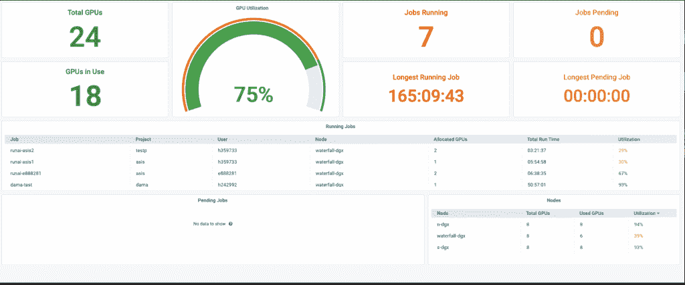

# Run:AI 为 Kubernetes 带来动态 GPU 虚拟化

> 原文：<https://thenewstack.io/runai-brings-dynamic-gpu-virtualization-to-kubernetes/>

一家虚拟化人工智能基础设施的公司 [Run:AI](https://www.run.ai/) 为 Kubernetes 推出了一个深度学习虚拟化平台，允许其用户动态分配图形处理单元(GPU)资源，用于人工智能模型推理和训练。

虽然该公司自两年前成立以来一直为人工智能基础设施提供虚拟化，但现在它通过一些特定的新功能将这些功能引入 Kubernetes，这些功能作为现有 Kubernetes 集群的一部分作为容器运行，Run:AI 联合创始人兼首席执行官 [Omri Geller](https://www.linkedin.com/in/omri-geller-47407a155/) 在接受新堆栈采访时解释道。

“我们正在为 GPU 构建虚拟环境，同时也为 Kubernetes 构建了一个调度程序。即使通过 Kubernetes，GPU 也是静态分配给用户的。盖勒说:“我们在 Kubernetes 中内置了调度功能，以支持批处理调度，这与构建人工智能模型非常相关。“Kubernetes 调度程序的建立是为了支持服务，而不是人工智能模型的训练。我们构建了一个扩展，将能够支持人工智能模型的高效训练和推理。”

盖勒解释说，本质上，Kubernetes 是为运行短期工作而构建的，在这些工作中，人工智能训练和推理可能需要长时间运行的工作负载。同时，在使用 Kubernetes 进行 AI 时，通常没有划分 GPU，也无法根据策略跨工作负载共享 GPU。这些都是运行的功能:AI 推出了让深度学习在 Kubernetes 上更高效的功能。盖勒还解释说，Run:AI 提供了“拓扑感知调度”，这很像区域和内容交付网络(cdn)的使用，将工作负载在物理上更靠近处理工作负载的处理器。

“如果您想要高效地运行分布式计算，您需要为特定的工作负载正确选择合适的 GPU。例如，你要确保那些 GPU 靠近 CPU，”盖勒说。“拓扑感知调度允许您确保最大限度地利用您昂贵而强大的人工智能硬件。”

Run:AI 的虚拟化平台只需一行代码就能插入 Kubernetes。该平台不仅能够管理许多不同的工作负载，制定策略以最有效地使用 GPU，而且还提供了该过程的可视化。

“今天，当你进入一个 IT 组织时，Kubernetes 已经成为运行 IT 环境的事实上的标准工具，”Geller 说。“你希望使用 Kubernetes 运行你的人工智能工作负载，并在 GPU 上运行 Kubernetes，因此需要进行联姻，以弥合人工智能开发需求和 Kubernetes 所能提供的之间的差距。”

虽然这整个过程听起来可能类似于虚拟 GPU(vgpu)，但盖勒说，这是一个主要的区别:vgpu 提供了一个静态的 GPU 供应，而 Run:AI 和 Kubernetes 可以允许 GPU 资源的分配根据需要进行更改，让用户可以更加灵活地进行实验。

“vGPUs 有些不同。vgpu 雕刻 GPU。运行:AI 动态编排 GPU 池。如果你有很多 GPU，你想有效地管理它们，并在用户中有效地使用它们。没有 Run:AI，这些是静态分配的，所以每个用户都获得了固定数量的 GPU，但他们不能获得更多，这限制了他们，”盖勒说。

“有时候，作为一个研究人员，你想并行运行很多实验，如果你有固定配额的 GPU，你就不能运行更多。GPU 是一种昂贵的资源，因此当涉及到企业环境时，GPU 的静态分配效率不高。我们的层以一种帮助我们管理资源的方式虚拟化 GPU，而不是静态地将 GPU 分配给用户，而是拥有一个根据业务目标自动配置的 GPU 虚拟池，”他说。

来自 Pixabay 的 analogicus 的特征图像。

<svg xmlns:xlink="http://www.w3.org/1999/xlink" viewBox="0 0 68 31" version="1.1"><title>Group</title> <desc>Created with Sketch.</desc></svg>