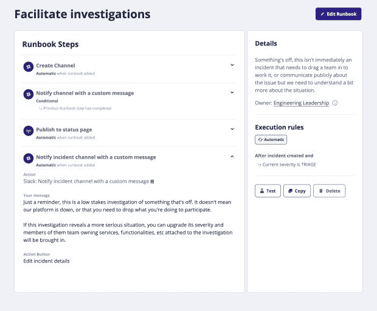
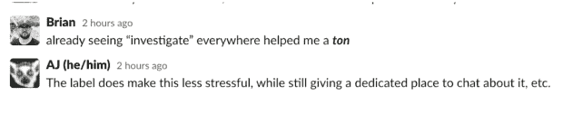

# 运行更多低严重性事故正在改善我们的文化

> 原文：<https://thenewstack.io/running-more-low-severity-incidents-is-improving-our-culture/>

我最近看到了一些关于摆脱事故是四个字母单词的文化的大讨论。关于这个主题的一些最流行的——也是最好的——建议鼓励团队声明更多的事件，并让可以声明事件的人民主化。

 [丹·康多米蒂

Dan 是 FireHydrant 的联合创始人和工程主管，FireHydrant 是一个事件管理平台，可以让您集成工具、简化流程并快速解决事件，而不会留下任何空隙。在这个职位上，Dan 利用他在 Red Hat 和 CoreOS 等公司的经验，指导团队构建 CircleCI、Spotify、Snyk 等公司和数千家其他公司使用的事件管理技术。](https://www.linkedin.com/in/dancondomitti/) 

虽然这个建议看起来相当简单，但我发现通常存在文化障碍，使得团队很难将其付诸实践。

告诉人们申报事故并不能消除随之而来的恐惧。以我的经验来看，许多小事，只要做得好并坚持不懈，最终会形成积极的事故管理文化。

我们在消防栓的内部工程团队一直在我们的事故管理计划中采取措施，旨在提高事故申报和管理的心理安全。

我们最近采取的一个小而简单的步骤是扩大事件的范围，并提供一个安全和可预测的调查场所。这对团队产生了巨大的积极影响，所以我想分享一些细节，希望能对其他人有所帮助。

## **如果这看起来很奇怪，那就称之为事件**

我们倾向于认为这些事件是非常非常糟糕的——而且是令人尴尬的公开事件——客户感到沮丧，组织正在亏损，一切都着火了。但事实上，我们可以将一系列活动归类为突发事件。我们对低影响事件越正常化，我们对严重情况的信心和经验就越多。

我们解决围绕事件的一些恐惧的第一步是要求团队开始以不同的方式思考他们如何定义事件。从本质上来说，这是一种文化转变，而非流程变革。正如许多文化变化的情况一样，当团队成员继续看到行为模式化时，这是一个逐渐的转变。

没有一个宏大的计划来启动这个项目；就这么发生了。团队中有人宣布了一个事件，即我们的测试套件中的瞬时故障急剧增加。对于大多数团队来说，这并不符合事件的经典定义，但是对于我们来说，这是一个很好的方式来捕捉已经在多个沟通渠道中传播的上下文，理解问题，实现修复，并在未来对工作进行优先排序，以提高我们测试套件的可靠性。在事件发生的过程中，我们意识到有多少工作已经开始了——团队只是在回避标签。

最后，归结为 Node.js 的特定版本中的内存泄漏导致了测试超时。几天之内有五个人卷入其中，尽管被贴上了“事故”的标签，但这并没有影响他们的日常工作。如果有什么不同的话，它提供了一种降低而不是增加认知负荷的结构和空间。我们使用消防栓来提供结构和绘制系统的上下文(最近的变化，仪表板等)。)到共享空间。

给这项工作起个名字感觉很好，因为它经常会让人分心，很难分清主次，所以我们开始谈论它——谈了很多。我们是一个足够小的公司，其他团队想尝试这种看起来很奇怪的事件声明方法。当我们的营销团队在尝试部署到站点时收到错误通知时，有人宣布了一个事件。在 Netlify、Gatsby、GitHub 和 Contentful 中逛了十分钟，我们发现了一个权限问题，这个问题很容易解决，并解除了一整天的工作。

## **调整响应的大小**

我们希望通过技术基础来加强行为改变。我们如何给人们一种安全的方法来调查某件事情是否真的是一个事故，而不用担心通常伴随事故声明而来的影响，例如警告和分散你的同事的注意力？

我们用最简单的 runbook 条件创建了一个新的严重性类型“triage ”:创建一个松弛通道。这确保了如果某件事只是感觉不对劲，发现问题的工程师有地方写下意识流或详细说明，然后看看接下来会发生什么。我们可以添加我们看过的图表、我们看到的警报、我们认为导致问题的所有东西的运行历史(甚至是转移注意力的东西)，然后在以后引用它。如果很明显有更大的问题，很容易升级并让正确的人跟上进度，因为信息已经记录在渠道中。

如果严重性没有发展，它仍然提供了对我们系统健康状况的有价值的洞察。在之前的一家公司，我的首席技术官用笔记本解决所有问题。他会写下一个事件的所有笔记，然后回头看更多的上下文。这些笔记可能会告诉他，一个大问题始于六周前的一个小事件，然后让位于当时被视为更优先的工作。

## 我们将何去何从？

随着越来越多的“分类”严重事故被宣布和解决，我们团队对事故的共同定义正在发生变化，这一点变得越来越明显。随着这种重新定义，我们看到的证据表明，事故对每个人都变得不那么可怕了。

这种重新定义让我思考了很多我们下一步要去哪里。最近我越来越清楚地意识到，旁观者清。工程师对事件的定义可能与客户支持、销售或营销团队中的某些人大相径庭，他们无法完成工作的某个方面，或者在没有太多摩擦的情况下完成工作。

随着我们不断完善事件定义，我们有必要更深入地了解我们的内部和外部客户如何使用我们的服务。事实是，每个事件都关系到*某人*。随着我们继续在消防栓建立和完善我们的内部事故管理计划，我们将提供更多信息。如果你喜欢(或讨厌)你在这里读到的东西，我很乐意收到你的来信。我是[dan@firehydrant.com](mailto:dan@firehydrant.com)。

<svg xmlns:xlink="http://www.w3.org/1999/xlink" viewBox="0 0 68 31" version="1.1"><title>Group</title> <desc>Created with Sketch.</desc></svg>