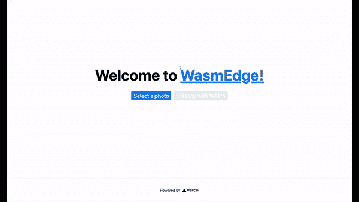

# Vercel 中的 Rust 和 WebAssembly 无服务器函数

> 原文：<https://thenewstack.io/rust-and-webassembly-serverless-functions-in-vercel/>

[](https://twitter.com/juntao)

[Michael Yuan](https://twitter.com/juntao)

[Michael Yuan 是 WasmEdge 的创始人和维护者，WasmEdge 是一个由 CNCF 托管的开源 WebAssembly 运行时，用于边缘计算、服务网格和嵌入式功能。袁博士是六部软件工程书籍的作者，也是一名长期的开源贡献者。他是 Second State 的联合创始人，Second State 是一家由风险投资资助的初创公司，支持并商业化 WebAssembly 和 Rust 生态系统中的企业应用程序。](https://twitter.com/juntao)

[](https://twitter.com/juntao)[](https://twitter.com/juntao)

Vercel 是开发和托管 [Jamstack](https://jamstack.org/) 应用的领先平台。与传统的 web 应用程序不同，在传统的 web 应用程序中，UI 是在运行时从服务器动态生成的，Jamstack 应用程序由一个静态 UI(HTML 和 JavaScript)和一组无服务器函数组成，通过 JavaScript 支持动态 UI 元素。

Jamstack 方法有很多好处。但也许最重要的好处之一是性能。由于 UI 不再在运行时从中央服务器生成，服务器上的负载大大减少，我们现在可以通过 cdn 等边缘网络部署 UI。

但是 edge CDN 只解决了静态 UI 文件的分发问题。后端无服务器功能可能仍然很慢。事实上，流行的无服务器平台都有众所周知的性能问题，比如冷启动慢，尤其是对于交互式应用。这就是 WebAssembly 可以提供帮助的地方。

有了云原生计算基金会托管的云原生 WebAssembly 运行时[WasmEdge](https://www.secondstate.io/articles/wasmedge-joins-cncf/)，开发人员可以编写部署在公共云或边缘计算节点上的高性能无服务器功能。在本文中，我们将探索如何使用 Rust 编写的 WasmEdge 函数来驱动 Vercel 应用程序后端。

## 为什么在 Vercel Serverless 中使用 WebAssembly？

Vercel 平台已经有一个非常易用的无服务器框架[T2，用于部署托管在 Vercel 中的功能。正如我们上面讨论的，使用 WebAssembly 和 WasmEdge 的原因是为了**进一步提高性能**。用 C/C++、Rust、Swift 编写的高性能函数可以很容易地编译成 WebAssembly。那些 WebAssembly 函数比无服务器函数中常用的 JavaScript 或 Python 要快得多。](https://vercel.com/docs/runtimes)

然而，如果原始性能是唯一的目标，为什么不直接编译这些函数来实现本机可执行文件呢？这是因为 WebAssembly“容器”仍然提供许多有价值的服务。

首先，WebAssembly **在运行时隔离函数**。代码中的错误或内存安全问题不会传播到 WebAssembly 运行时之外。随着时间的推移，[软件供应链](https://www.cisa.gov/publication/software-supply-chain-attacks)变得越来越复杂，在容器中运行代码以防止依赖库未经授权访问您的数据变得非常重要。

第二，WebAssembly 字节码是**可移植的**。开发人员只需要构建一次，不需要担心将来对底层 Vercel 无服务器容器(操作系统和硬件)的更改或更新。它还允许开发人员在其他托管环境中重用相同的 WebAssembly 功能，例如在另一个公共云中，如[腾讯无服务器功能](https://github.com/second-state/tencent-tensorflow-scf/blob/main/README-en.md)，或在[数据流框架中，如 YoMo](https://www.secondstate.io/articles/yomo-wasmedge-real-time-data-streams/) 。

最后， [WasmEdge Tensorflow API](https://www.secondstate.io/articles/wasi-tensorflow/) 提供了**最符合人体工程学的方式**来在 Rust 编程语言中执行 Tensorflow 模型。WasmEdge 安装 Tensorflow 依赖库的正确组合，为开发者提供统一的 API。

概念和解释已经够多了。事不宜迟，让我们直接进入示例应用程序吧！

## 先决条件

由于我们的演示 WebAssembly 函数是用 Rust 编写的，您将需要一个 [Rust 编译器](https://www.rust-lang.org/tools/install)。确保安装如下的`wasm32-wasi`编译器目标，以便生成 WebAssembly 字节码。

```
$  rustup target add wasm32-wasi

```

演示应用前端用 [Next.js](https://nextjs.org/) 编写，部署在 Vercel 上。我们假设您已经掌握了如何使用 Vercel 的基本知识。

## 示例 1:图像处理

我们的第一个演示应用程序允许用户上传一幅图像，然后调用一个无服务器函数将它转换成黑白图像。部署在 Vercel 上的[现场演示](https://vercel-wasm-runtime.vercel.app/)可用。


分叉[演示应用的 GitHub repo](https://github.com/second-state/vercel-wasm-runtime) 入门。要在 Vercel 上部署应用程序，只需[从](https://vercel.com/docs/git#deploying-a-git-repository) [Vercel for Github](https://vercel.com/docs/git/vercel-for-github) 网页导入 Github repo 。

这个 repo 是用于 Vercel 平台的标准 Next.js 应用程序。后端无服务器功能在`[api/functions/image_grayscale](https://github.com/second-state/vercel-wasm-runtime/tree/main/api/functions/image-grayscale)`文件夹。`[src/main.rs](https://github.com/second-state/vercel-wasm-runtime/blob/main/api/functions/image-grayscale/src/main.rs)`文件包含 Rust 程序的源代码。Rust 程序从`STDIN`读取图像数据，然后将黑白图像输出到`STDOUT`。

```
use hex;
use std::io::{self,  Read};
use image::{ImageOutputFormat,  ImageFormat};

fn main()  {
  let mut buf  =  Vec::new();
  io::stdin().read_to_end(&amp;mut buf).unwrap();

  let image_format_detected:  ImageFormat  =  image::guess_format(&amp;buf).unwrap();
  let img  =  image::load_from_memory(&amp;buf).unwrap();
  let filtered  =  img.grayscale();
  let mut buf  =  vec![];
  let format  =  match  image_format_detected  {
    ImageFormat::Gif  =&gt;  {
        filtered.write_to(&amp;mut buf,  ImageOutputFormat::Gif).unwrap();
        "gif"
    },
    _  =&gt;  {
        filtered.write_to(&amp;mut buf,  ImageOutputFormat::Png).unwrap();
        "png"
    },
  };
  print!("{}{}",  format,  hex::encode(&amp;buf));
}

```

你可以使用 Rust 的`cargo`工具将 Rust 程序构建成 WebAssembly 字节码或本机代码。

```
$  cd api/functions/image-grayscale/
$  cargo build  --release  --target wasm32-wasi

```

将构建工件复制到`api`文件夹中。

```
$  cp target/wasm32-wasi/release/grayscale.wasm  ../../

```

Vercel 在设置无服务器环境时运行`[api/pre.sh](https://github.com/second-state/vercel-wasm-runtime/blob/main/api/pre.sh)`。它安装 WasmEdge 运行时，然后将每个 WebAssembly 字节码程序编译成本机`so`库，以便更快地执行。

[`api/hello.js`](https://github.com/second-state/vercel-wasm-runtime/blob/main/api/hello.js) 文件符合 Vercel 无服务器规范。它加载 WasmEdge 运行时，在 WasmEdge 中启动编译好的 WebAssembly 程序，并通过`STDIN`传递上传的图像数据。注意 [`api/hello.js`](https://github.com/second-state/vercel-wasm-runtime/blob/main/api/hello.js) 运行 [`api/pre.sh`](https://github.com/second-state/vercel-wasm-runtime/blob/main/api/pre.sh) 生成的编译后的`grayscale.so`文件，以获得更好的性能。

```
const fs  =  require('fs');
const  {  spawn  }  =  require('child_process');
const path  =  require('path');

module.exports  =  (req,  res)  =&gt;  {
  const wasmedge  =  spawn(
      path.join(__dirname,  'wasmedge'),  
      [path.join(__dirname,  'grayscale.so')]);

  let  d  =  [];
  wasmedge.stdout.on('data',  (data)  =&gt;  {
    d.push(data);
  });

  wasmedge.on('close',  (code)  =&gt;  {
    let  r  =  d.join('');
    let format  =  r.substring(0,  3);
    let buf  =  Buffer.from(r.substring(3),  'hex');

    res.setHeader('Content-Type',  `image/${format}`);
    res.send(buf);
  });

  wasmedge.stdin.write(req.body);
  wasmedge.stdin.end('');
}

```

就这样。[将 repo 部署到 Vercel](https://vercel.com/docs/git#deploying-a-git-repository) 中，您现在有了一个 Vercel Jamstack 应用程序，该应用程序具有基于高性能 Rust 和 WebAssembly 的无服务器后端。

## 示例 2:人工智能推理

第二个演示应用程序允许用户上传图像，然后调用无服务器功能对图像上的主要主题进行分类。


与前面的例子在[相同的 GitHub repo](https://github.com/second-state/vercel-wasm-runtime) 但是在`tensorflow`分支。注意:当您在 Vercel 网站[导入该 GitHub repo](https://vercel.com/docs/git#deploying-a-git-repository) 时，会为每个分支机构创建一个[预览 URL](https://vercel.com/docs/platform/deployments#preview) 。`tensorflow`分支会有自己的部署网址。

图像分类的后端无服务器功能在`tensorflow`分支的`[api/functions/image-classification](https://github.com/second-state/vercel-wasm-runtime/tree/tensorflow/api/functions/image-classification)`文件夹中。`[src/main.rs](https://github.com/second-state/vercel-wasm-runtime/blob/tensorflow/api/functions/image-classification/src/main.rs)`文件包含 Rust 程序的源代码。Rust 程序从`STDIN`读取图像数据，然后将文本输出到`STDOUT`。它利用 WasmEdge Tensorflow API 运行人工智能推理。

```
pub fn main()  {
    // Step 1: Load the TFLite model
    let model_data:  &amp;[u8]  =  include_bytes!("models/mobilenet_v1_1.0_224/mobilenet_v1_1.0_224_quant.tflite");
    let labels  =  include_str!("models/mobilenet_v1_1.0_224/labels_mobilenet_quant_v1_224.txt");

    // Step 2: Read image from STDIN
    let mut buf  =  Vec::new();
    io::stdin().read_to_end(&amp;mut buf).unwrap();

    // Step 3: Resize the input image for the tensorflow model
    let flat_img  =  wasmedge_tensorflow_interface::load_jpg_image_to_rgb8(&amp;buf,  224,  224);

    // Step 4: AI inference
    let mut session  =  wasmedge_tensorflow_interface::Session::new(&amp;model_data,  wasmedge_tensorflow_interface::ModelType::TensorFlowLite);
    session.add_input("input",  &amp;flat_img,  &amp;[1,  224,  224,  3])
 .run();
    let res_vec:  Vec&lt;u8&gt;  =  session.get_output("MobilenetV1/Predictions/Reshape_1");

    // Step 5: Find the food label that responds to the highest probability in res_vec
    // ... ...
    let mut label_lines  =  labels.lines();
    for _i in  0..max_index  {
      label_lines.next();
    }

    // Step 6: Generate the output text
    let class_name  =  label_lines.next().unwrap().to_string();
    if max_value  &gt;  50  {
      println!("It {} a &lt;a href='https://www.google.com/search?q={}'&gt;{}&lt;/a&gt; in the picture",  confidence.to_string(),  class_name,  class_name);
    }  else  {
      println!("It does not appears to be any food item in the picture.");
    }
}

```

您可以使用`cargo`工具将 Rust 程序构建成 WebAssembly 字节码或本机代码。

```
$  cd api/functions/image-classification/
$  cargo build  --release  --target wasm32-wasi

```

将构建工件复制到`api`文件夹。

```
$  cp target/wasm32-wasi/release/classify.wasm  ../../

```

同样，`[api/pre.sh](https://github.com/second-state/vercel-wasm-runtime/blob/tensorflow/api/pre.sh)`脚本在此应用程序中安装 WasmEdge 运行时及其 Tensorflow 依赖项。它还在部署时将`classify.wasm`字节码程序编译成`classify.so`本机共享库。

[`api/hello.js`](https://github.com/second-state/vercel-wasm-runtime/blob/tensorflow/api/hello.js) 文件符合 Vercel 无服务器规范。它加载 WasmEdge 运行时，在 WasmEdge 中启动编译好的 WebAssembly 程序，并通过`STDIN`传递上传的图像数据。注意 [`api/hello.js`](https://github.com/second-state/vercel-wasm-runtime/blob/tensorflow/api/hello.js) 运行由 [`api/pre.sh`生成的`classify.so`文件以获得更好的性能。](https://github.com/second-state/vercel-wasm-runtime/blob/tensorflow/api/pre.sh) 

```
const fs  =  require('fs');
const  {  spawn  }  =  require('child_process');
const path  =  require('path');

module.exports  =  (req,  res)  =&gt;  {
  const wasmedge  =  spawn(
    path.join(__dirname,  'wasmedge-tensorflow-lite'),
    [path.join(__dirname,  'classify.so')],
    {env:  {'LD_LIBRARY_PATH':  __dirname}}
  );

  let  d  =  [];
  wasmedge.stdout.on('data',  (data)  =&gt;  {
    d.push(data);
  });

  wasmedge.on('close',  (code)  =&gt;  {
    res.setHeader('Content-Type',  `text/plain`);
    res.send(d.join(''));
  });

  wasmedge.stdin.write(req.body);
  wasmedge.stdin.end('');
}

```

你现在可以[将你的分叉回购部署到 Vercel](https://vercel.com/docs/git#deploying-a-git-repository) 并拥有一个用于食品分类的网络应用。

## 下一步是什么

从 Vercel 当前的无服务器容器运行 WasmEdge 是向 Vercel 应用程序添加高性能功能的一种简单方法。如果你已经使用 WasmEdge 创建了一个有趣的 Vercel 函数，请[告诉我们，我们会给你发送一个 WasmEdge SWAG](https://forms.gle/ozSNLz1MCJTNj9n18) ！

更好的方法是使用 WasmEdge 作为容器本身。不会有停靠站，也不会有节点。JS 到 bootstrap WasmEdge。这样，我们可以更高效地运行无服务器功能。WasmEdge 已经与 Docker 工具兼容。如果你有兴趣加入 WasmEdge 和[云原生计算基金会](https://cncf.io/?utm_content=inline-mention)来完成这项激动人心的工作，[让我们知道](https://github.com/WasmEdge/WasmEdge#contact)！

<svg xmlns:xlink="http://www.w3.org/1999/xlink" viewBox="0 0 68 31" version="1.1"><title>Group</title> <desc>Created with Sketch.</desc></svg>