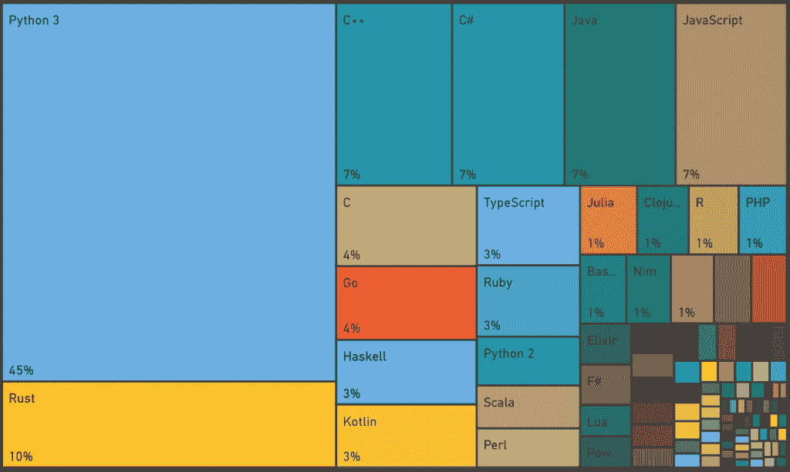

# Rust by The Numbers:2021 年的 Rust 编程语言

> 原文：<https://thenewstack.io/rust-by-the-numbers-the-rust-programming-language-in-2021/>

 [帕万·贝拉加蒂

帕万·贝拉加蒂是印度增长黑客领域的先驱之一，他也是 DevOps 的影响者和谷歌认证的数字营销人员。他已经就 DevOps 主题写了 100 多篇文章。他通常写 DevOps、市场营销和增长黑客。他是世界上一些顶级网站的客座撰稿人。](https://www.linkedin.com/in/pavan-belagatti-growthmarketer/) 

编程语言来来去去；有些人大肆宣传，有些人就消失了。我们都知道渗透到开发人员的核心领域并影响他们是很难的，当涉及到编程语言时，他们非常挑剔。嗯， [Rust 作为一门编程语言](https://thenewstack.io/the-case-for-rust-as-the-future-of-javascript-infrastructure/)正在竭尽全力赢得开发者的心。

[Rust](https://www.rust-lang.org/) 已经连续四年成为 [Stack Overflow 最喜爱的](https://insights.stackoverflow.com/survey/2020#technology-most-loved-dreaded-and-wanted-languages-loved)语言，而这也预示着谁有机会与这种语言共事，谁就立刻爱上并喜欢上了它。

另外，随着流行的 DevOps 工具如 [JFrog Artifactory](https://jfrog.com/artifactory/) 现在增加了对 Rust 的现成支持，看到 Rust 成为许多开发公司的主流是令人兴奋的。有了这个，让我们来看看为什么它变得如此受欢迎。

## 铁锈入门

Rust 于 2010 年推出，由 Mozilla Research 开发，是 C++更可靠、更安全的替代品。Rust 是一种静态多通道、内存高效的编程语言，专注于速度、安全性和性能。它用于开发游戏引擎、文件系统、网站和工具、操作系统、浏览器组件等等。 [Rust Foundation](https://foundation.rust-lang.org/) ，一个独立的组织，现在管理着开源代码库。

Rust 既支持命令式编程，也支持函数式编程，对于应用程序开发来说，它的功能也足够全面——它被一些巨头使用，如 DropBox、Coursera 和 Firefox 等。Rust 在 HackerNews 上也得到了很多关注。在过去的一年里，许多大公司，如微软、T2、脸书、T4、英特尔，联手支持 Rust。

## 为什么生锈？

为了证明为什么 Rust 是现象级的，我们来谈谈让 Rust 发光的一些特征，

*   Rust 有很好的文档。
*   Rust 有一个非常用户友好的编译器，包括顶级的工具，如集成的包管理器和多编辑器。
*   Rust tooling 具有类型检查和自动完成等高级特征。
*   Rust 速度超快，防止崩溃，默认安全。
*   Rust 解决了 C 和 C++长期以来一直在努力克服的障碍，其中包括内存错误和构建并发程序。

像微软这样的公司为了他们产品的安全正在使用 Rust。微软[鼓励他们的开发者](https://thenewstack.io/microsoft-rust-is-the-industrys-best-chance-at-safe-systems-programming/)在 Rust 中重写他们的一些组件，因为他们发现大多数安全补丁都是对与内存相关的错误的修复，Rust 本来可以在开发阶段发现这些错误。

微软[相信](https://medium.com/the-innovation/how-microsoft-is-adopting-rust-e0f8816566ba)Rust 可以帮助消除软件错误，尤其是那些导致安全漏洞的错误。

## 是什么让 Rust 与众不同？

与其他编程语言不同， [Rust 是从零开始构建的](https://research.mozilla.org/rust/)，它融合了高级系统编程语言和现代编程语言设计的元素和发现。

此外，作为一个开源项目，Rust 拥有优化和平滑用户体验的开发人员。例如，编译器生成非常准确且特别有指导意义的错误消息来帮助用户；它甚至强调了违规代码，并建议如何修复它。

Rust 社区还提供全面的文档和即时在线帮助。不仅仅是工具，围绕 Rust 的基础设施都是值得称赞的。与其他许多需要使用许多编译器的编程语言不同，Rust 可以通过一个名为 Cargo 的工具轻松地编译代码、运行测试、生成文档、将包上传到存储库等等。

Rust 有一个强大的命令行界面工具；它是开发 web 应用程序和跨平台应用程序的优秀工具。Rust 非常适合低资源环境。对于流行的开发环境，有 Rust 插件，如微软的 Visual Studio Code、JetBrains 的 IntelliJ 和 Rust Playground，它为代码实验提供了丰富的 Rust 在线环境。

## 一些闪亮的铁锈统计

说到受欢迎程度，Rust 在上面。自 2015 年起，Rust 连续四年(2016、2017、2018、2019)在 Stack Overflow 的开发者调查中被开发者票选为[最受喜爱的编程语言](https://insights.stackoverflow.com/survey/2020#technology-most-loved-dreaded-and-wanted-languages-loved):

来源:堆栈溢出

Rust 位居【2020 年收入最高的十大编程语言之首:

来源:堆栈溢出。

*   在谷歌趋势上，你可以看到 Rust 的搜索结果逐年增长的方式:

根据 Stack Overflow 的[调查，Rust 位列最受欢迎的顶级编程语言的前五名:](https://insights.stackoverflow.com/survey/2020#technology-most-loved-dreaded-and-wanted-languages-wanted)

来源:堆栈溢出

Rust 在 2020 年首次闯入 TIOBE 的前 20 名最受欢迎的编程语言索引。并且在 [2020 的 Sub-Reddit 调查(r/adventofcode)](https://www.reddit.com/r/adventofcode/comments/kj53l1/unofficial_aoc_2020_survey_results/) 中，Rust 被定位为仅次于 Python 的第二大使用编程语言。

来源:Reddit

## 我们来谈谈货物，船长

除了是一种伟大且最受欢迎的编程语言之外，Rust 还具有一个构建系统和一个名为 [Cargo](https://doc.rust-lang.org/book/ch01-03-hello-cargo.html) 的包管理器。Cargo 管理许多任务，比如构建代码、下载代码所依赖的库，以及构建这些库。铁锈和货物捆绑在一起；你装铁锈就拿货。

Rust 里的简单小程序不会有任何依赖。但是当你开始用 Rust 编写更复杂的程序时，就需要添加和管理依赖关系；这就是货物派上用场的地方。当您使用 Cargo 启动一个项目时，添加和管理依赖项将会变得更加容易。Rust 中的包在 Rust 社区中通常被称为“板条箱”。

简单来说，Rust 的包管理器和构建系统被命名为“Cargo”。使用 Cargo，可以轻松直接地访问 crates.io 中社区提供的库。

当使用 Cargo 时，它会查找并找到准确的版本并下载源代码，确保下载任何其他所需的板条箱。按照[官网](https://www.rust-lang.org/tools/install)或[货书](https://doc.rust-lang.org/stable/cargo/getting-started/installation.html)上的说明，我们可以很容易地一气呵成地安装 Rust 和货包管理器。对于 Linux/macOS，这应该可行:

`$ curl https://sh.rustup.rs -sSf | sh`

现在我们可以通过货物来管理我们的生锈代码。

货物被认为是铁锈生态系统的一大优势。如果没有 Cargo，我们将不得不搜索库，从 GitHub 的未知来源下载这些库，构建成静态库箱，将它们与程序链接起来。做这些有多痛苦。但是我们有货物可以在处理铁锈的时候为我们做这些事情。

为了提高您的 Rust 技能并进行更多的实验，请下载并阅读 Rust 团队编写的这本开源的[货物手册](https://doc.rust-lang.org/cargo)。

## 真实世界的 Rust 用法和实验

亚马逊网络服务的[鞭炮](https://firecracker-microvm.github.io/)完全是用 Rust 写的[。它支持 Fargate 和亚马逊网络服务。](https://opensource.com/article/19/3/rust-virtual-machine)

亚马逊、谷歌、英特尔和 [Red Hat](https://www.openshift.com/try?utm_content=inline-mention) 联合启动了一个名为 [rust-vmm](https://github.com/rust-vmm) 的项目，在彼此之间以及 rust 社区的其他成员之间共享通用的 Rust“板条箱”或者我们所说的软件包。

微软将 Rust over Go 用于 WebAssembly——一个来自 Azure 的项目，用于测试 Kubernetes 中的 web assembly 模块。除此之外，微软正在试验用 Rust 重写最初用 C 和 C++编写的 Windows 底层组件。

像 Dropbox、npm、微软、亚马逊、Discord、Cloudflare、Figma、Coursera 等公司[在生产中使用 Rust](https://serokell.io/blog/rust-companies)。

## 结论

铁锈很可能会继续开花。随着越来越多的公司选择这种独特的语言，在使用 Rust 作为编程语言创建项目的同时，也是时候考虑安全方面了。当您考虑采用 Rust 时，您可能会考虑在管理当前应用程序的同时管理货物仓库。确保你的工件管理工具理解货物箱，并提供一个安全的仓库。 [Artifactory 原生支持 Rust 编程语言的 Cargo registry](https://www.jfrog.com/confluence/display/JFROG/Cargo+Registry) ，让您完全控制您的部署并解析货物包。

<svg xmlns:xlink="http://www.w3.org/1999/xlink" viewBox="0 0 68 31" version="1.1"><title>Group</title> <desc>Created with Sketch.</desc></svg>