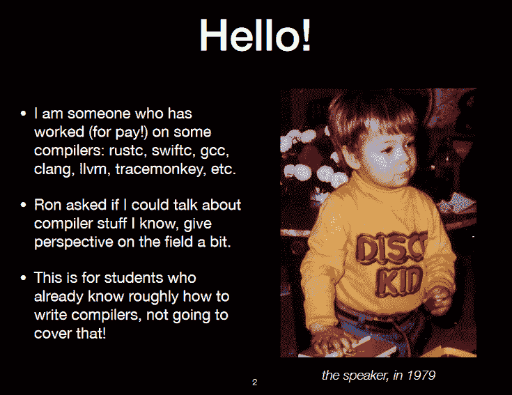
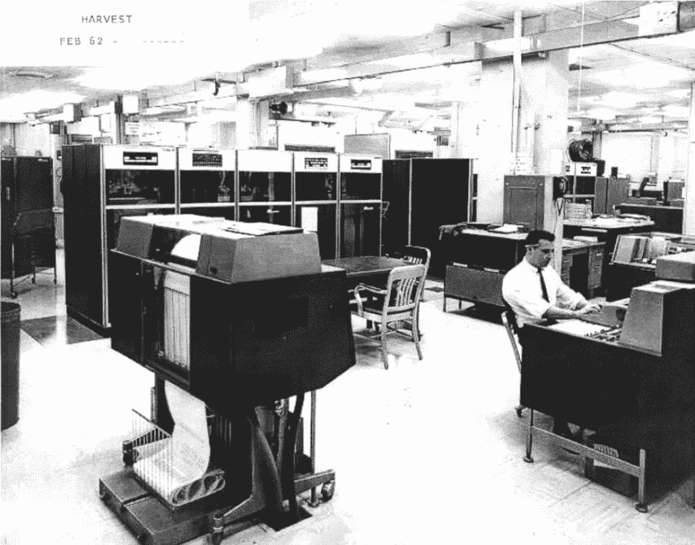

# Rust 的创造者格雷顿·霍尔讲述了编译器的历史

> 原文：<https://thenewstack.io/rust-creator-graydon-hoare-recounts-the-history-of-compilers/>

3 月 26 日，[Rust 编程语言的最初创造者格雷顿·霍尔](https://github.com/graydon)，在该校编译器构造入门课上，停下来向一些幸运的不列颠哥伦比亚大学学生讲述编译器。

考虑到未来有抱负的编译器设计者，霍尔的演讲跨越了为编程语言构建编译器的历史(他没有录制演讲，[，所以我们有幻灯片可以看](http://venge.net/graydon/talks/CompilerTalk-2019.pdf))。他告诉学生们，他想揭开“课堂项目和工业编译器之间”的神秘面纱，以“减少恐惧，激发好奇心，鼓励把它作为职业来尝试。”

"如果我能编译，你也能！"

他的编译器展示从`clang`开始，是为 C、C++、Objective-C 和 Objective-C++开发的编译器前端。Hoare 将其标记为“样本#1”，指出使用它需要 200 万行 C++代码，其中 80 万行用于 clang，另外 120 万行用于 [LLVM 项目](https://llvm.org/)——并且由一个多组织团队维护。"良好的诊断，快速的代码…比 GCC 更许可."

然后是`swiftc`编译器——它包含 530，000 行 C++代码，外加 200 多万行 clang 和 LLVM 代码。他后来专门为 LLVM 工具和库放了一张幻灯片，开玩笑说这是“编译器后端的一站式商店”

关于`rustc,`Rust 编译器，霍尔指出它由 36 万行 Rust 代码组成(加上 120 万行 LLVM)。他引用它的维护组织为“最初主要是 Mozilla”，谦虚地补充说“是的，我做了很多最初的培养，所以我的名字永远与它联系在一起；很高兴它成功了！”

在整个演讲中，每个样本都附有一段源代码——除了 Turbo Pascal 编译器。因为它的源代码是专有的，他用一个旧杂志广告来表示它。

第四个样本是曾经流行的 GCC，他指出它有 220 万行“主要是 C，C++”。600k 线 Ada。”霍尔指出，追溯到 1987 年，该语言得到了一个大型多组织团队的支持，并补充说它“生成相当快的代码”

## 平衡成本和收益

“编译器变得越来越大，因为开发成本被认为是值得的，至少对支付账单的人来说是这样，”霍尔解释道，并引用了更好的运行时性能和开发人员生产率(来自诊断工具等)以及开发新硬件功能等预期目标。最后一点补充道，“出于所有常见的原因(兼容性、性能、熟悉程度)，一些编译器是用“冗长”的语言编写的

接下来的演讲将探讨如何做出这些权衡，以及是否应该做出。

“在某些情况下，‘所有的优化’太多了，”一张幻灯片解释道。“如果您试图编写一个执行所有优化的编译器，您最终会使用太多的内存，或者创建一个需要太多精力来开发和维护的编译器，或者需要太长时间来编译！”

霍尔提醒学生们注意普罗伯汀定律，这是亚利桑那大学计算机科学教授托德·a·普罗伯汀讽刺性的重复。普罗伯汀认为编译器的进步将使我们的计算能力每 18 年翻一番——与芯片制造商将处理器上的晶体管数量翻一番所需的 18 个月相比，这是一个永恒(“摩尔定律”)。

霍尔自己拿的？如果一种语言需要消除更多的抽象，Proebsting 定律就不那么正确了——但不幸的是，对于低级语言来说，它更正确。

## 漫步在更奇怪的风景中

霍尔还研究了较小的(660，000 行代码)V8，这是 Chrome 和 Node 中的即时 JavaScript 编译器，他将其描述为“总是根据运行时性能与编译时的最佳状态进行调整。”

[Chez Scheme](https://cisco.github.io/ChezScheme/) 编译器使用了 27 种不同的 IRs(编译器的内部“中间表示”结构)，但只有 87，000 行。霍尔补充说，这主要是一个单一开发人员的项目——由于其相对较小的代码库而成为可能。而 Poly/ML(一种支持多核硬件的机器语言实现)的编译器只有 44000 行。最终，他的演示到达了斯坦福研究所增强研究实验室 1967 年美国空军研究项目的 184 行 TREE-META 元编译器。

“漫游通过一个怪异的景观”继续，与格拉斯哥哈斯克尔编译器，弗兰兹 Lisp，马恩岛阿兹特克 C 和 8cc。有 CakeML、Roslyn、Pharo/Cog 和 Eclipse 编译器。有一张幻灯片展示了施乐 PARC 公司在 1976 年至 1981 年间开发的“极具影响力”的语言 Mesa(他指出这是他最喜欢的语言之一)的编译器。

这让他开始讨论编译器如何与解释器交互，以及计算机的快速发展历史。

它始于 20 世纪 40 年代的 ENIAC，在 Jean Bartik 领导的团队开始在内存中存储指令之前，“编程”实际上涉及重新布线。1949 年出现了带有软件解释器的高级伪代码，不久，格蕾丝·赫柏用她的 A-0 系统，即第一个编译器，将伪代码直接转换成 UNIVAC 的机器语言。

霍尔还提醒学生们法兰西斯·E·艾伦的开创性工作，他在 IBM 的 45 年职业生涯包括为安装在国家安全局的 IBM“收获”超级计算机的编译器优化团队工作。

【1962 年 2 月 IBM 丰收电脑的图像

20 世纪 70 年代初，她与约翰·库克合著了《[优化转换目录](https://www.clear.rice.edu/comp512/Lectures/Papers/1971-allen-catalog.pdf)》，该论文旨在“系统化编译器对程序进行优化转换的大杂烩”，详细描述了这些优化:

*   在一条直线上的
*   展开(和矢量化)
*   公共子表达式消除
*   DCE(死代码消除)
*   [代码运动](https://en.wikipedia.org/wiki/Loop-invariant_code_motion)
*   恒定折叠
*   [窥视孔](https://en.wikipedia.org/wiki/Peephole_optimization)

霍尔补充说，许多编译器只做这八件事，就能获得 80%的最佳性能。

## 盛大的终曲

Hoare 提到了元编译器，并引用了 OCaml 的初级开发人员 Xavier Leroy 的话，讨论了编译和解释之间的权衡。作为一种廉价的实现设备，字节码解释器以 1/20 的实现成本提供了 1/4 的优化本机代码编译器的性能

他还包括了一个关于 [Truffle/Graal 的精辟观察，](https://github.com/oracle/graal/tree/master/truffle)一个用于构建解释器的开源库。“用一些机器编写一个解释器来帮助部分求值器，免费得到一个编译器，”他说。现在由甲骨文维护，霍尔称之为“极具竞争力！潜在的未来 Oracle JVM。”

也有编译器只编译*一些*函数，剩下的交给解释器处理。

在他的压轴戏中，他向观众展示了 JonesForth，这是一个开发人员的 Forth 教育实现，具有 692 条指令的虚拟机和 1，490 行 Forth，用于其编译器、调试器和读取-评估-打印循环。“第四，像 Lisp 一样，在输入端几乎是虚拟机代码，”他告诉观众。

霍尔对语言设计的欣赏可见一斑，他给学生们留下了鼓舞人心的临别赠言。“有很多语言，”他说，并引用了 T2 在线编程语言历史百科全书确定的 8945 种语言，这些语言可以追溯到 18 世纪。

“去研究它们:过去和现在！可能有许多编译器！”他敦促学生们。“挑一个自己喜欢的未来！”

* * *

## WebReduce

<svg xmlns:xlink="http://www.w3.org/1999/xlink" viewBox="0 0 68 31" version="1.1"><title>Group</title> <desc>Created with Sketch.</desc></svg>