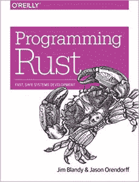
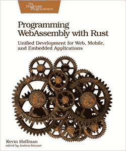

# Rust 创造者格雷顿·霍尔谈论安全、历史和 Rust

> 原文：<https://thenewstack.io/rust-creator-graydon-hoare-talks-about-security-history-and-rust/>

今天[格雷顿·霍尔](https://github.com/graydon)(以及众多贡献者)[首次向世界展示](http://venge.net/graydon/talks/intro-talk-2.pdf)新设计的 [Rust 编程语言](https://www.rust-lang.org/)的九周年纪念日即将到来。所以我们认为这是评估我们目前状况的好时机。

霍尔欣然同意，分享了他对所有事情的想法，从系统编程的状态到在越来越复杂的系统上定义安全的困难——以及我们今天是否真的更安全，或者面对一个需要几十年才能清理的继承的软件混乱。

当然，我们也花了一点时间回顾了 Rust 的历史…

你对当今系统编程的状态有什么评价？

在我看来，今天的“系统利基”似乎相当健康，至少与我职业生涯的前几十年相比是如此。当然，现在比以前更容易推销与性能或正确性有关的语言作品。许多优秀的新语言，工业界和学术界之间的大量对话。

**那么，当谈到安全性时，情况是否有所改善(其中有多少是由于更安全的编程语言)？**

 我认为安全性在某些方面正在改善(包括，当然，部署更安全的语言；虽然许多其他技术措施也有帮助)但在其他方面，我们只是在踩水，或者变得更糟。部分原因是因为我们一直在构建越来越复杂的新计算系统:难以理解的复杂性意味着我们甚至无法定义安全性，更不用说构建强制执行的机制了。在某种程度上，我们只是在这个领域积压了大量现存的不正确的软件，以至于计算机实际上只能在大量人工监督、随叫随到的操作团队、技术支持团队和维护编码员等等的情况下继续日常运行。更不用说坏演员了:这个领域有太多易受攻击的软件，他们总能找到漏洞。就像 20 世纪的许多遗产一样，软件领域有一大堆乱七八糟的东西，需要几代人来清理，假设人类甚至能存活那么久。

你还希望在系统编程领域看到什么额外的安全特性吗？

在安全方面还有很多事情要做。铁锈只会摘走一些挂得较低的果实。大量的语言技术和大量的非语言技术。我需要一个更大的字数来给出一个真正的答案，但对于一个专注于语言的简短列表，我们说:信息流控制系统，效果系统，细化类型，流动类型，事务系统，一致性系统，会话类型，单元检查，验证编译器和连接器，依赖类型。

真正的挑战并不在于提出有帮助的功能——学术界有相当多的好想法——而是将这些功能嵌入到一种平衡的、适合特定环境的语言中，这种语言对工业程序员来说足够可口，可以被采纳和使用。

**我已经看到有人呼吁用 Rust 取代 C 代码。但是你有没有更广泛的想法关于*我们应该如何*处理我们积压的内存不安全的遗留代码？**

如果有足够的动机和预算，如果它们在其他方面适合技术环境，Rust 重写 C 或 C++代码是可行的。但那是很多如果。重写也可以是集中的、部分的，一次重写一个库或子系统。Firefox 在 Rust 中被重写的各种模块就是一个很好的例子:它现在是一个 C++和 Rust 的混合程序。

但是我认为重写的速度不太可能比软件自然更新的速度快，因为一些旧程序总是以某种速度被替换。下一代中的一些将会是 Rust，但这大概是我所期望看到的:大多数处于维护模式的程序没有预算来重写它们的原始语言，更不用说一个新的了。

如果监管制度发生变化，这种情况理论上可能会改变。就像如果我们发现自己面对一个法律将内存不安全视为软件制造商或其他人的一种明显的疏忽的未来。但我们现在不在这样的环境中，所以它主要是由人们对问题重要性的个人评估所激发的，而这通常会受到背景的制约。

**去年你在 Reddit 上写道，Rust 和 Swift 团队的成员“[互相认识，互相交谈](https://www.reddit.com/r/rust/comments/7qels2/i_wonder_why_graydon_hoare_the_author_of_rust/?st=jwtlbp22&sh=9c80297e)，交换想法和实现见解，并且大体上和平共处；他们都是很好的合作团队。”您可能是唯一有资格满足开发人员闲散好奇心的人，他们可能想知道:一种主要编程语言的日常开发中到底发生了什么？**

我已经不在 Swift 团队了。但是语言(及其编译器)的日常工作是许多任务的混合。就数量而言，大部分是编程，就像任何其他程序一样:修复错误和对编译器进行增强。这些错误包括不正确的安全检查、错误的编译、编译器崩溃、错误的诊断、缓慢的编译、缓慢生成的代码等等。增强包括新的语言特性、新的平台支持、新的安全检查、新的优化等等。像任何大型程序一样，在编译器内部通常有许多简单的重构、清理、文档和基础设施工作要做。编译器团队中的一些人经常从事语言设计工作，但是随着语言的成熟，这种工作会逐渐减少。通常有许多与其他团队的联系，这些团队的工作需要与编译器协调:链接器、内核、调试器、库等等。

**在 Swift 团队工作感觉如何？**

正如我在 Rust 团队的时光一样，我非常享受，并为能与如此聪明、善良、敬业的同事一起工作而感到无比荣幸。两个团队都有非常优秀的工程师，都是非常好的人。

有趣的是，Rust 从一个研究项目一跃成为一种广泛使用的编程语言。

 我不确定它是否已经有了飞跃，但我也应该指出，Rust 并不是*打算让*成为一个研究项目。我们加入“Mozilla research”是作为一种组织问题——一个比平时多了几名学者的团队——但我们的想法总是发布一些在主流环境中有用的东西。为了满足这些需求，它的设计在很多方面都受到了限制！

**你去年还写道，Rust“将永远在我心中占据一个特殊的位置，因为我在它的前七年里付出了异乎寻常的努力。”那么你会如何讲述铁锈的历史呢？**

很难总结！我不擅长讲故事。我会说我们在很多方面都很幸运:Mozilla 愿意长期资助这样一个项目；苹果、谷歌和其他公司已经在 LLVM 上预先投入了大量资金，我们可以利用这些资金；学术界、工业界以及在互联网上闲逛的这么多有才华的人愿意自愿帮忙。这实际上是各个层面的集体努力。也许这个故事的一个引人注目的叙述是跨学科和跨组织的合作。

看起来很棒。我当然不知道会有这么好的结果。

<svg xmlns:xlink="http://www.w3.org/1999/xlink" viewBox="0 0 68 31" version="1.1"><title>Group</title> <desc>Created with Sketch.</desc></svg>