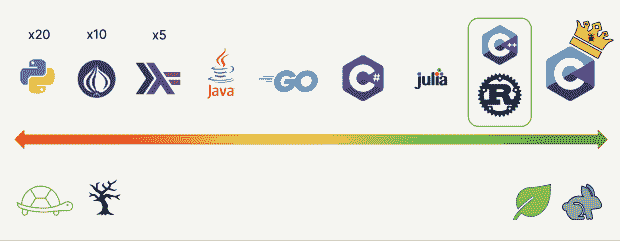
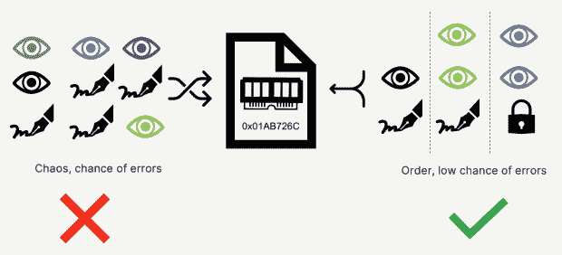
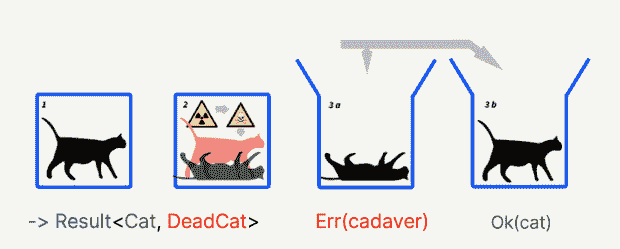

# Rust 让我们成为更好的程序员

> 原文：<https://thenewstack.io/rust-makes-us-better-programmers/>

在堆栈溢出调查中连续七年被评为“最受喜爱的”编程语言，Rust 已经在软件行业确立了自己的地位。多亏了像 WebAssembly 和 WASI 这样的防锈技术，它也找到了进入云端的方法。这并不奇怪，因为 Rust 带来了更好的开发体验，增强了安全性，提高了程序速度。但是 Rust 也让你成为更好的开发者。以下是方法。

为了理解为什么 [Rust 如此受欢迎](https://thenewstack.io/stack-overflow-rust-remains-most-favored-but-clojure-pays-the-most/)，我们首先需要考虑为什么我们发明了编译器和编程语言。在 50 年代，我们用汇编语言编写程序，编写和阅读都极其困难，而出错却极其容易。然后在 70 年代，我们得到了 C 语言，它仍然被广泛使用。它比汇编程序好得多——更容易编写和阅读，并且您可以从编译器那里获得一些帮助来发现代码中的错误。

所以我们创造编程语言和编译器的原因有四点:

*   **简易语言:**我们需要一些简洁、易于书写和阅读的东西，更像英语或数学。
*   **让程序可移植:**我们需要在不同的平台上运行我们的程序。
*   优化:我们想要更快的程序，充分利用我们的硬件。
*   **查找错误:**我们想要找到我们在编写代码时所犯的错误。

后两者才是铁锈真正闪光的地方。

## **它帮助我们这些易犯错误的人**

当我们是新程序员时，我们会犯很多错误(还记得 for 循环是神秘的吗？).随着时间的推移，我们获得了经验，并习惯了使用复杂的软件架构。这使我们能够犯更复杂的错误。

这些错误花费了公司数百万的时间和金钱来寻找和修复复杂环境中发生的复杂、细微的内存错误。有了[锈](https://thenewstack.io/adoption-of-rust-whos-using-it-and-how/)，许多这样的问题就完全避免了**。**

实话实说:我们需要工具的更多帮助来更安全地编写代码，从头开始构建可靠的软件。我们需要一个教练；像尤达一样，Rust 培养开发人员。

因为 Rust 有一个丰富而强大的类型系统和一个更深入、更严格的编译器，所以编程对于一个初学者来说是具有挑战性的。但是如果代码编译成功，它可能会工作！这教会我们延迟满足:在开始，它是困难和缓慢的；随着时间的推移，这是一个令人愉快的过程，我们需要修复的 bug 更少了。

我以前写 C 或 C++的时候会遇到很多运行时错误。我可能是一个糟糕的程序员，但有了 Rust，一旦我理解了它的原理，我的错误就少了，这让我更喜欢编程，甚至让我觉得自己更有能力。

## 这是一种低级和高级语言

我喜欢 Rust 在功能和抽象之间给了我们一个甜蜜的平衡。也就是说，它既是低级语言，也是高级语言。在低水平上，Rust 提供:

*   原始内存指针(尽管对于高级程序员来说，这破坏了安全保证。)
*   可以嵌入式运行
*   编译成机器码。没有中间人开销。
*   可定制的内存丢弃

从高层次来看，Rust 提供了:

*   自动内存删除
*   功能模式(迭代器、组合器、模式匹配)
*   特征(类似于接口)
*   简单的多线程库
*   内存安全
*   卫生宏元编程(随意扩展语言的语法)

Rust 有很好的抽象，因为它学习其他语言，尤其是函数式语言。你可以编写优雅简洁的代码来处理复杂的事情。Rust 是一种折衷的语言。

## **快了**

与 C 相比，Rust 大约慢 10%，与 C++相似，但比 Java 等其他语言快得多。如果你想要性能，为什么不用 C 呢？因为除了是速度之王，还是 bug 之王！根据[编程语言基准](https://benchmarksgame-team.pages.debian.net/benchmarksgame/index.html)，在 Python 等其他流行语言的情况下，Rust 程序的运行速度快了 20 倍。

Rust 的速度来自于拥有一个良好的优化器，编译成本为本机代码和许多零成本的抽象，比如迭代器，它们免费为开发人员提供了可爱的语法。没有隐含运行时间成本。

Rust 实现其速度和可靠性的一个令人兴奋和独特的方式是抛弃垃圾收集器。这在两个方面有所帮助:更快的速度和更高的可靠性。这是因为当你有一个垃圾收集器时，不能保证它会释放内存。当它被释放时，它会随机发生。此外，垃圾收集器是一个额外的程序，它必须停止你的代码，进行清理，然后继续。

Rust 可以通过使用更严格的关于数据生命周期和如何丢弃内存的规则来删除 GC。在 Rust 中，当变量超出范围时，内存就会丢失。如果你需要不同的东西，你需要通过一个叫做生命期注释的东西告诉编译器。这使您意识到数据在程序的执行过程中是如何存在的。

## **拥有优秀的工具**

除了抽象之外，Rust 还提供了优秀的工具，可以让您在从事项目时获得现代化的、高度集成的体验。

当与 Rust 一起工作时，通常使用 Cargo，它的项目经理。它设计良好，具有许多特性，并且易于扩展。Cargo 帮助您创建一个新项目、管理编译目标、运行测试、生成文档等等。

多亏了类型系统和彻底的编译器，编辑在编码时给出了令人敬畏的提示。有针对最流行的集成开发环境(ide)的高级插件，比如针对 JetBrains IDEs 的 Rust 插件，以及针对 Visual Studio 代码和 NeoVim 的 RustAnalyzer。就代码质量和标准而言，你可以用`rustfmt`得到简单的自动格式化，用 Clippy 得到额外的林挺。这排除了任何潜在的风格争议，所以你可以和你的同事保持朋友关系！

另一件很酷的事情是，Rust 代码可以很好地与 GitHub copilot 和其他人工智能自动完成工具配合使用，所以如果你对一些人工智能代码没有问题，那么就不需要输入语言的冗长部分或样板文件。

## **它功能多样，不断进化**

虽然 Rust 被认为是一种只用于编写系统软件的语言，但它实际上更加通用。它可以编译到嵌入式设备，x86 ARM，由于 WebAssembly 等技术，Rust 可以在浏览器中用于前端开发**。**

生态系统正在增长，Rust 被用于游戏、微服务、前端、区块链、CLIs、GUI 等等。

另一件令人兴奋的事情是，即使语言发展如此之快，版本之间的兼容性也没有问题。Rust 保证了项目与运行在旧版本或新版本编译器上的依赖项的兼容性。这消除了依赖性管理的许多麻烦。

## 很酷的东西是用铁锈做的！

由于行业需要 Rust 这样的编程语言及其很酷的特性，大公司已经开始使用它。其中有 Meta，微软，Google，亚马逊，Mozilla，JFrog，现在甚至还有 [Infobip](https://infobip.com/developers/) ！

除此之外，重要的项目都在拥抱这种语言。其中最引人注目的是 Linux 内核。30 多年后，Linus Torvalds 被说服使用除 C 之外的第二种语言来开发内核。如果这还不够认可，我不知道什么才是。

此外，许多有趣的项目涌现出来，旨在提高整个软件行业的安全性和速度。其中一些是 Dino，Node.js 的演变，以及 [WASI](https://thenewstack.io/mozilla-extends-webassembly-beyond-the-browser-with-wasi/) **，**允许您在 WebAssembly 中运行一般程序，并访问操作系统资源。WebAssembly 和 WASI 带来的最小性能影响和安全性开始让云原生系统受益匪浅。

Rust 也非常适合区块链系统，他们中的许多人都在使用它，包括[索拉纳](https://thenewstack.io/solana-rust-developers/)和 [DFinity 的互联网计算机](https://thenewstack.io/internet-computer-where-were-going-we-dont-need-clouds/)。Rust 的另一个积极因素是你可以从事很酷的项目！

## **它让我们编写更安全的代码**

Rust 实现安全的主要方式是让你的代码更加有序。例如，在其他语言中，您可以将一个变量作为不同函数的引用传递，这些函数可以修改它的值。这可能会有副作用，因为您可能有多个函数在编写，而其他几个函数在读取，这可能会导致难以跟踪的错误。

相比之下，Rust 在如何将值传递给函数方面非常严格，所以它们不是由多个函数编写的。它还促进了不变性，这意味着语言本身更喜欢你有不能改变的值，以消除讨厌的惊喜。

Rust 实现更安全软件的另一种方式是让你意识到什么会失败。你必须处理失败的案例。否则，您的代码看起来很难看，有许多未包装()。当一个函数可能失败时，您必须通过将该函数的结果包装在一个`Result<T, E>`枚举中来明确处理成功的情况和失败的可能性。该枚举有两个可能的元素，一个成功类型和一个失败类型。这就像薛定谔的盒子。如果你有一个在网上买猫的功能，这只猫可能会很好地到达，或者它可能已经死了。在 Rust 中，您必须编写代码来处理这两种情况，使您的程序更加健壮。

## 它有一个光明的未来

主要是，Rust 是相关的，因为它带有优秀的工具和现代体验，使更多的人使用它。

这种语言还提供了对行业非常有价值的独特优势。在过去，我们有其他类似的语言，但它们缺乏可能使 Rust 在未来成为主导语言的特征。例如，c 语言速度稍快，但很容易出错。Haskell 有更好的抽象，但从未被广泛采用，也没有相同的工具生态系统。其他语言，如 APL，有更清晰的语法，但难以阅读，也没有一个大的社区。

还有其他可能更安全的语言，比如 SPARK Ada。尽管如此，同样的问题困扰着他们:他们没有良好的采用，相同的性能，或一个伟大的工具生态系统，他们背后只有一个微小的社区。

另一方面，Rust 社区很棒，很活跃，发展很快。因此，很容易在网上、官方论坛、Discord 服务器和文档中找到帮助。

我是这个社区的一名自豪的成员，我喜欢支持 Rust，因为我相信它为软件行业的发展提供了一个真正的机会。我们可以拥有一个更安全、更快速的计算世界。

<svg xmlns:xlink="http://www.w3.org/1999/xlink" viewBox="0 0 68 31" version="1.1"><title>Group</title> <desc>Created with Sketch.</desc></svg>