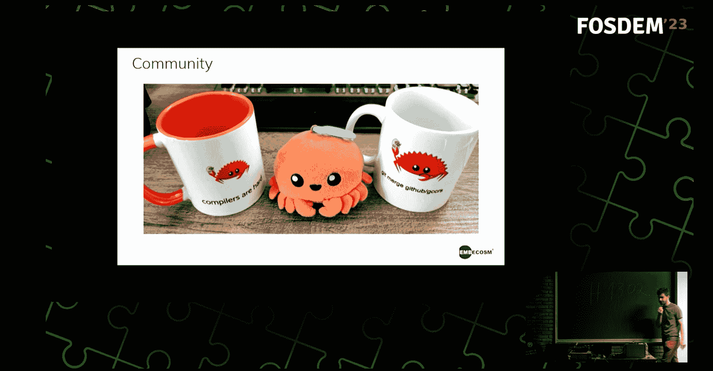

# Rust 支持正在 GNU GCC 编译器中构建

> 原文：<https://thenewstack.io/rust-support-is-being-built-into-the-gnu-gcc-compiler/>

在今年于布鲁塞尔举行的 FOSDEM 会议上，编译器工程师亚瑟·科恩(Arthur Cohen)发表了一个基于一个单一梦想的项目演讲:用 GCC 编译器(T3)为 T2 编译 Rust 代码。

“我们实际上是从零开始重新实现编译器，”科恩告诉观众。

在一屋子 [Rust 开发人员](https://thenewstack.io/developers-most-likely-to-learn-go-and-rust-in-2023-survey-says/)——他们可能使用 Rust 自己的编译器[*rustc*](https://manpages.ubuntu.com/manpages/xenial/man1/rustc.1.html)——面前，科恩开了个玩笑，说使用 [GNU 的开源 GCC 编译器](https://gcc.gnu.org/)“对你有好处。“这对你的健康有好处，”一个团队对一个项目的概述承诺道，“这个团队愚蠢到甚至想从头开始重新实现 Rust 编译器。”

但正如科恩后来解释的那样，在自嘲式幽默之外，还有一个雄心勃勃的重要使命。让 Rust 为 GCC 工具链提供自己的前端可以带来切实的好处。

它甚至可能有助于将 Rust 引入 Linux 内核。

## 额外的生态系统

Rust 目前的编译器是[低级虚拟机](https://llvm.org/) (LLVM)工具链的前端，可以输出多种机器的编译代码。但是通过为 GNU compiler Collection(GCC)编译器创建[前端，该团队希望 Rust 能够从 GCC 35 年历史中创建的 GCC 工具和插件的整个生态系统中受益，从安全插件和静态分析器到提供链接时间优化和控制流完整性检查的插件——更不用说 *gdb* 调试器、*T21 汇编器和链接器 *ld* 了。*](https://github.com/Rust-GCC/gccrs/wiki/Frequently-Asked-Questions)

因为他们的新编译器，就像 GCC 本身一样，是用 C++ 编写的[，该团队最终希望将其移植到 GCC 的以前版本中。“希望这将有助于一些系统生锈……因为 GCC 比 LLVM 老得多，它支持比 LLVM 更多的架构和更多的目标。所以从技术上来说，多亏了 gccrs，你现在可以在你最喜欢的苏联卫星上运行 Rust 等等。”](https://thenewstack.io/c-on-the-move/)

Cohen 一开始就简明地将 GCC 定义为一个大程序，它包含“来自多种语言的多个编译器，这些编译器共享相同的后端——所以有相同类型的汇编发射和优化器等等……你有一个 C 编译器、一个 C++编译器、一个 Fortran 编译器等等……

“我们正试图给它添加铁锈。”

gccrs 的第一个版本将在 GCC 13 上发布——尽管技术网站 Phoronix [在二月中旬指出,](https://www.phoronix.com/news/GCC-13-Rust-Front-End-State)仍在开发中。“借款检查代码目前明显缺失。对内置和内部函数的支持仍在进行中，能够编译 Rust-for-Linux 代码这一重要里程碑还没有成功。成功运行 *rustc* 编译器测试套件的能力仍然是目标中的一项工作……”

Phoronix 的结论？“至少要到明年 GCC 14 发布后，这个前端才会真正对开发者有用。”

但是进展很快。八天后，Phoronix 注意到又增加了 [103 个补丁](https://www.phoronix.com/news/GCCRS-103-More-Patches-Land)。“该项目开始收到越来越多的捐款，”科恩[在该项目的补丁邮件列表中发布了](https://gcc.gnu.org/pipermail/gcc-patches/2023-February/612388.html)。

## 各地的贡献者

这项工作是多年发展的结晶。该项目始于 2014 年，当时只有一名开发人员，2019 年，两家公司赞助了该项目，即[开源安全](https://opensrcsec.com/)和 [Embecosm](https://www.embecosm.com/) 。科恩还对为项目贡献代码的 GCC 和非 GCC 开发者表示感谢。

科恩的演讲指出，2022 年有超过 50 名不同的贡献者——包括几名学生，“这让我感到非常自豪。”科恩本人在谷歌的代码之夏期间就开始致力于该项目，并自豪地指出，该项目今年仍在参与中，提供了从事诸如 gccr Unicode 支持、高级中间表示代码的更好调试以及改进错误处理等工作的机会。

他们还得到了 Rust core 团队和 GCC 自己的开发团队的支持。

但在这一过程中，他们也希望帮助 Rust 的编译器团队找出语言规范可以更加清晰的地方。“我们试图为 rustc 项目做出贡献，”科恩说，并补充说 gccrs“是由热爱 Rust 并希望以我们自己的方式推进它的人建立的。”

## 异花授粉

在他演讲的最后，Cohen 说一个很大的希望是帮助努力将 Rust 引入 Linux 内核。该项目的[官方常见问题](https://github.com/Rust-GCC/gccrs/wiki/Frequently-Asked-Questions)指出，Linux 内核使用 GCC——及其相应的安全工具——这对于那些希望在 Linux 内核中集成 Rust 代码的人来说具有启示意义。“如果在 Linux 内核中混合使用 *rustc* 编译的代码和 GCC 构建的代码，编译器将无法对所有编译的代码执行完整的链接时优化，从而导致 CFI(控制流完整性)缺失。”

但是他们也希望与铁锈社区进行一些“异花授粉”。例如，Rust 的编译器团队目前有一个项目，将 Rust 检查“借用”对变量(及其值)的引用以用于程序的其他部分的方式正式化。他们将自己的努力命名为“波洛涅斯”项目(根据莎士比亚的人物建议哈姆雷特“不要借钱给人，也不要借钱给人。”)T4 gccrs 团队希望将这些算法集成到他们自己的编译器中。

科恩对观众开玩笑说:“如果你这辈子写过《铁锈》……你就好像被借货员用枪指着。”。“这真的是语言体验的核心部分，没有借用检查器，我们真的无法成为 Rust 编译器。”

在他的演讲中，科恩解释了技术细节，如它的解析器，抽象语法树，高级中间表示和“所有我们必须处理的额外有趣的东西，因为它是一种非常复杂的语言。”第一个版本现在已经合并到 GCC 13 的测试版本中，所以“你可以使用它。科恩告诉观众，你可以开始黑它，并开玩笑地补充说，此外，“当它不可避免地崩溃并可怕地死去时，请报告问题。”

但他的评论承认了一个对项目充满热情的社区，数十名开发人员提供了反馈和支持，以帮助他们实现他们的愿景。这一进程仍在继续。目前，gccrs 团队正在致力于支持 Rust 的常量泛型。

在另一个创造繁荣和忠诚社区的迹象中，科恩告诉 FOSDEM 的观众，“我们有杯子！

"如果你提出要求，我们会送你一个杯子！"

* * *

# WebReduce

<svg xmlns:xlink="http://www.w3.org/1999/xlink" viewBox="0 0 68 31" version="1.1"><title>Group</title> <desc>Created with Sketch.</desc></svg>