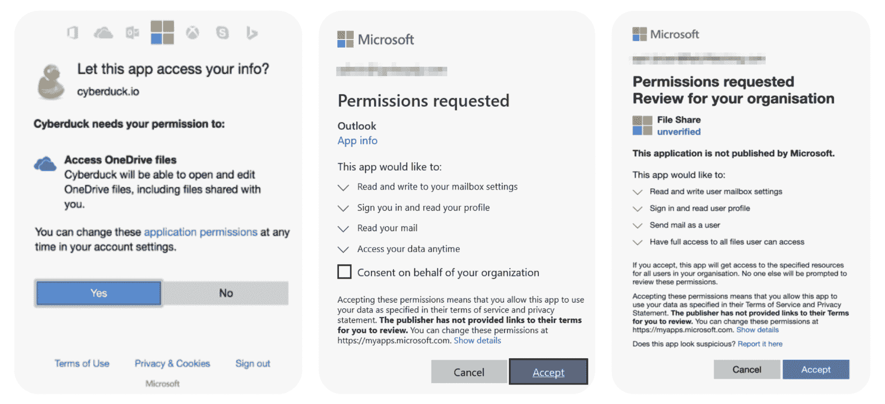
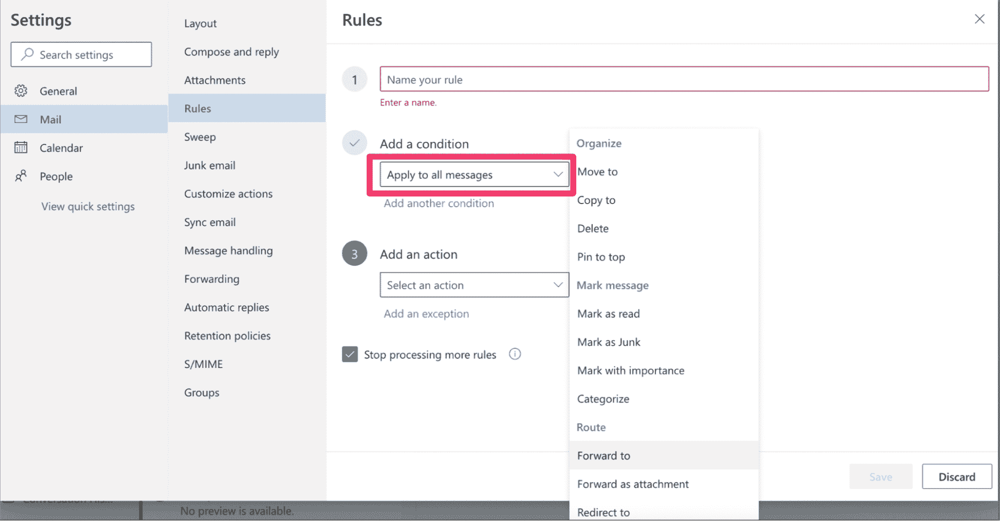
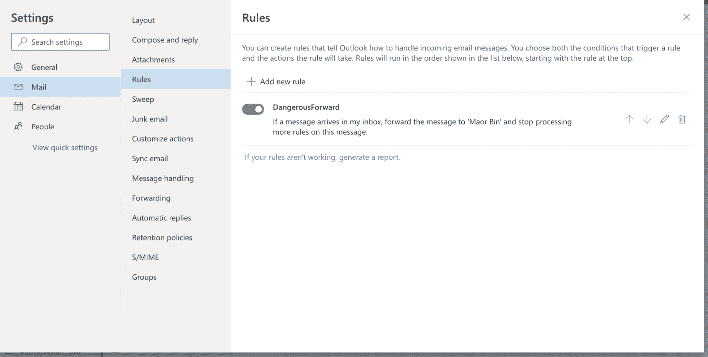
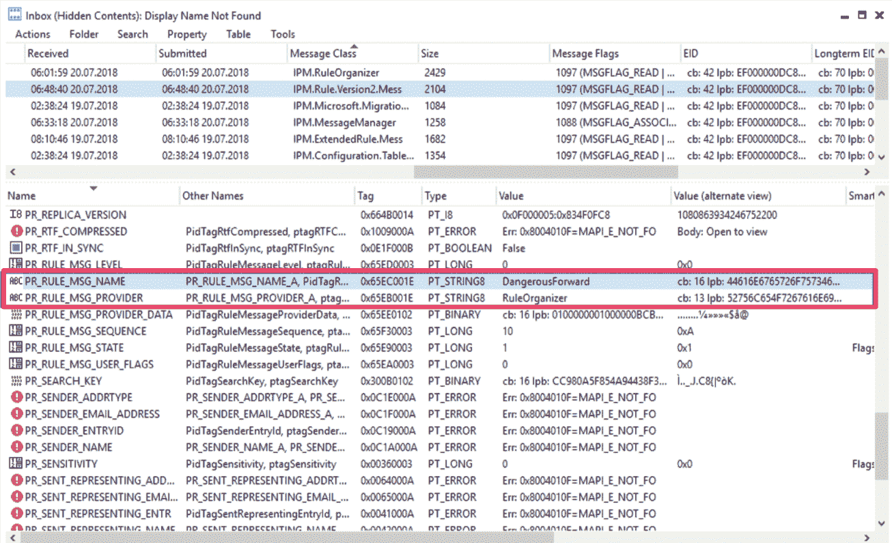
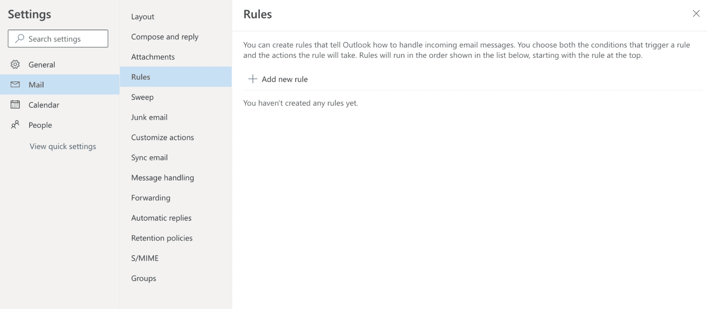
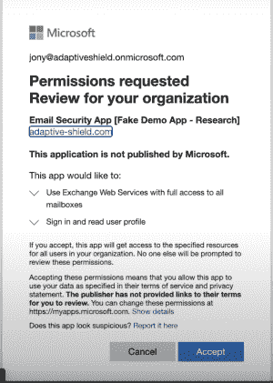
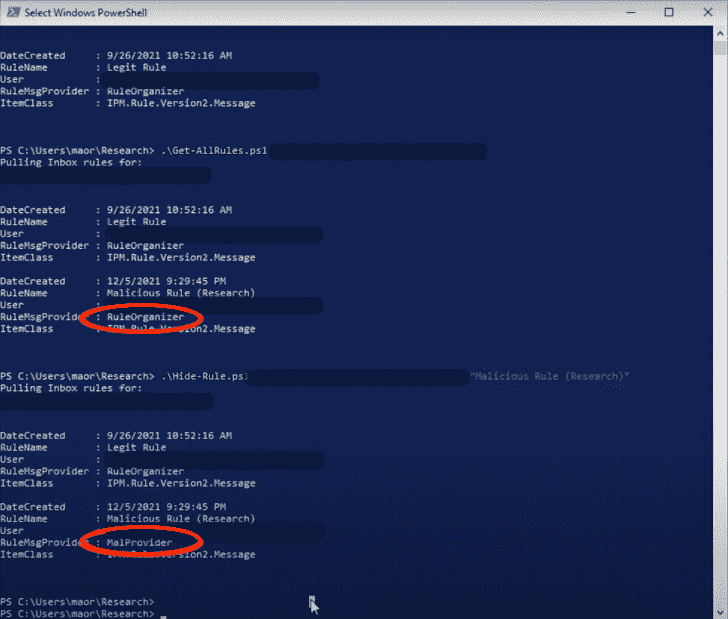

# SaaS RootKit:攻击创建 Office 365 潜规则

> 原文：<https://thenewstack.io/saas-rootkit-attack-to-create-hidden-rules-in-office-365/>

坏演员总是在寻找新的攻击方法，这使得我们的工作总是比他们领先两步。保护组织安全并不仅限于强化安全设置。这也意味着保持对不断变化或出现的弱点的掌控，这些弱点可以被利用。

由于微软 OAuth 应用程序注册中的漏洞，Adaptive Shield 安全研究人员发现了一种新的攻击媒介。通过此漏洞，攻击者可以使用 Exchange 的旧 API 在 Microsoft 365 邮箱中创建隐藏的转发规则。这篇博客将带我们看看这些隐藏的转发规则是如何产生的，以及它们带来的威胁。

## 通过 OAuth 2.0 从 SaaS 到 SaaS 的通道

对于公司来说，要保护自己免受这种新的攻击媒介，首先必须对第三方应用程序访问有一个基本的了解。第三方应用通过获得对不同信息和设置的访问和许可来连接到其他应用。这些应用对企业来说非常有价值。连接第三方应用程序时，该应用程序会请求一个或多个作用域。要启用这些权限，用户必须首先验证他们的身份，然后授予允许应用程序执行代码的权限，以便在他们的环境中执行逻辑，但仍然在后台执行。

图一。连接第三方应用

OAuth 2.0 机制简化了身份验证和授权过程，以提供细粒度的访问权限委托。OAuth 不共享密码数据，而是使用授权令牌来证明消费者和服务提供商之间的身份，从而为应用程序提供授权流。应用程序以作用域的形式表示，要求用户授权特定的权限。第三方应用程序可能完全无害，对企业来说是一个有价值的工具，但它们也可能是一个可执行文件和一个大威胁。

了解有关保护您的整个 SaaS 堆栈的[主要使用案例的更多信息。](https://www.adaptive-shield.com/use-cases?utm_source=TheNewStack&utm_medium=sponsored_content&utm_campaign=tns_saasrootkit.1)

## **收件箱规则**

那么微软 365 的收件箱规则是什么呢？简而言之，它们是基于 Microsoft 邮箱中的预设条件发生的操作。比如:自动标记收到的邮件的重要程度，自动删除发出的邮件，自动转发收到的邮件等等。转发规则可以由希望为特定用户的邮箱转发电子邮件的公司来设置。要配置此设置，管理员通常使用`ForwardingSMTPAddress`*或`ForwardingAddress`*。或者，用户可以使用邮件流规则或收件箱规则*、*自行设置它们，这些规则根据用户收件箱的不同属性触发不同的转发规则。**

 **下面是用户如何创建收件箱规则的示例。

图二。在 Microsoft 中创建转发规则

图 3。在 Microsoft 中创建转发规则

## 隐藏转发规则

Compass Security 的 Damian Pflammater 首先发现了一种未记录的方法，可以用来隐藏这些类型的收件箱规则。如图 3 所示，这些隐藏的转发规则功能齐全，可以在后端看到。然而，当用户通过通用界面(如电子邮件客户端、管理仪表板或 API)搜索它们时，规则是不可见的(图 4)。

图 4。隐藏转发规则的后端

图 5。隐藏转发规则

Pflammater 向微软报告了他的发现，并收到了以下回复。

“[……]我们的工程团队调查了您描述的行为。他们认为这不属于安全问题，因为创建这些规则需要控制帐户。不过，他们正在考虑未来改进软件的方法。”

“[……]MSRC 不会跟踪这个问题，我们将来也不会有关于它的更新[……]”

换句话说，微软说，“这不是一个 bug，这是一个特性。”

## 下一次进化:通过 SaaS 的攻击方法

在阅读了 Pflammater 的发现和微软的回应后，我们的研究人员被激起了足够的兴趣来进一步探索这种行为。第三方应用程序访问结合隐藏的转发规则创建了一种 *SaaS rootkit* 。rootkit 是计算机软件的集合，通常是恶意的，旨在允许访问计算机或其软件的某个区域，否则是不允许的，并且经常掩盖其存在或其他软件的存在。Rootkit 检测很困难，因为 rootkit 可能会破坏旨在找到它的软件。攻击者在微软 365 中隐藏的转发规则充当了 SaaS rootkit。

SaaS rootkit 允许攻击创建作为软件即服务应用程序存在的恶意软件，并在不被注意的情况下保持对受害者帐户的访问。通过这些隐藏转发规则的攻击不应被误认为是一次性的，而是通过 SaaS 应用程序的新攻击方法的开始。

图 6。伪造的应用程序权限请求

攻击者的工作很简单:创建一个看起来可信的应用程序，诱使用户接受并获得权限。虽然不良参与者在用户界面(UI)中找不到在线权限/范围，但他们能够通过终端脚本添加它们。攻击者创建一个应用程序，然后向用户发送连接该应用程序的邀请。在用户接受并授予权限后，攻击者可以使用它来创建转发规则，并像 rootkit 一样在用户界面中隐藏这些规则。用户将在微软官方网站上看到一个 OAuth 应用程序对话框，并可能像平常一样接受它。当用户接受时，他们就给了坏人特定访问权限的令牌。

图 7。隐藏规则的终端脚本

既然攻击者拥有权限，他们就可以创建隐藏的转发规则。流氓 OAuth 应用相当于恶意软件，其运行方式与发送恶意可执行文件没有任何不同。端点检测和响应工具无法检测到这种类型的攻击。

## 微软回应

在与 Microsoft 联系并提请他们注意该问题后，我们收到了以下回复:

“我们已经详细检查了报告，包括你所有的附加文件。不幸的是，虽然您报告的问题是有效的，但它不符合我们立即维修的要求。在这种情况下，我们认为这是可以改进的，但由于对攻击者的要求很高，问题是管理员的后利用，这将不会被安全团队跟踪服务。

也就是说，该提交已被标记为供产品团队将来审查，作为提高受影响产品安全性的机会。"

## 如何最好地缓解 SaaS Rootkit 攻击

没有一个防弹的方法来消除 SaaS rootkit 攻击，但有几个最佳做法，可以帮助保持组织更多的保护。

*   **监控第三方应用程序访问**及其权限，以确保应用程序是合法的，并且只被授予他们需要的访问权限。
*   **跟踪活动**并留意新的收件箱规则，以识别来自不受信任域的任何新连接。
*   **尽可能禁用第三方应用注册**以降低风险。

## 结论

隐藏的转发规则仍然是一种威胁，尤其是当它们通过可信的微软网站出现时。为阻止恶意软件而创建的传统控制措施一直难以跟上恶意软件的发展，以及可以利用任何 SaaS 应用程序的新攻击载体，从 Microsoft 365 到 Salesforce 到 Google Workspace 等。组织应该使用本机安全配置来控制 SaaS 应用中的 OAuth 应用安装，以保护用户免受此类恶意攻击。

获取 Forrester 的报告[“拥抱 SaaS 保护的范式转变:SaaS 安全态势管理”。](https://go.adaptive-shield.com/embrace-a-paradigm-shift-in-saas-protection-saas-security-posture-management-forrester-report?utm_source=TheNewStack&utm_medium=sponsored_content&utm_campaign=tns_saasrootkit.2)

<svg xmlns:xlink="http://www.w3.org/1999/xlink" viewBox="0 0 68 31" version="1.1"><title>Group</title> <desc>Created with Sketch.</desc></svg>**