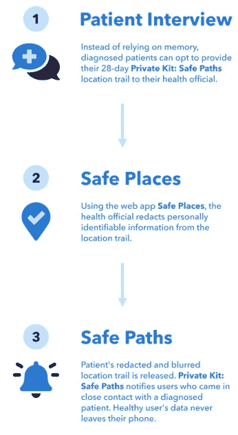
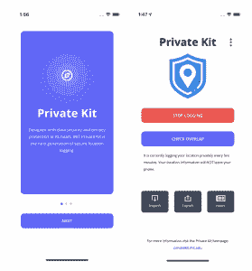

# 安全路径:麻省理工学院冠状病毒接触追踪应用程序保护用户隐私

> 原文：<https://thenewstack.io/safe-paths-mit-coronavirus-contact-tracing-app-protects-user-privacy/>

随着冠状病毒危机在国内和世界偏远地区继续发展，越来越明显的是，有效控制疫情不仅需要对大量人口进行广泛检测，还需要某种方法来识别和跟踪与病毒感染者接触过的人。[接触者追踪](https://www.forbes.com/sites/brucelee/2020/04/17/what-is-contact-tracing-why-is-it-key-to-stop-covid-19-coronavirus/#75e2d6013e5e)的做法已经存在了几十年，旨在阻断传染病的传播和蔓延，并已被证明在限制新冠肺炎病毒在[南韩](https://www.newyorker.com/news/news-desk/seouls-radical-experiment-in-digital-contact-tracing)和[中国](https://futurism.com/contact-tracing-apps-china-coronavirus)等国家的传播率方面相对有效，这些国家已经实施了数字接触者追踪平台来解决这一重大任务。

虽然数字联系人追踪应用程序相对于过去的手动方法来说没有那么乏味，但它们确实对公民的隐私构成了潜在威胁。这是因为他们通过收集用户的数据来工作，这些数据包括他们去了哪里，停留了多长时间，以及他们与谁进行了互动——这些数据可以与政府组织共享——因此可以被视为一种大规模监控的形式。此外，在数字接触追踪系统中，关于被诊断的携带者或受影响企业的信息可能会在他们更大的接触网络中传播，这种警告可能会导致耻辱或公众反弹，更不用说令人不安的[欺诈](https://www.bbc.com/news/technology-52353720)或敏感个人信息被盗的可能性了。

但是，如果有某种方法既能保护用户隐私，又能保护公众健康，那会怎么样呢？由麻省理工学院领导的多学科专家小组最近推出了一款开源、以隐私为导向的应用程序，通过以分散的方式在设备之间共享用户的加密位置数据来解决这些问题。

根据该团队的[白皮书](https://arxiv.org/pdf/2003.08567.pdf),[私人工具包:安全路径](http://safepaths.mit.edu/)应用程序以“拉”模式运行，用户可以检索已识别携带者的数据，以便他们可以“自我确定”他们是否接触过新冠肺炎病毒，然后采取任何必要的步骤咨询医疗专业人员并进行自我隔离。

该团队写道:“通过一个允许用户了解受感染个体的潜在暴露以及受感染个体的适当行动的应用程序，可能会通过更快地识别将他们从接触链中删除的病例/暴露来降低接触率。”

使用 GPS 和蓝牙技术，该应用程序每五分钟记录用户的位置数据，因此如果用户测试呈阳性，该应用程序还可以允许卫生当局利用该位置线索快速追溯其他潜在病例——但只有在用户同意的情况下。即便如此，这些数据在被删除之前也只能在手机上保留一段时间，而且是加密的，因此其他用户无法识别运营商。

“结束对第三方参与的需要将代表着对确诊携带者隐私保护的巨大进步，”该小组解释说。“一个实体(主要是政府)对数据的访问和使用应该受到限制和严格监管。我们认为没有人有义务分享他们的个人信息。位置轨迹的限时存储进一步保护了被诊断携带者的隐私。”

此外，通过为应用程序添加透明元素，该团队希望鼓励广泛采用，这在民主国家一直是一个持续存在的问题:“使用开源方法创建应用程序可以增强对应用程序隐私保护能力的信任，因为独立专家和媒体可以访问和评估源代码。”

该应用程序现在可以在 iOS 和 Android 上使用，尽管该团队继续进行改进，目前正在研究如何在 15 个美国城市以及 20 多个其他国家的其他政府组织中最好地部署该应用程序。

在[私人工具包:安全路径](http://safepaths.mit.edu/)中阅读更多信息。

图片来自 Pixabay，其他图片来自麻省理工学院

<svg xmlns:xlink="http://www.w3.org/1999/xlink" viewBox="0 0 68 31" version="1.1"><title>Group</title> <desc>Created with Sketch.</desc></svg>