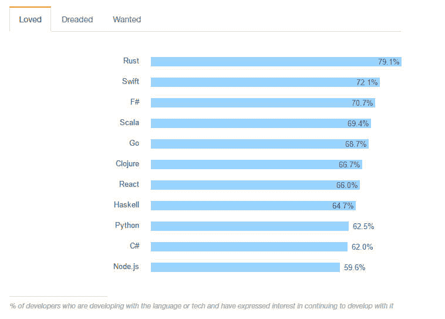

# Rust 与其他编程语言相比如何

> 原文：<https://thenewstack.io/safer-future-rust/>

上个月发布的最新堆栈溢出调查[宣称](http://stackoverflow.com/research/developer-survey-2016)“开发者喜欢 Rust”。

以广受欢迎的火狐浏览器和雷鸟电子邮件客户端而闻名的 Mozilla 基金会，也已经致力于开源的 [Rust 编程语言](https://www.rust-lang.org/)一段时间了。许多开发人员满怀期待地看着 Rust，等待合适的时机开始开发。鉴于 [Rust 在去年五月达到了 1.0](http://blog.rust-lang.org/2015/05/15/Rust-1.0.html) ，现在开始破解 Rust 比以往任何时候都要好！

然而，与任何语言或工具一样，理解引入 Rust 是为了解决什么问题，以及什么类型的解决方案最好源自 Rust 是很重要的。

## **更像 C++和 Go，不太像 Node 和 Ruby**

虽然 Rust 是一种通用语言，你可以用 Rust 编写你的下一个 web 应用，但是你不会很好地体验它所提供的功能。Rust 是一种低级语言，最适合系统、嵌入式和其他性能关键的代码。虽然可以想象有一天人们会在 Rust 上编写最新的 3D 视频游戏——这是一个高性能历来至关重要的领域——但不可能有一个 web 框架能与 Ruby on Rails 针锋相对。

### **比 C/C++** 更安全

Rust 和 C++最大的——有些人会说是最重要的——区别在于强调编写安全的代码。

使用“安全代码”，对象从头到尾都由编程语言管理。开发人员不做任何指针运算或管理内存，而这在 C 或 C++程序中是必要的。

对于给定的对象，承诺为该对象分配或保留适当数量的内存。当访问这个对象时，不可能意外地访问一个越界的内存位置。当它的工作完成时，对象将被系统自动释放，我的意思是程序员将不必手动“释放”或取消保留该对象使用的内存。

使用非托管代码，不仅更难编写正确且无错误的代码，而且使代码更容易受到安全威胁。一个特别常见的威胁是缓冲区溢出，在这种情况下，用户可以输入比程序分配的内存空间所能容纳的更多的信息，这使得恶意用户可以修改不受代码直接控制的系统部分的内存。

虽然危险，但不安全的代码有时对提高性能非常有用。Rust 让程序员两全其美，允许你写不安全的代码，但默认使用安全的代码。相比较而言，不安全代码在 C 和 C++中是默认的；您必须使用 unsafe 关键字显式选择加入 Rust 中的不安全代码。

Google Carbon 是一种新的编程语言,旨在潜在地取代 C++，但它目前还太新，无法与之相比。

上个月发布的堆栈溢出调查发现，Rust 是所有编程语言和框架的开发者中最受欢迎的。

### **比围棋更老练** 

Go 是另一种现代语言，旨在允许程序员编写内存安全的低级代码，并具有低级语言的性能特征。Go 编程语言的其他目标包括通过 Go 的通道构造提供强大的并发支持，以及简单性。但是 Go 有点像 [Node.js](https://thenewstack.io/node-js-long-term-support-ready-enterprise/) ，在异步代码中是语言的一等公民，你在编写 Go 代码时并不能真正忽略并发性。

虽然 Rust 在并发编程方面也很出色，但这不是该语言的主要目标。虽然 Rust 没有为了复杂而努力变得复杂，但这种语言并不像 Go 那样专注于简单。例如，Go 经常忽略其他语言认为必不可少的特性，比如泛型类型，以符合其简单性的目标。另一方面，Rust 是一种相当复杂的语言，与 C++非常相似。

Rust 的语言目标是实现快速、高效和内存安全的系统编程；简单从来没有被吹捧为它的设计基础之一。没有一种方法从根本上更好，但它们是构建语言的完全不同的方法。由于这种差异，我想大多数程序员都会对这种或那种语言有强烈的偏好。

## **现代依赖与构建管理与货物**

大多数现代编程语言的一个关键特征是强大的包管理工具。 [Ruby](https://thenewstack.io/how-to-write-ruby-faster-at-the-source-code-level/) 有 gems 和 bundler， [Python](https://thenewstack.io/popularity-python-java-world/) 有 pip ad PyPi，Node 有备受喜爱的——尽管[最近声名狼藉](https://thenewstack.io/the-kik-kerfuffle/) NPM，甚至 [Perl](https://thenewstack.io/perl-back-ready-roll-big-data/) 有德高望重的 CPAN。C 和 C++ 语言从来没有真正的标准——或者可以说，甚至是事实上的标准——包管理工具。

有配套打包系统的语言比没有配套打包系统的语言有一些优势。首先，这些语言中的大多数都有大量的开源库和框架可供参考。如果你是一名 Ruby/Rails 开发人员，这个生态系统已经非常成熟，你想要完成的任何事情都有合适的宝石。

库和框架不仅允许开发人员通过重用其他人的工作来更快地创建，而且通常可以产生经过更好测试、更经得起考验的代码。一个由 10，000 个用户下载的 JSON 库，有 3，000 个关闭的问题，超过 100 个单元测试，通常比普通的自主开发的 JSON 库要健壮得多。

这些包管理器的另一个好处是它使得将你的代码分发给最终用户更加容易。在大多数情况下，键入“gem install sometool”或“pip install sometool”要比下载一些 C 代码、正确安装其所有依赖项、编译它并将其链接到系统中的适当位置容易得多。这可以直接转化为更多的最终用户对你的软件和更少的“放弃”，而试图安装它。

## **未来和当前项目**

虽然 Rust 仍在不断成熟，但它得到了社区的大力支持。目前一些崛起的社区项目的例子: [redox](https://github.com/redox-os/redox) ，用 Rust 写的操作系统； [cgmath](https://github.com/bjz/cgmath) ，线性代数和计算机图形库；[铁](https://github.com/iron/iron)，并发 web 框架；甚至还有一个[末日渲染器](https://github.com/cristicbz/rust-doom)！如果你很想亲自体验一下 Rust，为什么不去看看 Rust 编程语言书，或者“这本书”，这是 Rustaceans 人给它起的昵称。

<svg xmlns:xlink="http://www.w3.org/1999/xlink" viewBox="0 0 68 31" version="1.1"><title>Group</title> <desc>Created with Sketch.</desc></svg>