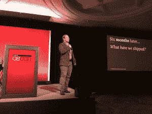

# 感谢您使用集装箱！”...说从来没有首席执行官

> 原文：<https://thenewstack.io/said-no-ceo-ever-things-dont-matter-cloud/>

“我们认为当我们使用其他人的服务器时，我们会获得神奇的力量，” [Pivotal 的云铸造平台](https://pivotal.io/platform)的首席技术专家 [Casey West](https://twitter.com/caseywest) 在他的 OSCON 欧洲演讲中说，他[提供了一个幽默而富有洞察力的眼神](https://speakerdeck.com/caseywest/said-no-ceo-ever-things-that-dont-matter-in-the-cloud)，关于首席执行官如何看待、或不看待——或诚实地说不在乎——IT 专业人员在云中做的绝大多数工作。

“这个演讲是关于高期望的，”韦斯特在他的幻灯片中说。“是的，我知道我在那里做了什么。高，云，云高高在上，lol。”

如今，IT 专业人士几乎在各个行业工作。但是对他们的期望基本上是相同的，不管他们从事的项目是“绿地项目”还是“棕色项目”，这是一种很好的方式来说明你正在更新遗留系统。

有了绿地系统，“你所要做的就是凭空创造一些东西，并与价值数十亿美元的公司竞争。没什么大不了的。”要求基本上是双重的:所有你必须做的是…

*   比其他人交付得更快。
*   千万不要出错。

有了布朗菲尔德系统公司，“你所要做的就是将一个现有的应用程序现代化，使我们的所有收入与理论上价值 10 亿美元的公司竞争。”没什么大不了的。哦，还有…

*   比其他人交付得更快。
*   千万不要出错。

当然，启动应用程序所需的所有这些小任务都需要时间，通常比你想象的要多。CEO 真的不关心他们中的大多数。根据 West 的说法，以下是你永远不要指望从你的首席执行官那里听到的一些事情:

*   “我很欣赏你在没有交付任何东西的情况下取得的进步。”
*   "挑一个 Linux 发行版做得好."
*   “内核补丁打得好。”
*   “优秀的 DNS 条目。你的 TTL 是最好的。”
*   “卓越的‘高可用性’战略。”
*   "手动生成和共享秘密做得很好."
*   “自动化做得好，所以我们的自动化是自动化的。”
*   "✋ ?感谢使用容器！”
*   “部署软件的工作做得很好。”
*   “日志记录基础设施做得很好。”
*   “我很高兴你建立了一个监控系统。”

韦斯特说，我们花了太多时间在无差别的繁重工作上，这些“工具、系统和过程不会提高你的组织提供的独特价值”。

他建议说，必然的结果是“我们没有在提供独特商业价值的东西上花费足够的时间，这些工具、系统和过程确实提高了你的组织提供的独特价值”。“这的确很重要。”

换句话说，根据韦斯特的说法:

*   “什么是独特的商业价值？—您的实际代码。”
*   “什么叫无差别举重？—其他一切。”

韦斯特把软件比作冰山。我们做的大部分事情都在表面之下。水面上的一点点对客户和首席执行官来说很重要。表面之下的东西很重要，但首席执行官不应该专注于此。

韦斯特的建议？"专注于你被认为是世界上最擅长的事情."

在问答环节，行业观察家西蒙·沃德利问了一个关于首席执行官们从哪里获得信息的问题，西氏用他演讲中最值得引用的一段话来回答，“[《哈佛商业评论》](https://hbr.org/)是商业黑客新闻。”

Cloud Foundry 是新堆栈的赞助商。

通过 Pixabay 的特征图像。

<svg xmlns:xlink="http://www.w3.org/1999/xlink" viewBox="0 0 68 31" version="1.1"><title>Group</title> <desc>Created with Sketch.</desc></svg>