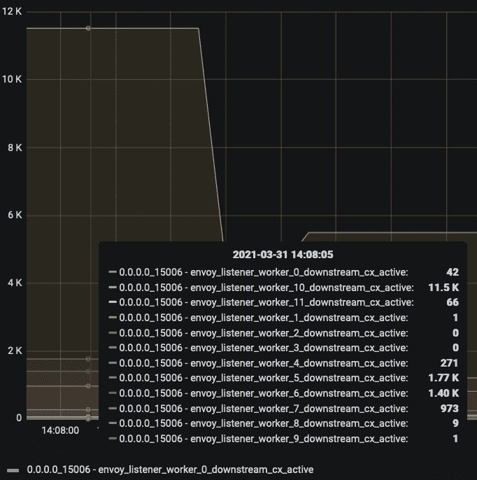

# 使用 Istio 加快航行速度，第 1 部分

> 原文：<https://thenewstack.io/sailing-faster-with-istio-part-1/>

[](https://www.linkedin.com/in/nrjpoddar/)

 [尼拉杰·波德达尔

尼拉杰是一名技术领导者，拥有在快节奏和早期组织中交付成果的良好记录。他对创业和解决复杂的分布式系统问题的热情使他共同创立了 Aspen Mesh，在那里他作为首席架构师领导工程工作。他是开源爱好者，也是 Istio 技术监督委员会(TOC)和指导委员会的成员。当不处理技术挑战时，你会发现他在打壁球、烹饪或尝试新餐馆。](https://www.linkedin.com/in/nrjpoddar/) [](https://www.linkedin.com/in/nrjpoddar/)

当超大型海运集装箱“长赐号”号在苏伊士运河搁浅，中断了一条造成数十亿美元损失的主要贸易路线时，我们在 Aspen Mesh 的解决方案工程师在过去几周一直被困在他们自己的岛上诊断一个棘手的性能瓶颈。尽管这两个问题的规模和全球影响非常不同，但它提供了一种有趣的方式来将全球航运事件与 Istio 使用的隐喻性航海主题相关联。为了详细说明这个主题，让我们从承载乳制品的容器，以及显然是天底下的其他东西，切换到穿梭于网络数据包的容器。

为了充分利用容器和微服务架构，Istio(和 Aspen Mesh)使用了 sidecar 代理模型。将边车代理添加到您的网状网络中有很多好处，从统一身份到安全性到度量和高级流量路由。由于 Aspen Mesh 的客户范围从大型企业一直到服务提供商，添加这些边车对性能的影响与上述好处一样重要。我将在这篇博客中介绍的性能实验旨在评估在服务器和/或客户端的高吞吐量场景中添加 sidecar 代理的影响。

我们遇到过工作负载，尤其是在服务提供商领域，在这一领域，对特定服务有很高的请求或每秒事务量要求。此外，纵向扩展(即添加更多 CPU/内存)优于横向扩展。我们希望测试 sidecar 代理在最大可实现吞吐量方面的限制，以便我们可以调整和优化我们的模型，满足客户使用的各种工作负载的性能要求。

## **吞吐量测试设置**

我们在这个实验中使用的测试设置非常简单:一个运行在大型 AWS 节点实例类型上的 [Fortio](https://github.com/fortio/fortio) 客户端和服务器，例如具有 8 个 vcpu 和 32 GB 内存的可突发 t3.2xlarge 或具有 32 个 vcpu 和 128 GB 内存的专用 m5.8xlarge 实例类型。测试运行的是 Fortio 客户机和服务器 pod 的单个实例，其专用节点上没有资源限制。Fortio 客户端运行在一种最大化吞吐量的模式下，如下所示:

```
for  ((  k  =  2;  k  <  9000;  k=k*2  ));  do
  /usr/bin/fortio load  -jitter=False  -c  $k  -qps  0  -t  60s  -a  http://fortio-server:8080/echo\?size\=1024’
done

```

上面的命令运行测试 60 秒，每秒查询数(QPS)为 0(即不同数量的同时并行连接的最大吞吐量)。在一台 t 3.2x 大型机器上使用此设置，我们能够实现大约 100，000 QPS。进一步增加并行连接的数量并没有导致吞吐量超过大约 100K QPS，这表明可能存在 CPU 瓶颈。在 m5.8xlarge 实例上运行相同的实验，我们可以获得大约 300，000 QPS 或更高的吞吐量，具体取决于并行连接设置。

这是 CPU 节流的充分证据。随着添加更多的 CPU 增加了 QPS，我们觉得我们有了一个合理的基线来开始评估在这个设置中添加 sidecar 代理的效果。

## 在两端添加边车代理

接下来，在 t 3.2x 大型实例上使用相同的设置，我们使用 Aspen Mesh 默认设置在 Fortio 客户端和服务器 pod 上添加了 Istio sidecar 代理；mTLS 严格设置，启用访问日志记录，默认并发(工作线程)为 2。使用这些参数，并像以前一样运行相同的命令，我们只能获得大约 10，000 QPS 的最大吞吐量。

这是吞吐量减少 10 倍的因素。这是意料之中的，因为我们只配置了两个工作线程，这两个线程有望以最大能力运行，但无法跟上客户端负载。

因此，对我们来说，合乎逻辑的下一步是增加并发设置，以运行更多的工作线程来接受更多的连接并实现更高的吞吐量。在 Istio 和 Aspen Mesh 中，您可以通过 mesh config 下的 proxy config 中的 concurrency 设置来全局设置代理并发性，或者通过 pod 注释来覆盖它们，如下所示:

```
proxy.istio.io/config:
  concurrency:  4

```

注意，使用值“0”进行并发配置，以使用机器上所有可用的内核。我们将并发设置从两个增加到四个，再增加到六个，正如预期的那样，我们看到最大吞吐量从 QPS 的 10K 稳步增加到 QPS 的大约 15K 到 QPS 的大约 20K。然而，与没有边车代理的结果相比，这些数字仍然很低(五分之一)。

为了消除 CPU 节流因素，我们在具有更高并发设置的 m 5.8 XL 大型实例上运行了相同的实验，但我们可以实现的最大吞吐量仍然约为 20，000 QPS。

这种性能下降是不可接受的，所以我们探究了为什么即使在 sidecar 代理上配置了足够的工作线程，吞吐量仍然很低。

## 剥洋葱皮

为了调查这个问题，我们查看了服务器窗格中的 CPU 利用率指标，注意到 CPU 利用率占请求的 CPU 总数的百分比并不是很高。这似乎很奇怪，因为我们期望代理工作线程尽可能快地旋转以实现最大吞吐量，所以我们需要进一步调查以了解根本原因。

为了更好地理解低 CPU 利用率，我们检查了服务器 sidecar 代理收到的连接。Envoy 的[并发模型](https://blog.envoyproxy.io/envoy-threading-model-a8d44b922310)依靠内核在监听同一个套接字的不同工作线程之间分配连接。这意味着如果服务器 sidecar 代理收到的连接数少于工作线程数，您将永远无法完全使用所有 CPU。

由于这项调查纯粹是在服务器端进行的，我们使用 Fortio 客户端 pod 再次运行了上述实验，但这次没有注入 sidecar 代理，而只注入了代理的 Fortio 服务器 pod。我们发现最大吞吐量仍然像以前一样限制在大约 20K QPS，因此暗示了服务器 sidecar 代理上的问题。

为了进一步调查，我们必须查看由 Envoy proxy 报告的连接级别指标。(在《用 Istio 航行得更快，第 2 部分》中，我们将看到暴露了 Envoy 指标的实验会发生什么。默认情况下，Istio 和 Aspen Mesh 不公开来自 Envoy 的连接级指标。)

这些指标可以在 Istio 版本 1.8 和更高版本中启用，方法是遵循[本指南](https://istio.io/latest/docs/ops/configuration/telemetry/envoy-stats/)，并添加与您想要公开的指标相对应的适当 pod 注释。Envoy 有许多以高分辨率发出的低级指标，对于中等规模的集群，这些指标很容易淹没您的指标后端，因此您应该在生产环境中谨慎地启用它。

此外，找到合适的特使指标可能是一个漫长的旅程，因此这里是您需要获得连接级指标的内容。在服务器端窗格上，添加以下注释:

```
annotations:
  proxy.istio.io/config:  |-
    proxyStatsMatcher:
      inclusionRegexps:
        -  "listener.*.downstream_cx_total"
        -  "listener.*.downstream_cx_active"

```

这将为 Istio 配置的所有监听器启用报告，根据集群中的服务数量，这可能很多，但仅启用下游连接总数计数器和下游连接活动度量。

要查看这些指标，您可以使用您的 [Prometheus](https://prometheus.io/) 仪表板，如果它已启用，或者将端口转发到正在测试的服务器 pod 的端口 15000 并导航到 http://localhost:15000/stats/Prometheus。由于 Istio 配置了许多侦听器，因此很难找到正确的侦听器。这里有一个关于 Istio 如何设置 Envoy 配置的快速入门。(你可以在这里找到特使监听器指标的完整列表。)

对于从 pod 外部的客户端到 pod 的任何入站连接，Istio 在 0.0.0.0:15006 配置一个虚拟入站侦听器，该侦听器从 iptables 的重定向规则接收所有流量。这是唯一一个实际配置为从内核接收连接的侦听器，在接收到连接后，它将与过滤器链属性进行匹配，以将流量代理到本地主机上正确的应用程序端口。这意味着，即使上面的 Fortio 客户机以端口 8080 为目标，我们也需要在 0.0.0.0:15006 而不是 0.0.0.0:8080 查看虚拟入站侦听器的总连接数和活动连接数。查看这个指标，我们发现活动连接数接近 Fortio 客户端上配置的同时连接数。这就否定了我们关于连接数少于工作线程数的理论。

我们调试之旅的下一步是查看每个工作线程收到的连接数。正如我前面提到的，Envoy 依赖内核将接受的连接分配给不同的工作线程，为了让所有的工作线程充分利用分配的 CPU，连接也需要相当平衡。幸运的是，Envoy 拥有针对监听器的[每工作者指标](https://www.envoyproxy.io/docs/envoy/latest/configuration/listeners/stats#per-handler-listener-stats)，可以让监听器理解分布。因为这些度量是基于侦听器的。<地址>。<处理程序>。<指标名称>，上面注释中提供的正则表达式也应该公开这些指标。每个工作人员的指标如下所示:



从上图中可以看出，连接远没有均匀地分布在工作线程中。一个线程，worker 10，有 11.5K 的活动连接，相比之下，一些线程有大约 1-1.5K 的活动连接，其他线程甚至更低。这解释了 CPU 利用率低的原因，因为大多数工作线程没有足够的连接来完成有用的工作。

在我们的特使研究中，我们很快发现了[这个问题，](https://github.com/envoyproxy/envoy/issues/4602)很好地总结了这个问题以及为解决这个问题所做的各种努力。


图片来自 Pixabay。

所以，接下来，我们开始寻找解决这个问题的方法。目前，我们自己的长赐号似乎陷入了困境，一些勤奋的工作线程在努力寻找平衡。我们需要一台挖掘机开始挖掘。

对于故事的其余部分，请查看下周的第 2 部分。

<svg xmlns:xlink="http://www.w3.org/1999/xlink" viewBox="0 0 68 31" version="1.1"><title>Group</title> <desc>Created with Sketch.</desc></svg>