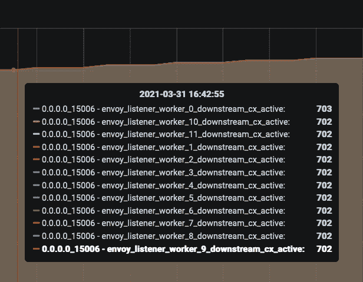
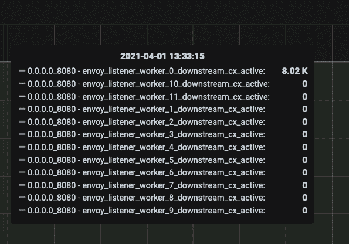

# 用 Istio 加速航行，第 2 部分

> 原文：<https://thenewstack.io/sailing-faster-with-istio-part-2/>

虽然我们勇敢的团队通过添加 sidecar 代理解决了高吞吐量工作负载的扩展问题，但我们遇到了一个瓶颈，这与长赐号不久前在苏伊士运河遇到的情况并非完全不同。(在本系列的[第 1 部分中，您可以了解到我们如何在运行 Fortio 客户端时发现这种低 CPU 利用率以及不平衡的代理工作线程连接。在这个扩展实验中，尽管添加了 sidecar 代理，每秒查询数(QPS)仍然很低，这是一个不可接受的结果。)](https://thenewstack.io/sailing-faster-with-istio-part-1/)

幸运的是，我们还有一些事情要做，我们已经准备好更仔细地研究侦听器指标。

## 让线程之间平等！

 [尼拉杰·波德达尔

Neeraj 是一名技术领导者，拥有在快节奏和早期组织中交付成果的良好记录。他对创业和解决复杂的分布式系统问题的热情使他共同创立了 Aspen Mesh，在那里他作为首席架构师领导工程工作。他是开源爱好者，也是 Istio 技术监督委员会(TOC)和指导委员会的成员。](https://www.linkedin.com/in/nrjpoddar/) 

正如我们在第 1 部分中谈到的，我们很快发现了[这个问题](https://github.com/envoyproxy/envoy/issues/4602)，它很好地总结了我们的 CPU 利用率和工作线程平衡问题，以及为解决这个问题所做的各种努力。在解析了这一期的对话之后，我们发现了 [pull 请求](https://github.com/envoyproxy/envoy/pull/8422)，它支持一个配置选项来打开一个特性，以便在工作线程之间实现更好的平衡。在这一点上，尝试一下似乎是值得的，所以我们研究了如何在 Istio 中实现这一点。(注意，作为这个 PR 的一部分，添加了每个工作线程的指标，这对诊断这个问题很有用。)

尽管 EnvoyFilter 可以在 Istio 中做一些不光彩的事情，但在这种情况下，快速尝试新的 Envoy 配置旋钮而无需在“istiod”或控制平面中更改代码是很有用的。为了打开“精确平衡”特性，我们创建了这样一个 EnvoyFilter 资源:

```
apiVersion:  networking.istio.io/v1alpha3
kind:  EnvoyFilter
metadata:
  name:  fortio-server-listener-balance
  namespace:  perf-sidecar
spec:
  workloadSelector:
    labels:
      app:  fortio-server
  configPatches:
    -  applyTo:  LISTENER
      match:
        context:  SIDECAR_INBOUND
        listener:
          portNumber:  15006
      patch:
        operation:  MERGE
        value:
          connection_balance_config:
            exact_balance:  {}

```

应用了这个配置后，我们屏住呼吸，再次运行实验，查看每个工作线程的指标。瞧啊。请看下图中完美平衡的连接:

[](https://cdn.thenewstack.io/media/2021/05/11a876b1-ex0obtruyaamtae.png)

使用这个配置集测量吞吐量，我们可以实现大约 80，000 QPS，这是对早期结果的一个显著改进。查看 CPU 利用率，我们看到所有的 CPU 都完全固定在 100%或接近 100%。这意味着我们终于看到了 CPU 节流。此时，通过添加更多的 CPU 和更大的机器，我们可以达到预期的更高的数字。到目前为止一切顺利。

您可能还记得，这个实验纯粹是为了测试服务器 sidecar 代理的效果，所以我们在这些测试中删除了客户端 sidecar 代理。现在是时候测量两个边车的性能了。

## 衡量客户端边车代理的影响

在入站端口(仅服务器端)启用了这种精确的平衡配置后，我们在两端运行了 sidecars 实验。我们希望实现高吞吐量，这只能受到专用于特使工作线程的 CPU 数量的限制。要是事情有那么简单就好了。

我们发现最大吞吐量再次被限制在大约 20K QPS **。**

有点令人失望，但是因为我们知道了服务器端连接不平衡的问题，我们推断在客户端应用程序和本地主机上的 sidecar 代理容器之间也会发生同样的情况。首先，我们在客户端代理上启用了以下指标:

```
annotations:
  proxy.istio.io/config:  |-
    proxyStatsMatcher:
      inclusionRegexps:
        -  "cluster.*.upstream_cx_total"
        -  "cluster.*.upstream_cx_active"
        -  "listener.*.downstream_cx_total"
        -  "listener.*.downstream_cx_active"

```

除了监听器指标之外，我们还启用了集群级指标，它可以显示任何上游集群的总连接数和活动连接数。我们希望验证客户端 sidecar 代理是否向上游 Fortio 服务器集群发送了足够数量的连接，以保持服务器工作线程被占用。我们发现活动连接数反映了 Fortio 客户端在我们的命令中使用的连接数。这是一个好迹象。请注意，Envoy 不报告每个工作线程级别的集群级别指标，但这些指标都是聚合的，因此我们无法知道连接在出站端是如何分布的。

接下来，我们检查了类似于服务器端的客户端的侦听器连接统计，以确保我们没有连接不平衡的问题。与入站端相比，在 Istio 中设置的出站监听器(或设置为处理来自与 sidecar 代理相同的 pod 中的应用程序的流量的监听器)稍有不同。对于出站流量，创建一个虚拟侦听器“0.0.0.0:15001”，类似于“0.0.0.0:15006”上的侦听器，这是 iptables 重定向规则的目标。与入站端不同，虚拟侦听器基于[原始目的地地址](https://www.envoyproxy.io/docs/envoy/latest/api-v3/config/listener/v3/listener.proto#listener-configuration)将连接移交给更具体的侦听器，如“0.0.0.0:8080”。如果没有特定的匹配，那么虚拟出站中的侦听器配置就会生效。这可以阻止或允许所有流量，具体取决于您配置的出站流量策略。在从 Fortio 客户端到服务器的流量流中，我们期望“0.0.0.0:8080”处的侦听器处理客户端代理上的连接，因此我们检查了该侦听器处的连接度量。侦听器指标如下所示:



上图显示了我们在服务器端看到的工作线程之间的连接不平衡问题。然而，出站客户端代理上的连接仅由一个工作线程处理，这解释了低吞吐量 QPS 数字的原因。在服务器端解决了这个问题后，我们应用了一个类似的 EnvoyFilter 配置，并对上下文和端口进行了细微的调整，以解决这种不平衡:

```
apiVersion:  networking.istio.io/v1alpha3
kind:  EnvoyFilter
metadata:
  name:  fortio-server-listener-balance
  namespace:  perf-sidecar
spec:
  workloadSelector:
    labels:
      app:  fortio-server
  configPatches:
    -  applyTo:  LISTENER
      match:
        context:  SIDECAR_OUTBOUND
        listener:
          portNumber:  8080
      patch:
        operation:  MERGE
        value:
          connection_balance_config:
            exact_balance:  {}

```

毫无疑问，应用这个资源将会解决我们的问题，我们将能够在客户端和服务器端代理分配了足够的 CPU 的情况下实现高 QPS。我们再次运行了实验，发现吞吐量数字没有差异。再次检查侦听器指标，我们看到即使应用了 EnvoyFilter 资源，也只有一个工作线程处理所有连接。我们还尝试在虚拟出站端口 15001 和出站端口 8080 上应用精确的平衡配置，但是吞吐量仍然被限制在 20K QPS。

这保证了下一轮的调查。

## 原始目的地听众，精确平衡问题

我们四处查看 Envoy 代码并打开 Github 问题，以了解为什么客户端精确平衡配置没有生效，而服务器端却在创造奇迹。除了方向性之外，这两个侦听器之间的主要区别在于，虚拟出站侦听器“0.0.0.0:15001”是原始目的地侦听器，它将连接移交给与原始目的地地址匹配的其他侦听器。在 Istio 社区的帮助下(感谢谷歌的戴)，我们发现了这个[未决问题，](https://github.com/envoyproxy/envoy/issues/15146)以一种相当神秘的方式解释了这种行为。

基本上，当前的精确平衡实现依赖于每个工作线程的连接计数器来修复不平衡。当在虚拟出站侦听器上启用原始目的地时，工作线程上的连接计数器会在收到连接时递增，但是当连接立即被传递给更具体的侦听器(如“0.0.0.0:8080”)时，它会再次递减。这种内部计数的快速增加和减少欺骗了精确的平衡器，使其认为平衡是完美的，因为所有这些计数器总是为零。在处理连接的侦听器上应用精确的平衡(本例中为“0.0.0.0:8080 ”),但不接受来自内核的连接，由于当前的实现限制，这似乎没有效果。

幸运的是，此问题的修复正在进行中，我们将与社区合作尽快解决此问题。与此同时，如果您在客户端遇到这些性能问题，那么与使用更高的并发性和工作线程进行扩展相比，使用更低的并发性设置进行扩展是达到更高吞吐量 QPS 数的更好方法。我们还与 Istio 社区合作，提供[配置旋钮](https://github.com/istio/istio/issues/18152)，以便在 Envoy 中实现精确平衡，从而可选地切换默认设置，这样每个人都可以从我们的发现中受益。

从事这种性能分析很有趣，也是一种挑战，就像巨型船只旁边的小拖拉机试图让它移动一样。

嗯，也许不完全是，但这对我和我的团队来说是一次学习经历，我很高兴我们能够与社区的其他人分享我们的学习成果，因为 Istio 的这一方面经常被更广泛的供应商生态系统所忽略。我们将在未来的博客中运行和发布与开启各种功能(如 mTLS、访问日志记录和高吞吐量场景中的跟踪)的影响相关的性能数据，因此如果您对这个主题感兴趣，[订阅我们的博客](https://aspenmesh.io/blog/)以获取更新，或者[联系我们以了解任何问题](https://aspenmesh.io/contact-us/)。

*我想特别提到我的团队成员 Pawel 和 Bart，他们耐心而勤奋地运行各种测试场景，收集数据，并坚定不移地追求从 Istio 和 Aspen Mesh 中获得最后一点。这并不奇怪。毕竟，作为 [F5](https://www.f5.com/) 的一员，认真对待绩效只是我们 DNA 的一部分。*

<svg xmlns:xlink="http://www.w3.org/1999/xlink" viewBox="0 0 68 31" version="1.1"><title>Group</title> <desc>Created with Sketch.</desc></svg>