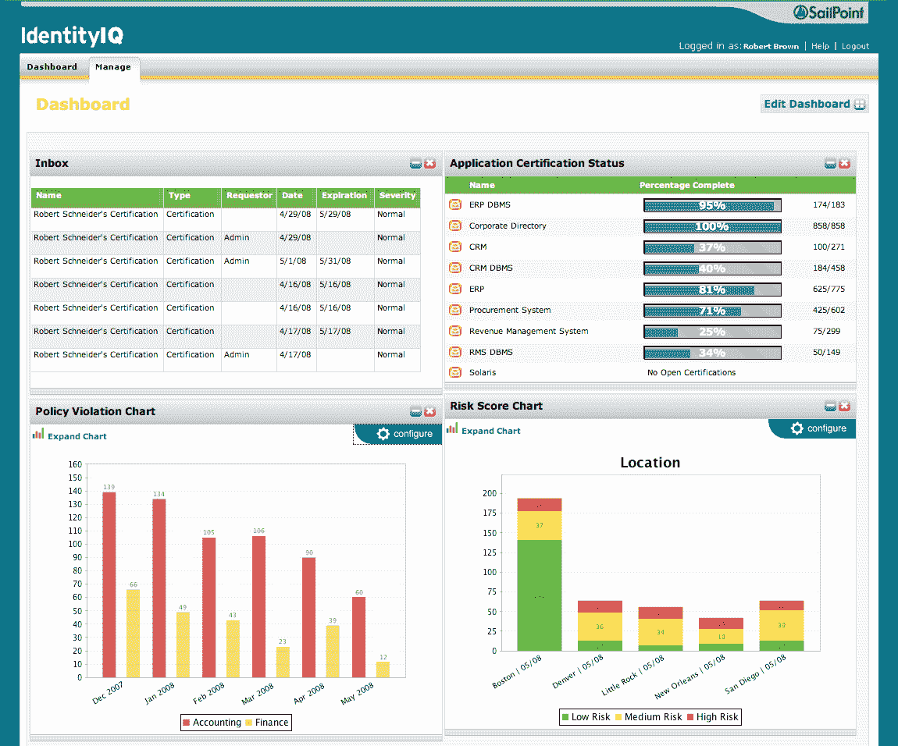
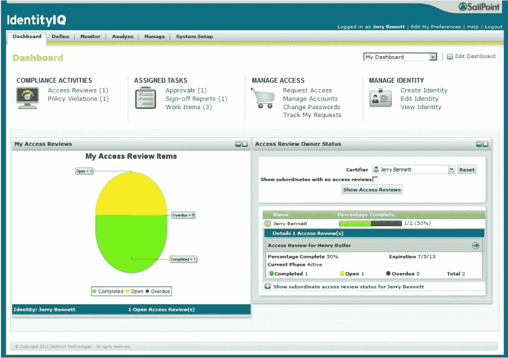
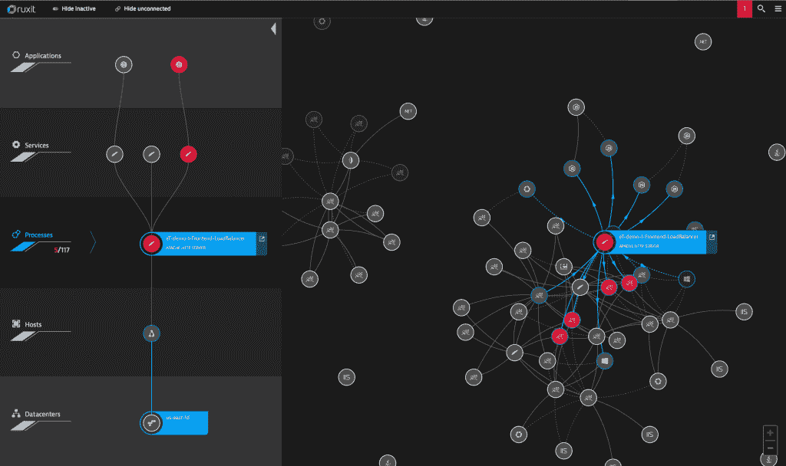
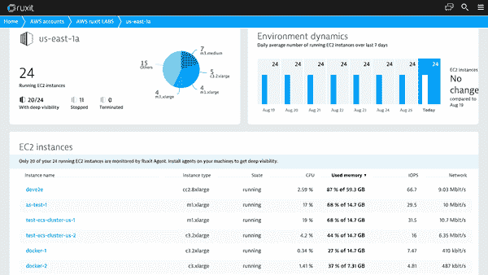

# SailPoint 如何依靠 Dynatrace Ruxit 帮助保持服务平稳运行

> 原文：<https://thenewstack.io/sailpoint-teams-dynatrace-ruxit-tackle-system-monitoring-scale/>

在考虑可伸缩性的情况下进行开发时，理解应用程序如何跨主机、服务和其他正在运行的应用程序运行是一个严峻的挑战。传统的[应用监控解决方案](https://thenewstack.io/category/monitoring/)往往达不到这一点，留下了用户无法真正可视化其应用环境的隐患。

身份应用服务提供商 [SailPoint](http://www.sailpoint.com/) 需要为其不断增长的 IdentityNow 服务套件提供工具。为了帮助应对监控企业级应用套件的挑战，SailPoint 与 [Dynatrace Ruxit](https://ruxit.com/#home_start) 合作，以确保 [IdentityNow 基础设施](https://www.sailpoint.com/products/identitynow)具有动态、灵活的拓扑结构，可供整个堆栈的开发人员使用。

## 做出改变

当部署任何[系统监控软件](https://thenewstack.io/category/monitoring/)时，灵活性是关键。SailPoint 的 IdentityNow 不仅在传统主机上运行一个堆栈，而且在容器上运行。Dynatrace Ruxit 不仅能够分析 SailPoint 堆栈两个部分的传入和传出请求流，而且没有发现任何性能问题。

SailPoint 的 DevOps 经理 Marty Bowers 表示:“我们的足迹相当大，我们在 Dynatrace Ruxit 中发现问题并引起我们的注意方面没有任何滞后。

SailPoint IdentityIQ 仪表板

寻找应对挑战的新方法是促成今天系统监控兴起的部分原因。当采用传统方法进行系统监控时，开发人员通常依靠各种图表、图形和实时信息仪表板来了解整个应用基础架构的情况。

在找到停机、容器健康问题或服务故障的解决方案之前关联数据是对宝贵的开发人员资源的浪费。过去，当遇到问题时，开发人员会收集数据来帮助确定解决方案，只有当他们发现哪个容器、服务或应用程序行为异常时，才能着手解决问题。随着动态系统监控方法的兴起，开发人员可以快速查明问题出现在堆栈的哪个位置，然后着手调试它。

SailPoint IdentityIQ 访问审查

与传统方法相比，Dynatrace Ruxit 不仅发现用户的整个应用程序环境，还将那里的数据关联起来，指向问题本身。这使得开发人员(比如 SailPoint 的团队)能够确定任何问题的原因，不仅缩小问题首次出现的位置，而且缩小问题出现的原因。

“对我们来说，关键是 Dynatrace Ruxit 如何能够立即将系统级问题转化并诊断为真正的客户影响，”Bowers 说。

随着技术的不断发展，现实很简单:对于那些大规模工作的人来说，传统方法不是正确的解决方案。瓶颈、过时的信息以及在容器中运行的弹性、一次性微服务的现实很快使传统的系统监控变得过时。

“这产生了新的问题，包括需要跟踪所有这些容器的健康状况以及它们何时何地运行，”Dynatrace Ruxit 业务运营副总裁 Michael Maggio 说。

## 面向未来的建筑

SailPoint 在其所有 IdentityNow 环境中部署了 Dynatrace Ruxit，其客户同时使用本地和 SaaS 解决方案。“IdentityNow 由一套服务组成，所有这些服务都有一个用户界面，供在各种数据后端运行的客户使用，”Bowers 说。随着公司不断扩大规模和聚集客户，系统监控应该成为任何应用基础设施不可或缺的一部分。越来越多的组织依靠系统监控解决方案向他们展示其生产环境的实时、易于理解的画面。

Dynatrace Ruxit 应用程序映射

Dynatrace Ruxit 为客户提供了两种不同的部署解决方案，为各种工作环境提供了灵活性。

Ruxit SaaS 完全在云中运行，而面临监管或数据隐私挑战的客户可以选择 Ruxit Managed 一种内部解决方案。Ruxit Managed 允许这些用户将他们的安全信息保存在他们的数据中心，而不牺牲功能可用性。

Maggio 表示，在系统中断的情况下，Dynatrace Ruxit 会通知开发人员可能会影响其用户的问题，从而节省开发人员的宝贵时间，同时“提供问题的实际根本原因，这每年可节省数百个传统上在“作战室”花费的工时。

Dynatrace Ruxit EC2 仪表板

随着企业在其开发栈中不断转向基于云的技术，系统监控已经成为开发人员日常工作流程的重要组成部分。

SailPoint 继续让更多用户加入其 IdentityNow 套件，Dynatrace Ruxit 报告称，有更多主机受到监控。除此之外，Dynatrace 还看到 SailPoint 客户端继续搭载可用的 Ruxit 仪表盘。

Maggio 说:“还增加了更多的网站，消费真实用户监测访问，并增加了合成监测的采用。

[综合监控](http://www.dynatrace.com/en/products/synthetic-monitoring.html)在浏览器中完成，模拟一个网站的访问者用来导航的管道。它允许企业确定客户管道中的问题发生在哪里，在问题严重影响用户之前解决它们。这种系统监控格式与 Dynatrace Ruxit 配合使用时非常理想，不仅可以在流量高峰期全面查看应用基础设施，还可以根据需要随时进行测试。

## 将这一切结合在一起

部署新技术通常会令人沮丧。过去，开发人员不得不手工编写系统监控解决方案，并将服务发现与它们集成在一起，但现在情况不同了。许多系统监控解决方案设置简单，只需要很少的开发人员设置即可部署。Dynatrace Ruxit 就是这样一种解决方案，不需要在整个系统中部署主动编码。Dynatrace Ruxit 可自动发现客户的应用拓扑，将收集的信息快速转化为完全实现的系统监控解决方案。

容器已经改变了应用程序设计的前景。仅仅拥有一个应用程序或一系列联网的容器已经不够了。敏捷性、可伸缩性和自动化系统故障转移已经成为当今软件开发团队面临的紧迫问题。使用容器时，不仅要了解容器的健康状况，还要了解它们在服务器上的交互、它们之间的依赖关系以及它们之间的交互，这一点至关重要。了解单个系统上运行的容器已经不够了。企业在不断发展，它们的系统监控解决方案也应如此。

通过 Pixabay 的特征图像。

<svg xmlns:xlink="http://www.w3.org/1999/xlink" viewBox="0 0 68 31" version="1.1"><title>Group</title> <desc>Created with Sketch.</desc></svg>