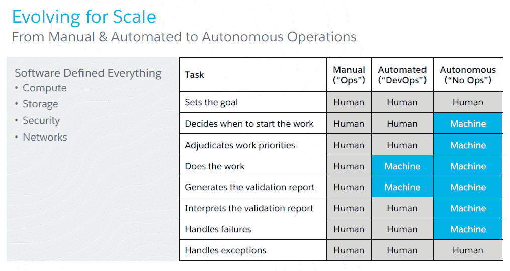
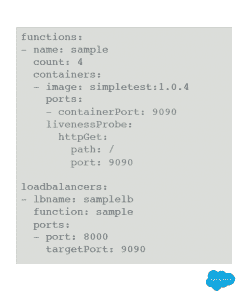
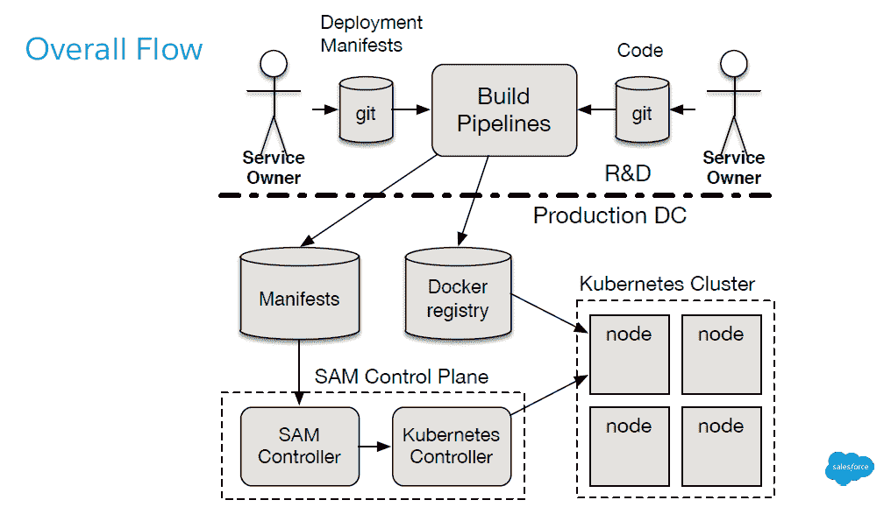
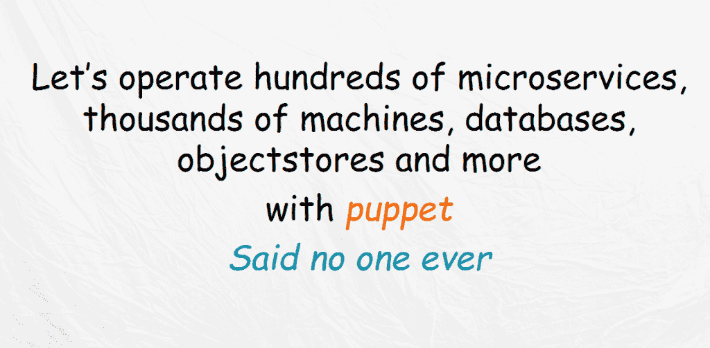

# Salesforce、Comcast 针对大规模可扩展工作负载测试 Kubernetes

> 原文：<https://thenewstack.io/salesforce-comcast-kicks-tires-kubernetes/>

虽然 Kubernetes 目前正处于炒作周期的顶端，但其效用的真正证明将是企业的采用。在最近[云本地计算基金会](https://www.cncf.io/)的 Kubecon 欧洲活动上，来自 Salesforce 和 Comcast 的工程师透露了他们各自公司如何测试 Kubernetes，着眼于使用开源容器编排引擎软件来帮助他们扩展应用程序，甚至管理这些应用程序的劳动力。

Salesforce 首席架构师 [Steve Sandke](https://github.com/ssandke) 在一次演示中讨论公司的部署时解释说，几年来，Salesforce 一直在运行一个 Kubernetes 试点项目，一直在朝着软件驱动的“NoOps”方法推进，这是一种自主交付模式，“在这种模式下，人的工作只是简单地设定目标，软件完成剩下的工作”。

作为一家成长中的 SaaS 提供商，Salesforce 一直在稳步增加其基础架构。2014 年至 2016 年间，该公司运营的数据中心数量翻了一番，从 10 个增加到 20 个。在此期间，它代表其客户的年度交易数量翻了一番，从 4900 亿增加到 1.1 万亿，同时实际上降低了这些交易的交易延迟时间，从 230 毫秒减少到 210 毫秒。

为了进行管理，该公司正在脱离单一的软件栈，在这种情况下，大量的开发人员编写单一的庞大的 JAR 文件。相反，开发人员正在编写微服务来覆盖单个功能。在这里，每个团队拥有自己创建的软件，使用容器作为部署工件。在硬件方面，该公司有一个横向扩展体系结构，可以轻松增加容量。

Salesforce 如何针对 DevOps 和标准运营定义 NoOps。

根据 Sandke 的说法，该公司设定了许多目标，希望从这个可扩展的基础架构中获得这些目标:

*   轻松加入新服务。
*   生产环境和非生产环境之间的“高保真”，以保证开发人员的健康。
*   IT 资产将以声明性而非命令性的方式进行描述，因此它们可以被编排。
*   资产将是“默认安全的”
*   完全自动化，减少人工干预和错误。
*   基础架构必须能够跨越公共云和私有数据中心。

工程团队明白他们需要某种容器编排工具来帮助完成这些目标。这些工程师中的许多人都有在其他公司管理大规模架构的长期经验，他们很容易与 Kubernetes 背后的设计师产生共鸣。

“坦率地说，我们被吹走了。即使在当时，发展速度也是令人难以置信的，”桑德克说。"这些人显然知道他们在做什么。"

虽然工程师们看到 Kubernetes 显然可以帮助他们实现自动化 IT 基础设施的目标，但让公司的其他人也加入 Kubernetes 完全是另一个挑战。管理层担心 Kubernetes 是一个新项目，仍有许多未解决的问题。然而，许多演示帮助构建了这个案例。另一个挑战是:Kubernetes 不能在真空中运行。必须铺设一个完整的基于 Docker 的持续集成管道。安全运营团队也需要参与进来。

Salesforce 部署清单

Sandke 说，在 Kubernetes 的基础上，该公司建立了一个开发人员“抽象”，一个可以为开发人员提供一系列基于 Kubernetes 的应用程序部署步骤的界面。

“护栏很重要。库伯内特是一个非常强大的。你可以做很多不同的事情。然而，我们不想把这种[权力]强加给几千个开发人员组织，”桑德克说。此外，就前瞻性规划而言，“展示新功能要比取消一个功能容易得多，”他说。

部署清单保存在一个 git 存储库中。部署请求通过 git pull 请求发出。典型的部署场景是这样的:开发人员将一些代码签入 git。一旦 pull 请求被批准，控制器就使用 manifest 创建一个更新的 Kubernetes 工件，该 manifest 指向构建该服务所需的资源的已批准的签名 Docker 映像。

“在批准清单变更三十分钟后，你的系统就在生产中运行了，没有任何人工参与，”桑德克说。“令人高兴的是，服务所有者就是这么做的。我们连一半的时间都不知道。”如果构建过程中出现错误，控制器将暂停部署。

Salesforce 现在在生产中有三个 Kubernetes 驱动的服务，在两个数据中心的大约 10 个集群上运行。然而，到 2017 年底，该公司希望在由 1000 多个节点组成的 20 个 Kubernetes 集群上运行 20 多项服务，这些集群分布在所有数据中心。

“我们故意跑得慢，因为运行 Kubernetes 集群是一门艺术，你必须学会如何去做，”桑德克说。

待办事项:公司仍然希望让开发人员的入职变得更加容易。工程团队希望对服务状态有更多的了解。他们还希望运行本地集群应用程序，如 Redis。今年的一大焦点将是支持需要某种数据存储后端的“有状态”应用程序。这个目标可能包括配置 Kubernetes，使其知道将工作负载放置在保存所需数据的磁盘附近。

* * *

康卡斯特工程效率负责人[也在 2017 年 Kubecon EU 大会上发言](http://events.linuxfoundation.org/events/archive/2017/cloudnativecon-and-kubecon-europe/program/schedule)指出:[扩展软件很难，但扩展组织以支持所有这些可扩展软件更难。](https://github.com/rfliam)

Fliam 说，Comcast 发现 Kubernetes 充当了一个有效的“数据中心操作系统”，通过简单地将开发人员和管理员的关注点明确分开，节省了他们的时间。

虽然 Fliam 没有提供 Kubernetes 部署的许多具体细节，但他分享了经验教训。

Fliam 说，这项技术的使用是为了“将一个组织中这些团队的操作分离，并给他们一个平台来管理他们自己的大型复杂的分布式系统，就像我管理我的 Linux 机器一样容易”。这种方法不仅可以减少应用程序的部署时间，还可以减少员工在文档和跨团队沟通上花费的时间。

Fliam 领导 Comcast 的 VIPER(视频 IP 工程和研究)工程效率小组，该小组专注于基于视频的客户服务的可扩展性问题。随着团队项目的规模从五年前的起点开始增长，支持这些项目所需的工程师数量也在增长。只需几名工程师，该团队就可以轻松地将所有东西打包到虚拟机中。随着部署的复杂性和范围的增长，需要更多的 IT 自动化工具，如[木偶](http://www.puppet.com)。

他们很快也超越了这种模式。一种面向用户的复杂数字视频记录(DVR)服务，客户使用它来记录并随后传输每天数 Pb 的数据，这带来了一系列全新的工程需求。跨数十个数据中心运行的 DVR 服务实际上是多种服务的组合——广告系统、配置系统、视频后端系统，这些都由不同的团队管理。

“每个系统都有一个扁平的网络名称空间，并有一套部署它的方法，比如 Geronimo T7，”Fliam 说。将所有这些服务交织在一起不能仅仅通过 Puppet 来完成。

Fliam 说:“当 200 个人都在同一个技术平台上工作时，很难让每个人都像 20 个人一样高效。”参与项目的人越多，对每个人的带宽要求就越高。风险上升；做出改变的能力变慢了。

Kubernetes 在这个场景中是有价值的，因为它减轻了开发人员理解他们要部署到的特定的、多种环境的需求。“没有一个开发团队能够以有效的方式与所有的机器进行交互，”Fliam 说。

容器化的环境允许 Comcast 以代码形式捕获系统的所有变更、部署和版本，为自动化部署过程铺平了道路。它将应用程序与底层基础架构完全分离，允许运营部门对基础架构进行更改，而无需更改应用程序本身。

[云本地计算基金会](https://www.cncf.io/)是新堆栈的赞助商。

<svg xmlns:xlink="http://www.w3.org/1999/xlink" viewBox="0 0 68 31" version="1.1"><title>Group</title> <desc>Created with Sketch.</desc></svg>