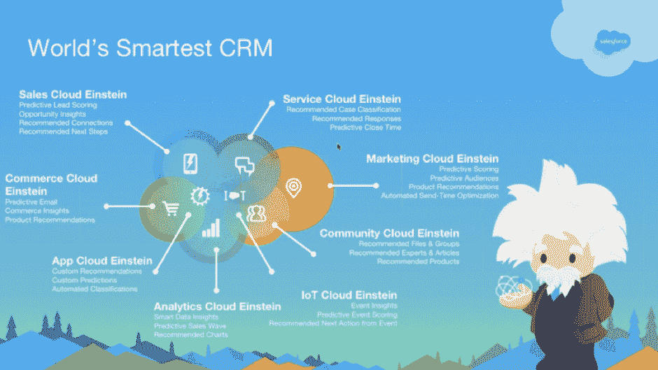
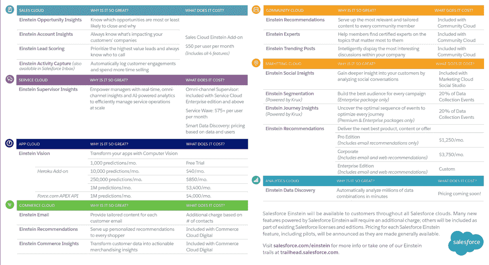
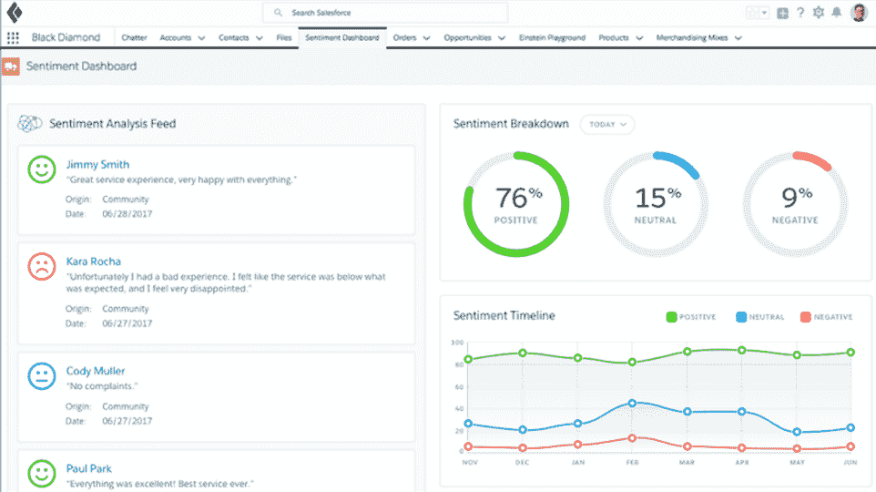

# Salesforce 的爱因斯坦将自动化人工智能与特定于业务的数据模型相结合

> 原文：<https://thenewstack.io/salesforce-mixes-automated-ai-custom-data-models-einstein/>

凭借其[爱因斯坦服务](https://www.salesforce.com/blog/2016/09/introducing-salesforce-einstein.html)，Salesforce 将自动化人工智能与开发人员为处理客户的特定需求而创建的定制数据模型相结合。

尽管 Salesforce Einstein 在营销中使用了白发苍苍的拟人化形象，但它不是 Alexa 或 Cortana 那样的人工智能助手；相反，它是一系列 Salesforce 产品(销售云、商业云、应用云、分析云、物联网云、服务云、营销云和社区云)中的一组人工智能服务。

其中一些在标准 Salesforce 工具[中自动运行，如 SalesforceIQ Cloud 和 Sales Cloud 中的 Sales Insights](https://www.salesforce.com/blog/2016/09/artificial-intelligence-builds-olympic-sales-team.html)。在管理门户中打开这些功能，您可以将 Score 字段添加到 Salesforce 视图中，或者在 Lightning 应用程序的详细页面中使用它来查看线索评分，该评分表明潜在客户实际购买某样东西的可能性有多大，同时还可以获得提醒，以跟进特定的人来阻止交易变冷或查看可能影响销售的新闻故事(如一个客户买断另一个客户)。

Einstein 工具已经(或将)用于一系列不同的 Salesforce 云服务(credit: Salesforce)。

对于[营销云](https://www.salesforce.com/blog/2016/09/intelligent-marketing-and-analytics-salesforce-einstein.html)，Einstein 提供了类似的预测分数，以表明哪些客户将根据营销电子邮件购买某些东西，哪些客户将在收到邮件后取消订阅。它还将潜在客户划分为分享多种预测行为的受众群体，并建议发送营销电子邮件的最佳时间。服务云爱因斯坦建议最好的代理来处理一个案例。

[Commerce Cloud](https://www.salesforce.com/products/commerce-cloud/faq/) 使用产品推荐和预测排序视图自动个性化页面上的产品(您可以在管理门户中使用业务规则进行定制)。针对 [Salesforce 社区](https://www.salesforce.com/products/community-cloud/overview/)的基于机器学习的垃圾邮件检测正在私下预览，从人类版主的行为中学习什么是不合适的评论。这些分数和见解使用 Salesforce 存储在 CRM 中的结构化数据，例如当销售人员将一个查询标记为销售机会时(以及您可以连接的来自 Office 365 和 Google 的电子邮件数据)。

Salesforce Einstein AI 服务的价格和功能。

由于如此广泛的企业使用 Salesforce，相同的数据模型和算法不会在所有企业中很好地工作。因此，Einstein 工具会自动构建多个模型，转换租户数据(存储在 Apache Spark 中),并评估哪些模型和参数选择可以为每个新客户提供最准确的预测，因此，一个 Salesforce 客户可能拥有可以通过随机森林算法进行最佳分析的数据，而另一个客户可能会通过线性回归获得更好的结果。

所有这些都在 Salesforce 平台中实现了自动化，甚至能够检测到您的客户在用什么语言与您交谈。您的企业需要充分使用 Salesforce 来创建足够的数据供其学习；对于预测性销售线索评分，这意味着在过去六个月中至少创建了 1，000 条销售线索和 120 个转化为销售的机会，每月至少 20 个。销售团队在这些记录中输入的信息越多，线索洞察就可能越准确。事实上，在您打开销售云 Einstein 之前，您可以运行 Einstein 就绪评估程序，该程序会构建模型并对模型进行评分，以查看是否有足够的数据来生成有用的预测，以及这些预测是否会帮助他们的业务。

## 面向所有人的机器学习(根据他们的需求)

Salesforce Einstein 负责数据科学和工程的副总裁 Vitaly Gordon 在最近的[trail headx](https://developer.salesforce.com/trailheadx)会议上表示:“我们根据客户数据的大小和形状来评估他们对爱因斯坦感兴趣的客户，并根据数据对他们的有用程度来提出建议。”该会议是该公司的开发者大会。

有些公司 50%的销售线索变成了机会，而其他公司只有 0.1%；他指出，知道谁是目标对第二类公司非常有用，但即使是对销售线索转化的非常准确的预测，对第一类公司也不会有太大影响。“有时更多的是关于异常检测，这需要一套不同的算法，”戈登说。

而如果你一天只有十条线索，就全部打电话；“人工智能不是‘一只手套适合所有人’的工具，也不是每个问题都需要人工智能，”戈登说。

为了帮助客户信任这些自动机器学习系统，Salesforce 会显示特定线索得分高或低的原因。“我们解释为什么我们相信一条线索会起作用；我们解释了哪些模型正在影响分数，以及数据中的哪些信息表明机会将会转换，”戈登说。

这些分数也给了你预期的预测准确度。“我们说我们认为这是正确的下一步，有 82%或 77%的准确率，所以它就像一个路标，”戈登说。

随着新数据的到来，这些客户特定的模型也会自动更新，并且一定比例的数据会保留用于持续测试和培训，因此 Einstein 可以跟踪预测的准确性，并发现数据的变化，这意味着需要新的模型。这将显示在用于解释得分的预测器中，这也应该有助于用户对预测感到舒适。该系统还寻找“泄漏特征”；好得令人难以置信的预测，因为它们预测了一系列永远不会真正发生的事件。

对于开发人员来说，Salesforce 有三个机器学习 API，用于在非结构化数据上使用深度学习来构建定制模型:用于视觉、情感和意图。爱因斯坦物体检测视觉 API 现已全面上市；意图和情感 API 在预览中。

训练对象检测 API 背后的卷积神经网络可以通过压缩您想要识别的每个类别中的图像文件夹(文件夹名称成为特征类别)并将其上传到 Salesforce 来完成。你会看到每个标签有 200-500 张图片，每个标签有大量的例子和相似数量的例子。

[https://www.youtube.com/embed/gfMITQ8JkCo?feature=oembed](https://www.youtube.com/embed/gfMITQ8JkCo?feature=oembed)

视频

这将创建一个端点，您可以向其发送新图像，以检测对象，如一双鞋或一条裤子，它还可以通过计算图像中有多少双鞋和裤子以及它们的颜色来对图像进行分类，或者识别货架是空的，需要重新进货。

图像识别可能有助于使销售线索评分更加准确；安装太阳能电池板的人可以使用 API 查看谷歌地图上的地址，看看屋顶类型是否适合安装太阳能电池板。

API 也可以用于异常检测；如果员工上传大量图像，他们可以使用图像分类来建议任何可能与任务无关的图像。图像识别还不能使用 OCR 从图像中提取文本，但 Salesforce 正在努力。

每个认知都有一个确定的百分比。API 会自动保留一些训练数据用于测试，开发人员可以在 Einstein API 操场上看到测试和训练准确度分数以及数据模型的混淆矩阵。他们可以确定是否需要更多的数据来进行训练——也许可以通过标记误报和漏报来让它学习。

开发人员可以在应用程序的界面上添加一个按钮，让客户或员工标记被错误识别的图像。由于这是一个定制模型，开发人员需要自己评估一段时间内的准确性；如果准确度分数下降，系统不会警告你。

[Intent API](https://andyinthecloud.com/category/salesforce-api/) 试图从他们的消息文本中提取客户想要的东西。API 可以通过上传具有两列的 CSV 文件来训练，一列用于客户可能使用的短语(如“我无法登录”或“我的自行车车轮弯曲”)以及这些短语在您的过程中表示的标签(如“密码帮助”或“客户支持”)。

为了准确预测，Salesforce 建议每个标签超过 100 个短语，这是一个异步训练阶段，所以在准备调用 API 之前需要一点时间。目前，API 只查看每条消息的前 50 个单词，尽管这将被扩展。混合使用长短短语是一个好主意，这样可以避免一些较长信息的错误关联。

Intent 可以与情绪 API 一起使用，以告知客户何时不高兴，或者它可以用于关注客户沟通，以了解他们是积极的、消极的还是中立的。同样，情绪是一个预先训练好的模型，但上传的数据标签，如产品名称或特定的正面和负面术语，会使情绪更适合您的领域。所有 API 的每次上传限制为 1GB，但您可以多次上传。

爱因斯坦情绪 API 将文本(如电子邮件、评论和社交媒体帖子)的语气分为积极、中性或消极(credit Salesforce)。

Salesforce 正在开发其他几个人工智能工具。 [Heroku Enterprise](https://www.heroku.com/enterprise) 支持 [Apache PredictionIO](https://predictionio.incubator.apache.org/) 开源框架(Kafka 作为 Heroku 服务，用于向 Heroku 传输大数据), Salesforce 正在创建一个包装器，以便更容易地使用 PredictionIO 构建您自己的定制智能应用。

还有与 IBM Watson APIs 的集成。Salesforce 首席产品官 Alex Dayon 解释说这些是不同的数据层。

“Einstein 在 Salesforce 平台中使用 Salesforce 数据。Watson 是一套独立的库和数据集，就像天气预测数据一样，我们希望确保数据集可以共享，并且 Watson 可以触发 Salesforce 业务流程，”Dayon 说。当使用 Watson 预测性维护时，该服务可以发送一个机器将出现问题的警报，Salesforce 现场服务可以自动派遣一名技术人员。

“我们试图确保爱因斯坦可以利用来自其他平台的数据集，”Dayon 说。

塞思·威灵汉姆在 [Unsplash 上的特写图片。](https://unsplash.com/?utm_source=unsplash&utm_medium=referral&utm_content=creditCopyText)

<svg xmlns:xlink="http://www.w3.org/1999/xlink" viewBox="0 0 68 31" version="1.1"><title>Group</title> <desc>Created with Sketch.</desc></svg>