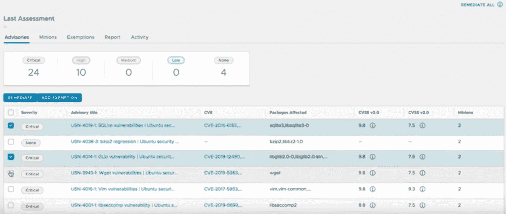
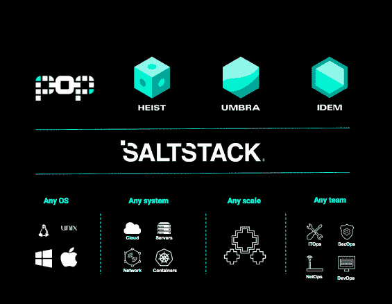

# SaltStack:企业 6.1 有助于消除安全疏忽

> 原文：<https://thenewstack.io/saltstack-enterprise-6-1-helps-to-remove-security-neglect/>

SaltStack 赞助了新 Stack 对 [SaltConf19](https://saltconf.com/) 的新闻报道。

许多组织都面临着漏洞检测疲劳的负担，而且由于缺乏资源和其他限制，他们在尝试对修复进行优先级排序和补救时会受到束缚。

随着开发人员急于加快新的开放堆栈开发和部署的步伐，安全扫描通常会揭示网络中可能存在漏洞的大量报告。然而，安全团队通常很难花费时间和资源来确定最关键漏洞的优先级，同时确保安全团队实施正确的修复也是一个额外的挑战。安全团队可能经常通过实施手动修复来继续混日子，同时希望最好的情况，但害怕最坏的情况，而 [Equifax](https://thenewstack.io/equifax-data-breach-shows-perils-not-patching-timely-manner/) 、 [Docker 容器](https://thenewstack.io/container-security-unverified-images-and-docker-vulnerabilities/)和其他高调的漏洞显示了可能会出现可怕的错误。

然而，SaltStack 表示，它有一个解决方案:SaltStack Protect 的 Enterprise 6.1 版本通过自动检测和修复绝大多数漏洞，提供了一种替代方案来弥补安全和 it 技能缺口和人才短缺。

背后的概念是为 SecOps 团队提供跨多云和内部基础架构自动发现和修复安全漏洞的选项。SaltStack 表示，SaltStack Enterprise 6.1 通过一个 API 为 SecOps 带来了自动化，该 API 可以扫描 IT 系统的漏洞，然后提供现成的自动化工作流来修复这些漏洞。

SaltStack 首席技术官兼创始人 Thomas S. Hatch 说:“有很多供应商可以告诉你你有多少漏洞，有些供应商可以为你优先考虑这些漏洞，”但他们不会自动完成修复过程。

SaltStack Enterprise 6.1 的引入是 SaltStack 试图在其 Salt 配置管理软件中改进对基础设施和 SecOps 的支持的一部分。此次发布恰逢 Hatch 引入开源项目[面向插件编程(POP)](https://github.com/saltstack/poppy) 作为 SaltStack 本周也推出的 [Heist](https://github.com/saltstack/heist/issues/17) 和 [Umbra](https://github.com/saltstack/umbra) 的保护伞项目。所有版本都是 SaltStack 尝试提供更多“创新驱动”项目的一部分，这些项目旨在管理多样化的部署和网络，这些部署和网络通常分布在内部和多云基础架构的组合中。

虽然 Hatch 说 SaltStack 也在寻求保持开源和专有商业模式之间的平衡，但他不同意 SaltStack 的主要竞争对手仍然由[傀儡](https://puppet.com/)、[主厨](https://www.chef.io/)和其他人组成。“我觉得我们在重新发明方面有点超前，”哈奇说。

然而，Hatch 坦率地说，Enterprise 6.1 也不允许你“设置它，然后忘记它”。“不承认总会有一些领域需要人工干预这一事实，将是极其不负责任的，”哈奇说。“但是[企业 6.1]可以处理 80%到 90%的此类情况，并且可以完全自动化。仍然会有最后 10%到 20%的棘手情况需要更多一点的人工干预，但我们可以让这些基础架构达到更自动安全的程度。”

Hatch 说，安全修复自动化转化为时间和资源的节约。“您知道，当您发现某个问题将在一定时间内得到解决时，您已经释放了资源来完成它，因为[Enterprise 6.1]已经自动解决了这么多容易解决的问题。”

强调加强安全补救也是提高网络标准化和合规性的一个明显步骤。“对潜在安全问题更快的自动响应意味着更好的标准化。这也允许所有数据在我的数据中心[或多云环境]中共存，因为一切都在使用相同的语言，使用相同的端口等。Forrester Research 的分析师 Renee Murphy 告诉 New Stack。因此，当一个安全系统管理所有相同的数据时,“数据知道如何很好地相处，并且被正确地标准化，那么管理起来总是更便宜。”

Enterprise 6.1 提供的具体功能包括:

*   本地 CVE 扫描用于内部部署和多云部署。
*   漏洞优先级确定，用于评估威胁并确定修复的优先级，SaltStack 有助于区分可利用的漏洞。
*   为 [SecOps](https://www.saltstack.com/products/secops/) 提供自动补救，该 API 可扫描漏洞并自动执行工作流程来补救漏洞。

“与以前的企业版相比，我们除了安全地配置漏洞之外，还会自动修复漏洞，”Hatch 说。

Puppet 是新堆栈的赞助商。

通过 Pixabay 的特征图像。

<svg xmlns:xlink="http://www.w3.org/1999/xlink" viewBox="0 0 68 31" version="1.1"><title>Group</title> <desc>Created with Sketch.</desc></svg>