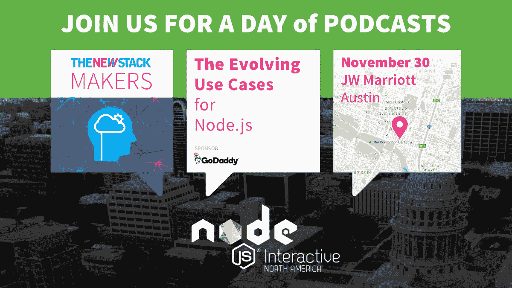

# SAP 测试 Kubernetes 的云原生企业软件部署

> 原文：<https://thenewstack.io/sap-bringing-multi-site-microservices-enterprise-kubernetes/>

虽然 [SAP](http://www.SAP.com) 以企业级软件闻名，但其研究部门 [SAP Labs](http://go.sap.com/corporate/en/company/innovation/sap-labs.html) 正在寻找将公司及其客户带入云原生架构的方法。毫不奇怪，SAP 实验室正在认真研究 Kubernetes，将其作为 SAP 应用程序的潜在部署工具，既可以在内部运行，也可以在云中运行。

在本期[新堆栈制造商](https://thenewstack.io/podcasts/)播客中，SAP 云架构和工程部门主管[西山丽·戴维森](https://www.linkedin.com/in/nish2707)在 KubeCon 2016 期间与 TNS 执行主编 [Joab Jackson](https://twitter.com/Joab_Jackson) 讨论了 SAP 如何看待未来的 Kubernetes 生产。

[SAP 针对云原生企业软件部署测试 Kubernetes](https://thenewstack.simplecast.com/episodes/sap-tests-kubernetes-for-cloud-native-enterprise-software-deployments)

[https://www.youtube.com/embed/SAc7l_oi7k0?start=1&feature=oembed](https://www.youtube.com/embed/SAc7l_oi7k0?start=1&feature=oembed)

视频

“坦率地说，我们已经习惯了虚拟机的世界。我们习惯于使用传统的流程编排工具来运行基础架构，这种工具通常在主数据中心运行。当我被介绍给 Kubernetes 时，很明显，Kubernetes 的设计方式与众不同，它基于运营基础设施，不需要像宠物一样维护和照顾，”Davidson 说。

在与开源社区的合作中，SAP 实验室找到了急需的支持，使其最新的项目得以实现。在 KubeCon 的一系列[演示中，Davidson 和他的同事](https://cnkc16.sched.org/event/8K98/running-multi-site-hybrid-sap-applications-on-kubernetes-and-coreos-nishi-davidson-sap-victoria-rozhina) [Victoria Rozhina](https://cnkc16.sched.org/speaker/victoriarozhina1) 演示了如何使用 Kubernetes、CoreOS 和 Docker 跨多个云平台部署 SAP 微服务。

SAP 实验室的目标是在不久的将来发布用于管理 Kubernetes 的开源工具，该工具应该对开发人员和运营团队都有用。“我们的受众既包括开发团队，也包括运营团队。开发团队承担了应用程序容器化的大部分工作。确保所有允许他们调试的工具都得到很好的集成和支持，并确保他们接受过培训，以确保他们能够在企业中运行 Kubernetes，这是运营团队最头疼的事情，”戴维森说，并补充说，这些项目“如果没有开源社区的支持，就不可能实现。”

随着谈话的结束，Davidson 继续指出，虽然她理解当今的企业在寻求从传统环境迁移到云环境时可能会面临的困难。但是，她断言，他们越早这样做，他们就会过得越好。当一个人将他的堆栈迁移到云时，他的基础架构不仅会变得更加高效，还可能会节省大量成本。

“将您的应用程序容器化是一个巨大的挑战，但是从脱离实际上非常昂贵的传统遗留环境的角度来看，您移动得越快越好。你不必更换硬件，而且你的软件成本可以降低到令人难以置信的程度，”她说。

CoreOS 和 Docker 是新堆栈的赞助商。思科赞助了这个播客。

<svg xmlns:xlink="http://www.w3.org/1999/xlink" viewBox="0 0 68 31" version="1.1"><title>Group</title> <desc>Created with Sketch.</desc></svg>