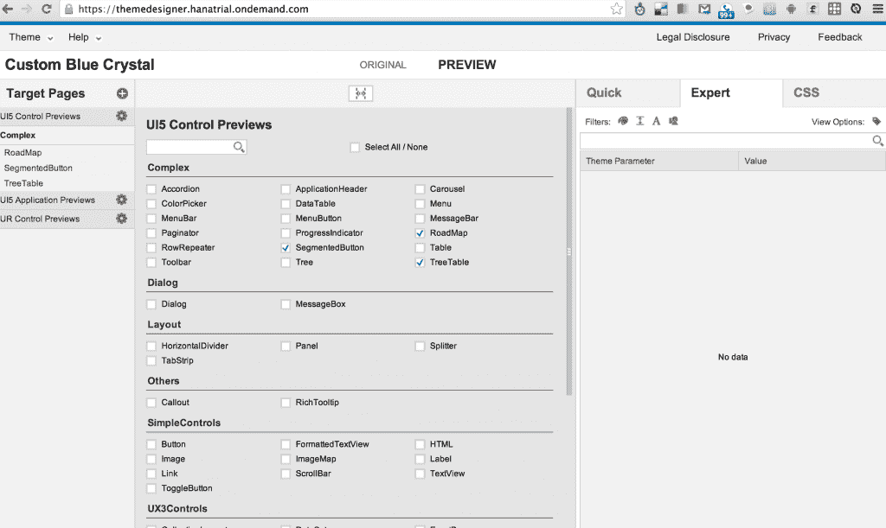

# SAP 的 OpenUI5 JavaScript 库做得出奇的好，堪比 AngularJS

> 原文：<https://thenewstack.io/saps-openui5-javascript-library-is-surprisingly-well-done-comparable-to-angularjs/>

我真的很讨厌昨天在 OSCON 的 SAP openui 5 Javascript 库介绍。我是一个[安古拉吉斯](http://angularjs.org)狂热者(我喜欢[反应堆](http://facebook.github.io/react/)的辉煌)。SAP 团队以一个乏味的应用程序开始了他们的演示，这个应用程序吹嘘了德国在世界杯半决赛中战胜巴西，这是我所期望的。那不适合我。尽管我有德国血统，但在巴西生活了一年后，我现在认为“meu coraoébrasileiro”所以仅仅几分钟后，在我看来，SAP 已经落后一球。

关于 SAP UI5 库有一些事情让我担心。当字体很小以至于第一行的人都看不到文本时，他们经常会说“非常少的代码”之类的话，这显然只代表了特定演示的一部分代码。SAP 团队对开源和分叉有一种奇怪的方法(下面会详细介绍)。与 AngularJS 等公司相比，他们的测试故事并不令人振奋。SAP UI5 库存在一些问题，但最终还是有很多好的方面。实际上，比我想象的要多得多，这充分说明了全栈客户端 JavaScript 库世界中一个新的开源入口。

OpenUI5 框架提供了一个库，目标是为构建 web 应用程序提供一整套组件。有其他框架提供这种功能，也有其他框架在某些方面提供更好的功能。但是，因为这是第一个由 SAP 这样的大型企业提供的 JS 库，没有与后端的紧密链接(所以我们暂时忽略微软的产品)，所以与其他框架相比，OpenUI5 有一些闪光的地方。

根据 SAP 的说法,“企业级”意味着:

*   额外的质量保证
*   可支持
*   国际化和从右向左支持
*   易接近
*   展开性
*   主题

将 QA 作为第一项服务是一个需要达到的高标准，[这是 AngularJS](https://docs.angularjs.org/misc/faq) 设定的标准。没有其他框架能像 AngularJS 那样提供测试覆盖，也没有其他框架能比 AngularJS 更好地测试 JavaScript。但是，SAP 团队正在考虑进行测试，并声明他们针对大量浏览器测试他们的代码，包括 IE9，这意味着他们与 AngularJS 不相上下。尽管 SAP 没有公布他们的测试统计数据(这对我来说是一件大事！)，测试用例包含在 OpenUI5 框架的下载中。当我在问答环节询问他们的测试建议时，他们说他们推荐 Qunit 和 Selenium。我会说他们的测试故事得了 C+:他们的意图是好的，但交付是缺乏的(但考虑到他们的轨迹，可以很容易地改进)。考虑到像 SAP 这样的公司的企业客户的各种各样的需求，我敢打赌，他们会通过手动或自动 QA 解决这些问题，并获得良好的结果。

从现在开始，尽管我最初持怀疑态度，SAP 产品看起来越来越好。忽略可支持性(也许这在德语中可以理解)，SAP 提到国际化和从右到左支持的事实是重要的。其他 JS 框架和库也提供了这些工具，但是它们几乎总是受到社区的支持。AngularJS 的国际化故事终于有了转机，但它从未成为一等公民，也从未有过可靠的路线图。SAP 通过该工具包在全球范围内提供解决方案，我希望他们的 i18n 和 RTL 支持至少是可容忍的，最多是良好的支持。

大型组织通常必须在他们的应用程序中合法地支持可访问性(例如，为屏幕阅读器在标记中添加信息)，但是开放源码项目不受相同要求的约束，并且通常缺乏可访问性特性。任何工具包都可以支持可访问性，SAP 团队没有演示可访问性，但我认为这比其他 JS 库黑客占用了 SAP 内部某个人(并由其付费)更多的时间。如果我在考虑一个库，并且需要支持可访问性，我会强烈推荐 OpenUI5。

我对代码示例和“可扩展性”没什么印象如果不深入研究文档，就很难比较组件库，而且有些代码在演示中没有完全解释清楚。我喜欢命令式代码示例(纯 JavaScript)和 XML 声明式语法，它们提供了使用 SAP 组件构建应用程序的两种方法。如果您担心“XML”一词的用法，它看起来更像是自定义标记，如 AngularJS 指令，而不是您可能在 Microsoft 规范中看到的带有命名空间色彩的 XML 文档。我不能保证声明性代码的有效性，但我喜欢这些选项是可用的。

主题令人印象深刻。SAP 团队展示了与组件库紧密集成的“主题设计器”。他们关于如何更改主题的演示非常强大，看起来很简单，并且展示了与 SAP JavaScript 组件的深度集成。我相信 SAP 销售工程师在做现场客户解释时会很努力地演示这一点。最重要的是，主题化是建立在[减去](http://lesscss.org/)的基础上的，这是一个维护 CSS 库的标准化和开放的工具。将优秀的 GUI(如主题设计器)与 LESS 等可靠的命令行工具相结合是一个成功的组合，将吸引所有类型的开发人员和设计人员使用 OpenUI5 库。

【T2

最后，SAP 团队展示了一款名为“ [SAP UI5 Diagnostics](http://help.sap.com/saphelp_uiaddon10/helpdata/en/6e/c18e80b0ce47f290bc2645b0cc86e6/content.htm?frameset=/en/55/356e6b3b9c4c8d89114553b5d86635/frameset.htm&current_toc=/en/e4/843b8c3d05411c83f58033bac7f072/plain.htm&node_id=732) ”的工具，该工具似乎与 [Batarang](https://github.com/angular/angularjs-batarang) 相似，后者是一款 AngularJS 工具，可用于深入检查 AngularJS 技术。我很惊讶看到这样一个强大的工具，除了您自己构建的定制组件之外，它显然还允许对 SAP 通过 OpenUI5 提供的 180 个组件进行内省。用于创建定制组件的 JS 接口使得提供这样一个了解定制组件的工具成为可能，这个工具甚至允许您更改模型中的数据，并在预览客户端视图中更新它。

需要注意的是，这个库在开源生态系统中占据了一个奇怪的位置。如果你进入 GitHub 页面，你只会看到一个指向项目下载页面的 README。演示者指出，他们还没有接受 fork(尽管奇怪的是有 38 个 fork ),所以不可能对这个库做出贡献(或者至少在 GitHub 上使用 pull 请求)。这使得这个库在名义上是开源的，但不完全是围绕项目产生的社区意义上的开源。现在大多数人认为开源是你可以自由使用、自由修改和自由反馈的东西(GitHub 以一种[理查德·斯托尔曼](https://stallman.org/)可能从未想象过的方式让这成为可能)。乍一看，这个选择似乎很奇怪，因为我假设开源项目通过接受贡献获得免费营销和曝光。人们推销他们修补的东西。但是，在看到 AngularJS 团队核心成员 Igor Minar 最近在 ng-conf 上的讲话后，[描述了“补丁压倒一切”，](https://www.youtube.com/watch?v=YbyZdFA6Qt4)SAP 团队可能会保留一些团队理智，至少提前制定策略，说明他们将如何接受与 AngularJS 这样的社区不同的贡献。关于上下文，副总裁兼全球开发者关系负责人 Thomas Grassl 对 New Stack 的 Alex Williams 说，他们将在大约一个月后开始接受贡献。他说，SAP 最初开发 OpenUI5 是为了内部目的，在接受社区贡献之前，不得不改变构建过程。不管怎样，由于上述原因，SAP 尽快解决这个贡献者问题是有意义的。

我的期望很低，但是 SAP 团队提供了一个漂亮的演示，展示了他们新开源的 OpenUI5 工具的强大功能。如果我正在考虑一个企业级 JavaScript 工具包来构建响应迅速且功能强大的 web 应用程序，SAP OpenUI5 将是我的首选。我甚至会推荐给我的巴西朋友。

<svg xmlns:xlink="http://www.w3.org/1999/xlink" viewBox="0 0 68 31" version="1.1"><title>Group</title> <desc>Created with Sketch.</desc></svg>