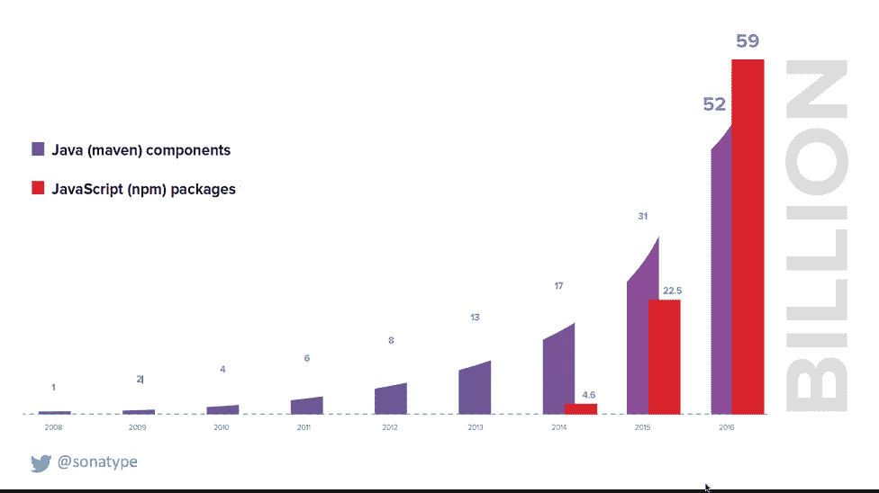
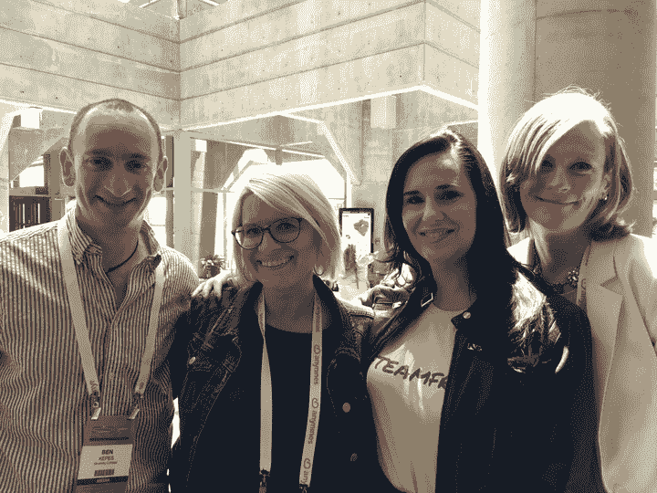

# 本周的可伸缩性:容器时代的系统备份

> 原文：<https://thenewstack.io/saturday-podcast-review-backups-lolz/>

*“要说清楚；我是分权制的信徒。我已经用它建立了系统，我可以告诉你，这不是你要找的魔法尘埃。”— [亚马逊网络服务首席技术官沃纳·威格尔](https://twitter.com/Werner/status/887667382679871489)。*

随着我们准备发布下一本关于 Kubernetes 开源容器编排引擎的电子书(大约一个月后与我们联系)，我们一直在回顾 K8s 在企业中的表现——可以说，这是该软件是否成为“新堆栈”的重要组成部分的真正决定因素。

回顾我们今年早些时候在柏林举行的 Kubecon 2017 的笔记，我们发现[来自 Salesforce 和 Comcast](https://thenewstack.io/salesforce-comcast-kicks-tires-kubernetes/) 的一些有力的证词。Salesforce 在一个试点项目中使用它来支持三项云原生服务，计划到今年年底运行 20 项服务。当该公司的工程师在考虑不同的编排选项时，他们立即欣赏到了 Kubernetes 背后的智慧。毕竟，许多人来自管理大规模工作负载的其他工作。“坦率地说，我们被震撼了。开发速度令人难以置信，即使在当时也是如此，”Salesforce 首席架构师 Steve Sandke 在谈到 Kubernetes 背后的开发人员时说。"这些人显然知道他们在做什么。"

Comcast 发现 Kubernetes 不仅可以轻松扩展应用程序，甚至可以帮助扩展 IT 运营团队。Comcast 的 Richard Fliam 说，它对 Kubernetes 的使用完全是为了“在一个组织中分离[工程]团队的运作，并给他们一个平台来管理他们自己的大型、复杂的分布式系统，就像我管理我的 Linux 机器一样容易”。这种方法不仅可以减少应用程序的部署时间，还可以减少员工花在文档和跨团队沟通上的时间。

在其他地方我们发现——令人惊讶！— [就连微软也在使用 Kubernetes](https://thenewstack.io/microsoft-uses-linux-containers-test-sql-server-2017/) ，它需要使用它来快速路测当时即将发布的移植到 Linux 的 SQL Server 2017 版本。最初，微软要花一整晚的时间来运行 700-800 个容器化的 SQL Server 测试。然而，使用 Kubernetes，完成这些测试所需的时间缩短到了几个小时。

## 本周数字:Java vs. JavaScript

*TNS 研究分析师的每周图表和评论[劳伦斯·赫特](https://thenewstack.io/author/Lawrence-Hecht) :*

随着 Node.js 在服务器端的使用，比较 JavaScript 和 Java 不再是苹果和橘子。在这种背景下，值得注意的是，去年下载的 npm (JavaScript)包的数量超过了 maven (Java)组件中的组件——提前于 Mikeal Rogers 的预测。根据 Sonatype 的 2017 年软件供应链状态，2017 年下载了 590 亿个 npm 包，比上年增长了 262%，而 Java 组件下载“仅”增长了 68%。下载数量是用户数量、可供下载的总数量以及软件发布/更新频率的函数。根据 [2017 Stack Overflow 开发者调查](https://insights.stackoverflow.com/survey/2017)，使用 Node.js 的开发者比例从 2013 年的 8%上升到 2017 年的 26%。

根据[模块计数](http://www.modulecounts.com/)，2014 年唯一 Node.js 模块总数超过 Java，现在超过 300 万到 200 万。Node.js 的用户群和复杂性持续增长，但每年下载量的持续增长也与应用发布周期的缩短有关。展望未来，每个用户每月的 npm 下载量将是一个值得关注的数据。

## 本周播客中

企业备份和恢复(又名“灾难恢复”又名“运营连续性”)的老派供应商的问题是，他们的备份部分没问题，但许多组织发现，恢复过程非常困难，如果不是完全不可能的话， [Rubrik](https://www.rubrik.com/) 的 [Kenny To](https://www.linkedin.com/in/tokennyw/) 解释道。正如向[软件工程日报](http://se-radio.net/)主持人[杰夫·梅尔森](https://twitter.com/the_prion)解释的那样，Rubrik 专注于运行 VMware 基础架构的微软商店的最佳位置，提供一个设备(！)来备份虚拟机，以便它们可以快速恢复。恢复发生得很快，所以即使它们不能提供完整的性能，组织也可以恢复一些运行到完整的操作，to 认为:

<https://traffic.libsyn.com/sedaily/Rubrik.mp3?_=1>

[https://traffic.libsyn.com/sedaily/Rubrik.mp3](https://traffic.libsyn.com/sedaily/Rubrik.mp3)

Kubernetes 社区对谷歌的依赖程度到底有多大？这是[软件定义的对话](http://www.softwaredefinedtalk.com/)团队思考的问题，讨论 [Matt Asay 的](https://twitter.com/mjasay)最近关于[Kubernetes 社区如何依赖 Google 的文章，](http://www.infoworld.com/article/3204597/open-source-tools/kubernetes-days-may-be-numbered-as-open-source-changes.html)他们都同意 Asay 虽然是一个聪明的家伙，但似乎在这里被误导了。或者他有意要写一篇轰动一时的文章。当然，谷歌仍然主导着 K8s 代码开发，但不像以前那么多了。“很明显，有人需要写一篇年度‘开源很无聊的文章，让我们停止谈论它’，”共同主持人[迈克尔·科特](http://www.softwaredefinedtalk.com/hosts/cote):

<https://aphid.fireside.fm/d/1437767933/9b74150b-3553-49dc-8332-f89bbbba9f92/9a22c1e8-e5eb-437c-8351-edca8bd72230.mp3?_=2>

[https://aphid.fireside.fm/d/1437767933/9b74150b-3553-49dc-8332-f89bbbba9f92/9a22c1e8-e5eb-437c-8351-edca8bd72230.mp3](https://aphid.fireside.fm/d/1437767933/9b74150b-3553-49dc-8332-f89bbbba9f92/9a22c1e8-e5eb-437c-8351-edca8bd72230.mp3)

开源在云中如何改变？本周在[新栈制造商](https://thenewstack.io/podcasts/makers)中，我们[与 Apache 软件基金会的联合创始人 Jim Jagielski 谈论了自由软件基金会的 Affero GPL，这是一个专门涵盖自由软件的云使用的 GPL 版本。](https://thenewstack.io/apaches-jim-jagielski-changing-philosophies-open-source-licensing/)

[Apache 的 Jim Jagielski 谈开源许可的变化哲学](https://thenewstack.simplecast.com/episodes/apaches-jim-jagielski-on-the-changing-philosophies-of-open-source-licensing)

## 本周照片

TNS 在技术领域的活跃程度。

Cloud Foundry Summit 2017:(从左至右):独立分析师 Ben Kepes 阿什利·麦克纳马拉，Pivotal 金·班纳曼、谷歌和 Equinix 的劳伦·库尼。

## 本周艺术

上面的特写图片是克里斯汀·维拉的[salt brush Dam](https://cdn.thenewstack.io/media/2017/07/7ddcfba4-file-jul-21-11-11-41-am.jpeg)中的一个细节镜头，这幅油画目前正在纽约 [Agora Gallery](http://www.agora-gallery.com/) 展出(1700 美元)。据这位艺术家说，Vella 的抽象画使用“澳大利亚内陆的纹理和颜色来创造表达景观本质的图案”。

<svg xmlns:xlink="http://www.w3.org/1999/xlink" viewBox="0 0 68 31" version="1.1"><title>Group</title> <desc>Created with Sketch.</desc></svg>