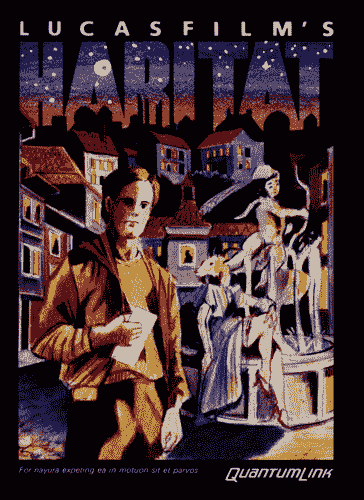

# 拯救栖息地:世界上第一款多人在线角色扮演游戏

> 原文：<https://thenewstack.io/saving-habitat-worlds-first-multiplayer-online-role-playing-game/>

我用旧电脑工作的时间几乎和我用电脑的时间一样长。大约在 1994 年之前，我一直使用一辆雅达利 ST 520。2000 年初，我在一家电脑回收中心工作，看着死去的 [SGI](https://en.wikipedia.org/wiki/Silicon_Graphics) s，旧的[sun](https://en.wikipedia.org/wiki/Sun_Microsystems)和旧的[Macintosh](https://en.wikipedia.org/wiki/Macintosh)流口水。因此，2011 年，我在奥克兰创办了一家非营利性视频游戏博物馆[艺术和数字娱乐博物馆](http://www.themade.org)，致力于以一种可玩的方式保存我们的数字艺术和游戏历史，这或许并不令人惊讶。

该博物馆已经运营了六年，为孩子们提供免费的编程课程，还有 5000 多种游戏机和家用电脑游戏。 [Ultima 4](https://en.wikipedia.org/wiki/Ultima_IV:_Quest_of_the_Avatar) 上[苹果 IIGS](https://en.wikipedia.org/wiki/Apple_IIGS) 有人吗？[钢营](https://en.wikipedia.org/wiki/Steel_Battalion)？想找一款 [Pong](https://en.wikipedia.org/wiki/Pong) 的游戏？我们会掩护你的。

在 MADE 的六年历史中，我们接受了许多令人惊叹的设备捐赠。事实上，除了我们在跳蚤市场和旧货店购买的物品外，我们所有的收藏都是捐赠的。在这些物品中，通常是游戏开发者的个人物品，他们储存了打印在线打印纸上的源代码，索环线仍然连着。通常，这些只是笔记，或者，对于 PC 的 Lode Runner，是等级图和内存布局。

 但是在 2013 年，我们有了一笔重大的捐赠。芯片晨星和[兰迪·法默](https://en.wikipedia.org/wiki/Randy_Farmer)被安排在那年春天的[游戏开发者大会](http://www.gdconf.com/)上，在前[卢卡斯影业游戏](https://en.wikipedia.org/wiki/LucasArts)员工的[小组](https://www.youtube.com/watch?v=HDvEFbh6I2g)上发言。他们在那里讨论 Habitat，这是 Commodore 64 的第一款图形多人在线角色扮演游戏(MMOs)。

所以我联系了晨星公司和法默公司，请求他们提供那个时代的任何遗物，我们可以在博览会的地板上，在我们的会议主题历史陈列柜中展出。此后不久，他们给我发来了源代码。整棵树。[客户端和服务器](https://github.com/Museum-of-Art-and-Digital-Entertainment/habitat)，甚至还有一条辉交叉编译器。

作为一名软件历史学家，我对这封邮件附件感到非常兴奋和激动。我觉得，就像我刚刚拿到圣杯一样，我现在有义务与世界分享这个神奇的东西。

当然，我当时不知道的是，到目前为止，这需要四年的持续工作，以及超过 70 人愿意帮助和贡献这个项目。我们还没完呢！

## 回到栖息地

那么这个栖息地到底是什么？也许讲述它的故事的最好方式是讲述晨星公司的故事，他在 20 世纪 80 年代初加入卢卡斯影业游戏公司时还是一名初出茅庐的程序员。

卢卡斯影业游戏公司要他做的第一件事就是写一个交叉编译器。那时候，为基于 6502 的家用电脑编写游戏是卢卡斯影业游戏公司的主要任务。不幸的是，在那些实际的平台上编译这些游戏要花费大量的时间。正如任何优秀的程序员都知道的那样，构建时间越短，开发人员就越开心，效率也越高。

解决方案是使用当时全新的 Sun 工作站来进行编译。然而，这些工作站是 68000 台机器。因此，晨星着手编写一个编译器，在 68000 台 Sun 机器上构建 6502 个程序。卢卡斯的大多数游戏都是这样编译的。

该团队最终甚至要求一个 68000 到 68000 的交叉编译器，因此 [Amiga](https://en.wikipedia.org/wiki/Amiga) 和 ST games 可以在这些 Sun 工作站上编译，但晨星公司表示速度优势最终被认为是毫无意义的。然而，这些代码仍然保存在一条辉的资料库中。

https://www.youtube.com/watch?v=fjgH27p-FAM

然而，更大的项目出现在 20 世纪 80 年代中期。晨星公司和兰迪·法默结成对子，成为 MMO 游戏公司充满活力的二人组。他们的任务是建立一个伟大的想法，一个可以利用 C64，Atari 800 和 Apple II 的新兴在线产业的想法。其中一个在线服务被称为[量子链接](https://en.wikipedia.org/wiki/Quantum_Link)，它允许 C64 用户登录一个提供游戏、电子邮件和新闻的在线系统。

QLink 最终变成了 AOL，但那完全是另一回事了。然而，应该指出的是，QLink 时代的基础设施的最后一部分，也是最后一个能够处理这些系统的人，去年刚刚结束了他们在 AOL 的工作。

我所说的 QLink 时代的基础设施是 [Stratus VOS 操作系统](https://www.stratus.com/solutions/platforms/v-series-continuum-openvos/operating-systems/)和硬件组合。Stratus 在 80 年代初开始运营，作为一家试图将基于 [Multics](http://multicians.org/history.html) 环境的理论引入现代企业的公司。因此，Stratus 机器是高度冗余的，可以链接在一起协同工作。

[https://www.youtube.com/embed/VVpulhO3jyc?feature=oembed](https://www.youtube.com/embed/VVpulhO3jyc?feature=oembed)

视频

这些机器被银行、AOL 和国防部用来处理永远不会离线的系统。无论是银行系统、在线服务，还是导弹发射井。Stratus 是一家非常成功的公司，尽管大多数超级书呆子还从未听说过它。今天，[它提供对其旧系统和现代 IBM Z 系列系统和软件的传统支持](https://www.stratus.com/)。

卢卡斯影业游戏公司在这个小小的在线游戏项目背后，已经有了两项 1985 年最前沿的技术。然而今天，这些服务和产品几乎完全消失在历史中。QLink 以 [QLink Reloaded](http://orrtech.us/qlink/) 的名字继续存在，这是对旧服务的未经批准的替代。另一方面，层云 VOS 几乎不可能在野外或网上找到。

[https://www.youtube.com/embed/ZCwwi6L7L-g?feature=oembed](https://www.youtube.com/embed/ZCwwi6L7L-g?feature=oembed)

视频

在这种混合中，加入了一种编程语言: [PL/1](https://en.wikipedia.org/wiki/PL/I) 。代表编程语言一。这种语言被选为编写高可用性、高性能在线服务的合适语言。这项服务将被称为栖息地。这将是一个 2.5 维的互动空间，玩家可以在一个大世界中漫游，并实时相互聊天。

当我决定试着把“栖息地”带回来的时候，我被扔进了这个看似不可逾越的堆积如山的堡垒。

现在我应该指出，我在这个项目上的所有工作都是在生产和项目管理层面上进行的。与 Morningstar、Farmer 和他们的 30 多名贡献者的团队在过去 4 个月中所做的工作相比，我为让我们走到这一步而投入的 4 年工作绝对是小巫见大巫。

[https://www.youtube.com/embed/KTtIzLZGNLw?feature=oembed](https://www.youtube.com/embed/KTtIzLZGNLw?feature=oembed)

视频

但这超出了我们的想象。我可能应该解释一下我们需要做些什么才能到达我们现在的位置:我们正在把整个该死的东西移植到一个现代平台上。

我们首先需要的是许可。1988 年，作为一款名为加勒比俱乐部的游戏，Habitat 被卖给了富士通。我们知道这一点，因为我们有一份转移文件的副本。富士通对基于 Habitat 的技术进行开发很感兴趣，最终在 1990 年发布了 Habitat 的日本版。

[https://www.youtube.com/embed/UWI8f9QpnR8?feature=oembed](https://www.youtube.com/embed/UWI8f9QpnR8?feature=oembed)

视频

我联系了富士通的首席法律顾问，在被指示与该公司的日本分公司交谈后，我们被告知，只要我们不在日本出售它，我们可以做任何我们想做的事情。完成后，我们的下一个挑战是获得运行服务器的适当硬件。

不幸的是，Stratus 硬件很难获得。所以我联系了 Stratus 的 FTP 站点上的那个人:保罗·格伦。他也对带回栖息地的想法感到兴奋，不到一个月，他免费给我们寄来了一个调色板，里面有 1989 年的迷你层云，全套文档和文件，以及所有的配件:键盘、终端、电缆、适配器。

这台机器本身被称为光轮，是有史以来最小的层云机器。在谷歌上搜索了几分钟后，我现在可以有把握地说，世界上唯一的层云雨云照片是我们在 hack-day 上拍摄的，我们试图编译 Habitat。

## 缺失的库

hack-day 有点热，所以我们在雨云前面放了一个风扇来降温。我们也有来自 Stratus、卢卡斯影业和 C64 社区的帮手。保罗·格伦甚至飞过来帮助我们周末的项目工作。

那是在 2014 年，到周末结束时，我们已经确定我们将无法编译 Habitat server 二进制文件，因为我们缺少 QLink 中的一些库。

因此，几周后，我给美国在线的首席法律顾问打了电话。她有点困惑，但不到一周，他们就在内部开会讨论我到底想要什么。原来，AOL 的最后一名 VOS 管理员将于本月底退休，他最后的职责之一是旋转他们的备份磁带，并为我们撤出图书馆。

可悲的是，这基本上已经成为美国在线的公关机制，我们没有听到他们的任何消息。上次我们听说，他们希望将代码作为开源历史软件发布。你知道，现在他们终于结束了他们的 VOS 系统。2015 年。

尽管如此，我们不会让这阻止我们。奇普和兰迪集思广益，决定将“栖息地”推向一个现代平台。这个平台将是埃尔克 T2 服务器框架。

关于晨星公司和法默公司，你可能不知道的一件事是，他们的整个职业生涯都走在时代的前列。遥遥领先，他们通常不会赢得任何战斗，他们只是知道如何做每件事，所以后来，其他人可以在他们失败的地方成功。

栖息地就是一个很好的例子。它创造了虚拟形象的概念，游戏中的货币和交易，玩家可以修改和控制的世界。然而，几乎要过 30 年，任何公司才能在像 Habitat 这样的努力中成功赚钱。

一路走来，晨星公司和法默公司多次试图重现栖息地的体验。在此过程中，他们还重写了大约三到五次他们的服务器架构。他们围绕这一追求建立了完整的编程语言。他们曾与业内一些最聪明的人合作过，比如[马克·s·米勒](https://en.wikipedia.org/wiki/Mark_S._Miller)、【达尔维克作者】[丹·博恩施泰因](https://en.wikipedia.org/wiki/Dalvik_(software))和[道格拉斯·克洛克福特](http://www.crockford.com/)。在这些追求中，晨星最终厌倦了重新发明轮子，并将他最后的服务器端实现开源为 [Elko](http://habitatchronicles.com/2009/09/elko-i-the-life-death-life-death-life-death-and-resurrection-of-the-elko-session-sever/) 。

一月份，晨星公司和法默公司决定将橡胶投入使用。在 Michael Steil 的巨大帮助下，我们把 Habitat 和一条辉编译器放到 GitHub 上，Randy 用它开始移植。

他们组建的团队现在正在港口努力工作。然而，大部分工作不仅仅是将旧的 PL/1 移植到 JavaScript。它也在重建栖息地的真实世界，一个屏幕一个屏幕，一个项目一个项目。这是字面上的考古学，建立在旧截图和截屏的基础上。

今天，我们正式向开发者开放来加入这个项目。我们还不能让外行人进入开发服务器，因为客户端仍然可以执行使服务器崩溃的操作。但是对于愿意不使用 bailing wire 和 spit 的开发人员来说，您实际上可以使用 C64 emulator Vice 和我们的 C64 客户机映像登录到我们的测试服务器。

我们还有很长的路要走，但项目进展顺利，兰迪暗示我们可能会在今年夏天达到 alpha。该项目现已在 NeoHabitat.org 上线。来加入我们的努力，帮助我们带回世界上第一个图形 MMO！

<svg xmlns:xlink="http://www.w3.org/1999/xlink" viewBox="0 0 68 31" version="1.1"><title>Group</title> <desc>Created with Sketch.</desc></svg>