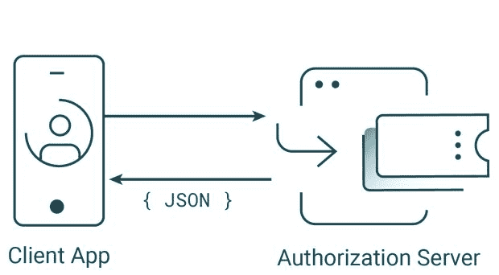

# 告别浏览器和密码

> 原文：<https://thenewstack.io/say-goodbye-to-browsers-and-passwords/>

让用户登录应用和网站对任何企业来说都是至关重要的。从安全和业务的角度来看，您想知道您的用户的身份。然而，登录会分散您的核心功能——在用户开始与您的业务交互之前，他们必须通过身份验证。因此，公司试图使认证用户体验尽可能无缝。

然而，建立良好的登录体验会占用其他优先事项的时间和精力。安全性的提高通常会使登录过程更加繁琐，并给用户登录或创建帐户带来问题。

例如，您的企业可能要求用户在密码中输入一个特殊字符，但他们忘记了，这使得他们每次尝试登录时都要重置密码。或者你可能要求用户经历一个复杂的了解你的客户的过程，这对于一些不太懂技术的用户来说太复杂了。您的企业最不希望的就是因为您提供了更安全的解决方案而失去客户。

## 认证是一个旅程

身份验证的复杂性很大程度上源于这样一个事实，即身份验证不再是提供用户名和密码的简单行为。这是用户确认其身份并获得对其资源的安全访问的旅程。用户可以在各种身份验证方法之间进行选择，其中一些方法可能需要他们使用第二个因素来验证身份。

授权服务器可以基于许多变量做出身份验证决定。他们可以在工作时间之外拒绝身份验证，或者如果用户似乎在可疑的短时间内走了很长的距离，则需要更强的身份验证方法。可以联系外部服务来断言关于用户的信息。这样的例子不胜枚举。

认证是一个旅程。

## 浏览器是容器

为了完成这个复杂的认证过程，用户需要一个合适的容器，到目前为止，我们使用浏览器来完成这个目的。浏览器是一个可靠的选择，因为它为我们提供了基本的安全功能。例如，通过浏览器进行身份验证有助于防止密码进入应用程序。在 [OAuth](https://curity.io/resources/oauth/) 和 [OpenID Connect](https://curity.io/resources/openid-connect) (OIDC)流中，通过浏览器进行的 HTTP 重定向证明了客户端的来源。

然而，当考虑到移动世界时，浏览器可能会成为一种负担。在移动应用程序中使用时，用户通常会切换到另一个应用程序进行身份验证。该应用程序将用户发送到外部浏览器，或者实现复杂的自定义选项卡或 Web 身份验证会话。这种解决方案通常意味着您的用户无法获得最佳体验。

此外，您的业务的一个重要部分依赖于浏览器供应商的突发奇想，他们可以突然改变 API 或删除功能。这不仅影响你的用户，而且使开发过程更加困难。

## 超媒体是推动流动的力量

如果浏览器是一艘船，那么超媒体就是我们穿行的风景。我们太习惯于网络被超媒体驱动，以至于我们经常忽略了这个事实。基本上，超媒体是一组通过链接相互连接的页面(文本)，这些链接允许我们在它们之间遍历，一旦我们记住了它，我们就可以得出一个简单的结论——浏览器处理丰富的用户认证，因为它是一个超媒体流。

超媒体允许用户根据需要遍历认证步骤，这对于每次登录可能是唯一的。因此，超媒体 API 可用于在移动设备上执行复杂的认证流程，而无需借助浏览器。这允许用户在不切换应用程序的情况下遵循复杂的认证流程，他们将在整个旅程中保持在你的应用程序的上下文中。

使用浏览器与超媒体 API 的流程

## 更多控制，更多安全

将用户保持在你的应用环境中并不是[超媒体认证 API](https://curity.io/product/authentication-service/authentication-api/) 的唯一优势。另一个好处是使用本地组件进行身份验证。这简化了开发，因为您的团队只需要在本地应用程序代码中处理主题，他们不必单独创建定制视图来显示在流程的浏览器操作部分中。更不用说，与编写复杂的 CSS 规则相比，设计本机 UI 组件的样式要简单得多。

当供应商更新他们的产品或使用一个模糊的浏览器应用程序时，浏览器的样式可能最终会打破。坚持使用本机代码也是对跨站点脚本攻击的强大保护，因为在这个过程中没有使用 JavaScript 代码。

使用超媒体认证 API，授权服务器现在可以直接与您的应用程序对话，这为另一次安全升级提供了可能性。授权服务器可以在允许身份验证开始之前执行客户端应用程序的证明，这意味着它可以证明:

*   它正在与谷歌 Play 商店/App Store 中注册的合法应用程序对话。
*   该应用程序运行在非 root 或越狱的设备上。

证明将允许授权服务器证明客户机的出处，即使没有浏览器重定向。当通过浏览器与授权服务器通信时，不可能达到这种安全级别。(如果你想详细了解证明是如何工作的，可以看看 Curity 出版的关于超媒体认证的白皮书。)

将浏览器从认证中移除可能会引起一些质疑——毕竟，这意味着用户密码现在直接输入到应用程序中。

如果应用程序由拥有用户数据的同一方(第一方应用程序)拥有，这不是问题。该党知道这些密码，而且它不是一个安全问题，他们不是通过浏览器输入的。然而，如果使用第三方来认证用户(就像用用户的 Google 账户来认证用户)，那么浏览器仍然是完成至少部分流程所必需的。

## 用硬件加强安全性

由于 Android 和 iOS 提供的 API，执行证明成为可能。负责密钥安全存储的硬件模块支持这些 API。这使得证明成为一种可靠的安全机制，因为破解由硬件支持的安全解决方案要困难得多。

最近，出现了另一种解决方案，它可以由硬件支持，以确保对身份验证过程的最佳保护。Web 认证( [WebAuthn](https://webauthn.io/) )标准允许用户使用安全的加密密钥对应用和网站进行认证。这些密钥不仅安全地存储在用户的设备上，而且可以通过生物特征来保护对它们的访问。

WebAuthn 标准将通过鼓励无密码登录使互联网更加安全。如果没有密码，黑客将无法窃取和重复使用人们的密码。

[像 WebAuthn 这样的无密码解决方案](https://curity.io/blog/going-passwordless-with-webauthn/)，可以让你的应用抵御网络钓鱼的企图。用于验证用户身份的加密密钥与您的域紧密相关。它们永远不会发布到另一个网站上，不管它的名字有多相似。例如，如果你在 example.com 上运营你的业务，你的用户凭证将永远不会被恶意的 exаmpIe.com 使用。(看什么“**我**”那里没有？这正是网络钓鱼攻击背后的东西。在其中一个地址中，L 实际上是一个大写的 I。攻击者利用这种能力来注册使用看起来与合法字符相似的字符的域。)

一旦无密码成为身份验证的第一个标准因素(目前它通常被用作第二个因素)，它也将改善用户体验。用户将不必记住许多密码，使用密码管理器或在不同网站之间重复使用密码的风险。

Web 身份验证不限于移动设备。大多数浏览器已经支持它，至少是部分支持(对一些浏览器来说，它需要一个外部硬件安全密钥卡，如 Yubikey)，所以在桌面上转向无密码也是可能的。

## 是时候加强安保了

现在，移动设备和应用程序主宰了世界，是时候升级身份认证流程的安全性和用户体验了。一种策略是取消浏览器，转而使用超媒体认证 API，该 API 允许在本机代码中进行复杂的认证。另一种方法是逐步淘汰密码，转而使用硬件支持的身份认证解决方案，如网络认证。总之，这些功能将有助于使您的应用和网站为您的用户提供更安全的环境。

如果你想了解更多关于我们如何在 Curity 开发[超媒体认证 API](https://curity.io/product/authentication-service/authentication-api/) 的信息，那么看看这个[演示 Android 应用](https://curity.io/resources/learn/kotlin-android-haapi/)或[演示 iOS 应用](https://curity.io/resources/learn/swift-ios-haapi/)。

<svg xmlns:xlink="http://www.w3.org/1999/xlink" viewBox="0 0 68 31" version="1.1"><title>Group</title> <desc>Created with Sketch.</desc></svg>