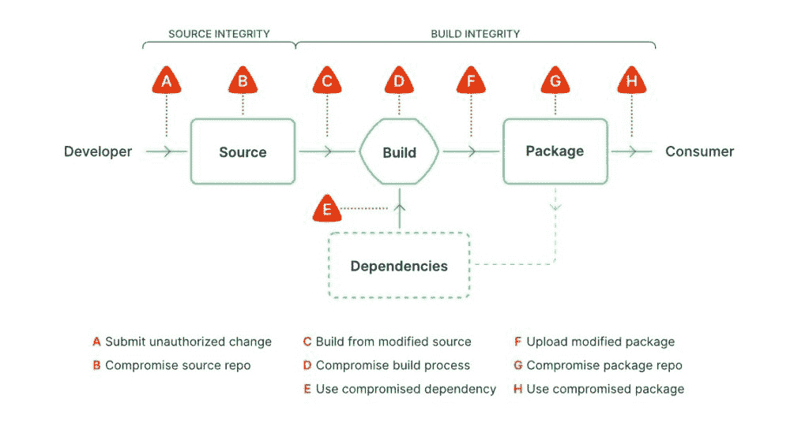

# SBOMs 有利于供应链安全，但买家要小心

> 原文：<https://thenewstack.io/sboms-are-great-for-supply-chain-security-but-buyers-beware/>

两个主要事件有助于将软件物料清单(SBOMs)进一步推向前沿，作为组织开始保护其供应链的潜在方法。Apache Log4j 的 Log4Shell 灾难——这可能会在未来几年造成问题，成为历史上最广泛的供应链攻击之一——以及如果有一个适当的 SBOM，这种灾难是如何避免的。5 月，拜登总统发布了第 14028 号行政命令，要求 IT 提供商必须提供 SBOM，以便与美国联邦政府合作。因此，组织现在越来越希望将 SBOMs 集成到他们的 DevSecOps 流程中。

至少，SBOMs 将作为任何安全软件开发框架(SDF)的主要组成部分，提供任何应用中使用的所有库的完整库，以及所有代码源和时间线的完整历史。 [Sysdig 的](https://sysdig.com/)产品分析师和软件工程师 [Alvaro Iradier Muro 说:“SBOM 就是通过包含软件组件和依赖项的列表来增加软件可交付性的透明度。](https://es.linkedin.com/in/airadier)“如果没有 SBOM，对软件依赖性、可能的开源或商业许可问题、已知漏洞或其他潜在恶意元素的可见性就会降低。当组织和用户交付或使用缺乏 SBOMs 的软件时，他们承担了风险，并且没有作为尽职调查执行额外的分析。”

但是，虽然采用 SBOMs 至少对提高安全性是积极的，但在它们能够开始在防止供应链攻击和检测漏洞方面发挥作用之前，还必须做大量的工作。因此，SBOMs 似乎确实提供了一个解决困扰供应链安全的问题的方案，并且至少应该作为任何安全计划中的一个主要组成部分，阻碍其采用的挑战仍然存在。

在描述挑战之前，首先要考虑的主要问题是详细说明 SBOM 需要做什么。“我们通常将 SBOM 笼统地描述为一系列成分——你可以食用食物而不用担心成分，但如果过敏，营养问题等。，你想了解产品里面是什么，”Muro 说。软件应用程序、服务、软件包等。，是完全一样的。因此，SBOM 不是供应链安全的全部解决方案，但它是保护数字供应链的关键部分。”

## 货物出门概不退换

Muro 表示，在选择 SBOM 供应商时，需要注意的主要事项包括:

*   一些分析工具如何只扫描二进制文件中的内容并生成组件列表。“这种方法的有效性在很大程度上取决于二元分析的能力，并且仍然可能导致缺口。理想情况下，每个供应商都应该为交付给消费者的每一款软件提供 SBOM，”Muro 说。“该软件的消费者将使用组合分析来为其自己的输出生成 SBOM，包括原始的 SBOM 加上作为定制和交付的一部分而添加的工件的描述。”供应链中最终可交付产品的 SBOM 应包含一份全面、准确的列表，列出生产该可交付产品所涉及的组件和版本。“这意味着每一个软件供应商都必须为任何商业或开源软件提供全面、准确的 SBOM，”Muro 说。"否则，最后的 SBOM 文件是不准确或不完整的."
*   如何竞争 SBOM 标准，包括 CycloneDx，SPDX 和 SWID 标签。“这些 SBOM 格式也不包含相同的信息。Muro 说:“大多数组织希望 SBOM 包含依赖列表、已知漏洞(CVE-IDs)和软件许可信息。"这使得更难达成一个共同的解决方案."
*   虽然在某些方面违反直觉，但开发团队必须意识到 SBOM 本身是一个需要保护的数字文档。“无论它有多准确和全面，组织或供应商都需要确保 SBOM 不会受到影响。这通常通过集成检查和数字签名来实现，以确保真实性并防止篡改，但这需要额外的工具和过程来实现，”Muro 说。“许多组织在收集或维护 SBOMs 方面几乎没有触及皮毛，更不用说深入研究这种级别的供应链完整性了。SBOMs 可以增加软件供应链的透明度，但同时，它们也带来了额外的挑战，组织必须用新的工具或流程来解决这些挑战。”

在考虑了这些警告之后，如果组织没有采用适当的 DevSecOps 过程，那么即使是最好的 SBOM 提供者也没有多大用处。“今天讨论的最常见的操作元素是使用 SBOM 来传达给定应用程序的软件供应链中组件内的新漏洞。这种知识显然是有价值的，但如果你的组织没有一个消费它的过程，那么拥有 SBOM 和相关漏洞信息的好处是很小的，” [Tim Mackey，](https://www.linkedin.com/in/mackeytim)总部位于山景城的 [Synopsys 网络安全研究中心](https://www.synopsys.com/software-integrity/cybersecurity-research-center.html)的首席安全策略师告诉 New Stack。“缺少流程是最大的挑战，因为虽然采购团队可以向所有供应商要求 SBOM，但如果没有明确定义的流程来处理 SBOM 中的信息，那么所发生的一切就是目录中多了一个文件。同样重要的是要注意，SBOMs 只是定义良好的软件供应链风险管理过程的一个组成部分，但它们不是“运营管理的银弹”"

## SLSA 香料

SBOMs 当然不会涵盖组织保护其供应链的所有方面。除了他们自己的最佳实践应该提供跨 CI/CD 的安全监控和检查，并涵盖部署后阶段的运行时，用软件工件的[供应链级别](https://security.googleblog.com/2021/06/introducing-slsa-end-to-end-framework.html)补充 SBOMs 也是明智的(SLSA 发音为“salsa”)。SLSA 提供了一个框架和路线图，因此行业可以开始坚持实施 SBOMs 和其他安全良好实践，以确保软件供应链的安全。“这还包括为认证设定标准或水平，以及对软件提供商的要求，”Muro 说。

来源:链卫士

同样，即使 SBOM 和 SLSA 的实施都以供应链保护为目标，但也只是供应链保护的两个组成部分。“你不能只是买些东西，插上电源就解决所有问题，”[丹·洛伦克、](https://www.linkedin.com/in/danlorenc)联合创始人兼首席执行官、[链甲](https://www.chainguard.dev/)告诉 New Stack，他共同创建了 SLSA 和 Sigstore 安全项目。“当你分解供应链问题时，SLSA 专注于一个领域，SBOM 专注于另一个领域，SLSA 专注于另一个领域，有几十个问题需要你去解决，而 SBOM 只针对其中一个。所以，那里有很多问题，除了这个问题还有很多问题。”或者，即使我们真的解决了这个问题，有完美的毁灭，每个人都有，我们仍然要担心。"

数字风险保护解决方案提供商 [Digital Shadows](https://www.digitalshadows.com/) 的首席信息安全官兼战略副总裁[里克·霍兰德(Rick Holland)对《新堆栈》表示，采用 SBOMs 和 SLSA 虽然尚未成为主流，但代表了一个充满希望的开端。“SLSA 的补充 SBOMs:SBOM 提供原料，SLSA 详述原料如何以安全的方式制成，而 slsa 使 s boms 更好。软件公司可以利用 SBOMs 和 SLSAs 作为竞争优势，”Holland 说。“您不仅可以获得用于交付产品的软件组件的更新，还可以获得软件安全生产的保证。”](https://www.linkedin.com/in/rickhholland/)

Holland 说，SBOMs 也不是“万灵药，而是朝着正确方向迈出的一步”。Holland 说:“在一个供应商不报告或甚至不知道他们的解决方案中使用的所有软件的世界里，防御者必须依靠检测和响应。

<svg xmlns:xlink="http://www.w3.org/1999/xlink" viewBox="0 0 68 31" version="1.1"><title>Group</title> <desc>Created with Sketch.</desc></svg>