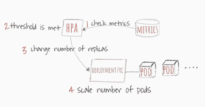

# Kubernetes 中使用 Kubectl 和水平 Pod 自动秤的秤应用

> 原文：<https://thenewstack.io/scale-applications-in-kubernetes-with-kubectl-and-the-horizontal-pod-autoscaler/>

[](https://www.linkedin.com/in/matt-zand-64047871)

 [马特·赞德

马特·赞德是 DC 高中技术服务、网页制作和编码训练营的创始人。他撰写了大量关于网页设计、移动应用程序开发和区块链的高级主题的文章。他是 Touchstone Words 的高级编辑，撰写和评论编码和技术文章。他还是一名居住在华盛顿 DC 的高级讲师和开发人员。](https://www.linkedin.com/in/matt-zand-64047871) [](https://www.linkedin.com/in/matt-zand-64047871)

如今，Kubernetes 已经改变了软件开发的方式。作为一个用于管理容器化工作负载和服务的可移植、可扩展的开源平台，Kubernetes 促进了声明式配置和自动化，并已证明自己是管理[复杂微服务](https://blockchain.dcwebmakers.com/blog/comprehensive-guide-for-migration-from-monolithic-to-microservices-architecture.html)的主导者。它的流行源于 Kubernetes 满足了以下需求:企业希望增长和支付更少，DevOps 希望有一个稳定的平台，可以大规模运行应用程序，开发人员希望有可靠和可复制的流程来编写、测试和调试代码。[这里的](https://coding-bootcamps.com/blog/kubernetes-evolution-from-virtual-servers-and-kubernetes-architecture.html)是一篇了解 Kubernetes 进化和架构的好文章。

但是，您是否考虑过如何获得如此强大的容器编排平台，同时使用您实际需要的资源？优化资源利用率的关键是了解应用程序需要扩展的内容和时间。因此，在本文中，我们讨论并学习最流行的伸缩 Kubernetes 容器的方法。特别是，在本文中，我们将关注两个服务:Kubectl 和 Horizontal Pod Autoscaler。

## 一、库贝内特斯的库贝克特尔

每天与 Kubernetes 进行交互的机制通常是通过一个名为 kubectl 的命令行工具。Kubectl 主要用于与 Kubernetes API 服务器通信，以在 Kubernetes 内创建、更新、删除工作负载。在这里，我们提供了一些常见命令的概述，您可以利用这些命令作为管理 Kubernetes 的良好起点。

大多数常见的 kubectl 命令都提供了要执行的特定操作或动作，如创建、删除等。这种方法通常包括解释描述 Kubernetes 中的对象(POD、服务、资源等)的文件(YAML 或 JSON)。这些文件被用作模板，以及环境的持续文档，并有助于保持 Kubernetes 对声明性配置的关注。命令行上给出的操作被传递给 API 服务器，API 服务器根据需要与 Kubernetes 中的后端服务进行通信。要安装 kubectl，请遵循下表:

**注意:**随着新版本的发布，kubectl for Windows 的最佳版本会随着时间的推移而改变。要找到最佳的当前二进制文件，请点击此链接([https://storage . Google APIs . com/kubernetes-release/release/stable . txt](https://storage.googleapis.com/kubernetes-release/release/stable.txt))并根据需要调整上述 URL。

### Kubectl 语法

Kubectl 有一个语法，如下所示:

```
kubectl  [command]  [TYPE]  [NAME]  [flags]

```

*   **命令:**指你要执行的(创建、删除等。)
*   **类型:**指的是您正在对其执行命令的资源类型(Pod、服务等。)
*   **名称:**对象的区分大小写的名称。如果不指定名称，就有可能获得命令匹配的所有资源的信息(例如，pod)
*   **标志:**这些是可选的，但是在查找特定资源时很有用。例如，–namespace 允许您指定要在其中执行操作的特定名称空间

### Kubectl 操作

使用下面一组例子来帮助您熟悉常用的 kubectl 操作的运行:

```
kubectl apply -  Apply or Update  a  resource from  a  file or stdin.

# Create a service using the definition in example-service.yaml.

kubectl apply  -f  example-service.yaml

kubectl get -  List one or more resources.

# List all pods in plain-text output format.

kubectl get pods

# List all pods in plain-text output format and include additional information (such as node name).

kubectl describe -  Display detailed state of one or more resources,  including the uninitialized ones by default.

# Display the details of the node with name &lt;node-name&gt;.

kubectl describe nodes  &lt;node-name&gt;

kubectl delete -  Delete resources either from  a  file,  stdin,  or specifying label selectors,  names,  resource selectors,  or resources.

# Delete a pod using the type and name specified in the pod.yaml file.

kubectl delete  -f  pod.yaml

# Delete all the pods and services that have the label name=&lt;label-name&gt;.

kubectl delete pods,services  -l  name=&lt;label-name&gt;

kubectl logs -  Print the logs for  a  container in  a  pod.

# Return a snapshot of the logs from pod &lt;pod-name&gt;.

kubectl logs  &lt;pod-name&gt;

# Start streaming the logs from pod &lt;pod-name&gt;. This is similar to the 'tail -f' Linux command.

kubectl logs  -f  &lt;pod-name&gt;

```

这些是 kubectl 中常用的操作。更多细节可以去查阅 kubectl 的官方指南。[这里的](https://myhsts.org/tutorial-review-of-17-essential-topics-for-mastering-kubernetes.php)是一篇阅读更多类似 Kubernetes 主题的好文章。

## 二。水平吊舱自动定标器

Horizontal Pod Autoscaler (HPA)是 Kubernetes 的一个特性，它允许您配置您的集群来自动扩展它正在运行的服务。水平 Pod 自动缩放器被实现为 Kubernetes API 资源和控制器。资源决定了控制器的行为。控制器定期调整复制控制器或部署中的副本数量，以使观察到的平均 CPU 利用率与用户指定的目标相匹配。

HPA 被实现为一个控制环路，其周期由控制器管理器的*–水平机架自动缩放器同步周期标志*控制(默认值为 30 秒)。

在每个周期中，控制器管理器根据每个 HPA 定义中指定的指标查询资源利用率。控制器管理器从资源指标 API(针对每个 pod 的资源指标)或自定义指标 API(针对所有其他指标)获取指标。

*   对于每个机架的资源指标(如 CPU)，控制器从 HPA 针对的每个机架的资源指标 API 中获取指标。然后，如果设置了目标利用率值，则控制器将利用率值计算为每个箱中的容器上的等效资源请求的百分比。如果设置了目标原始值，则直接使用原始度量值。然后，控制器取所有目标箱的利用率或原始值(取决于指定的目标类型)的平均值，并产生一个比率，用于缩放所需副本的数量。
*   对于每个机架的自定义指标，控制器的功能类似于每个机架的资源指标，只是它使用原始值，而不是利用率值。
*   对于对象指标，获取单个指标(描述所讨论的对象)，并与目标值进行比较，以产生上述比率。

HorizontalPodAutoscaler 控制器可以通过两种不同的方式获取指标:直接堆访问和 REST 客户端访问。当使用直接堆服务器访问时，HorizontalPodAutoscaler 通过 API 服务器的服务代理子资源直接查询堆服务器。Heapster 需要部署在集群上，并在 kube-system 名称空间中运行。

HPA 的工作流程遵循以下四个步骤，如下图所示:

1.  HPA 会以默认的 30 秒间隔持续检查您在设置过程中配置的指标值
2.  如果达到指定的阈值，HPA 会尝试增加机架的数量
3.  HPA 主要更新部署或复制控制器中的副本数量
4.  然后，部署/复制控制器将部署任何额外的所需单元



### 在推广 HPA 时，请考虑以下几点:

*   默认的 HPA 检查间隔是 30 秒。这可以通过 controller manager 的—horizontal-pod-auto scaler-sync-period 标志进行配置。
*   默认 HPA 相对指标容差为 10%。
*   HPA 在最后一次扩展事件后会等待三分钟，以便指标稳定下来。这也可以通过—水平-pod-自动缩放-上调-延迟标志进行配置。
*   HPA 从最后一次缩减事件开始等待五分钟，以避免自动缩放抖动。可配置通过—水平-pod-自动缩放-向下缩放-延迟标志。
*   HPA 最适合部署对象或 Pod 指标，而不是复制控制器。不适用于使用复制控制器直接操作的滚动更新。进行部署时，管理底层副本集的大小取决于部署对象。
*   在将 HPA 与定制指标(如 Pod 指标或对象指标)一起使用时，为了确定是扩大还是缩小规模，您可以同时使用多个指标，因为 Kubernetes 支持多个指标。同样，请记住 Kubernetes 将依次考虑每个指标。查看 https:/ / kubernetes。io/docs/tasks/run-application/horizontal-pod-auto scale 查看更多示例。

## 结论

在本文中，我们讨论了用于扩展 Kubernetes 应用程序的两个主要工具，这两个工具都是所有 Kubernetes 服务的关键组件。我们已经看到了如何安装和使用不同的特性，比如应用、获取、删除、描述、kubectl 的日志。此外，我们回顾并了解了水平 Pod Autoscaler 的工作原理，以及它对 Kubernetes 服务的重要性。在扩展微服务应用时，kubectl 和 HPA 都是 Kubernetes 的基本特性。

从这里开始，您可以继续学习 Kubernetes 的其他主题，比如使用滚动更新来更新 live containers、使用配置文件、将 monolithic 迁移到微服务、与 Jenkins 集成、使用私有 Docker registry，或者设置和构建持续交付管道。[这里的](https://blockchain.dcwebmakers.com/blog/advance-topics-for-deploying-and-managing-kubernetes-containers.html)是一篇学习 Kubernetes 开发的更高级主题的好文章。

通过 Pixabay 的特征图像。

<svg xmlns:xlink="http://www.w3.org/1999/xlink" viewBox="0 0 68 31" version="1.1"><title>Group</title> <desc>Created with Sketch.</desc></svg>