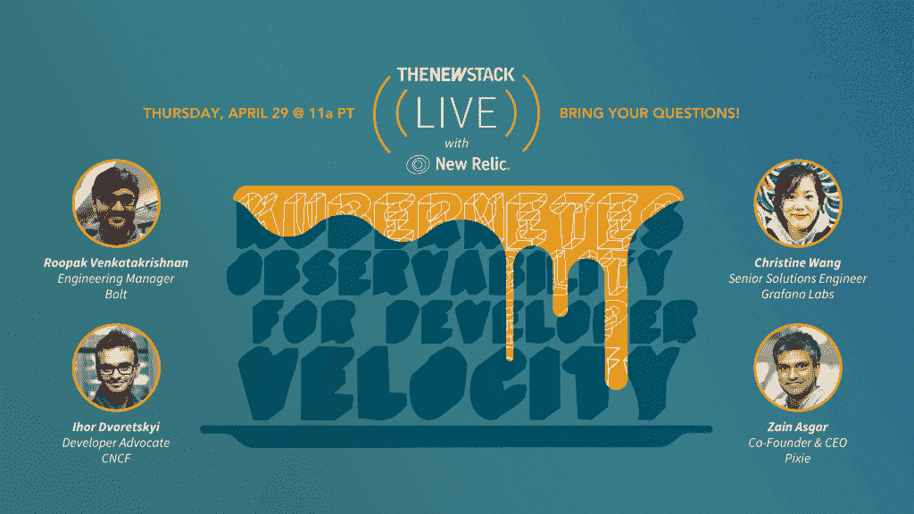

# 立即横向扩展:新堆栈已有 7 年历史

> 原文：<https://thenewstack.io/scale-out-today-the-new-stack-is-7-years-old-today/>

编者按:今天是新栈的七岁生日，我们供应煎饼！这是我们的出版商和创始人发来的消息。

今天是新栈的七岁生日。我不禁想起了我在英特尔的安德烈斯·罗德里格斯(Andres Rodriguez)的新书中读到的这个花絮:“[深度学习系统:大规模生产的算法、编译器和处理器](https://deeplearningsystems.ai)”

Rodriguez 写了我们现在为深度学习模型实现的计算速度，以及它与横向扩展架构的速度相比如何。机器可以扩展，但是人类软件的指数级发展缓慢，我们只能通过自动化来加快速度，这意味着更加依赖机器。但相反，开发深度学习模型所需的计算需求远远超过了可用的内存。带宽是有限的，这就需要更专业的硬件和更好的编译器。

很明显，横向扩展架构定义了我们工作和生活方式的几乎所有方面。在大规模上，数百万人拥有需要横向扩展架构才能运行的智能手机。这些设备上的应用程序由软件构建的分布式架构支持，其中大部分依赖于开源。

服务和软件只是故事的一部分。工程管理正在发生变化。当技术本身驱动组织的销售、运营和营销时，会产生什么样的文化分支？当关注规模时，组织的其他部分会受到什么影响？

为了我们的目的，我们必须把它带回到真正重要的事情上，这就是人们是如何受到影响的。规模如何影响妇女和代表性不足的少数群体？新堆栈如何支持女性和代表性不足的少数群体，并涵盖横向扩展架构的技术方面？

在一个横向扩展的世界中，问题在于表示。几百年来，专有思想一直是社会的基础，在软件世界也是如此。今天的事件，无论是一名黑人被谋杀，还是一名 13 岁儿童被警察杀害，都告诉我们，为管理和控制人民而建立的大众体系是站不住脚的。它坏了，没有任何级别的监控可以修复它。我们有一个基于数据分析的先例，用于跟踪行为。开发这些技术的人大多是特权阶层。答案是放弃固有的种族主义制度，并认识到我们已经系统地边缘化了整个社会群体:黑人、有色人种妇女、亚洲人、美国原住民、同性恋群体、变性儿童——这是一个越来越具有消费性和反动性的清单。最终，它会吞噬所有人。我们知道潜意识里。这就是我们如何将内心深处的东西展现出来，而这只能由个人来完成。

那么，对于像 New Stack 这样专注于大规模开发、部署和管理的组织来说，答案是什么呢？首先，这关系到我们团队的多元化和包容性。在这方面，我们可以做得更好，更负责任。我们可以更加关注谁在构建横向扩展架构的文化，特别是当深度学习成为 at 级组织的核心要求时。

我们需要努力支持那些希望在软件开发领域建立职业生涯的女性和少数族裔。但最重要的是，这意味着我们必须根据我们为组织设定的价值观来管理新的堆栈。

解释和分析横向扩展、分布式和复杂的体系结构是新体系的核心重点。重要的是技术是如何开发的，谁在开发它们，谁受雇于这项工作，以及组织如何使用扩展架构。

现在占主导地位的是排外的做法。人力资源组织现在使用数据分析来系统地筛选曾就读于顶级计算机科学机构的人的简历。这意味着很多人被排除在外。

我们生活在一个扩大了的世界里。对于我们的生日，我们只是在审视自己，寻找如何让它更能代表和反映受到系统性种族主义制度影响的女性和代表性不足的少数族裔。

一个缩小的世界有一种乌托邦的感觉。我们知道到达乌托邦是不可能的。但是，从我们自己做起，是我们知道如何为那些长期被排斥和边缘化的人创造更美好世界的唯一途径。

*帮助我们庆祝我们的生日，加入我们太平洋时间今天上午 11 点举行的[煎饼和播客直播](https://t.co/nRHkXhYYk1?amp=1)，我们将与来自 Pixie、Grafana、Bolt 和[云本地计算基金会](https://cncf.io/?utm_content=inline-mention)的人们讨论可观测性——这是我们庆祝七岁生日的一个恰当主题！*

<svg xmlns:xlink="http://www.w3.org/1999/xlink" viewBox="0 0 68 31" version="1.1"><title>Group</title> <desc>Created with Sketch.</desc></svg>