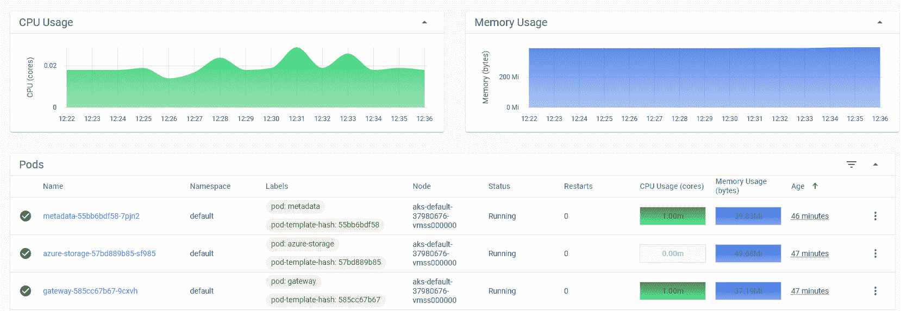
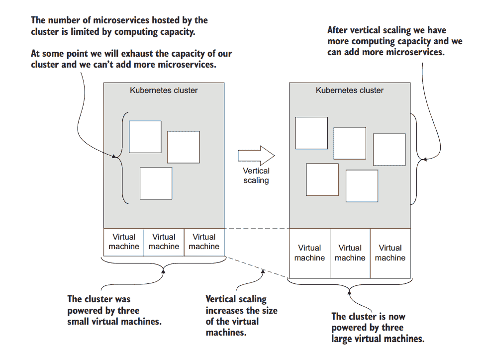
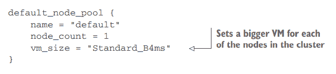
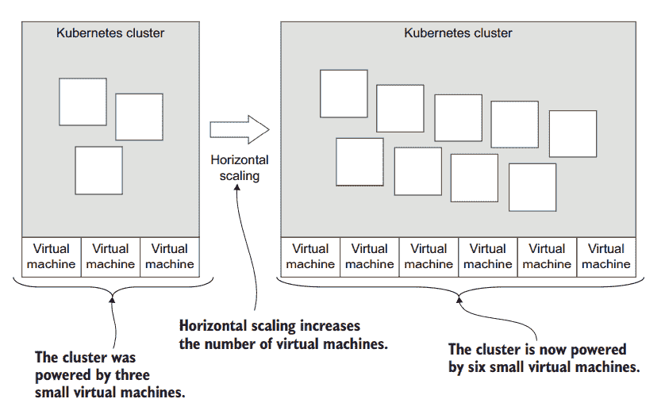
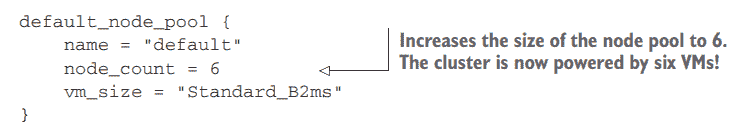
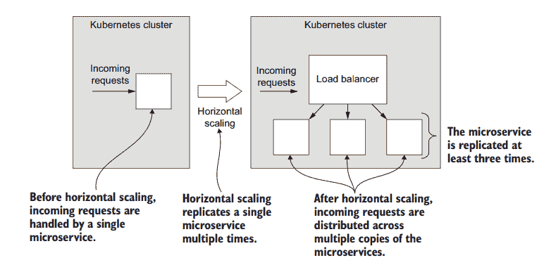
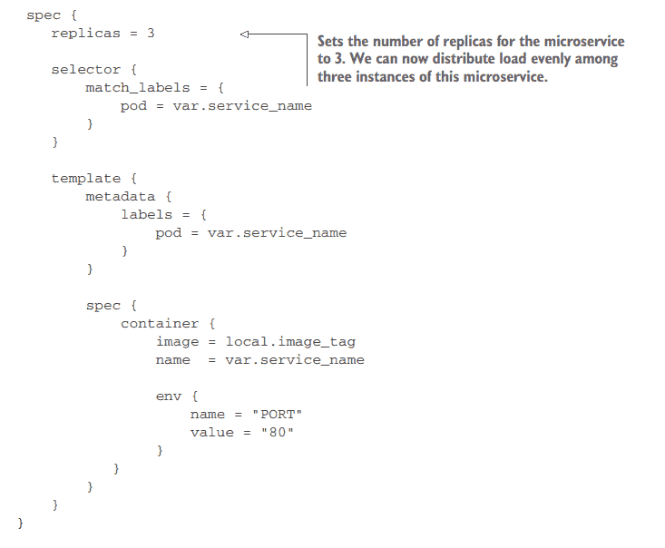
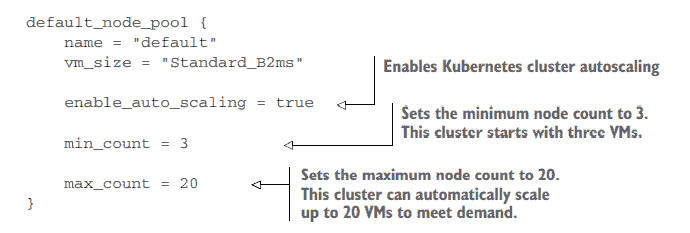
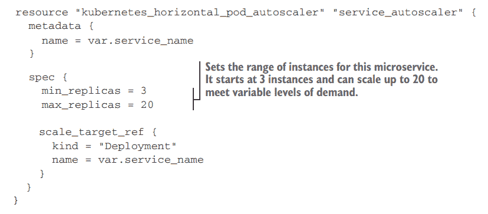

# 在 Kubernetes 上扩展微服务

> 原文：<https://thenewstack.io/scaling-microservices-on-kubernetes/>

基于微服务构建的应用可以通过多种方式进行扩展。我们可以扩展它们以支持大型开发团队的开发，也可以扩展它们以获得更好的性能。这样，我们的应用程序就可以拥有更高的容量，并能够处理更大的工作负载。

使用微服务可以让我们对应用程序的性能进行精细控制。我们可以很容易地测量我们的微服务的性能，以找出那些性能差、超负荷或在高峰需求时超负荷的微服务。图 1 显示了我们如何使用 [Kubernetes 仪表板](https://coding-bootcamps.com/blog/kubernetes-evolution-from-virtual-servers-and-kubernetes-architecture.html)来了解微服务的 CPU 和内存使用情况。

图 1:在 Kubernetes 仪表板中查看微服务的 CPU 和内存使用情况

然而，如果我们使用一个整体，我们对性能的控制将是有限的。我们可以垂直放大这个庞然大物，但基本上就是这样。

 [阿什莉·戴维斯

Ashley 是一名软件工匠、企业家和作家，拥有 20 多年的软件开发经验，从编码到管理团队，再到创办公司。他是 Sortal 的 CTO，这是一款通过机器学习的魔力自动对数字资产进行分类的产品。](https://www.linkedin.com/in/ashleydavis75/) 

水平缩放一个整体要困难得多，我们根本无法独立缩放一个整体的任何“部分”。这并不理想，因为它可能只是导致性能问题的一小部分。然而，我们将不得不垂直缩放整个庞然大物来修复它。垂直扩展一个巨大的整体可能是一个昂贵的提议。

相反，有了[微服务](https://thenewstack.io/microservices-vs-monoliths-an-operational-comparison/)，我们有了许多扩展选项。例如，我们可以独立地微调系统小部分的性能，以消除瓶颈并实现性能结果的正确组合。

我们也有许多先进的方法来解决性能问题，但在这篇文章中，我们将概述一些相对简单的技术来使用 [Kubernetes](https://learn.coding-bootcamps.com/p/complete-live-training-for-mastering-devops-and-all-of-its-tools) 扩展我们的微服务:

1.  垂直扩展整个集群
2.  水平扩展整个集群
3.  水平扩展单个微服务
4.  弹性扩展整个集群
5.  弹性扩展单个微服务

扩展通常需要对我们的集群进行高风险的配置更改。因此，您不应该试图直接对您的客户或员工所依赖的生产集群进行任何更改。

相反，我会建议您创建一个新的集群，并使用**蓝绿色部署**，或类似的部署策略，来缓冲您的用户对您的基础架构的风险性更改。

## **垂直缩放集群**

随着我们应用程序的增长，我们可能会发现我们的集群通常没有足够的计算、内存或存储来运行我们的应用程序。随着我们添加新的微服务(或复制现有的微服务以实现冗余)，我们最终会最大限度地利用集群中的节点。(我们可以通过我们的云供应商或 Kubernetes 仪表板对此进行监控。)

此时，我们必须增加集群可用的资源总量。当在 [Kubernetes 集群](https://blockchain.dcwebmakers.com/blog/advance-topics-for-deploying-and-managing-kubernetes-containers.html)上扩展微服务时，我们可以轻松地利用垂直或水平扩展。图 2 显示了 Kubernetes 的垂直伸缩情况。

图 2:通过增加虚拟机的大小来垂直扩展集群。

我们通过增加节点池中虚拟机(VM)的大小来扩展集群。在本例中，我们增加了三个小型虚拟机的大小，因此我们现在有三个大型虚拟机。我们没有改变虚拟机的数量；我们只是增加了它们的规模—垂直扩展我们的虚拟机。

清单 1 是在 Azure 上提供集群的 Terraform 代码的摘录；我们将 vm_size 字段从标准 _B2ms 更改为标准 _B4ms。这将升级我们 Kubernetes 节点池中每个虚拟机的大小。我们现在有四个 CPU(每个虚拟机一个)，而不是两个。作为这一变化的一部分，虚拟机的内存和硬盘也会增加。如果您正在部署 AWS 或 GCP，您可以使用这种技术进行垂直扩展，但这些云平台为不同的虚拟机大小提供了不同的选项。

我们的集群中仍然只有一个虚拟机，但是我们已经增加了虚拟机的大小。在这个例子中，扩展我们的集群就像修改代码一样简单。这就是基础设施即代码的强大之处，这种技术将我们的基础设施配置存储为代码，并通过提交触发我们的连续交付(CD)管道的代码更改来对我们的基础设施进行更改

清单 1。使用 Terraform 垂直缩放集群(提取)。

## 水平扩展集群

除了垂直扩展我们的集群，我们还可以水平扩展它。我们的虚拟机可以保持相同的大小，但我们只需添加更多的虚拟机。

通过向我们的集群添加更多的虚拟机，我们可以将应用程序的负载分散到更多的计算机上。图 3 展示了我们如何将集群从三个虚拟机增加到六个。每个虚拟机的大小保持不变，但我们通过拥有更多虚拟机获得了更强的计算能力。

图 3:通过增加虚拟机数量来水平扩展集群。

清单 2 显示了 Terraform 代码的摘录，用于向我们的节点池添加更多的虚拟机。回到清单 1，我们将 node_count 设置为 1，但是在这里我们将其更改为 6。请注意，我们将 vm_size 字段恢复为较小的 Standard_B2ms。在本例中，我们增加了虚拟机的数量，但没有增加它们的大小；尽管没有什么可以阻止我们增加虚拟机的数量和规模。

不过，一般来说，我们可能更喜欢水平扩展，因为它比垂直扩展更便宜。这是因为使用许多较小的虚拟机比使用更少但更大且价格更高的虚拟机更便宜。

清单 2。使用 Terraform 水平缩放集群(提取)。

## 水平扩展单个微服务

假设我们的集群扩展到足够大的规模来托管所有性能良好的微服务，当单个微服务过载时，我们该怎么办？(这可以在 Kubernetes 仪表板中监控。)

每当微服务成为性能瓶颈时，我们可以横向扩展它，将其负载分布在多个实例上。这如图 4 所示。

图 4:通过复制来水平扩展微服务。

我们有效地为这个特定的微服务提供了更多的计算、内存和存储，以便它能够处理更大的工作负载。

同样，我们可以使用代码来实现这种改变。我们可以通过在 Kubernetes 部署或 pod 的规范中设置 replicas 字段来做到这一点，如清单 3 所示。

清单 3。使用 Terraform 横向扩展微服务(摘录)。

我们不仅可以扩展单个微服务的性能，还可以横向扩展我们的微服务以实现冗余，从而创建一个容错能力更强的应用。通过拥有多个实例，每当任何一个实例出现故障时，都有其他实例可以承担负载。这允许微服务的失败实例重启并再次开始工作。

## 集群的弹性扩展

进入更高级的领域，我们现在可以考虑弹性伸缩。这是一种技术，我们可以自动、动态地扩展我们的集群，以满足不同层次的需求。

每当需求较低时， [Kubernetes](http://myhsts.org/tutorial-review-of-17-essential-topics-for-mastering-kubernetes.php) 可以自动释放不需要的资源。在高需求期间，会分配新的资源来满足增加的工作量。这产生了大量的成本节约，因为在任何给定的时刻，我们只为处理我们的应用程序的工作负载所必需的资源付费。

我们可以在集群级别使用弹性伸缩来自动扩展接近资源极限的集群。同样，当使用 Terraform 时，这只是一个代码更改。清单 4 展示了如何启用 Kubernetes 自动缩放器并设置节点池的最小和最大大小。

默认情况下，集群的弹性伸缩是有效的，但是我们也可以通过多种方式对其进行定制。在 Terraform 文档中搜索“auto_scaler_profile”以了解更多信息。

清单 4。使用 Terraform 实现集群的弹性扩展(摘录)

## 针对单个微服务的弹性扩展

我们还可以在单个微服务级别实现弹性扩展。

清单 5 是赋予微服务“突发”能力的 Terraform 代码示例。微服务的副本数量会动态扩展和收缩，以满足微服务不断变化的工作负载(突发活动)。

默认情况下，缩放工作正常，但可以定制为使用其他指标。参见[地形文档](https://www.terraform.io/docs/providers/kubernetes/r/horizontal_pod_autoscaler.html)了解更多信息。要了解更多关于 Kubernetes，[中 pod 自动缩放的信息，请参阅 Kubernetes 文档](https://kubernetes.io/docs/tasks/run-application/horizontal-pod-autoscale/)。

清单 5。使用 Terraform 实现微服务的弹性扩展

## 关于这本书:引导微服务

您可以通过[引导微服务](https://www.manning.com/books/bootstrapping-microservices-with-docker-kubernetes-and-terraform)来了解如何使用微服务构建应用。

Bootstrapping Microservices 是一个实用的基于项目的指南，旨在用微服务构建应用程序。它将带你从构建一个单独的微服务一直到在 [Kubernetes](https://coding-bootcamps.com/blog/build-containerized-applications-with-golang-on-kubernetes.html) 上运行一个生产中的微服务应用，最终实现一个自动化的连续交付管道，并使用*基础设施即代码*将更新推入生产。

## 其他 Kubernetes 资源

这篇文章摘自*引导微服务*，简要概述了在 Kubernetes 上运行微服务时如何扩展它们。

我们使用 Terraform 指定基础设施的配置。以这种方式通过代码创建和更新我们的基础设施被称为**内部结构作为代码**，这是一种将基础设施的工作转化为编码任务的技术，为 DevOps 革命铺平了道路。

要了解更多关于 [Kubernetes](https://learn.coding-bootcamps.com/p/live-training-class-for-mastering-kubernetes-containers-and-cloud-native) 的信息，请参见[Kubernetes 文档](https://kubernetes.io/docs/home/)。

要了解更多有关使用 Terraform 使用 Kubernetes 的信息，请参见[terra form 文档](https://registry.terraform.io/providers/hashicorp/kubernetes/latest)。

<svg xmlns:xlink="http://www.w3.org/1999/xlink" viewBox="0 0 68 31" version="1.1"><title>Group</title> <desc>Created with Sketch.</desc></svg>