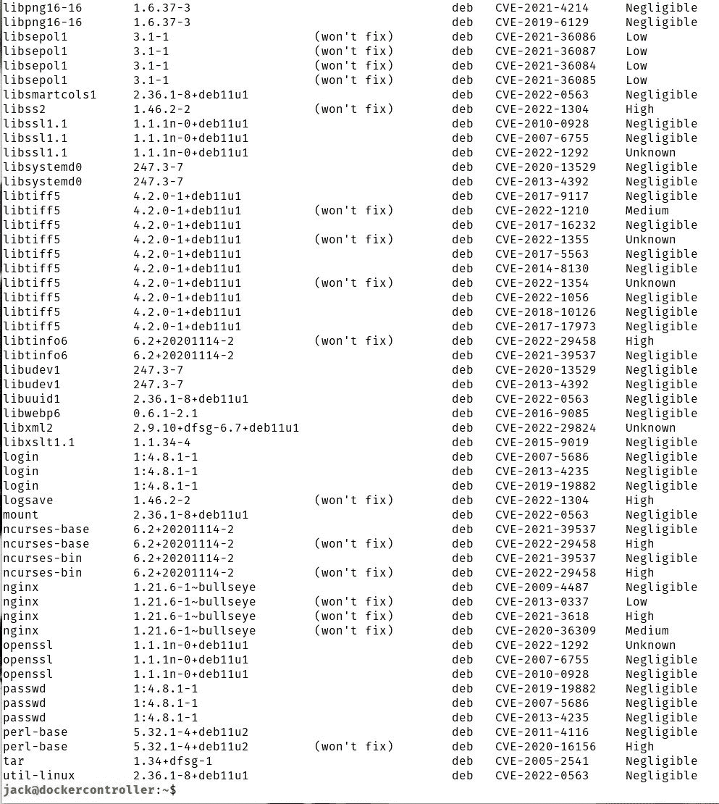

# 使用 Grype 扫描容器映像中的漏洞

> 原文：<https://thenewstack.io/scan-container-images-for-vulnerabilities-with-grype/>

容器化的应用和服务部署有许多移动部件，这相当于一架非常大的攻击飞机。

这就是为什么你的第一步是绝对重要的。为此，您必须确保作为容器基础的映像没有漏洞。但是你是怎么做到的呢？有很多可用的工具，但是其中有一个(至少对我来说)比其他大多数工具更容易使用。

那个工具就是[格里普](https://github.com/anchore/grype)。

Grype 是一个由安全公司 Anchore 管理的开源软件包，它是一个针对图像和文件系统的漏洞扫描器。它已经取代了现已废弃的 Anchore 内嵌扫描脚本(将于 2022 年 1 月 10 日终止)。锚点漏洞数据库将不再保持最新，新图片也不再发布。正因为如此，是时候和格里普一起前进了。

正如我所说的，Grype 使用起来非常简单，可以在下面的图片中扫描包的漏洞:

*   阿尔卑斯山的
*   亚马逊 Linux
*   BusyBox
*   CentOS
*   一种自由操作系统
*   Distroless
*   Oracle Linux
*   红帽(RHEL)
*   人的本质

但是 Grype 不仅限于这些官方图片。任何基于上述的图像都可以被扫描。我已经使用 Grype 成功地扫描了各种图像(比如 NGINX、MySQL 等等)。Grype 也非常擅长为特定语言的包寻找漏洞，例如:

*   红宝石
*   爪哇(加尔、战争、埃尔、JPI、HPI)
*   JavaScript (NPM，纱)
*   Python(鸡蛋、轮子、诗歌、requirements.txt/setup.py 文件)

我想带你看一下安装 Grype 的过程，然后用它来扫描图像。我将演示在 Linux 上安装 Grype([Pop！_OS](https://pop.system76.com/) )和 macOS Monterey。我将假设您已经启动并运行了 Docker、Podman 或您选择的容器运行时引擎。

就这样，我们开始吧。

## 在 Linux 上安装 Grype

登录到您的 Linux 机器并打开一个终端窗口。在终端上，发出命令:

`curl -sSfL https://raw.githubusercontent.com/anchore/grype/main/install.sh | sudo sh -s -- -b /usr/local/bin`

安装完成后，您可以使用以下命令进行验证:

`grype -h`

上面的命令将打印出 Grype 帮助文件。

## 在 MacOS 上安装 Grype

为了在 macOS 上安装 Grype，你必须使用 Homebrew。要安装 homebrew，请在 Apple 设备上打开一个终端窗口，并发出命令:

`/bin/bash -c "$(curl -fsSL https://raw.githubusercontent.com/Homebrew/install/HEAD/install.sh)"`

安装需要一些时间，所以要么坐下来看输出，要么处理另一个任务，稍后再回来。

一旦安装了 Homebrew，您首先必须使用命令“点击”Grype 进行安装:

`brew tap anchore/grype`

完成后，在 Grype 中安装:

`brew install grype`

到目前为止一切顺利。Grype 已经启动并运行，可以在 Linux 或 macOS 上进行扫描。我们就这么做吧。

## 使用 Grype 扫描图像

Grype 的基本用法是:

`grype IMAGE`

其中 IMAGE 是图像的名称。

例如，我可以用以下命令扫描 NGINX 图像:

`grype nginx:latest`

您可能已经注意到，我包含了带有图像名称的标记。如果您提取了图像的多个版本，这是必要的。例如，您可能有官方的 MySQL 映像(mysql:latest)以及 ubuntu/mysql:8.0-22.04_beta 映像。如果你没有指定标签，并且你有多个版本，grype 将会出错。

在对映像运行扫描后，Grype 将报告它发现的任何漏洞(**图 1** )。

**图 1**

Grype 在官方 NGINX 图片中发现了几个漏洞(其中一些标记为高)。

将列出图像中扫描的每个包裹，输出包括:

*   名称–数据包的名称。
*   INSTALLED–映像中安装的版本号。
*   FIXED-IN–漏洞已被修复的版本。
*   类型——数据包的类型
*   漏洞–每个漏洞的 CVE 列表。
*   严重性–每个漏洞的严重性。

您需要密切关注每个软件包的严重性和漏洞列表。

这是一个相当基本的扫描。如果您想要包括所有图像层中的包(不管它是否出现在最终图像中)，您可以发出如下命令:

`grype nginx:latest --scope all-layers`

区别？通过扫描 *nginx:latest* 图像，Grype 发现了 143 个编目包和 138 个漏洞。当使用 scope 选项运行时，Grype 发现了 239 个包和相同数量的漏洞。在范围扫描中，Grype 检查容器可见的包裹，因此包裹数量较少。

如果您的图像是项目的一部分，您可以使用 Grype 扫描整个项目。比方说，您的项目位于 *~/myproject* 。要用 Grype 扫描项目，使用如下命令:

`grype dir:~/myproject/`

Grype 将深入目录，扫描每个相关的包，并报告任何发现的漏洞。

## 结论

如果你正在寻找市场上最简单的图像漏洞扫描工具，Grype 可能就是你要找的。这个命令行应用程序不仅使用简单，而且是识别您计划处理的映像是否包含漏洞的可靠方法，如果包含漏洞，还可以识别其严重性。如果您对您的容器安全性非常重视，那么这一切都始于(但不止于)您的部署所基于的映像。

<svg xmlns:xlink="http://www.w3.org/1999/xlink" viewBox="0 0 68 31" version="1.1"><title>Group</title> <desc>Created with Sketch.</desc></svg>