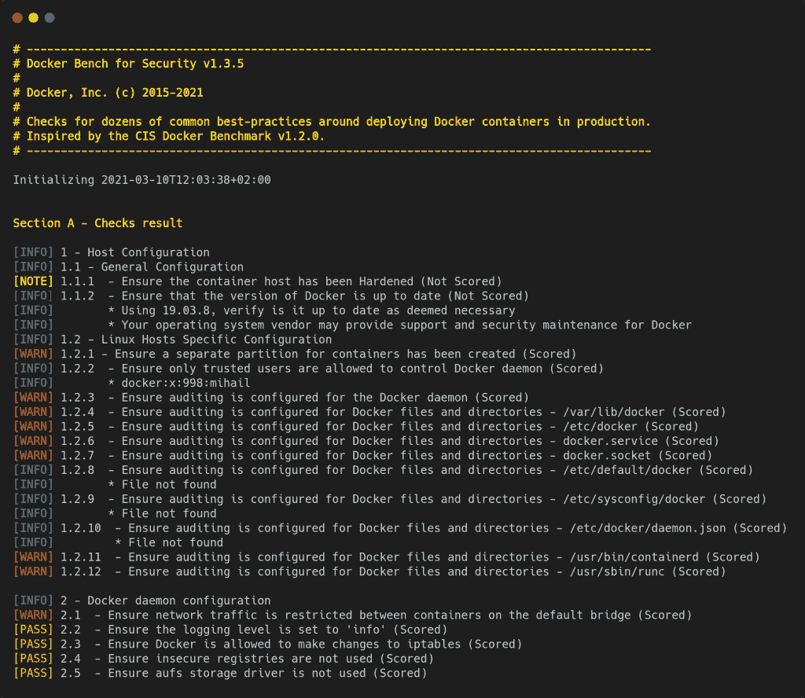

# 使用 Docker Bench 扫描主机漏洞

> 原文：<https://thenewstack.io/scan-for-host-vulnerabilities-with-docker-bench/>

如果您是云原生开发人员，那么您很有可能使用容器和容器映像。这样做的问题是，您可能会将工作建立在包含漏洞的图像上。因此，从一开始，安全性就是一个问题。如果您正在处理易受攻击的图像，安全问题将困扰您的应用程序和服务。这不是你面临的唯一问题。您从主机平台部署容器。你确定主机平台是安全的吗？

在云原生开发领域中有许多移动部分，因此最好从坚实的基础开始。这就是为什么有像 Docker Bench 这样的工具，它可以对你的托管平台进行审计，以发现任何你可能不知道的问题。根据 Docker 文档，“Docker Bench for Security 是一个脚本，它检查了几十个在生产中部署 Docker 容器的常见最佳实践。”

Docker Bench 将扫描您的主机平台是否存在以下漏洞:

*   一般配置
*   特定于 Linux 主机的配置
*   Docker 后台程序配置
*   所有 Docker 守护程序配置文件
*   容器图像和构建文件
*   容器运行时
*   码头保安业务
*   码头群配置
*   Docker 企业配置
*   Docker 可信注册表配置

这些测试都是自动化的，并且基于 [CIS Docker 基准 v1.3.1](https://www.cisecurity.org/benchmark/docker/) 。



照片由 Docker 提供。

这个工具应该在每一台用于部署 Docker 容器的主机上运行(无论是单台主机还是 Docker 集群)。您希望确保每个可能的漏洞都得到解决。码头工人席不会解决你的问题。它所做的只是将它们列出来，这样您就可以采取措施来解决所有发现的问题。

您可以在您的开发机器、本地服务器甚至云托管服务器上使用 Docker Bench。我将在 Ubuntu Server 20.04 的一个实例上演示。

让我们安装并运行 Docker Bench 来审计您的 Docker 主机。

## 安装 Docker

万一您没有安装 Docker，让我们先安装并运行它。登录到您的 Ubuntu 服务器并发出命令:

`sudo apt-get install docker.io -y`

安装完成后，使用以下命令将您的用户添加到 docker 组:

`sudo usermod -aG docker $USER`

注销并重新登录，以使更改生效。

## 安装码头工作台

接下来，我们将安装 Docker 工作台。你不会在标准库中找到这个工具。事实上，您需要从[官方 GitHub 库](https://github.com/docker/docker-bench-security)中克隆最新版本，所以首先使用以下命令安装 Git:

`sudo apt-get install git -y`

安装 Git 后，您可以使用以下命令克隆 Docker Bench 存储库:

`git clone https://github.com/docker/docker-bench-security.git`

克隆存储库后，使用以下命令切换到新创建的目录:

`cd docker-bench-security`

## 配置 Docker 守护程序

我们需要修改 Docker 守护进程配置文件，以便 Docker Bench 可以访问它。使用命令打开配置文件:

`sudo nano /etc/docker/daemon.json`

在该文件的底部，添加以下几行:

```
{
     "icc":  false,
     "userns-remap":  "default",
     "live-restore":  true,
     "userland-proxy":  false,
     "no-new-privileges":  true
}

```

保存并关闭文件。

## 安装 Auditd

接下来，我们需要安装 [Auditd](https://linux.die.net/man/8/auditd) ，它是 Linux 审计系统的 Linux 用户空间组件，负责将审计记录写入磁盘。使用以下命令安装该软件:

`sudo apt-get install auditd -y`

现在，我们可以配置 Auditd 来使用 Docker。使用以下命令打开审计的配置文件:

`sudo nano /etc/audit/audit.rules`

在该文件的底部，粘贴以下内容:

```
-w  /usr/bin/docker  -p  wa
-w  /var/lib/docker  -p  wa
-w  /etc/docker  -p  wa
-w  /lib/systemd/system/docker.service  -p  wa
-w  /lib/systemd/system/docker.socket  -p  wa
-w  /etc/default/docker  -p  wa
-w  /etc/docker/daemon.json  -p  wa
-w  /usr/bin/docker-containerd  -p  wa
-w  /usr/bin/docker-runc  -p  wa

```

保存并关闭文件。

重新启动 Auditd:

`sudo systemctl restart auditd`

然后使用以下命令重新启动 Docker:

`sudo systemctl restart docker`

## 运行您的第一次审计

现在好戏开始了。在 docker-bench-security 目录中，发出以下命令:

`sudo ./docker-bench-security.sh`

您将看到报告的大量信息，在这些信息中，您将看到与[通过]、[信息]、[注意]、[警告]相关的行。您绝对应该密切关注任何标有[WARN]的内容，因为这很可能是一个安全问题。

在输出的最后，您还将看到运行了多少检查以及您的分数。

如果您想将输出保存到一个文件中(供以后阅读)，您可以发出以下命令:

`sudo ./docker-bench-security.sh -l scan_results`

扫描完成后，您可以使用以下内容查看文件:

`less scan_results`

你会被警告该文件是二进制的，但它仍然是可见的。

您可能会发现如下警告:

`[WARN] 4.5 - Ensure Content trust for Docker is Enabled (Automated)`

要修复此错误，请使用命令启用内容信任:

`sudo echo "DOCKER_CONTENT_TRUST=1" | sudo tee -a /etc/environment`

重新启动 Docker:

`sudo systemctl restart docker`

如果您运行另一次扫描，内容信任警告应该不再出现。

继续梳理结果，修复以[WARN]开头的每一行，以加固您的 Docker 主机。

这就是全部了。像 Docker Bench 这样的工具应该被认为是任何使用 Docker 的人的必备工具。

<svg xmlns:xlink="http://www.w3.org/1999/xlink" viewBox="0 0 68 31" version="1.1"><title>Group</title> <desc>Created with Sketch.</desc></svg>