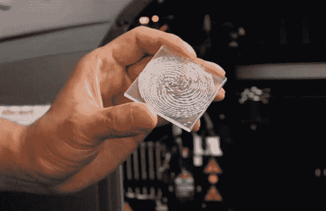
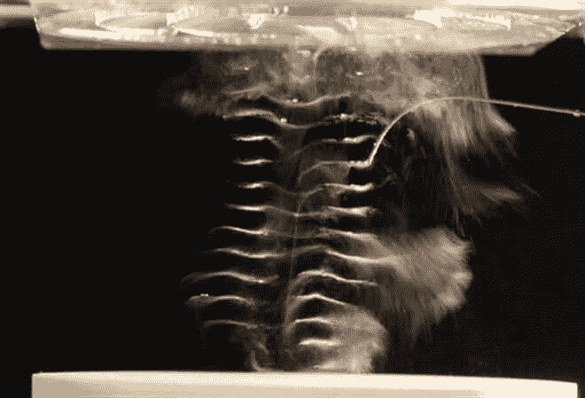

# 声学全息图将空气和水重塑成新的形式

> 原文：<https://thenewstack.io/scientists-3d-printed-acoustic-holograms-act-like-sonic-tractor-beams/>

德国斯图加特马克斯·普朗克智能系统研究所的一组科学家已经利用超声波作为运动的驱动力。他们使用带有复杂的 3d 打印图案的塑料块来扭曲声波的路径，创建所谓的“声学全息图”，沿着某个方向推动物体，例如水或空气。观看这个巧妙的实验:

[https://www.youtube.com/embed/z90FPL_PQ2Q?feature=oembed](https://www.youtube.com/embed/z90FPL_PQ2Q?feature=oembed)

视频

这项工作是一个被称为增材制造的新兴领域的最新成果，该领域使用三维打印来建造从[建筑](https://thenewstack.io/emerging-objects-3d-printing-pioneers-will-build-houses-salt/)到[假肢](https://thenewstack.io/robo-prosthetics-for-the-masses-is-a-future-ready-to-happen/)的一切。这些新技术被证明是科学的福音，允许研究人员做十年前不可能的疯狂事情，例如创建 3d 打印形式，以操纵声音的方式推动物体运动。

## 塑造三维声场

我们所熟悉的全息图本质上是光场的摄影记录，它投射这种编码信息以再现三维图像。全息技术还用于高密度数据存储，以及货币、护照和其他身份证明的防伪和安全目的。

这项研究发表在《自然》*上，详细描述了实验如何使用这些相同的概念和技术，但是利用声音而不是光。科学家们将这些扭曲的声波比作声波“牵引波束”，可以通过对物质施加无形的压力来作用于物质。*

 *为此，该团队首先必须进行一些计算，以找出声波需要“相移”的区域，以便施加更多的力来推动物体沿特定轨迹运动。这些相移被绘制成干涉图案，并使用 3d 打印机转换成脊状的三维物体，部署了一种比实验中使用的液体介质传播超声波更快的材料。

然后，3d 打印板被放置在特殊扬声器或“换能器”的顶部，这些扬声器或“换能器”通过液体介质发射超声波，形成在液体中可见的声场或声学全息图。这种全息场的运动推动物体，如视频中看到的小纸船，或者在不使用液体介质的情况下，可以将水滴悬浮在空气中。

## 简化复杂的方法

其他类似的实验探索了操纵声波的三维结构如何影响物质的运动。然而，这些以前的实验很复杂，需要一系列排列在科学家称为相控阵换能器中的声源。每个声音点都必须配置得恰到好处，以达到理想的声学形式领域。

相比之下，这个特殊的实验能够做同样的事情，但设置要简单得多。

该研究的主要作者 Peer Fischer 在 [LiveScience](http://www.livescience.com/56202-3d-printed-acoustic-holograms.html) 上说:“我们没有使用一套相当复杂和笨重的传感器，而是使用了一片价值几美元的 3d 打印机塑料。”

Fischer 指出，唯一的限制是实验中创建的声学全息图是静态的，不能像在相控阵换能器中那样在运行中改变。“虽然我们的技术不能动态地改变声场的三维结构，但它仍然可以引起动态运动，”他说。"我们感到惊讶的是，以前没有人提出过这个想法。"

“通过一种极其简单的方法，我们可以创造出极其复杂、精密的声场，否则很难实现，”费舍尔补充道。

虽然这个实验看起来只不过是科学客厅里的一个小把戏，但是这个发现可能会对未来产生巨大的影响。例如，研究人员认为这项技术可以用来完善超声波在医学诊断和材料测试中的应用。

声学全息图还可以用来雕刻精确的超声波场，例如，可以瞄准并杀死癌细胞，同时保持健康细胞完好无损。这些成形的声场还可以在不需要任何接触的情况下移动大量的微粒，让它们组装成更大更复杂的形式。虽然我们还远未达到像《星际迷航》中那样的牵引光束，但这项技术的最大优势在于它易于放大，这意味着我们可能离科幻小说变成现实更近了一步。

图片:马克斯·普朗克智能系统研究所和 YouTube。

<svg xmlns:xlink="http://www.w3.org/1999/xlink" viewBox="0 0 68 31" version="1.1"><title>Group</title> <desc>Created with Sketch.</desc></svg>*