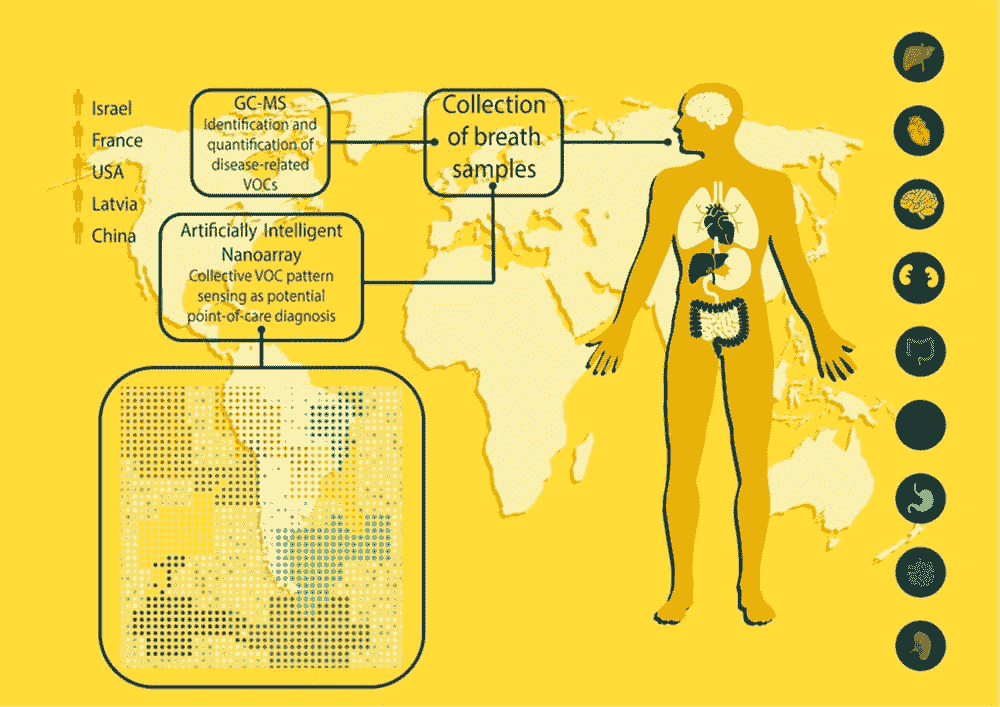
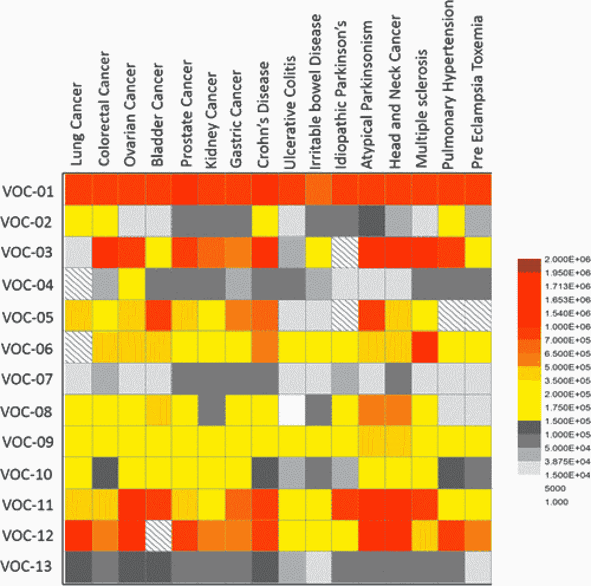

# 科学家的人工智能纳米阵列可以利用你的呼吸来诊断疾病

> 原文：<https://thenewstack.io/scientists-artificially-intelligent-nanoarray-can-diagnose-disease-using-breath/>

正如你可能知道的，呼吸让我们活着，氧气充足。但是我们的呼吸——或者至少是它的化学成分——也可能包含我们可能患有的任何疾病的线索。这是根据一个国际科学家小组开发的一种设备，该设备能够分析一个人的呼吸，以获得 17 种疾病的独特化学特征，使用由碳纳米管制成的“人工智能纳米阵列”。这一发现指出了一种更便宜、更快速、非侵入性的医学诊断方法，这种方法同样惊人地准确。

发表在*美国化学学会纳米*上的[研究](http://pubs.acs.org/doi/full/10.1021/acsnano.6b04930)描述了该团队如何筛选 1404 名健康或之前已被诊断患有疾病的参与者呼吸中的 13 种挥发性有机化合物(VOCs)的存在。利用这些信息，科学家们能够识别出肺癌、结肠直肠癌、卵巢癌和肾癌、肠易激综合征、多发性硬化症、先兆子痫和帕金森氏症等疾病的独特“呼吸痕迹”。观看科学家解释他们如何通过呼吸检测多种疾病:

[https://www.youtube.com/embed/1dhOaArOYdM?feature=oembed](https://www.youtube.com/embed/1dhOaArOYdM?feature=oembed)

视频

## 呼吸诊断学

令人惊讶的是，利用呼吸来诊断疾病的想法并不新鲜。希腊医生和现代医学之父希波克拉底早在公元前 400 年就指出了呼吸异常和疾病之间的联系，而古代的医生有时通过闻病人的呼吸、汗液或粪便来诊断疾病。

这种做法背后的科学非常简单:人类呼出气体的样本不仅包含氧气、氮气、二氧化碳和水蒸气的主要成分，还包含不同含量的挥发性有机化合物，这些化合物是人体代谢过程的副产品。

“这些疾病中的每一种都有一个独特的指纹，这意味着这 13 种化学成分的不同组成，”T2 以色列技术学院的教授 Hossam Haick 在视频中说。“正如我们每个人都有区别于他人的独特指纹一样，每种疾病都有区别于其他疾病和正常健康状态的化学特征。这些气味信号使我们能够使用我们开发的技术来识别疾病。”

呼气测醉器设备的[纳米阵列](http://www.encyclopedia.com/science/dictionaries-thesauruses-pictures-and-press-releases/nanoarray)由分子修饰的金纳米粒子层和碳纳米管制成的传感器网络组成。纳米阵列被设计成对呼吸样本中可能存在的不同挥发性有机化合物具有化学抗性。

用机器学习算法分析读数，该算法考虑了性别、年龄、吸烟习惯和地理位置等变量。使用[气相色谱](http://www.chemguide.co.uk/analysis/chromatography/gas.html)和[质谱](https://www2.chemistry.msu.edu/faculty/reusch/virttxtjml/spectrpy/massspec/masspec1.htm)来独立交叉验证纳米阵列的结果，该团队发现他们的设备总体准确率为 86%。

## 教系统识别“呼吸纹”

海克把纳米阵列比作狗的鼻子，把算法比作它的大脑。“我们可以教[人工智能]系统，一个呼吸印记可能与一种特定的疾病相关联，”海克在[Smithsonian.com](http://www.smithsonianmag.com/science-nature/your-bad-breath-doesnt-just-repulseit-can-also-reveal-disease-180961527/)上解释道。“它的工作原理和我们用狗来检测特定的化合物是一样的。我们把一些东西放在狗的鼻子上，狗会把这种化学混合物转换成电子信号并提供给大脑，然后在大脑的特定区域记忆下来。[..]这正是我们所做的。我们让它嗅出某种疾病，但我们用化学传感器代替鼻子，用算法代替大脑。将来，它可以像狗识别气味一样识别疾病。”

虽然该团队并不是第一个探索呼吸如何帮助诊断疾病的团队——最近还开发了一些用于识别糖尿病和黑色素瘤等单一疾病的呼气测醉器原型——但这是第一个开发出可以识别多种疾病的相对可靠的诊断工具的研究。

“这是一个新的、有希望的疾病诊断和分类方向，其特点不仅是相当准确，而且成本低、耗电低、小型化、舒适，并可以轻松重复测试，”海克说。

对于患者来说，这可能意味着远离更具侵入性的诊断程序，如活检，对于医疗保健提供者来说，这将意味着更容易使用，而不会严重影响准确性。早期诊断的机会增加了，因此总体上导致更健康的结果。

但也许该系统最大的优势在于，它还可以被训练用于非医疗应用，如嗅出爆炸物或检测何时食物不安全。无论如何，它有望成为有用的工具。

图片:ACS Nano

<svg xmlns:xlink="http://www.w3.org/1999/xlink" viewBox="0 0 68 31" version="1.1"><title>Group</title> <desc>Created with Sketch.</desc></svg>