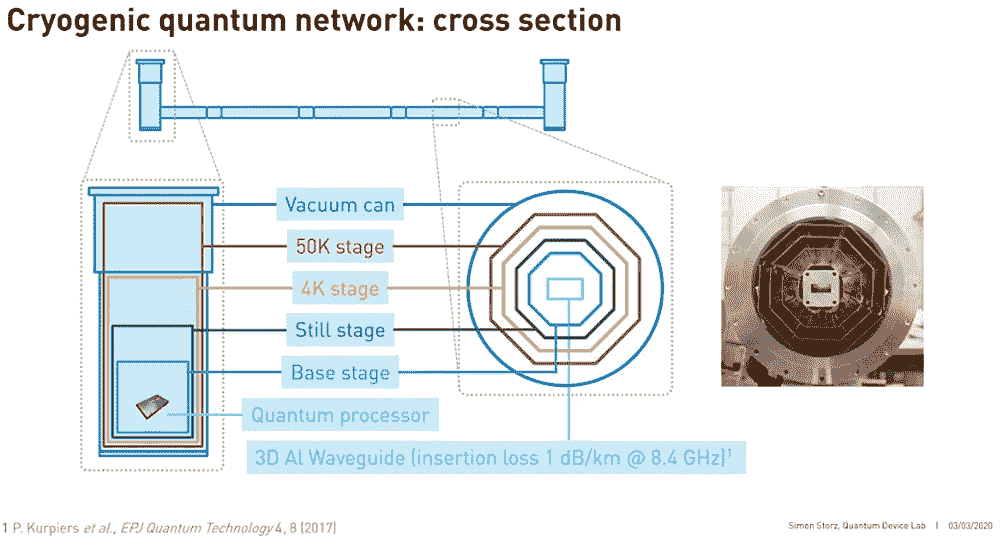

# 科学家创建长距离低温微波量子网络

> 原文：<https://thenewstack.io/scientists-create-a-long-distance-cryogenic-microwave-quantum-network/>

在过去几年中，量子计算引起了相当大的轰动，专家预测量子计算机将有助于满足人工智能日益增长的计算需求，并形成一个不可破解的互联网的主干。但是，除了大肆宣传之外，现实是量子计算机仍然离商业上可行的还有[一些路，因为研究人员继续解决诸如](/quantum-computings-challenging-liftoff-to-commercialization/)[准确性](/new-protocol-allows-noisy-quantum-computers-to-auto-assess-their-accuracy/)、[大小](/singapore-researchers-shrink-quantum-chips-to-the-size-of-an-integrated-circuit/)以及如何建立[安全量子网络](https://www.nature.com/articles/d41586-018-07129-y)等问题。

但在建立更大的量子网络之前，必须在单个量子设备之间建立量子“链接”，类似于一个小型传统计算机集群在局域网(LAN)中的连接方式。建立这种链接的一个主要障碍是，一些量子芯片中使用的[超导电子振荡器](https://en.wikipedia.org/wiki/Superconducting_quantum_computing)需要冷却到接近绝对零度的温度，否则就会出现[退相干](https://hackernoon.com/decoherence-quantum-computers-greatest-obstacle-67c74ae962b6)的问题，导致量子位(qubits)失去其特殊的量子属性，最终导致计算错误。

为了解决这个问题，来自瑞士苏黎世联邦理工学院量子设备实验室的一组研究人员最近展示了一条长达 10 米(32.8 英尺)的长距离量子链路。为了实现这一目标，该团队尝试了一种不同的方法:他们不是将量子芯片放在同一个稀释冰箱(一种提供连续冷却的低温设备)中，而是将芯片放在通过专用量子通道连接的独立稀释冰箱中。

“随着我们扩大量子计算机的规模，一种有用的资源可能是将不同的量子处理器在网络中相互连接，正如我们从经典计算机中所知的那样，”研究的合著者 Simon Storz 解释道。“所以芯片对芯片的量子通信是关键。这个方向的第一批实验，已经由几个小组进行量子态转移，并在不同的晶片间产生纠缠态。

“然而，到目前为止，所有这些实验都只在单稀释冰箱中进行，但我们认为，未来在单独的稀释冰箱中操作芯片将是有益的……[因为]在某种程度上，为单稀释冰箱增加更多的冷却能力将变得不切实际，我们也可能会遇到空间限制，”Storz 补充道。

该团队的模型有两个超导量子芯片通过微波光子进行通信，由一个超导振荡器发送，由另一个接收。微波光子通过一个波导——一个微小的中空金属结构，也必须经过超冷却，以最小化能量损失和任何潜在的量子扰动。

根据该团队的说法，每个量子芯片都在低温恒温器(一种用于稳定超低温的设备)中被冷却到绝对零度以上百分之几度，使用压缩和液体形式的氦。该团队的实验涉及一条 5 米(16.4 英尺)长的物理链路——其中心是铝波导——包裹在几层铜片中，作为低温恒温器不同冷却阶段的隔热板。科学家的方案是模块化设计，这意味着它可以通过增加更多的链接和稀释冰箱来轻松扩大规模。

为了证明量子链接确实可以在两个芯片之间发送信息而不会造成明显的数据丢失，研究小组将两个芯片置于“纠缠”状态，并进行测试以确保信息确实在传输。在量子纠缠的过程中，两个粒子以某种方式联系在一起，这样无论一个粒子发生什么，另一个粒子也会立即发生，无论距离远近。

在证明了基于低温的长距离量子网络确实是可能的之后，该团队现在正致力于构建一条 30 米(98.4 英尺)的量子链路。

[https://www.youtube.com/embed/cyoFv_rYTxA?feature=oembed](https://www.youtube.com/embed/cyoFv_rYTxA?feature=oembed)

视频

在苏黎世联邦理工学院的[量子设备实验室](https://qudev.phys.ethz.ch/)可以看到更多。

图片:苏黎世联邦理工学院

<svg xmlns:xlink="http://www.w3.org/1999/xlink" viewBox="0 0 68 31" version="1.1"><title>Group</title> <desc>Created with Sketch.</desc></svg>