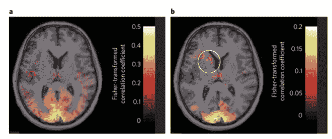

# 科学家创造基于人工智能的方法来无意识地对抗恐惧症

> 原文：<https://thenewstack.io/scientists-create-ai-based-method-unconsciously-combat-phobias/>

恐惧症会让人变得虚弱，无论是对昆虫的持续恐惧，对社交场合的焦虑，还是开阔的空间。恐惧症可以通过药物或心理治疗方法来治疗，如厌恶疗法，通过逐渐让患者接触他们的恐惧来脱敏。至少可以说，许多人觉得这种待遇非常令人不快。

但是可能有更简单的方法。来自剑桥大学、日本和美国的一组科学家最近试验了一种应对恐惧症的创新方法:通过使用人工智能算法和大脑扫描技术，无意识地从患者大脑中移除或减少恐惧记忆。

## 治疗恐惧而不引发它

作者在他们的研究中描述了他们如何开发一种他们称为“解码神经反馈”的技术来减少对某件事情或事件的恐惧，而不会触发实际的恐惧记忆本身。该方法依赖于首先在研究志愿者中创建一个“恐惧记忆”，当他们看到某个物体的计算机图像时，给他们轻微的电击，在这种情况下，是一个由彩色线条组成的圆圈。随着时间的推移，当他们习惯于对彩色圆圈产生恐惧反应时，他们的大脑活动被功能性磁共振成像机(fMRI)扫描和记录，以识别与这个圆圈的视觉认知相关的特定神经模式。

一旦看到这条彩色线的特定神经信号被确定，研究人员就在接下来的几天里继续消除受试者对圆圈的恐惧反应。他们通过使用人工智能图像识别技术来帮助他们识别志愿者在功能性磁共振成像中看到的大脑活动何时可能表现出先前记录的恐惧神经信号。

“信息在大脑中的表达方式非常复杂，但人工智能(AI)图像识别方法的使用现在允许我们识别信息内容的各个方面，”研究作者[剑桥大学](https://www.cam.ac.uk/)的 [Ben Seymour](http://www.neuroscience.cam.ac.uk/directory/profile.php?bseymour) 在 *[科学日报](https://www.sciencedaily.com/releases/2016/11/161121175251.htm)* 上解释道。“当我们在大脑中诱发轻度恐惧记忆时，我们能够通过使用人工智能算法开发出一种快速准确的读取方法。当时的挑战是找到一种方法来减少或消除恐惧记忆，而不是有意识地唤起它。”

一旦使用人工智能算法在志愿者的大脑中检测到特定恐惧的神经模式，科学家就会给受试者奖励，而不是电击，以“重写”恐惧记忆。奇怪的是，真正的恐惧并不一定要在意识中完全实现，才能从受试者的脑海中抹去。

“我们意识到，即使志愿者只是简单地休息，我们也可以看到大脑活动波动模式具有特定恐惧记忆的部分特征的短暂时刻，即使志愿者没有意识到这一点，”Seymour 说。“因为我们可以快速解码这些大脑模式，所以我们决定每当我们获得这些记忆特征时，就给受试者一份奖励——一小笔钱。”

在消除恐惧的阶段结束时，参与者再次看到彩色圆圈的图像。令人惊讶的是，他们之前对物体的条件恐惧明显减少了。

“值得注意的是，我们再也看不到典型的恐惧皮肤出汗反应。我们也不能确定杏仁核——大脑的恐惧中心——的活动增强了，”来自京都国际高级电信研究所和大阪信息和神经网络中心的 Ai Koizumi 说。“这意味着我们能够减少恐惧记忆，而志愿者在此过程中从未有意识地经历过恐惧记忆。”

该团队的下一步是进一步扩展他们的发现，通过开发一个“大脑信息代码库”，对看到某些物体的特定大脑模式进行编目。正是看到这些特定的物体可以引发恐惧反应，这个想法是将这些视觉记忆与奖励而不是负面体验重新联系起来，以重新训练患者的大脑。科学家们希望解码的神经反馈技术可以发展成为一种更有效的治疗恐惧症和创伤后应激障碍(PTSD)的方法，这样患者就不必承受目前基于药物或厌恶治疗的压力和副作用。

图片:[劳拉·路易斯](https://www.flickr.com/photos/lauralewis23/ "Go to Laura Lewis's photostream") ( [CC BY 2.0](https://creativecommons.org/licenses/by/2.0/) )，[自然人类行为](http://www.nature.com/articles/s41562-016-0006)。

<svg xmlns:xlink="http://www.w3.org/1999/xlink" viewBox="0 0 68 31" version="1.1"><title>Group</title> <desc>Created with Sketch.</desc></svg>