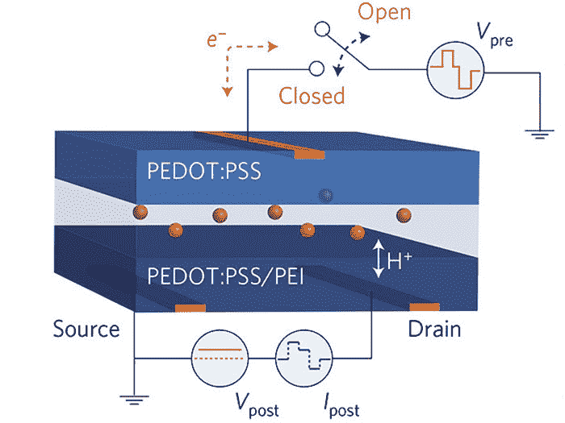

# 科学家为类脑计算创造“人造突触”

> 原文：<https://thenewstack.io/scientists-create-artificial-synapses-brain-like-computing/>

尽管过去几十年取得了令人难以置信的进步，微芯片逐年变得更小、更快、更便宜，但技术行业正在快速接近潜在的后[摩尔定律](https://thenewstack.io/farewell-moores-law/)情景，即每两年翻一番的计算能力最终将受到公司可以在芯片的纳米尺寸中塞进多少晶体管的阻碍。因此，这些公司中的一些投资于像[神经形态计算](https://en.wikipedia.org/wiki/Neuromorphic_engineering)这样的替代品是有道理的，在那里芯片被制造来更有效地执行计算，就像人脑一样。

斯坦福大学(Stanford University)和美国能源部桑迪亚国家实验室(Sandia National Laboratories)的研究人员最近将这种可能性推向了现实，他们开发了一种“人造突触”，模仿人脑中突触可能运行、处理和存储记忆的节能方式。这种柔性元件有朝一日可能成为连接人脑和计算机的接口的一个组成部分，同时比传统的硅基微芯片消耗更少的能量。

“它的工作方式像一个真正的突触，但它是一个可以设计的有机电子设备，”斯坦福大学材料科学与工程副教授兼论文高级作者阿尔贝托·萨莱奥解释道，该论文发表在《自然》杂志上。“这是一个全新的设备系列，因为这种类型的架构以前从未展示过。对于许多关键指标来说，它的表现也优于以前用无机物做的任何事情。”

根据研究结果，该设备是一种有机晶体管，研究小组称之为电化学[神经形态](http://spectrum.ieee.org/automaton/robotics/artificial-intelligence/analog-and-neuromorphic-chips-will-rule-robotic-age)有机设备(ENODe)。该设备由廉价的有机材料制成，主要是氢和碳，旨在与人脑兼容。

## 受人类大脑的启发

计算的神经形态方法受到人类大脑工作方式的启发。在生物大脑中，当学习某些东西时，电脉冲通过突触从一个神经元流向另一个神经元，突触包括由神经递质组成的突触前末端和具有这些神经递质受体位点的突触后末端。在这些突触前和突触后末梢之间存在一个小间隙或突触间隙。当这些脉冲在神经元之间第一次交叉时，需要的能量最多。之后，需要更少的能源，从而产生一种节能且适应性强的模型。

人类大脑也不同于传统的冯诺依曼架构，信息的处理 T2 创造了记忆，而不是信息的条块化处理，然后将其存储在记忆中。模仿生物突触功能的人工突触可能对人工智能的未来发展具有重大意义。

“深度学习算法非常强大，但它们依赖处理器来计算和模拟电状态，并将它们存储在其他地方，这在能量和时间方面效率低下，”论文的主要作者 Yoeri van de Burgt 指出。“我们的工作不是模拟神经网络，而是试图制作一个神经网络。”

## 500 个州

有趣的是，该团队对人工突触的设计类似于电池，利用薄聚合物膜，三个端子通过含盐液体连接。质子流经这些末端，这些末端类似于生物突触的突触前和突触后末端。与只能以 1 或 0 状态存在的数字晶体管不同，该团队能够将 500 种导电状态编程到他们的人工突触中，所有这些状态都在大约 1 伏的范围内，只有大约 0.5 毫伏的电压才能在状态之间切换。这大约是传统硬件的十分之一。然而，人造突触仍然比其生物对应物多使用约 10，000 倍的能量。

当在模拟神经网络的模拟中进行测试时，人工突触证明它可以识别 0 到 9 的手写数字，准确率高达 97%。该团队现在计划制造更多这样的设备，并用其他数据集在阵列中测试它们。

不可否认，使用人工突触与功能性人类神经元进行交互的可能性仍有一些路要走，但这是另一项发展，为硅基计算提供了一种有前途的替代方案。至少，这些人工突触可能是计算机的一个组成部分，其功能更像人脑，这可能有助于在自动驾驶汽车的语音控制界面等应用中加速更好地处理视觉和听觉数据。鉴于无人驾驶汽车仍有可能发生事故，让车载系统变得更高效、反应更灵敏无疑将是一项受欢迎的改进。

图片:斯坦福大学

<svg xmlns:xlink="http://www.w3.org/1999/xlink" viewBox="0 0 68 31" version="1.1"><title>Group</title> <desc>Created with Sketch.</desc></svg>