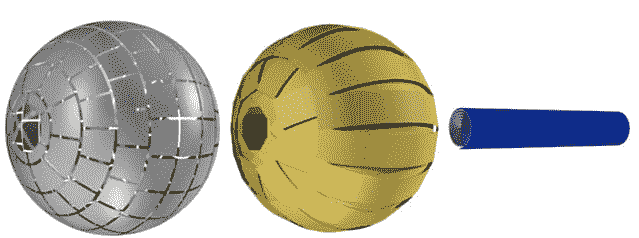
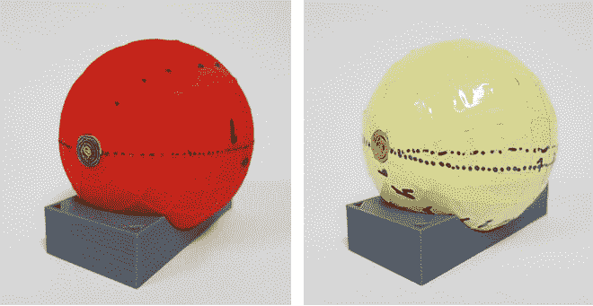
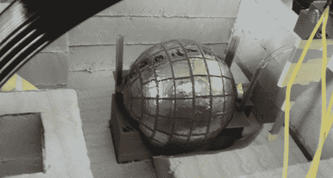

# 科学家创造“虫洞”使磁场不可见

> 原文：<https://thenewstack.io/scientists-create-wormhole-renders-magnetic-fields-invisible/>

科幻迷可能对[虫洞](http://www.space.com/20881-wormholes.html)很熟悉，这些穿过时空结构的捷径让《星际迷航》等热门电视剧中的角色能够在眨眼之间在太空中进行长距离旅行。尽管像阿尔伯特·爱因斯坦这样的科学家已经从数学上预测了虫洞，但虫洞目前只存在于理论中，因为我们还没有真正找到一个。

但这个小细节并没有阻止西班牙巴塞罗那自治大学的研究人员开发一种设备，产生他们所谓的“磁性虫洞”。从技术上来说，它不是一条连接时空地形上两个不同点的通道，而是一条穿过空间的无形磁场“隧道”。研究合著者乔迪·普拉特-坎普斯[解释道](http://www.livescience.com/51925-magnetic-wormhole-created.html):

> 这种设备可以将磁场从空间中的一点传输到另一点，通过一条磁性不可见的路径。从磁学的角度来看，这个装置的作用就像一个虫洞，就好像磁场是通过一个额外的特殊维度转移的。

这项研究最近发表在“[科学报告](http://www.nature.com/articles/srep12488)”上，扩展了 2007 年的一项研究，该研究介绍了基于光的“隐形”设备的可能性，这种设备可以隐藏电磁波，使其无法被检测到。

## 超材料制成的磁性斗篷

为了完成以前看起来不可能的任务，西班牙研究人员描述了他们如何采取另一种方法来解决这个问题，用[超材料](https://en.wikipedia.org/wiki/Electromagnetic_metasurface)和[超材料](https://en.wikipedia.org/wiki/Metamaterial)——具有自然界中通常不存在的属性的工程材料——构建了一个小工具:“我们没有[基于[转换光学](https://en.wikipedia.org/wiki/Transformation_optics)设计虫洞，而是利用磁性超材料为形成静态磁场提供的可能性。磁性材料自然存在，具有从零(超导体)到有效无穷大(铁磁体)的极端磁导率值，以及许多中间值。由它们的不同组合构建的超材料已经实现了磁性斗篷和其他塑造磁场的设备。”

该实验使用铁磁性金属制造了一种“磁性软管”，由一片高磁导率的μ金属组成，以螺旋的圆柱形形式折叠起来。

【T2

将磁场从一端传送到另一端的软管被包裹在两个球体中，这两个球体一起工作来掩盖磁场的活动。内部球体由超导钇钡铜氧材料(黄色)制成，当磁场通过软管时会扭曲磁场。第二层，外部球形层由铁磁高导金属薄板(见灰色)制成，类似于用于屏蔽电子设备的薄板，其排列方式有效地抵消了超导壳产生的任何磁失真。

由于高温超导体需要低温才能工作，所以在操作之前，该装置被浸入液氮浴中。在测试过程中，看起来好像磁场不知从哪里进入、消失和重新出现，其通道是隐藏的，但最终磁性地连接了两个空间区域。

虽然实验没有在遥远的目的地之间传输物质，但这些显然孤立的“孤立磁单极子”并不是自然发生的，这促使科学家们将阿尔伯特·爱因斯坦和纳森·罗森提出的引力虫洞进行类比。首席研究员 lvar Sánchez 说，就像这些假设的时空桥一样，这个设备似乎“改变了空间的拓扑结构，就好像内部区域被从空间中磁性抹去了一样”。

虽然磁性虫洞可能看起来不像它的理论堂兄那样令人兴奋，但研究人员认为磁性隐形设备可能是有用的。例如，它们可以进一步发展成为更先进、更少幽闭恐惧症的磁共振成像(MRI)机器，在这种机器中，患者不需要被封闭在外壳内进行扫描。相反，患者的诊断图像可以在一个开放的空间，使用一段距离外的强磁体拍摄。因此，虽然我们还没有发现也没有创建一个真正的虫洞，但除此之外，毫无疑问，这一新发现将产生许多其他无法预见的应用和深刻的见解，潜在地为更深入地了解我们的宇宙可能如何工作铺平了道路。更有西班牙巴塞罗纳自治大学和“[科学报道](http://www.nature.com/articles/srep12488) *”*

图片:科学报告。

<svg xmlns:xlink="http://www.w3.org/1999/xlink" viewBox="0 0 68 31" version="1.1"><title>Group</title> <desc>Created with Sketch.</desc></svg>