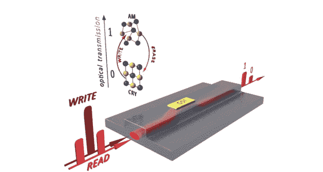

# 科学家开发出能永久存储数据的光存储芯片

> 原文：<https://thenewstack.io/scientists-develop-light-based-memory-chip-can-store-data-permanently/>

科学家开发了一种芯片，它使用光子而不是电子，以闪电般的速度携带和存储数据。我们所知的计算会永远改变吗？

专家指出，现代计算机架构很快将达到设计极限，无论是由于硅基半导体的限制，还是电子在计算机处理器和内存之间传输数据时碰撞产生的相对较慢的速度和热量。即使使用多核处理器，由于 CPU 和数据内存之间的共享总线，数据仍然不能足够快地传输，这种限制现象被称为[冯诺依曼瓶颈](https://en.wikipedia.org/wiki/Von_Neumann_architecture#Von_Neumann_bottleneck)。

但是，如果电子被速度极快的光子所取代，这一切都可能发生变化——无论是作为处理器和存储器之间传输数据的方式，还是作为一种存储方法。先前的实验表明，基于光的存储芯片是可能的，但问题在于数据存储本身，因为光存储器可能是“易失性的”，因为它通常需要持续的电力来存储数据。关掉电源，你就会丢失数据。

现在，牛津大学、明斯特大学、卡尔斯鲁厄理工学院和埃克塞特大学的科学家似乎在解决这一困境方面迈出了重要一步。在《自然光子学》上发表的一项[研究](http://www.nature.com/nphoton/journal/vaop/ncurrent/full/nphoton.2015.182.html)中，他们描述了他们所谓的世界上第一个“全光子、非易失性、多级”存储芯片，使用锗-锑-碲(Ge2Sb2Te5 或 GST)相变合金材料——这种材料用于可重写 CD 和 DVD。

## 使用多种波长的光

它是这样工作的:一小块 GST 被放在一个叫做“波导”的氮化硅脊上。波导的作用就像光纤电缆，它携带的光脉冲会导致 GST 改变状态。强脉冲光将导致 GST 轻微熔化，并呈现无序的“无定形”结构状态，而弱脉冲光将导致 GST 呈现更有序的“结晶”状态。当另一个低功率光脉冲通过波导发送时，这些状态的差异可以被测量并转换为“开”或“关”——类似于二进制的“一或零”系统。

更有趣的是，该团队使用了“[波长复用](https://en.wikipedia.org/wiki/Wavelength-division_multiplexing)”，其中不同波长的光同时通过波导发送，以允许数据同时读取由一个光脉冲写入的*和*。理论上，这意味着可以同时读写数千位，提供几乎无限的带宽，并有可能消除瓶颈问题。

## 可能有八种状态

这种同时性不仅会大大加快速度，研究人员还发现，不同强度的重复强光脉冲可以在 GST 内建立非晶态和晶态的混合——确切地说，是八种可区分的组成状态。这是从二进制数据存储系统中发现的双态限制的巨大飞跃，并可能意味着几个状态可以同时存储在一位存储器中。此外，该团队假设计算甚至可以由内存本身执行，而不是必须发送到处理器。

除了这些改进之外，这种新型光学存储器的其他重要优势包括:不需要持续供电来将数据永久保存在存储器中，并且它使用了一种寿命相对较长的材料，这种材料有几十年的研究历史。

“这是一种使用现有材料的全新功能，”牛津大学教授 Harish Bhaskaran 解释道，他也是这项研究的负责人之一。“这些光比特可以以高达 1 千兆赫的频率写入，并可以提供巨大的带宽。这就是现代计算需要的那种超高速数据存储。”

当然，仍有一些问题需要解决。虽然该团队的原型非常小，只有一平方微米，但与硅芯片的小得多的组件相比，这是巨大的。但该团队并不气馁，他们正在努力缩小光子芯片，此外还开发了一种新的光电互连，使用光而不是电子直接将其与其他计算机组件相连接。如果该团队取得成功，它可能会开创一个光速计算的新时代，这些光子存储芯片和处理器的运行速度将比今天的版本快 50 至 100 倍，这意味着已经存在的巨大电子数据海洋无疑将达到更高的难以想象的信息增长和传输速度。

在[牛津大学](http://www.ox.ac.uk/news/2015-09-21-light-based-memory-chip-first-ever-store-data-permanently)和[自然光子学](http://www.nature.com/nphoton/journal/vaop/ncurrent/full/nphoton.2015.182.html)阅读更多信息

图片:牛津/明斯特/基特/埃克塞特。

<svg xmlns:xlink="http://www.w3.org/1999/xlink" viewBox="0 0 68 31" version="1.1"><title>Group</title> <desc>Created with Sketch.</desc></svg>