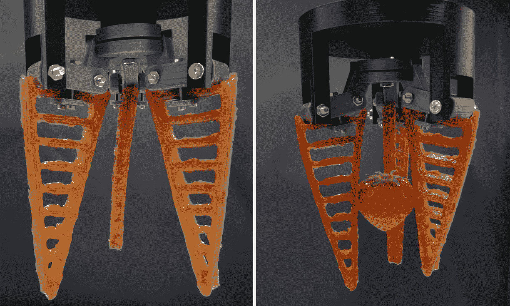

# 科学家开发能“感觉”疼痛的自愈软体机器人

> 原文：<https://thenewstack.io/scientists-developing-self-healing-soft-robot-that-can-feel-pain/>

对于我们大多数人来说，机器人的概念就是某种被编程来执行特定任务的金属机器。但是，下一代机器人很可能不会是我们已经非常熟悉的刚性装置——相反，它们很可能是由柔软、柔韧的材料制成的机器，使它们能够在办公室、[手术室](/autonomous-robot-surgical-cuts-better-human-surgeon/)以及学校和[酒店](/hotel-run-entirely-robots-opens-japan/)等各种机构中与人类一起安全工作[，而不会有用硬边肢体伤害人类的风险。](/collaborative-robots-will-help-human-workers-not-replace/)

然而，正如人们可能想象的那样，用更软的材料制造机器人的另一面是它们更容易损坏。更具挑战性的是创造出不仅能“感觉”疼痛、察觉受伤、还能自我修复的机器人。

虽然建造“自我修复”机器人的想法听起来有点遥不可及，但这正是来自剑桥大学、布鲁塞尔大学(VUB)、高等物理与化学工业学院(ESPCI)、瑞士联邦材料科学与技术实验室(Empa)和荷兰聚合物制造商 SupraPolix 的研究人员组成的财团正在着手做的事情。他们的目标是创造软机器人，当它们被损坏时，不仅可以“感觉”，还可以在没有人类帮助的情况下自我修复。看一看:

[https://www.youtube.com/embed/jE7JyMmgZ8Q?feature=oembed](https://www.youtube.com/embed/jE7JyMmgZ8Q?feature=oembed)

视频

该项目被命名为 [SHERO](http://www.sherofet.eu/project/) (自我修复软机器人的简称)，最近从欧盟委员会获得了€300 万英镑(3，363，228 美元)的资金，并计划将材料科学的最新前沿研究与人工智能相结合。目的是解决修理机器人时成本不断上升的问题，特别是当它们无法自我修理，因此必须依靠人工来检查和修理时。根据研究人员的说法，替换机器人零件的市场相当于比利时的 GDP，或约 4000 亿美元。因此，通过首先用“智能”的自我修复材料制造机器人来降低成本是有意义的，这种材料即使在受损后也可以保留大部分原始属性——无论是通过重建结构完整性(如切割后可以闭合的材料)，还是通过恢复某些功能，如传感和驱动。

“在过去的几年里，我们已经在为机器人创造自我修复材料方面迈出了第一步，”VUB 教授和项目负责人 [Bram Vanderborght](http://mech.vub.ac.be/multibody/members/bram.htm) 在[的一份声明](https://www.cam.ac.uk/research/news/machine-learning-to-help-develop-self-healing-robots-that-feel-pain)中解释道。“通过这项研究，我们希望继续，最重要的是，确保在我们的工作环境中使用的机器人更安全，也更可持续。由于这种新型机器人的自我修复机制，复杂、昂贵的维修可能会成为过去。”

一个 3D 打印的自我修复、柔软的机器人手爪抓着一个草莓。

这个想法将是开发一个“智能控制”系统，通过算法指导软机器人暂停工作，以便“休息和康复”，从而防止进一步的损害。柔性传感器和致动器将被集成到现有的自修复聚合物材料中，这种材料将能够感测应变，然后在特定点触发自修复过程，当超过一定的力阈值时。

“我们将使用机器学习来研究这些自修复材料的建模和集成，包括自修复致动器和传感器、损伤检测、定位和受控修复，”剑桥大学研究员托马斯·乔治·瑟鲁特尔补充道。“最终目标是将自修复传感器和致动器集成到演示平台中，以便执行特定的任务。”

正如研究人员指出的那样，在未来，自我修复机器人也有可能对模块化机器人的设计和实施产生重大影响，这些模块化机器人可以很容易地“回收”成更新的原型，有可能转化为更低的运营成本和更高的长期可持续性。自我修复机器人也可能对[进化机器人](https://en.wikipedia.org/wiki/Evolutionary_robotics)的发展产生重大影响，达尔文的“适者生存”概念被应用于自主机器人，使用计算算法使人工智能机器能够一次又一次地动态优化自己，而无需任何人类干预。如果这听起来像是自然对生物有机体的固有行为，那么它会让人想知道，当我们从过去的机器人转向自主的人工有机体时，人类和机器之间的定义线可能是什么，这些人工有机体不仅可以独立思考，还可以感受疼痛，自我治愈，自我繁殖和进化。

图片:剑桥大学和布鲁塞尔大学。

<svg xmlns:xlink="http://www.w3.org/1999/xlink" viewBox="0 0 68 31" version="1.1"><title>Group</title> <desc>Created with Sketch.</desc></svg>