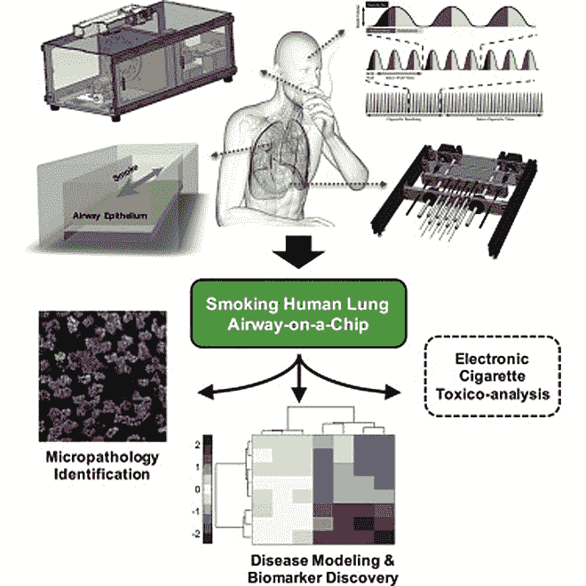
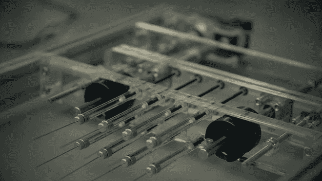
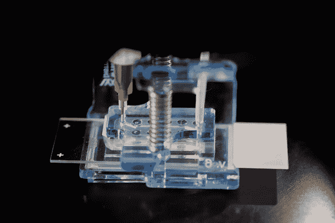

# 科学家在连续吸烟机器上插入“芯片肺”来研究肺部疾病

> 原文：<https://thenewstack.io/scientists-insert-lung-chip-chain-smoking-machine-study-lung-disease/>

随着机器人革命的继续，它促使许多人思考机器人接管工作的可能性，尽管很明显，机器人辅助的未来已经在这里了。尽管如此，机器在某些领域胜过人类也有一些非常引人注目的好处。

首先，以医学研究为例。目前的研究方法有其局限性:像动物试验和细胞培养这样的做法可能既耗时又昂贵，而且在忠实地捕捉人体内复杂的动态方面不是很有效——这就是特别设计的机器可能是答案的地方。

这种新型研究的一个例子可以在所谓的[芯片上器官](https://thenewstack.io/organs-on-chips-emulates-human-organs-for-better-biomedical-testing/)中找到——这种设备生物模拟人体器官如肝脏、心脏和肺的机械和生化属性。在最近发表在 [*Cell Systems*](http://www.cell.com/action/showMethods?pii=S2405-4712%2816%2930322-2) 的一篇论文中，哈佛大学 [Wyss Institute](https://wyss.harvard.edu/) 研究吸烟长期影响的一组科学家描述了他们用配备有“芯片肺”的自动吸烟机进行的实验，这种芯片肺排列着真正的人肺细胞。这台机器还被设计成能像人一样呼吸和吸烟——一次最多 10 根——甚至能自己点烟。

那么，为什么不依靠动物试验或细胞培养，而要大费周章地制造这种一根接一根吸烟的机器呢？虽然众所周知，吸烟是肺部疾病的主要原因，但准确模拟吸烟相关疾病的负面影响比人们想象的要困难得多。使用来自人类肺部的材料的传统细胞培养可能是一个开始，但这些静态细胞培养不会模拟香烟烟雾填充整个肺部的整体效果，因为它在深呼吸时动态移动，从香烟中吸了一大口。在像老鼠这样的动物实验对象身上测试吸烟的影响并不一定与人类的情况相似，因为老鼠用鼻子呼吸，对吸烟的负面影响有不同的生理反应。

该团队的吸烟机器人不仅能够自己点燃，它还拥有一个可编程的“微型呼吸器”，可以密切模仿人类肺部吸入和呼出的不同强度，因为它会吸入香烟烟雾和新鲜空气的间隔，使其流过片上肺。

微型呼吸器吸入新鲜空气和烟雾，就像一个肺一样，流经芯片上的肺。

这项研究的“呼吸肺芯片”是利用从计算机芯片制造商那里借来的技术制造的。该芯片有一个中空的微通道，其中填充了取自健康肺部或慢性阻塞性肺病(或 COPD——包括慢性支气管炎和肺气肿在内的肺部疾病)患者的活体细胞。由多孔膜隔开的是另一个相邻的通道，它携带细胞培养基来滋养肺细胞长达四周，创造了与人类肺中真实气道非常相似的动态。

芯片肺。

“该设备首次使我们能够比较正常人和慢性阻塞性肺病患者在暴露于通过体外生理呼吸产生的香烟烟雾之前和之后的人类小气道组织的反应，”Wyss 创始董事兼研究负责人 [Donald Ingber](https://wyss.harvard.edu/team/executive-team/donald-ingber/) 解释道。“我们现在可以开始破译哪些细胞类型、细胞功能和基因有助于正常肺中以及个体患者慢性阻塞性肺病恶化期间的烟雾诱导损伤，从而确定常见的以及患者特异性的疾病因素。”

更好的是，像电子烟这样的新产品，可以使用相同的概念更准确地测试潜在的毒性，而科学家不必承担以某种方式训练实验室动物 vape 的尴尬任务。目前，电子烟是人们寻找癌症棒替代品的热门产品。

多亏了这个简单的吸烟机器人和它的微型芯片肺，吸烟方式的变化(喷烟时间、烟量等)。)可以得到更好的控制，以便让科学家们在与吸烟相关的疾病出现时关注生物标记、长期影响以及有朝一日可能针对个体患者的有效治疗。

Ingber 解释说:“这项技术的强大之处在于，它允许我们直接分析刺激对肺部的影响，在这种情况下，烟雾暴露可以被认为是一项体外人类‘临床前’研究。“在标准的人类临床研究中，很难做到这一点，因为所有的患者都有不同的历史，背景和暴露于刺激的模式。”

像这样的实验促使我们重新思考医学研究在未来会是什么样子，帮助我们摆脱相对不太精确和不太人道的方法，如动物试验。此外，我们还可以期待有一天 Wyss 的科学家们将开发出一种所谓的“芯片人体”，这是一种将模仿人体工作方式的芯片器官连接系统，有望开创医学研究的新时代。

图片:威斯研究所

<svg xmlns:xlink="http://www.w3.org/1999/xlink" viewBox="0 0 68 31" version="1.1"><title>Group</title> <desc>Created with Sketch.</desc></svg>