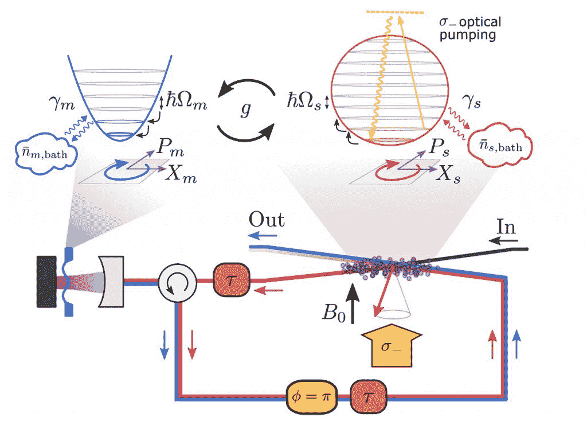

# 科学家试图在不测量的情况下控制量子态

> 原文：<https://thenewstack.io/scientists-look-to-control-quantum-state-without-measuring-it/>

构建实用的量子设备是一个重大挑战，因为量子系统本质上是不可预测和难以控制的，因为量子系统中的物体被认为既是粒子又是波，这与经典系统不同。

巴塞尔[大学](https://www.unibas.ch/en.html)的[瑞士纳米科学研究所](https://nanoscience.ch/en/)的研究人员正在研究如何解决这些问题，通过利用薄膜和原子云之间的量子力学相互作用，将整个量子系统冷却到目标状态——所有这些都不需要实际测量它，也不需要导致系统去聚焦。

特别是，该团队的工作集中在一种称为[相干控制](https://en.wikipedia.org/wiki/Coherent_control)的技术上，这种技术使用激光脉冲来控制量子系统。一致控制的过程是基于[控制理论](https://www.britannica.com/science/control-theory-mathematics)的原理，这是一个工程领域，涉及设计将动态系统驱动到期望状态的方法。

想想巡航控制系统，甚至温度计如何工作:测量初始状态，将结果反馈到系统中，并与目标值进行比较，然后修改系统以满足目标状态。但是在量子系统中，这样的控制反馈回路将不起作用，因为仅仅测量量子系统中的一些东西就会改变它的状态，导致一些不期望的叫做[退相干](https://www.informationphilosopher.com/quantum/decoherence/)的东西，并且还会导致不期望的[反作用](https://qsm.quantumtinkerer.tudelft.nl/6_backaction/)回波及到系统，从而影响系统达到期望状态的能力。

正如研究小组在他们最近发表在*Physical Review**X*上的[论文](https://journals.aps.org/prx/pdf/10.1103/PhysRevX.12.011020)中概述的那样，他们在实验中使用了纳米机械氮化硅膜和铷原子云。该团队使用了一种被称为[相干反馈](https://en.wikipedia.org/wiki/Quantum_feedback)的原理来控制整个系统。

“在相干反馈中，一个量子系统通过与另一个系统的相互作用来控制，以这种方式保持量子相干性，”该团队解释说。与基于测量的反馈相比，相干反馈不依赖于测量，因此避免了相关的反作用和消相干

该团队首先通过将系统中的原子冷却到几乎绝对零度，使它们的自旋排列在同一方向。相比之下，超薄薄膜在相对较高的温度下剧烈振动，起到一种机械振荡器的作用。

原子和薄膜之间的量子力学相互作用意味着它们最终会交换状态，这导致薄膜在几分之一毫秒内从室温冷却到-272.95 摄氏度——或接近绝对零度——因为能量从薄膜转移到原子。然后，使用受控的激光脉冲将这些原子返回到它们的初始状态。

光如何被用来耦合原子自旋和膜的示意图。光首先与自旋相互作用，然后与膜相互作用，再与自旋相互作用。

研究人员指出，他们实现相干反馈的改进方法似乎比以前的研究更有效:“以前的实验将膜与冷原子的运动相耦合，缺乏对原子的强耦合和相干控制。相比之下，我们的强耦合自旋膜系统允许我们实现更精细的相干控制方案。”

研究小组指出，仍然有一些问题需要解决，例如两个量子系统之间相对较大的距离导致的时间延迟，即使激光以光速传播。即使延迟很小，也会对反馈产生影响，从而使系统不稳定。

对于未来的工作，该团队表示，他们的冷却方法可以进一步优化，以带来更有效的结果。他们还强调，他们的方法有可能被推广并应用于其他问题，可能为新型传感器和量子网络铺平道路。

“我们的相干反馈冷却方案是一种相当通用的技术，可以应用于任何具有强光物质界面的物理系统，”该团队说。这包括光腔机械系统或没有光腔的机械振荡器。此外，利用耦合到固态自旋系统的机电振荡器，可以在微波域中实现类似的冷却方案。反馈控制器和目标系统之间的宏观距离使得模块化控制方案类似于电气工程中的经典反馈。这为在量子网络中使用相干反馈控制开辟了新的可能性。”

量子技术有可能彻底改变目前正在使用的许多技术。基于量子技术的未来方法有望[加速计算](https://thenewstack.io/quantum-switchable-qubit-quickly-flips-between-storage-and-fast-calculation-modes/)和[机器学习](https://thenewstack.io/machine-learnings-next-frontier-quantum-computing/)，并使[通信系统](https://thenewstack.io/scientists-adapt-1930s-radio-tech-help-build-unhackable-quantum-internet/)更加安全。这些研究人员的工作使这项技术更加接近商业化。

更多阅读团队[论文](https://journals.aps.org/prx/pdf/10.1103/PhysRevX.12.011020)。

<svg xmlns:xlink="http://www.w3.org/1999/xlink" viewBox="0 0 68 31" version="1.1"><title>Group</title> <desc>Created with Sketch.</desc></svg>