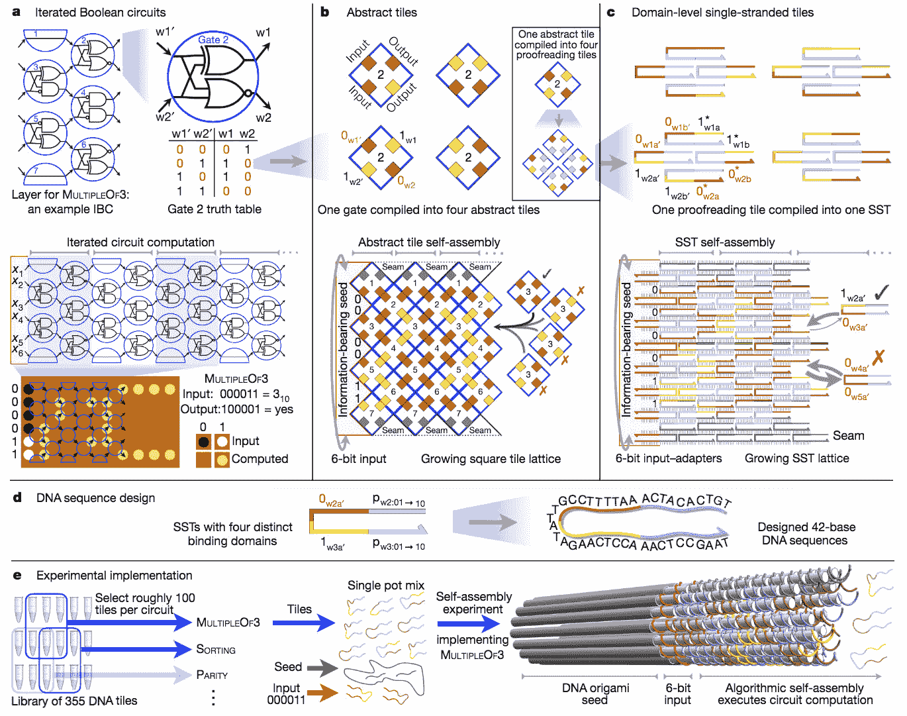
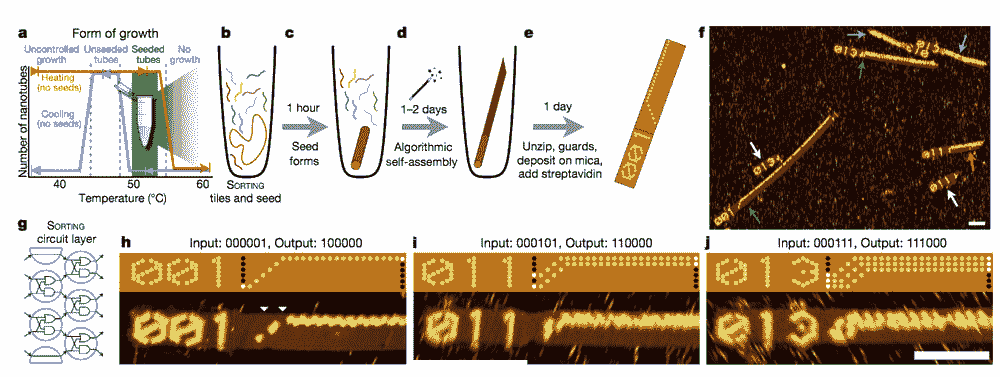
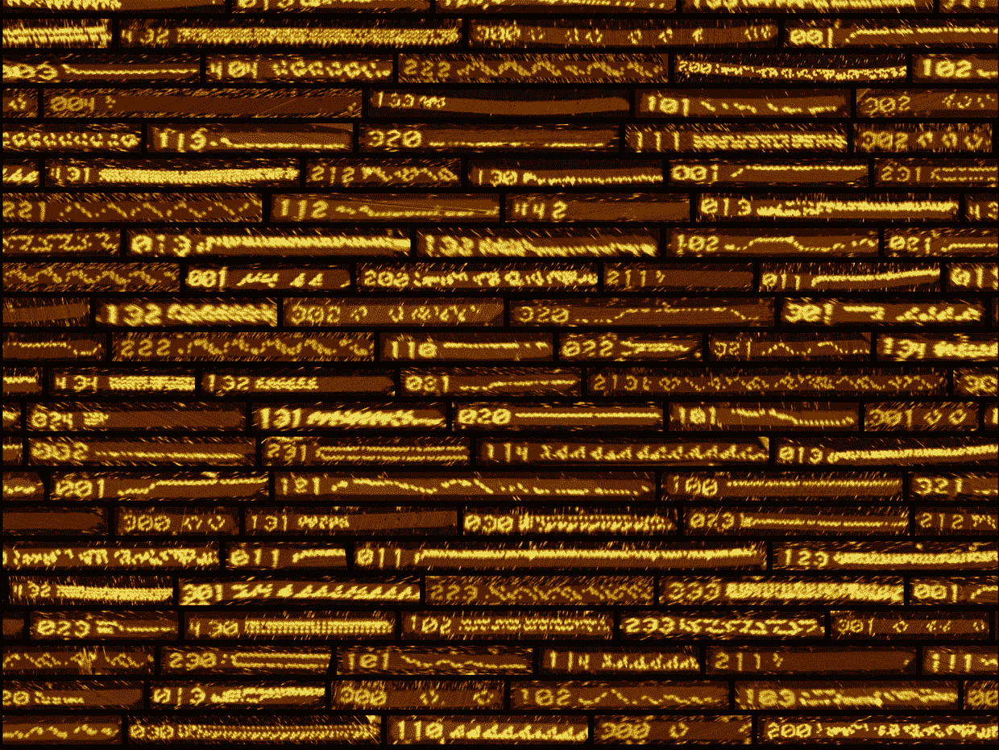

# 科学家利用 DNA 创造出世界上第一台可重新编程的分子计算机

> 原文：<https://thenewstack.io/scientists-use-dna-to-create-worlds-first-reprogrammable-molecular-computer/>

向大自然寻求设计灵感的实践——或者更广为人知的是[仿生学](https://en.wikipedia.org/wiki/Biomimetics)——在各种地方都有体现。在尖端技术的世界里，大自然解决工程问题的非凡能力在为自动驾驶汽车改编[蜂群技术中熠熠生辉；基于变形虫和蠕虫的光滑、无定形的](https://thenewstack.io/how-bumblebees-may-help-smart-cars-drive-themselves/)[表面机器人](https://thenewstack.io/nasa-creating-slitherly-bladder-bots-explore-harsh/)；还有像鸟一样的可折叠无人机，它们可以把自己挤进狭小的角落。

正如人们可能预料的那样，人们也可以从自然和分子生物学中汲取教训，帮助解决硅基硬件现在面临的计算挑战。像它的仿生对应物一样，[生物计算机](https://thenewstack.io/amoeba-based-computer-solves-traveling-salesman-puzzle/)可能是硅硬件限制的一个潜在解决方案。然而，迄今为止设计的大多数 DNA 计算机都非常简单，从某种意义上来说，它们只能解决为其量身定制的一个任务，而不能被重写来解决其他问题。

也就是说，直到现在。来自加州理工学院、哈佛大学、牛津大学、加州大学戴维斯分校和 Maynooth 大学的一个跨学科科学家团队最近创造了世界上第一台可重新编程的 DNA 计算机，其中相同的化学“硬件”可以重新配置以运行不同的“软件”程序。梅努斯大学计算机科学教授、该研究的主要作者之一达米恩·伍兹解释道

[https://www.youtube.com/embed/GV5wiGIC8Kg?feature=oembed](https://www.youtube.com/embed/GV5wiGIC8Kg?feature=oembed)

视频

## 多用途分子计算机

该团队的论文最近发表在《自然》 杂志上，详细描述了他们如何在盐溶液中使用特殊设计的 DNA 链作为他们工作的基础。这些 DNA 链类似于计算机微芯片上的晶体管和二极管，但它不是使用电流进行计算，而是使用分子及其固有的属性[分子自组装](https://en.wikipedia.org/wiki/Molecular_self-assembly)来执行任务。换句话说，形成这些 DNA 链的分子将逐渐粘附在一起，以构建越来越大的逻辑电路，随着每条链的添加，部分计算将同时执行。

然而，为了让该系统成为一个能够重新编程的多用途系统，科学家们不得不打破常规。为了实现这一目标，他们创建了一组 355 个模块化的单链 DNA“瓦片”——旨在实现基于 6 位系统的算法(使用 6 个 1 和 0 的可变序列)。

这种设计的美妙之处在于，这些 DNA 瓦片可以层层叠加并相互连接，以完成计算，编织一种纳米尺度的 DNA“围巾”，由此产生的图案指示输出。为了对“计算机”重新编程以解析其他算法，使用了组成该系统的可能 700 条 DNA 链中的一个不同的子集。

完整 6 位 DNA 切片集的设计与实现。

“把它们想象成纳米应用，”伍兹在新闻发布会上说。“不需要改变硬件就能运行任何类型的软件程序的能力是计算机变得如此有用的原因。我们正在分子中实现这一想法，本质上是在化学中嵌入一种算法来控制化学过程。”

为了确保这些 DNA 链不会在盐溶液中随机粘在一起，研究小组使用了 [DNA 折纸](https://thenewstack.io/electrically-controlled-dna-robots-will-make-nano-factories-possible/)，它被设计成 150 纳米长、20 纳米宽的纳米管。这些纳米管起到了一种“种子结构”的作用，执行计算的 DNA 链可以围绕它聚集，只要有一位等于 1，就会附着一个蛋白质标签。然后，这些管状的、类似折纸的框架可以展开，计算序列和蛋白质标签可以在原子力显微镜下“读取”。

使用 DNA“种子”结构对瓷砖进行分类。

自组装 DNA 条带的原子力显微镜图像及其完整的算法计算。

利用这个系统，团队能够运行 21 个不同的“程序”——比如[随机漫步](https://en.wikipedia.org/wiki/Random_walk)，数到 63，或者确定一个数字是否是 3 的倍数。其他的程序包括在 DNA“围巾”上绘制像之字形或菱形的图像。虽然该方案与传统的计算机芯片相比速度不快——DNA 计算机运行计算大约需要两天时间——但其目标是推进未来 DNA 计算的可能边界。结合久经考验的 [DNA 可靠地存储信息数千年的能力](https://thenewstack.io/dna-long-term-data-storage-format-will-never-go-obsolete/)，这里可能有一个新的生物技术范式的端倪。

“这些是基本的计算，但它们有能力教会我们更多关于像自我组装这样的简单分子过程如何编码信息和执行算法，”加州理工学院计算机科学和生物工程教授兼研究合著者埃里克·温弗里指出。“生物学证明，化学本质上是以信息为基础的，可以存储信息，这些信息可以在分子水平上指导算法行为。”

图片:加州理工、哈佛、牛津、加州大学戴维斯& 梅努斯 大学。

<svg xmlns:xlink="http://www.w3.org/1999/xlink" viewBox="0 0 68 31" version="1.1"><title>Group</title> <desc>Created with Sketch.</desc></svg>