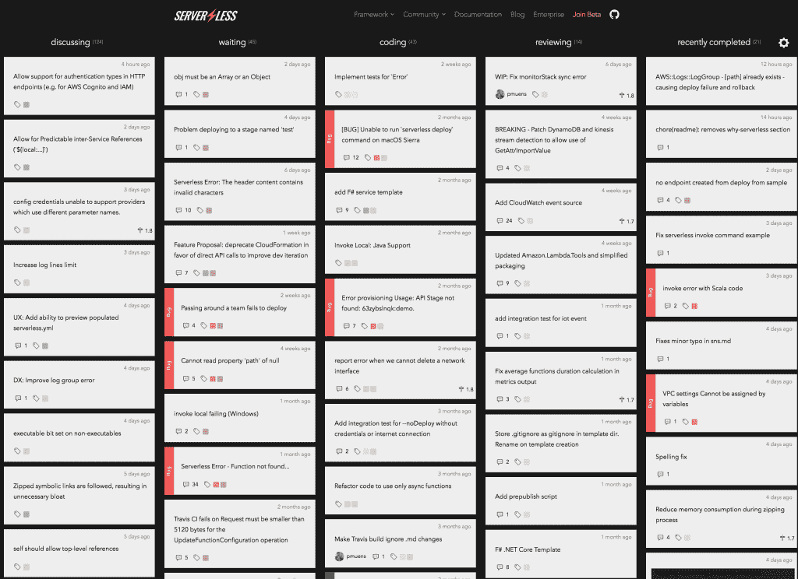

# 范围:管理开源项目的无服务器项目

> 原文：<https://thenewstack.io/scope-serverless-project-manage-open-source-projects/>

支持[无服务器](https://serverless.com)框架的人们发布了一个开源状态板，旨在帮助开发者跟踪他们的 GitHub 项目，名为 [范围](https://github.com/serverless/scope) 。

使用类似 Trello 的项目卡片流，Scope 允许用户定制显示开源项目当前阶段的栏目。用户可以设置所需的标签来决定需要显示哪些拉取请求、提交或注释，并且可以打开和关闭最近完成的项目，这取决于项目经理是否希望显示这些项目。

Serverless 本身正在使用 Scope[向社区通知与 serverless 项目相关的](https://serverless.com/framework/status/) 活动的当前状态，并使其成为一个开源项目，可以用作独立的应用程序或嵌入到网站中。

该应用程序运行在 Amazon Web Services 上，可以使用其免费层进行部署。必须先部署[无服务器](https://github.com/serverless/serverless)后端，然后用户进入自己开源项目的 GitHub API 端点，配置在项目卡片中显示哪些列，部署前端。

无服务器开发人员 David Wells 写道，编写这个工具是因为在管理和通知开源社区优先级问题、拉取请求和工作的当前状态时遇到了困难。Wells 认为 Scope 将帮助无服务器团队更好地突出他们寻求反馈和协作的领域。

[https://www.youtube.com/embed/kTrPeKZ0JxI?list=PLIIjEI2fYC-BtxWcDeTziRp7cIZVEepB3](https://www.youtube.com/embed/kTrPeKZ0JxI?list=PLIIjEI2fYC-BtxWcDeTziRp7cIZVEepB3)

视频

Scope 有一个空闲的 AWS [Lambda](https://aws.amazon.com/lambda/) 函数，通过 [webhook](https://webhooks.pbworks.com/w/page/13385124/FrontPage) 监听任何对开源项目的 GitHub 更新。任何活动都会触发 Lambda 函数将帖子的详细信息保存在 DynamoDB 中。状态板最初由所有打开的问题填充一次，在 GitHub webhooks 和 API Gateway 事件之后，Lambda 函数用于维护来自 [DynamoDB](https://aws.amazon.com/dynamodb/) 的项目卡状态细节，并保持项目流最新，仅显示配置中定制的细节。

虽然上周才发布，但截至记者发稿时，该项目已经被打了 140 次星号，被分叉了 7 次。回购的几个分支是开发商店，像 [Codegram](https://www.codegram.com/) ，它已经创建了三个开源项目。一个是 Ruby 兼容的 [数据验证器](https://github.com/codegram/date_validator) 已经被下载了超过 1200 万次，还有 [菠菜](https://github.com/codegram/spinach)，一个运行在[小黄瓜](https://github.com/cucumber/cucumber/wiki/Gherkin)之上的行为驱动开发框架，一种商业可读的特定领域语言。

这个版本是无服务器提供的一系列工具中的最新一个，用来展示他们的平台的发展方向和可能性。该公司还开源了一个博客网站结构， [使用 GraphQL API](https://github.com/serverless/serverless-graphql-blog) 运行该结构，它将三个数据源(帖子、作者和评论)整合在一起，存储为 DynamoDB 表，所有内容只有一个端点。

专题图片:由 [Justin Main](https://unsplash.com/search/camera?photo=OATNVU37Vj0) ，via Unsplash。

<svg xmlns:xlink="http://www.w3.org/1999/xlink" viewBox="0 0 68 31" version="1.1"><title>Group</title> <desc>Created with Sketch.</desc></svg>