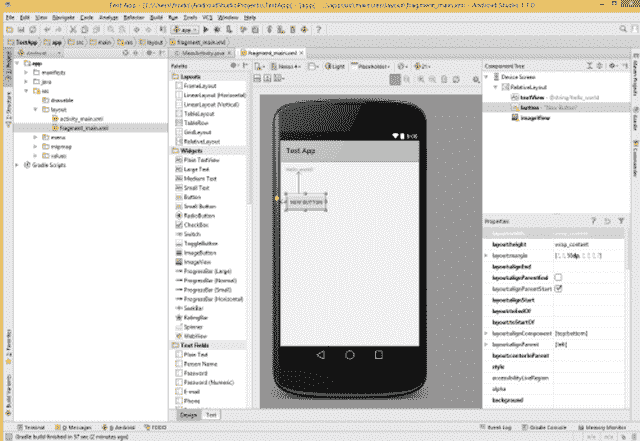
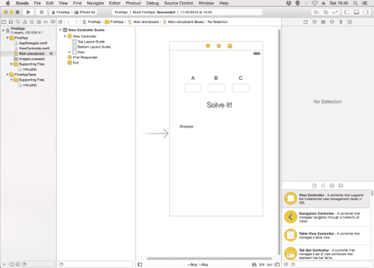
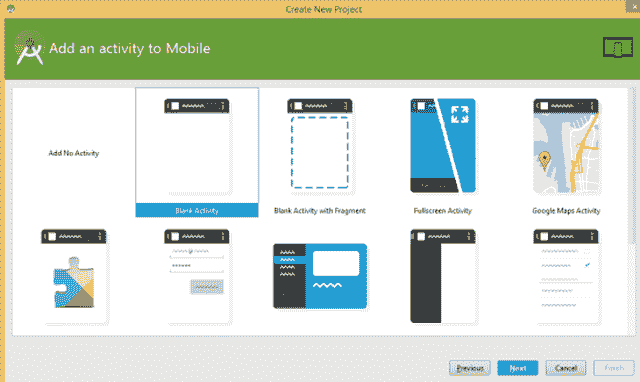
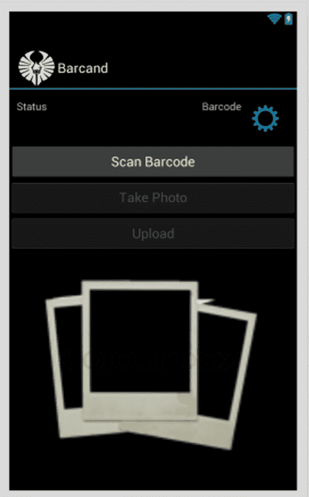

# Android 和 iOS 开发的评分比较

> 原文：<https://thenewstack.io/scoring-comparison-android-ios-development/>

想进入移动应用程序开发吗？相对于 iOS，为 Android 开发是什么感觉？在本文中，我将从程序员的角度比较这两种开发风格。由于 Android 5(棒棒糖)和[材料设计](https://developer.android.com/design/material/index.html "Link to Android Material Design docs")仍然相当新，我正在研究更早的方法，从 Android 版本 4.0.3 到 4.4。我选择这些版本是因为谷歌安卓开发者仪表板上的市场份额数据。总共覆盖了 90.6%的车型。

我认为 iOS 开发要容易得多，但是看看你是否同意。每次比较，我都会给两者打分。这些完全是主观的，但希望是公平的。注意，在写这篇文章的前两天，我从 Eclipse 转到了 Android Studio。

## 编程语言

Android 开发在编程语言类别上完胜 iOS。Java 比 Objective-C 更容易学，Objective-C 是一种更老的低级语言。这意味着你必须编写更多的代码来做同样的事情，Java 开发人员可用的高级数据结构远远领先于 Objective-C。但现在，与 Java 相比，使用 Swift，我认为它几乎是可以学习的。【T4**安卓:9/10 iOS: 7/10**

## 开发工具

以前，Android 开发是通过 Eclipse 使用 ADT 完成的，ADT 是 Google 定制的 Android 开发工具包。现在已经正式换成了 [Android Studio](https://developer.android.com/sdk/index.html "Link to ") ，如下图，下方是 Xcode 截图。iOS 开发使用 Xcode，目前是 Xcode 6.1.1。Android Studio 和 Xcode 都是免费的。只有当你想在你的 iOS 设备上部署应用程序或在应用商店中分发应用程序时，你才需要每年向苹果支付 99 美元。
**安卓:10/10 iOS: 5/10**

Android Studio 有后台编译，会快速突出错误，而 Xcode 需要显式的构建阶段。两者都允许您在仿真器或真实硬件上进行调试。可能需要一篇很长很详细的文章来比较每种 IDE 的特性——两者都提供导航、重构、调试等功能。Android Studio 提供了更多的选择，但这是由两者中的 GUI 设计工具来平衡的，这取决于设计哲学，所以让我们继续。
**安卓工作室:8/10 Xcode: 8/10**

有点跑题了，我非常喜欢 ReSharper，这是一个由 JetBrains 公司为 C#开发者开发的工具包。他们非常擅长编写程序员友好的 IDE，他们的 Java IDE IntelliJ IDEA 是 Eclipse 的有力竞争对手，具有许多用户友好的编辑特性，如高级代码完成、重构和代码分析。免费社区版是 Android Studio 的动力，它有一个改进的布局编辑器。当你开始一个项目时，你可以选择一些活动。我还没有用它做过任何东西，但是通过尝试，我非常喜欢它。Android Studio 1.1 在最近一周刚刚发布。

## Android 和 iOS 的设计理念

与台式机不同，手机屏幕上的空间相对较小。这两个平台有一些共同的设计规则。例如，手指和触控笔不具备鼠标指针的针尖精度。最小的可点击尺寸也差不多:iOs 上 44 像素，Android 上 48 像素。两个平台上的屏幕架构有一个共同点:它们都把可点击的矩形区域称为视图。从那以后，一切都变得不同了。

在 iOS 上，导航和组织是由视图控制器完成的，有许多不同的控制器，如选项卡控制器、页面视图控制器、导航控制器、分割视图控制器等。通常，视图控制器控制整个屏幕或部分屏幕。这些可以用代码或使用[故事板来编程。使用故事板，用户可以组织图像或插图，然后将它们存储在 XML 文件中。最初，XML 文件被用来作为笔尖单独构建每个页面，但是故事板现在已经使用了几年。你可以 100%用代码编程——没有 XML 笔尖或故事板——但是它更慢，也更容易出错。](https://en.wikipedia.org/wiki/Storyboard)

非常粗略地模拟查看控制器，Android 允许你将应用程序划分为活动和片段。活动对应于一个屏幕，所以如果您有多个屏幕，那么您将有多个活动，每次只有一个活动。片段是活动的一部分，一个活动中可以有多个片段。例如，您可以使用一个片段打开另一个屏幕，输入一个值，然后返回到活动。

Android 也使用 XML 文件，事实上，比 iOS 多得多。如下所示的示例应用程序有两个文本视图、三个按钮、一个图像视图和一个图像按钮(设置嵌齿轮)。这都是由一个 65 行的 xml 文件 Main.axml 定义的。其他 Android XML 文件包括 preferences.xml 以控制设置、字符串和样式 XML 文件，当然还有包含 SDK 版本和权限的 AndroidManifest.xml。还是那句话，和 iOS 一样，可以通过编程来布局控件，但是不像使用可视化设计器那么容易，Android Studio 布局设计器非常好。

如果你想知道一个 Android 应用程序中有多少个 XML 文件，可以获取一个. apk 文件——应用程序包文件，即安装程序——从。apk 到。拉上拉链，然后拉开。是的， [APK 文件](https://en.wikipedia.org/wiki/Android_application_package "Link to Wikipedia about Apk")只是 zip 存档，很像 jar 文件，但是扩展名是. APK。注意，XML 文件可能是 Android 二进制 XML 格式的，所以需要转换后才能读取。维基百科 APK 链接提到了做这件事的工具。
**安卓:5/10 iOS: 9/10**

## 设备碎片

这与你的手机掉落无关，而是对市面上有多少不同手机的一种衡量。有许多制造商生产不同屏幕尺寸的手机。安卓版本，屏幕像素密度等。意味着 Android 有大约 19000 个(OpenSignal 报告),而 iOS 不到 12 个。在 Android 上，你必须支持每英寸中等点数(mdpi)、hdpi、xhdpi、xxhdpi 和 xxxhdpi。每种分辨率都有自己的文件夹，使用的图形应该适当地预先缩放，并放在正确的文件夹中。如果你没有为给定的分辨率预先缩放图形，那么 Android 会尝试缩放它们，这可能看起来不太好。

iOS 在这方面做得更好，只有三种尺寸的图形，现在最低的一种不是很需要。如果你的图形被称为 fred.png，是 60 像素(宽度或高度是无关紧要的)，那么你也应该提供一个 fred@2x.png，这是 120 像素。对于 iPhone 6 和 6+，应该是 fred@3x.png，也就是 180 像素。
**安卓:5/10 iOS: 8/10**

## 模拟器

苹果在这里太容易了。对于如此小范围的模型，它们只提供了一个模拟器，供您调用合适的模型。使用 Android，你必须选择操作系统版本、屏幕尺寸，并为你创建一个。希望它是英特尔驱动的版本，而不是 Arm，因为 Arm 的模拟器非常慢，除非你安装了英特尔硬件仿真器。
**安卓:5/10 iOS: 9/10**

## 证明文件

Android 和 iOS 开发都有很好的记录。我有点喜欢 iOS docs，因为苹果花了很多精力来解释许多概念，比如视图控制器，并且支持 Swift 和 Objective-C。但是[谷歌的 docs](https://developer.android.com/index.html "Link to Google's Android developer documentation") 也非常全面。
**安卓:10/10 iOS: 10/10**

## 获胜者是？

将分数相加得到 iOS 56 和 Android 52，所以他们太接近了，所以更好。我故意排除了由 Android 主导的市场份额，有利于 iOS 的应用收入，以及其他因素，如升级的容易程度，这也有利于 iOS。与之相反的是，为任何 Android 手机开发都非常容易，而 iOS 手机内置了三到四年后就会过时的开发。iPhone 4，有人吗？App store 会删除任何在 iOS 版本发布后六到九个月内没有升级到最新版本的应用。

所以，从程序员的角度来看，Android 和 iOS 是摇摆不定的。

<svg xmlns:xlink="http://www.w3.org/1999/xlink" viewBox="0 0 68 31" version="1.1"><title>Group</title> <desc>Created with Sketch.</desc></svg>