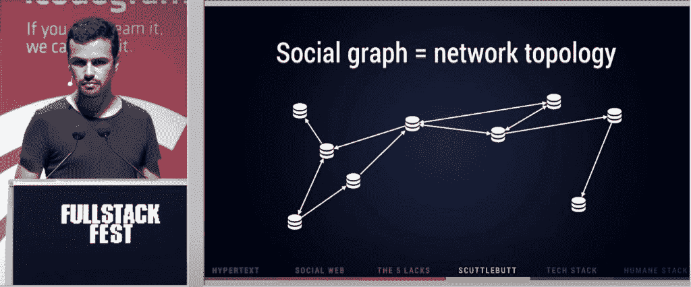
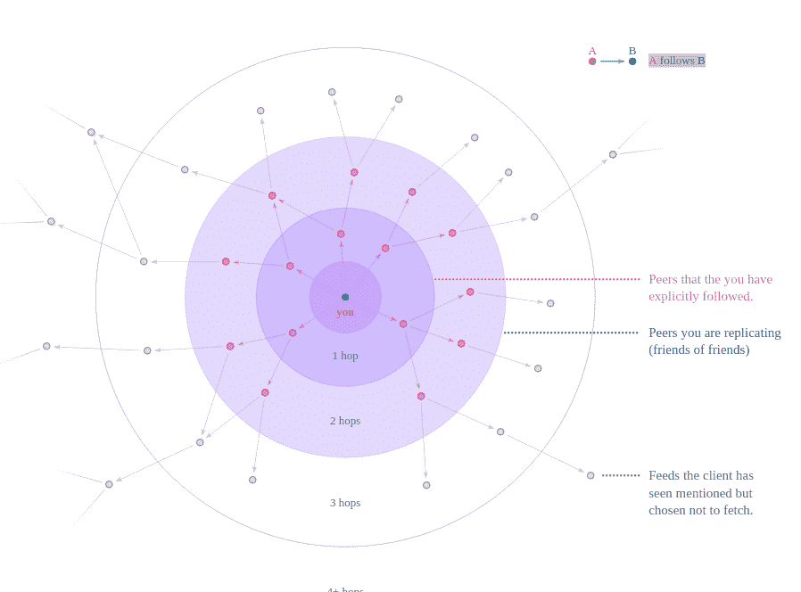

# 流言蜚语:分散权力，逃离社交媒体的激烈竞争

> 原文：<https://thenewstack.io/scuttlebutt-decentralize-and-escape-the-social-media-rat-race/>

 [理查德·麦克马努斯

理查德是 New Stack 的高级编辑，每周撰写一篇关于网络和应用程序发展趋势的专栏文章。此前，他在 2003 年创立了读写网，并将其打造为全球最具影响力的科技新闻和分析网站之一。](https://twitter.com/ricmac) 

当 Twitter 在 2010 年开始对其面向第三方开发者的 API 施加限制时，它向开发者发出了一个强烈的信号，即集中式平台不值得信任。同年，[Diaspora](https://diasporafoundation.org/)——一种去中心化的脸书——由四名纽约学生成立。后来，在 2017 年，一个名为[乳齿象](https://joinmastodon.org/)的联合社交网络经历了[人气飙升](https://web.archive.org/web/20170903090136/http://altplatform.org/2017/06/07/mastodon/)。

现在，在 2021 年，有一个名为[小道消息](https://scuttlebutt.nz/)的地下项目正在从不同的角度解决去中心化的网络。与 Diaspora 和乳齿象不同，流言蜚语不是面向最终用户的产品，而是一种协议(像 HTTP 或 RSS)。分散化的社交网络产品，像 Manyverse 和 Planetary T21，都是基于流言蜚语协议为终端用户打造的。

## 与集中式社交媒体相比

《安全的流言蜚语》( SSB)最初的名字是由多米尼克·塔尔(Dominic Tarr)于 2014 年发布的，他是一个住在船上的新西兰人，偶尔有网络报道。塔尔的生活方式(这在新西兰也是罕见的！)启发了《流言蜚语》的设计，它依赖于自我托管的内容，并且只通过点对点网络定期发送。这与 Twitter 的工作方式相反:在那里，内容被托管在一个中央服务器上(由 Twitter 控制),并通过互联网实时更新。

《流言蜚语》的创作者多米尼克·塔尔在他的快乐之地；图片[通过 YouTube](https://www.youtube.com/watch?v=0cpvorVA86E) 。

与 Twitter 不同的是,“流言蜚女”鼓励人们加入小型的同辈网络。您的数据存储在您携带的设备上(例如，您的电脑或手机)，当您连接到共享的 WiFi 信号或其他网络通道(例如，蓝牙)时，或者当您将其共享到您所属的“pub ”(其他用户的服务器中心)时，这些数据将与您信任的网络共享。从社交网络的角度来看，这里的关键是，你不要在“小道消息”上向全球互联网传播你的内容——相反，你只与小范围的人交流。

当浏览来自其他用户的内容时，无论你是直接连接还是通过酒吧连接，你都需要将每个人的内容下载到你自己的设备上——这可能是许多兆字节甚至千兆字节的数据。这就是为什么小道消息应用程序通常被称为[脱离网格的](https://www.manyver.se/faq/off-the-grid)社交网络。顺便说一句，这个“脱离网格”的功能让我想起了我第一次认真使用的博客平台: [Radio Userland](http://radio.userland.com/) ，这是一个桌面应用程序，你所有的内容都存放在你的电脑上，然后每当你连接到互联网时就上传到网络服务器。

最后一点值得注意的是，流言蜚语使用加密技术来保护你的身份和内容的安全。正如伊恩·博格斯特[2017 年在《大西洋月刊》上解释的](https://www.theatlantic.com/technology/archive/2017/05/meet-the-counterantidisintermediationists/527553/)，“小道消息将所有数据视为添加到列表末尾的大块内容——就像日记中的一个新条目。”每次更新“日记”时，都会有一个密钥验证该条目，并将其与作者联系起来。这类似于加密货币区块链的工作方式，只是没有金融投机诡计，也没有消耗大量电力的“工作证明”。

## Manyverse 和入职问题

Manyverse 是《流言蜚语》主页上列出的五个应用之一(也是目前唯一一个在 Android 上运行的应用)。它是由安德烈·斯塔尔茨(André Staltz)创建的，他于 2016 年加入了这个消息灵通人士社区。在 2018 年 10 月的一次演讲中，Staltz 指出了基于《流言蜚语》开发的应用程序与脸书和 Twitter 的不同之处。那就是社交图**就是**网络拓扑。

“在小道消息，他们是一样的，”斯塔尔茨说。一个人的帐户是其设备上的本地数据库，以下关系是网络连接

Manyverse 创始人 André Staltz。

但是，尽管这种方法允许用户完全控制他们的内容和连接，但它确实给新用户带来了问题。坦率地说，当你第一次加入像 Manyverse 这样基于小道消息的社交网络时，这是一种令人困惑的经历。

在我下载了 Manyverse 作为我手机的 iOS 应用程序后，我建立了我的个人资料，并发出了一条“Hello world”消息。然而，因为我在我的家庭办公室 WiFi，没有其他人可以连接。因此，我使用其中一个邀请代码[连接到了一个 pub 服务器](https://github.com/ssbc/ssb-server/wiki/Pub-Servers)上，这个服务器承诺将我连接到一组也连接到那个服务器的用户。但 24 小时后，我在 Manyverse 的“公共”订阅中仍然没有任何内容，所以没有任何内容可供我查看或互动。也许这是因为该应用程序需要花费大量时间从酒吧获取数据并建立索引——无论如何，这对 noob 用户来说都不是一个有希望的开始。

最终，酒吧开始填满我的公共饲料。它还跟踪我回来，这意味着酒吧里的其他人现在可以看到我的内容。 [Mix Irving](https://twitter.com/whimful) ，一个早期的公开源码项目成员(另一个新西兰人)向我解释了这是如何工作的。“Follow 的意思是‘我会复制这个人的东西’(复制他们说的话)，”他告诉我。“小道消息收集你所能看到的东西的方式与人际网络非常相似——你倾听你的朋友和你朋友的朋友说过的话。我们称之为，听 2 度/跳。"

资料来源:小道消息. nz

“Mix”(他更喜欢用这个名字)还在一个面向新西兰人的分布式应用程序中使用了 skutbottot，该应用程序名为[āhau](https://www.ahau.io/)，是一个数据管理系统，“帮助 whānau(家庭)和部落社区获取、保存重要信息和历史，并将其共享到安全的 whānau 管理的数据库中。”作为新西兰人，特别是毛利人社区的优秀资源，hau 表明，流言蜚语不仅仅适用于像 Manyverse 这样的 Twitter 类应用，它还可能重新定义社交网络。

现在回到 Manyverse:我花了几天时间琢磨的另一件事是，你在不同的设备上没有一个单一的身份。因此，我在 iPhone 上的 Manyverse 上创建的身份(后来我将其标记为“ricmac.mobile”)与我在 iMac 上使用另一个名为 [Patchwork](http://dinosaur.is/patchwork-downloader/) (我将其标记为“ricmac.desktop”)的应用程序创建的身份是不同的。然而，正如 Mix 向我解释的那样，如果我使用 ricmac.mobile 和*加入一个酒吧，那么*跟随 ricmac.desktop，**两个**身份都可以访问酒吧的公共内容(因为它是一个“朋友的朋友”网络)。

至于 Manyverse 本身，它最近宣布了一项名为“[房间服务器](https://twitter.com/andrestaltz/status/1399378477405646855)的新开源功能，该功能被宣传为酒吧服务器的替代品。当[介绍功能](https://www.manyver.se/blog/2021-06-update)时，Staltz 称之为“一种新的社区服务器模式，它还可以授予你一个个人网络链接，用来邀请朋友。”与 Mastodon 类似，房间服务器使用联邦服务器方法。然而，与 Mastodon 不同的是，用户账户并不存在于服务器上——按照 Scuttlebutt 的设计，它们存在于你的设备上。

## 社交媒体竞争的出路

尽管脱离网格的流言蜚语范式需要一些时间来适应，但作为一种相对较新的 web 架构，它具有很大的吸引力。

在过去的十年里，我们已经看到了集中式社交媒体平台如何在许多方面辜负了社会——错误的信息，自我驱动的内容(对喜欢和关注者的持续渴望)，群体思维，以及人们在脸书和 Twitter 等平台上并不真正倾听彼此的事实。也许我们都应该把它降低一个档次，找到更小的、适合的社区来互动。正如我们目前所知，通过有目的地缩小你的网络，流言蜚语消除了社交媒体的自私动机——但它也有我们都喜欢的社交网络中的意外收获(例如，通过“朋友的朋友”联系发现新朋友)。

对于发展中国家来说，流言蜚语协议似乎也很有前途，在这些国家，移动电话非常多，但是互联网连接却时好时坏或者不可靠。也就是说，Mix 告诉我，在纳米比亚的一个项目中，他们“发现低端手机变化很大，为它们开发手机是一个相当大的挑战。”所以这是一项正在进行的工作。

有一点小道消息是**而不是**:脸书或推特的潜在篡夺者。它永远不会这样做，因为使用 Scuttlebutt(及其应用程序，如 Manyverse)的目的是逃离主流社交媒体的激烈竞争，找到一个更安静、压力更小的地方与他人联系。顾名思义，流言蜚语并不像 Twitter 或脸书那样永远在线。它有时是开着的，给你时间享受远离尘嚣的生活——在船上或其他地方。

<svg xmlns:xlink="http://www.w3.org/1999/xlink" viewBox="0 0 68 31" version="1.1"><title>Group</title> <desc>Created with Sketch.</desc></svg>