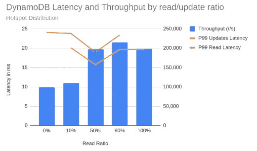
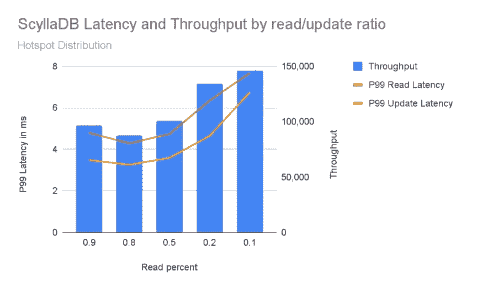
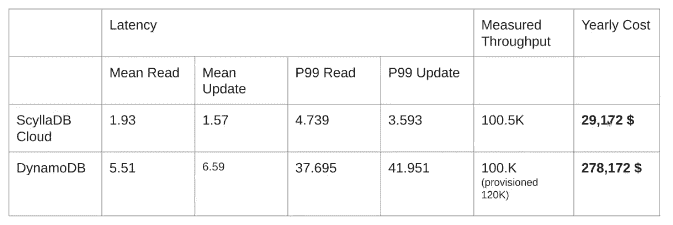
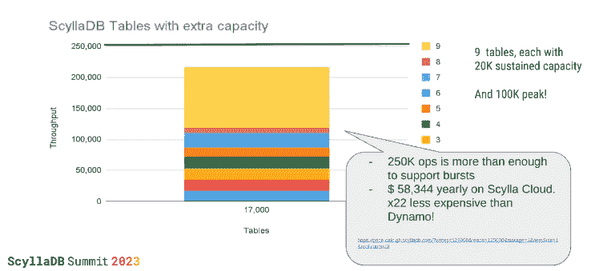

# ScyllaDB 在延迟和定价上挑战 DynamoDB

> 原文：<https://thenewstack.io/scylladb-challenges-dynamodb-on-latency-and-pricing/>

ScyllaDB[是一个大规模运行的分布式数据库](https://www.scylladb.com/?utm_content=inline-mention)，它是为需要高性能和低延迟的数据密集型应用程序而设计的。创造者认为这个数据库系统是 T2 亚马逊网络服务 T4 dynamo db NoSQL 数据库服务的有力竞争者。他们对这种说法如此自信，以至于他们发布了 ScyllaDB 交流发电机，它提供了 Scylla 和 Dynamo 之间的 A/B 测试，只需几个脚本，零停机时间。

在 2023 年 ScyllaDB 峰会上，ScyllaDB 产品副总裁 [Tzach Livyatan](https://www.linkedin.com/in/tzach/?originalSubdomain=il) 在演讲中谈到“使用 ScyllaDB 交流发电机使用亚马逊 DynamoDB API，到处都是，更好，更实惠，一次搞定。”

Livyatan 将 ScyllaDB 与亚马逊的 DynamoDB 进行了并列对比，并在价格和延迟方面对两者进行了比较。在他的测试中，结果显示 Scylla 具有较低的延迟和价格。ScyllaDB 的交流发电机工具是一个 DynamoDB 兼容的 API，使得任何使用 DynamoDB 的应用程序也与 ScyllaDB 兼容。

任何供应商自报的数字都不能全信。尽管如此，通过回顾这项工作还是可以获得很多真知灼见。

## **第一轮:延迟测试**

尽管 Scylla 团队对 ScyllaDB 有着深刻的理解，并知道如何在测试中操作它，因此拥有主场优势，但 DynamoDB 是一个“黑匣子”,其底层技术是未知的。他们不得不像其他人一样经历一些相同的试错和学习，来测试这两者。

以下是延迟测试的规格:

*   雅虎！云服务基准(YCSB) 0.18.0+，Livyatan 的“无 SQL 数据库标准”
*   “锡拉”的“最新最伟大”版本，锡拉企业 2022.2
*   他们使用三节点 Scylla 群集—i4i . 2x 大，分布在美国东部-1 区 b、c、d。Scylla 云默认为三个区。可靠性更高，潜在延迟稍高。
*   加载器包括 i4i.2xlarge 的八个节点，每台机器运行 YCSB 的三个实例。总共有 40 个线程，18 个进程，并行度为 720。有一个测试是用 50 个线程完成的，性能没有提高。
*   他们找到了最大吞吐量，然后将其降低到 70%。吞吐量达到最大时，延迟会受到影响。
*   测试是用 Uniform、Zipfian 和 Hotspot 分布完成的，但是本文只引用 Hotspot。Hotspot 模拟了热分区的真实场景——许多分区，但只有少数几个分区接收大部分流量。
*   1TB 存储，因为正在测试延迟。

以下是 DynamoDB 的结果:

对于 ScyllaDB:

上图显示 DynamoDB 中的延迟更高。

以下是使用案例对比(包括年度成本):

上面的图表是工具从两个测试中得到的总体用例比较，并将它们相互比较。据 ScyllaDB 估计，ScyllaDB 具有更低的延迟和显著的成本节约。

根据 ScyllaDB 的说法，对供应表进行了类似的比较，结果也对 ScyllaDB 有利。ScyllaDB 是按集群而不是按表进行配置的，因此，如果集群有额外的分配，而某个表出现峰值，则该表可以清除额外的分配。这个概念允许提供整个数据库，而不是单个表。

## **零停机迁移**

[交流发电机](https://docs.scylladb.com/stable/using-scylla/alternator/)，一项基于 Apache Spark 的开源技术，提供了一个基于 REST/ HTTP 的 DynamoDB 兼容 API。它为那些使用 DynamoDB 的应用程序提供了一种与 ScyllaDB 兼容的替代方法。有了交流发电机，Scylla 可以兼容相同的应用程序、SDK、数据建模、查询和其他功能。从演示视频的 17:17 开始有一个深入的演示:

[https://www.youtube.com/embed/ryvMsxixI2s?start=2&feature=oembed](https://www.youtube.com/embed/ryvMsxixI2s?start=2&feature=oembed)

视频

<svg xmlns:xlink="http://www.w3.org/1999/xlink" viewBox="0 0 68 31" version="1.1"><title>Group</title> <desc>Created with Sketch.</desc></svg>