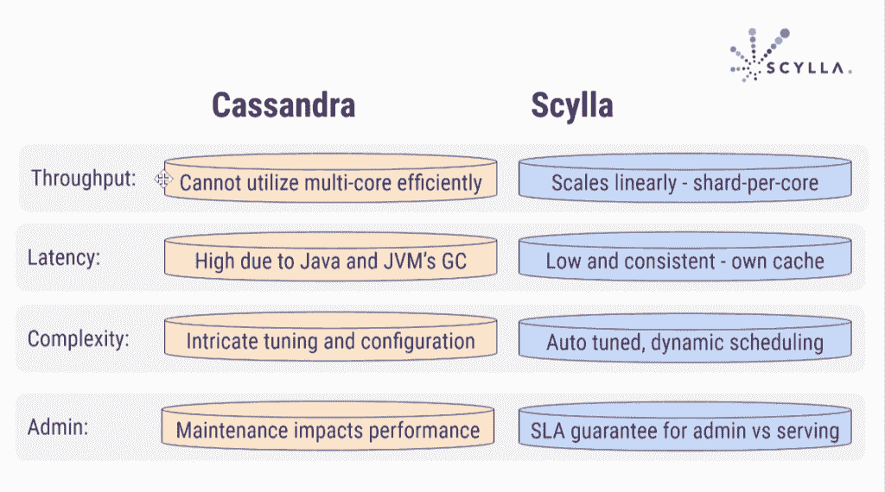
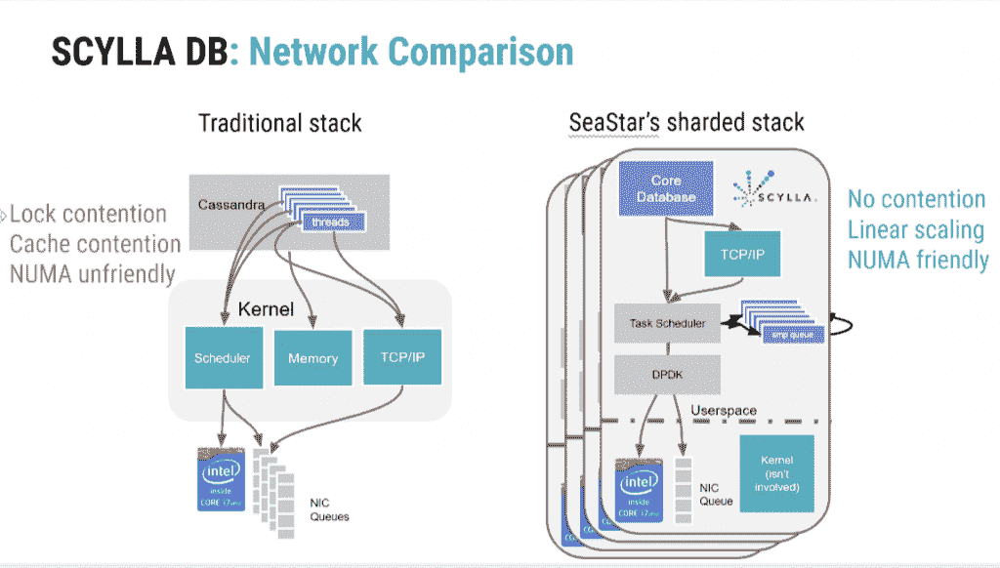
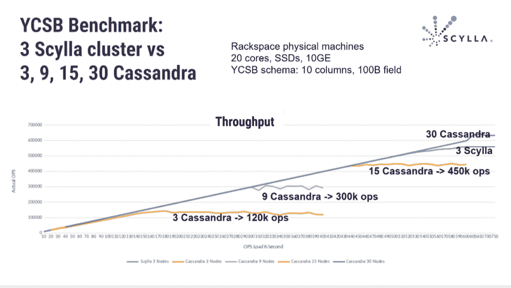
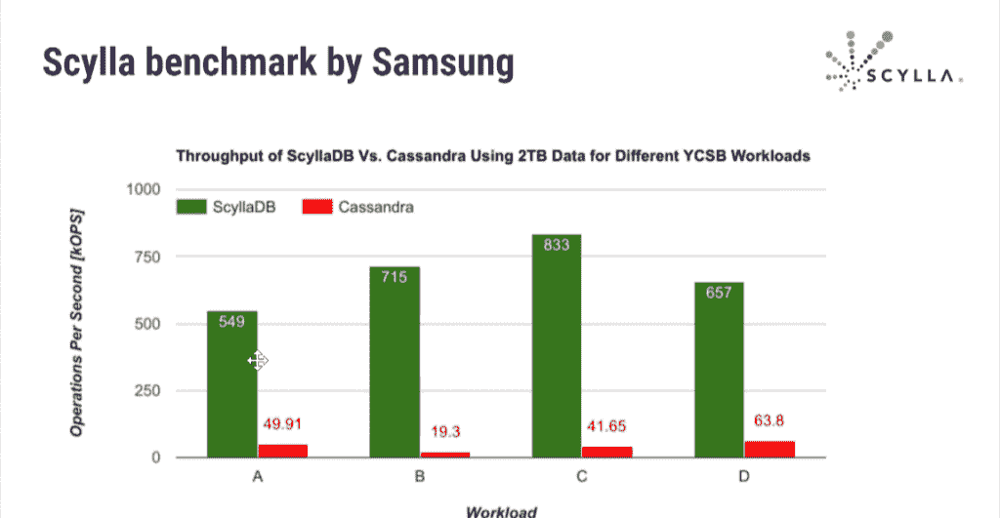
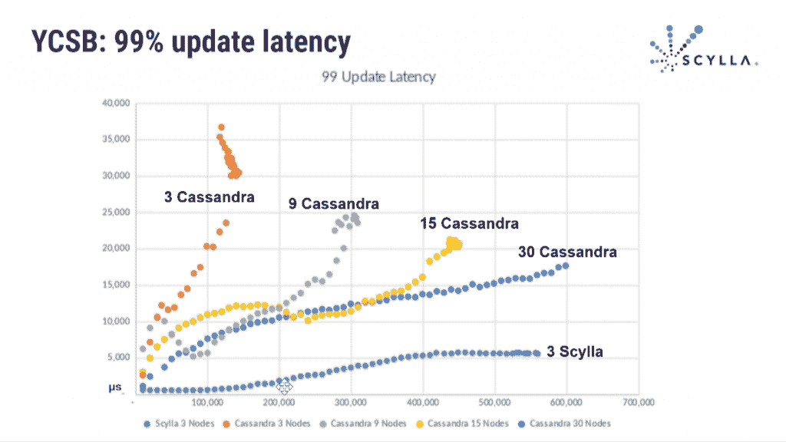

# ScyllaDB 采用 Cassandra 来提高效率，减少延迟

> 原文：<https://thenewstack.io/scylladb-takes-cassandra-boost-efficiency-reduce-latency/>

Henrik Johansson， [Eniro](https://en.wikipedia.org/wiki/Eniro) *，*的高级开发人员，对他工作的瑞典搜索和目录协助公司使用的[基于微服务的管道](https://www.slideshare.net/ScyllaDB/scylla-summit-2016-using-scylladb-for-a-microservicebased-pipeline-in-go)中的 ScyllaDB 数据库系统给予了热情的评价。

Eniro 最初使用 [Redis](https://redis.io/) 来完成一个看似简单的任务:将一大组瞬态标识符 A 与另一大组其他标识符 b 相关联。它之前使用 [MongoDB](https://www.mongodb.com/) 和 [PostgreSQL](https://thenewstack.io/20-postgres-still-sign-times/) 的经验带来了可伸缩性问题，尽管 Redis 在这个项目中一度快速稳定，但延迟最终成为一个问题。

他在[博客帖子](http://developer.eniro.com/blog/post/scylladb-a-monster-or-a-rock/)中解释说，编程语言 [Go](https://golang.org/) 、web 框架 [Echo](https://github.com/labstack/echo) 、开源消息系统 [NATS](http://nats.io/) 和 [ScyllaDB](http://www.scylladb.com/) 的组合被证明速度快、延迟低且不需要额外的调整。

“这带来了一种近乎反常的满足感……这让我怀疑我以前使用其他堆栈的大部分经验，”他说。

ScyllaDB 是一个开源的 NoSQL 数据库，旨在替代 [Apache Cassandra](http://cassandra.apache.org/) ，根据 [DB-Engines 的数据库受欢迎程度排名](http://db-engines.com/en/ranking)，Apache Cassandra 是第八大使用最广泛的数据库系统。ScyllaDB 是用 C++而不是 Java 编写的，它声称每秒可以处理一百万次操作，延迟不到一分钟，总体性能提高了 10 倍。

ScyllaDB 的联合创始人 Dor Laor 坚持认为 Cassandra 的效率非常低，但也有它的优点。

“我们本可以用不同的 API 编写一个完整的数据库，但决定与 Cassandra 兼容，因为它被广泛使用。Cassandra 中的好东西成就了它的今天——高可用性和容错。它可以执行 1，000 节点集群、多数据中心、开箱即用的出色复制、带 Spark 的生态系统。我们在设计中保留了所有这些，但做得更好，”他说。

Cassandra 使用多个执行线程来试图获取锁和资源。他说，问题是资源变得繁忙，对资源的访问受到限制，因此它们必须相互等待，有时还会相互干扰，导致即使使用 x86 也有 20%的效率低下。

## 核心处的碎片

Scylla 使用两级[分片](http://searchcloudcomputing.techtarget.com/definition/sharding)，或者将数据库分割成更小更快的部分。分片通常由服务器完成。Cassandra 使用集群范围的分片，但 Scylla 在核心级别使用分片，这对用户是透明的。

“在服务器上，我们将数据范围划分为独立的核心。每个内核都拥有自己的数据子集、自己的 CPU、自己的内存，并且多次可以直接访问 I/O。因此它是完全独立的，不需要锁定和许多其他好处，”他解释道。

“在 Cassandra 设计中，你有这些线程，但是内核拥有资源。它执行调度、内存管理和 I/O。但是内核不知道哪个线程将处理哪个数据包。可能有内核 10 的传入数据包，但应用程序线程在内核 20 上运行。所以它需要锁定，需要上下文切换…这是一个巨大的开销。如果你的内存被分配在远程套接字上，那么访问它的代价是两倍。”

Scylla 运行多个引擎，但它是一个多线程的进程。每个线程运行子集。

“因此，内存总是 [NUMA](http://whatis.techtarget.com/definition/NUMA-non-uniform-memory-access) (非统一内存访问)友好的，因为每个引擎都有一个 RAM 子集，而且是 NUMA 本地的。我们把记忆和它联系在一起。我们还绑定了线程，因此非常高效，”他解释道。

## 来自 KVM 创始人

Scylla 创始人 Laor 和 [Avi Kivity](https://github.com/avikivity) 是创建 [KVM hypervisor](https://www.linux-kvm.org/page/Main_Page) 的团队成员，该团队是 Red Hat 在收购虚拟化初创公司 [Qumranet](https://arstechnica.com/information-technology/2008/09/red-hat-acquires-qumranet-will-embrace-kvm/) 时收购的。

Laor 和 Kivity 于 2012 年离开 Red Hat，成立了 Cloudius Systems。它创建了云操作系统 [OSv](https://github.com/cloudius-systems/osv) 和服务器端应用框架 [Seastar](https://github.com/scylladb/seastar) 。2015 年，他们将这家总部位于以色列的公司更名为 ScyllaDB。该公司刚刚筹集了 1600 万美元的 B 轮融资，使其总投资达到 2500 万美元。

Scylla 声称性能提高了 10 倍，但这取决于所用的硬件。广告技术公司 [Outbrain](http://techblog.outbrain.com/2016/03/we-are-testing-scylladb-live-blogging-1/) 是[的早期测试者之一](https://www.youtube.com/watch?v=bE_oGi3DNLA)，它报告了 6 倍的提升，Scylla 处理的流量是 Cassandra 的 20 倍，而延迟是 Cassandra 的 3 倍。

[阿里巴巴集团](http://www.alibabagroup.com/en/global/home)在其[NoSQL 数据存储项目](https://github.com/fastio/pedis)中，使用 Scylla 的 [Seastar](https://github.com/scylladb/seastar) 框架作为库，使用 Redis 协议重写了一个应用程序，并报告了 8 倍的好结果。Investing.com 的首席技术官兼首席架构师 Gabriel Mizrahi 说，Scylla 使公司的集群规模缩小了一半。

开发者 Marc Alonso 和 Thomas Mouron 在 Octo Talks 博客上这样描述 Scylla 的优势:

“用 C ++编写应用程序的优势实际上是通过避免将程序加载到 JVM 中来减少 CPU 的使用。Scylla 还提供定制的网络管理，通过绕过 Linux 内核来最小化资源。完成网络请求不需要系统调用。一切都发生在用户空间，限制了内核空间中昂贵的开关数量。

C++的另一个优势是能够进行更精细但更复杂的内存管理。事实上，在 Java 中，垃圾收集器负责定期浏览分配的内存以释放未使用的空间。就处理器周期而言，这一步的成本非常高，它可能会在大内存上停止应用程序长达几秒钟，这也被称为“停止世界”"

Laor 说，有时对客户来说，延迟比吞吐量更大，比如在广告技术公司。

延迟改善的部分原因是消除了 Java 的垃圾收集。通常，NoSQL 数据存储由运行在 Linux 之上的 Java 虚拟机(JVM)组成，使用页面缓存和复杂的内存分配策略来“欺骗”JVM 垃圾收集器以避免暂停。

Laor 说，在 Cassandra 中配置 Java 既复杂又非常困难。“锡拉”的自我调节能力提供了另一个好处，在 [Quora](https://www.quora.com/What-are-the-main-differences-between-Cassandra-and-Scylla) 上提到的 [Kivity](https://github.com/avikivity) 。

“使用 Cassandra，您必须调整几乎所有东西:读取器和写入器线程的数量、压缩和流吞吐量、垃圾收集器、各种缓存的大小。这非常耗时，容易出错，并且在可能变化的生产环境中非常困难。他写道:“ScyllaDB 可以自我调整，并在用户读取、用户写入以及压缩和流式传输等内部任务之间动态划分处理器、网络和磁盘带宽。

## 仍然不成熟的技术

在那篇文章中，“[实用卡珊德拉](https://www.amazon.com/Practical-Cassandra-Developers-Addison-Wesley-Analytics/dp/032193394X)”的合著者[埃里克·卢博](https://github.com/elubow)，列举了 Scylla 的缺点，作为一个小公司，很少有产品实现，并且缺乏围绕卡珊德拉的大规模社区。他指出，这是一项远不如 Cassandra 成熟的技术，并抱怨说，它不支持计数器(1.7 版本中的一个[功能)，以及 Seastar TCP 堆栈和用户空间。](https://github.com/scylladb/scylla/commit/000edc36c43882cb9d1778dd61210e0e3802617f)

Scylla 在 2 月份发布了 1.6 版本，并计划在本月推出其企业版。

Lubow 坚持认为，仅仅复制 Cassandra 的功能限制了 Scylla 的创新能力和真正的差异化。Laor 说，Scylla 将在 Q2 结束时实现 Cassandra 的所有功能，它将能够专注于大量其他事情，包括添加多租户，这可以通过 Scylla 来完成。

[IBM Compose](https://developer.ibm.com/dwblog/2016/scylladb-compose-hosted-nosql-cassandra/) 提供与 [Bluemix 云服务](https://www.ibm.com/cloud-computing/bluemix/)集成的托管服务 Scylla。[三星 SDS](https://www.youtube.com/watch?v=vvJjGpvYJWw) ，其投资者之一，也将其用于物联网和移动应用。其他用户包括 Arista Networks、广告技术公司 AppNexus、视频社交网络 musical.ly、印度出租车预订服务 Ola。

<svg xmlns:xlink="http://www.w3.org/1999/xlink" viewBox="0 0 68 31" version="1.1"><title>Group</title> <desc>Created with Sketch.</desc></svg>