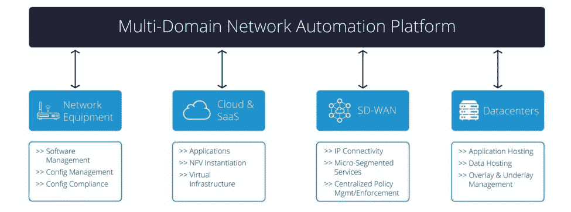

# SD-WAN 必须解决多域问题

> 原文：<https://thenewstack.io/sd-wan-must-tackle-the-multidomain-problem/>

 [克里斯·韦德

克里斯·韦德(Chris Wade)是网络自动化软件公司 Itential 的联合创始人兼首席技术官，该公司致力于简化和加快网络自动化的采用，并转变网络运营实践。](http://www.itential.com/) 

SD-WAN(广域网中的软件定义网络)最初被吹捧为一种利用私有(MPLS)和公共(互联网)网络将流量路由到最合适的网络的方法。随着时间的推移，SD-WAN 不断发展，并实现了更多创新服务的加速。为了将 SD-WAN 扩展为多云现实，SD-WAN 2.0 增强了安全性和分析能力，同时将边缘创新与应用和云概念相结合。虽然我们已经看到了云生态系统中的巨大创新，但网络和应用领域正在采用类似的概念来构建以软件为中心的可编程网络。

鉴于这些应用和网络现在跨越云、数据中心、广域网、局域网和边缘，网络自动化应该被视为一个多领域问题。每个域都有独特的挑战，这些挑战应该在本地实现自动化，同时提供端到端功能，以适应目标网络的实际情况。

应用程序和服务变得越来越分散，需要跨各种域的连接和策略实施。无论是零信任安全、智能网络自动化，还是任何现代网络战略，管理这些网络概念都需要我们重新思考我们传统的网络运营方式。

这些网段中的每一个都有一个领域策略，该策略已经发展到可以解决特定领域的问题。示例包括用于第 2/3 层网络的基于 Y [ANG 的建模](https://tools.ietf.org/html/rfc8346)和用于云应用的[拓扑和编排规范](http://docs.oasis-open.org/tosca/tosca-primer/v1.0/tosca-primer-v1.0.html) (TOSCA)。物理网络继续由命令行界面(CLI)主导，而云应用程序正在转向 REST API 概念。控制器和编排的引入允许基于软件平台操作的网络自动化策略，而不是与物理或云网络中存在的每个实例集成。今天的企业网络由所有这些领域的组合组成。

SD-WAN 2.0 和多云解决方案必须包括多域策略，以提供协调的服务创建以及基本操作和配置管理功能。传统的网络管理概念依赖于孤岛战略，每个领域都有组织和技术解决方案。鉴于现代服务分布在复杂的网络环境中，网络自动化策略需要关注在一个全面的端到端网络自动化平台下集成这些多个领域。

> 应用程序和服务变得越来越分散，需要跨各种域的连接和策略实施。无论是零信任安全、智能网络自动化，还是任何现代网络战略，管理这些网络概念都需要我们重新思考我们传统的网络运营方式。

基于制造商或网段的历史孤岛正在被域控制器和解决方案所取代。虽然前进了一步，但我们需要抵制允许每个领域垂直化和退回到过去 20 年来限制创新的类似的、以前的策略。我们需要一个端到端的策略，该策略关注平台并将所有组件连接到一个可编程结构中，关注变化率，而不是当今主导策略的中断厌恶。

云供应商在这条路上走得更远，他们专注于解决类似问题的平台，并认为抽象层对简化复杂问题至关重要。正在进行的垂直化单个网络域的努力只会使解决这些问题的尝试复杂化。总的来说，生态系统应该侧重于采用更多的云概念，而不是独特的定制网络解决方案。设备层和编排层的网络可编程概念开启了网络管理平面的创新。SD-WAN 2.0 和多云管理强调了采用这些结构的必要性，是推动网络自动化平台及其在提供可编程网络中的作用的绝佳用例。

通过 Pixabay 的特征图像。

<svg xmlns:xlink="http://www.w3.org/1999/xlink" viewBox="0 0 68 31" version="1.1"><title>Group</title> <desc>Created with Sketch.</desc></svg>