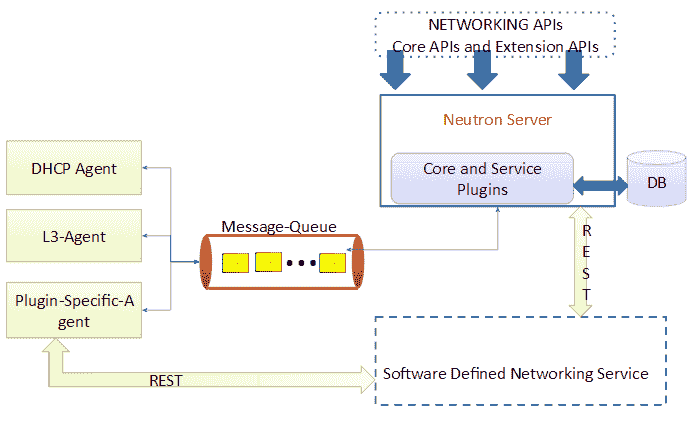
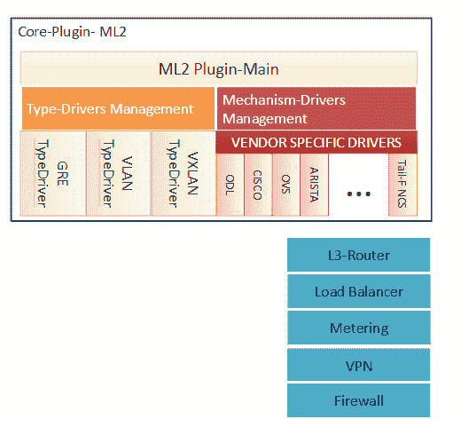
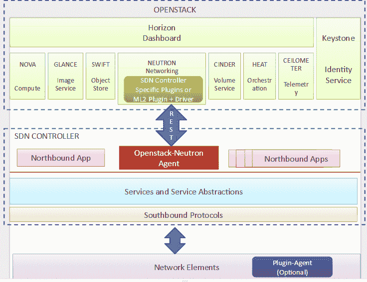

# SDN 对 OpenStack 中子的横向扩展效应

> 原文：<https://thenewstack.io/sdn-controllers-and-openstack-part1/>

这是关于 OpenStack 和软件定义的网络的两部分系列的第一部分。在…里

[part two](https://thenewstack.io/opendaylight-is-one-of-the-best-controllers-for-openstack-heres-how-to-implement-it/)

，斯里达尔讨论了 OpenStack 的 OpenDaylight 控制器以及如何实现它。

将 Neutron 简单地视为软件定义的网络(SDN)应用会有所帮助。更详细地说，它管理运行在 OpenStack 之上的网络虚拟化，并为开发高级云服务创建松散耦合的相关项目集。这些服务中的每一个都是一个单独的项目，由社区和许多供应商和公司的贡献驱动。重要的是，在 [OpenStack Kilo](https://wiki.openstack.org/wiki/ReleaseNotes/Kilo) 版本中有 12 个集成项目:

1.  **Nova(计算):**按需为云用户提供虚拟服务器/机器。
2.  **Neutron(联网):**提供联网即服务(虚拟联网服务)。
3.  **Swift(对象存储):**允许存储和检索 API 可访问的数据图像、文件和文档。
4.  **Cinder(块存储):**为用户的虚拟机提供持久的块存储。
5.  **Glance (images):** 向计算节点提供虚拟磁盘映像列表，供虚拟机使用。
6.  **Horizon (dashboard):** 为管理员和租户(用户)管理 OpenStack 提供基于 web 的图形用户界面(GUI)。
7.  **Keystone (identity):** 存储为 OpenStack 服务提供认证和授权的信息。
8.  **云高仪(遥测):**监控和测量 OpenStack 云的使用情况，以便进行计费、基准测试和统计。
9.  **Heat (orchestration):** 通过使用适当的 API 调用来提供用于管理云应用的编排服务。
10.  **讽刺(裸机供应):**旨在供应裸机而不是虚拟机，由 Nova 裸机驱动程序派生而来。
11.  **Sahara(大数据即服务):**项目提供了一种在 OpenStack 上配置数据密集型应用集群(Hadoop 或 Spark)的简单方法。
12.  **Trove(数据库即服务):**项目旨在为关系和非关系数据库引擎提供云数据库即服务供应功能。

虚拟网络由租户和管理员创建，以在 OpenStack compute 管理的虚拟机之间提供联网功能。Neutron 是一个网络管理服务，它公开了一组可扩展的 API 来创建和管理虚拟网络。

在 Neutron 之前，OpenStack 有一个简单的平面网络环境，没有 L3 或防火墙支持。它包含在 Nova 服务器中，这使得它很难适应网络中发生的变化。

引入 Neutron 是为了将网络视为一个独立的服务，并提供不同的抽象实现选择——Neutron 服务器提供抽象定义和管理，抽象的实际实现由插件实现。这种基于[插件](https://wiki.openstack.org/wiki/Neutron_Plugins_and_Drivers)的多租户支持框架被认为是技术无关的和模块化的。我们需要注意，Neutron 是一个独立的服务——也就是说，它可以作为一个自治的服务运行，向不同的供应商公开 API，提供实现和任何适当的扩展。

API 类别和每个子类别下支持的操作总结如下。创建、读取、更新和删除的操作缩写为 CRUD。核心 API 涵盖基本和必要的网络操作，而扩展和属性 API 涵盖功能丰富的虚拟网络的必要性。

### 核心 API 的操作

*   网络
*   子网(CRUD)
*   端口(污物)

### 扩展和属性 API 的操作

*   配额(RUD)
*   网络提供商扩展属性(CRUD)
*   网络多提供商扩展(CR)
*   端口绑定扩展属性(CRU)
*   安全组和规则(CRD)
*   第三层网络
*   计量标签和规则(CRD)
*   负载平衡器即服务(LBaaS) (CRUD)

## 中子建筑

下图 1 描述了 OpenStack 中子架构，它由以下元素组成:

### 中子服务器

python 守护进程是 OpenStack 网络的主要进程，通常运行在[控制器节点](http://docs.openstack.org/juno/install-guide/install/yum/content/ch_overview.html)(open stack 部署中使用的术语)上。它公开 API，以加强网络模型，并将请求传递给 neutron 插件。

### 插件

插件可以是核心的，也可以是服务的。核心插件实现了“核心”中子 API——L2 网络和 IP 地址管理。服务插件提供“附加”服务，如 L3 路由器、负载平衡、VPN、防火墙和计量。这些网络服务也可以由核心插件通过实现相关的 API 扩展来提供。简而言之，插件运行在[控制器节点](http://docs.openstack.org/juno/install-guide/install/yum/content/ch_overview.html)上，实现网络 API，与中子服务器、数据库和代理交互。

图一:OpenStack 中子架构

### 插件代理

这些代理特定于正在使用的中子插件。它们运行在[计算节点](http://docs.openstack.org/juno/install-guide/install/yum/content/ch_overview.html)上，并与中子插件通信以管理虚拟交换机。这些代理在许多部署中都是可选的，它们在每个虚拟机管理程序上执行本地虚拟交换机配置。

### 信息排队

OpenStack 组件(包括 Neutron)使用高级消息队列协议(AMQP)进行内部通信。AMQP 代理 RabbitMQ 位于 Neutron 的任何两个内部组件之间，并允许它们以松散耦合的方式进行通信，即 Neutron 组件使用远程过程调用(RPC)相互通信。

### 数据库ˌ资料库

几乎所有的插件都需要一个数据库来维护一个持久的网络模型；因此，模式是由配置的核心和服务插件定义的。

### DHCP 代理

该代理是 Neutron 的一部分，为租户网络提供 DHCP 服务。它维护所需的 DHCP 配置，并且在所有插件中是相同的。

### L3 代理

该代理负责提供第 3 层和 NAT 转发，以获得租户网络上虚拟机的外部访问。

## 模块化第二层核心插件

模块化第二层(ML2)是[中子的核心插件](https://www.openstack.org/summit/openstack-summit-hong-kong-2013/session-videos/presentation/openstack-neutron-modular-layer-2-plugin-deep-dive)。ML2 推出时(在 Havana 版本的 OpenStack 中)，取代了现有的单片插件(例如，Open vSwitch 和 Linux Bridge——它们只是插件，不是代理！)来消除冗余代码并减少开发和维护工作。正如 ML2 的作者所定义的，“模块化第 2 层( [ML2](https://wiki.openstack.org/wiki/Neutron/ML2) )插件是一个框架，允许 OpenStack Neutron 同时利用复杂现实世界数据中心中的各种第 2 层网络技术。”

图二:ML2 插件架构

ML2 通过其驱动模型实现模块化。如图所示，它包括两类驱动程序:类型和机制。类型驱动程序(如 flat、VLAN、GRE 和 VXLAN)定义了一个特定的 L2 类型，其中每个可用的网络类型都由相应的类型驱动程序管理。驱动程序维护特定类型的状态信息，并实现租户网络之间的隔离以及提供商网络的验证。

另一方面，机制驱动程序—特定于供应商(如 OVS，以及来自 ODL、思科、NEC 等的驱动程序)。)，基于启用的类型驱动程序—支持创建、更新和删除网络、子网和端口资源。我们应该注意，供应商可能会实现一个全新的类似于 ML2 的插件，或者只是实现一个机制驱动程序。Salvatore Orlando 和 Armando Migliaccio 的[谈话](https://www.openstack.org/summit/openstack-summit-hong-kong-2013/session-videos/presentation/how-to-write-a-neutron-plugin-if-you-really-need-to)有助于让这个决定变得更容易。

## OpenStack 和 SDN 控制器:重要特性

软件定义网络的引入不仅克服了 Neutron 的不足，还为多种网络虚拟化技术(创建隔离租户[虚拟网络](http://docs.openstack.org/admin-guide-cloud/content/index.html)的集中控制平面)和方法(F5 Networks 的 Christian Koenning 的“软件定义网络(SDN)和 OpenStack ”)提供了支持。随着在 SDN 上的集成，Neutron 有望支持大规模、高密度、多租户云环境的动态特性。

OpenStack Neutron 通过其插件架构，提供了将 SDN 控制器集成到 OpenStack 中的能力。这种使用插件将 SDN 控制器集成到 Neutron 中的做法提供了集中管理，并且还使用 API 促进了 OpenStack 网络的网络可编程性。

像 [OpenDaylight](https://thenewstack.io/writing-opendaylight-applications/) 、 [Ryu](https://thenewstack.io/sdn-series-part-iv-ryu-a-rich-featured-open-source-sdn-controller-supported-by-ntt-labs/) 和[泛光灯](https://thenewstack.io/sdn-series-part-v-floodlight/)这样的 SDN 控制器使用特定的插件或带有相应机制驱动程序的 ML2 插件，以允许中子和 SDN 控制器之间的通信。下图 3 展示了 OpenStack 与 SDN 控制器的集成。

在我们关于 SDN 控制器的文章中，我们看到了 Open Daylight 和 RYU 等网络操作系统负责提供网络(拓扑)及其当前和一致状态的完整视图。我们还看到，控制器还负责“管理”(应用、实施和确保)网络的必要更改，方法是将要求转化为配置(和监控)网络元素(物理和虚拟)。通常，对底层网络(和网络元素)的这些更改来自运行在 SDN 控制器之上的网络应用程序，使用北向 API。

通过 OpenStack Neutron 和 SDN 控制器的这种集成，对网络和网络元素的更改也可以由 OpenStack 用户触发，这些更改被转换为 Neutron APIs，并由 Neutron 插件和在 SDN 控制器中运行的相应代理来处理。例如，OpenDaylight 通过使用 northbound 通信经由 REST API 使用 Neutron 的网络节点上的 ML2 插件与 Neutron 进行交互。当 OpenStack 用户执行任何网络相关操作(创建/更新/删除/读取网络、子网和端口资源)时，典型流程如下:

1.  用户在 OpenStack 仪表盘(Horizon)上的操作会被翻译成相应的联网 API 并发送给中子服务器。
2.  中子服务器接收请求，并将其传递给已配置的插件(假设 ML2 配置有 ODL 机制驱动程序和 VXLAN 类型驱动程序)。
3.  中子服务器/插件将对数据库进行适当的更改。
4.  插件将调用 SDN 控制器的相应 REST API(假设是 ODL)。
5.  ODL 在接收到该请求后，可以使用任何南向插件/协议(例如 OpenFlow、OVSDB 或 OF-Config)对网络元件执行必要的改变。

图三:OpenStack 和 SDN 控制器，大图

我们应该注意，SDN 控制器和 OpenStack 存在不同的集成选项；例如，a)可以完全消除 Neutron 服务器和计算节点上的代理之间的 RPC 通信，SDN 控制器是管理网络的唯一实体，或者 b)SDN 控制器只管理物理交换机，虚拟交换机可以直接从 Neutron 服务器管理。

## 思考:SDN 控制器部署选项和 OpenStack 集成

我们希望通过与读者分享 SDN 适应性的诸多挑战之一来结束这篇介绍性文章。

SDN 控制器部署可以采取不同的形式，如下面三个表中所总结的。我们应该注意的是，可以使用下面提到的选项的不同排列和组合进行部署。例如，我们可以在数据中心中使用非虚拟化、集成的单/冗余控制器来管理数据中心的所有网络元素。

********

 **SDN 控制器虚拟化的优势包括能够更好地纵向扩展和横向扩展–向现有 SDN 控制器动态添加更多资源(如存储)。在虚拟化和分布式部署中，当 SDN 控制器作为一组协作虚拟机实施时，可以添加额外的虚拟机实例来响应增加的工作负载。

考虑一个场景，其中 SDN 控制器被虚拟化和集成/分布式，并且 SDN 网络元素的范围从虚拟到物理。此外，数据中心环境中这些虚拟基础架构的管理应符合当前的流程编排模型，与当前的 vim(虚拟化基础架构管理器)如 OpenStack 集成。为了实现这一点，人们必须克服各种挑战，例如性能和动态服务管理。鼓励读者在这种情况下考虑创建端到端解决方案的不同选择。

斯里达尔于 2007 年获得新加坡国立大学的计算机科学博士学位，于 2000 年获得印度苏拉特卡尔 KREC 大学的计算机科学硕士学位，并于 1997 年获得印度班加罗大学 Tumkur 分校的仪器仪表和电子工程学士学位。他在印度 SRM 研究所担任研究负责人；意大利都灵理工大学微软创新中心博士后研究员；并在新加坡资讯通信研究所(I2R)担任研究员。他从事过各种开发和部署项目，涉及 ZigBee、WiFi 和 WiMax。斯里达尔目前在 NEC 技术印度有限公司担任集团技术专家。斯里达尔的研究兴趣主要在下一代有线和无线网络领域，如 OpenFlow、软件定义的网络、用于认知网络的软件定义的基于无线电的系统、Hotspot 2.0 和物联网。

<svg xmlns:xlink="http://www.w3.org/1999/xlink" viewBox="0 0 68 31" version="1.1"><title>Group</title> <desc>Created with Sketch.</desc></svg>**