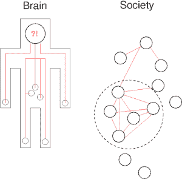

# SDN、Docker 和未来的真正变化

> 原文：<https://thenewstack.io/sdn-docker-real-changes-ahead/>

一天晚上，一位同事对我说，每个人都想从老派网络转向软件定义的网络(SDN)。我同意，但是 Docker 怎么办？Docker 指出了 SDN 未来的真正变化，因为关于密度的问题以及对思考计算的新方法的需求成为焦点问题。与 Docker 的影响相呼应的是堆栈的应用层和平台层发生的变化。这些层如何受到 SDN 的影响，它们又如何反过来影响 it？

当越来越多的服务和软件运行在复杂、快速和分布式的基础设施上时，这些问题就出现了。应用程序将越来越多地被设计为跨数据中心同步。这些应用将由可互换的服务和事件驱动的功能组成，用于处理实时流数据。为了检测 OpenStack、Amazon Web Services 或多个云服务上运行的容器中的异常，监控将变得越来越重要。

这些新的应用程序架构的复杂性对于大多数开发人员来说是看不见的。该网络将只是期望在没有服务人员的帮助下工作。目前，人们的注意力集中在 Docker 上，它是新堆栈转型的象征。但是随着 Docker 的出现，对于技术栈的各个方面将会有许多不同的需求。

在过去的几周里，我们推出了一系列由斯里达尔·拉奥撰写的关于软件定义的网络的文章。它记录了市场上第一代 SDN 工具以及 SDN 如何开始成熟。现在，我们开始看到对容器、Docker 和应用程序平台的整体兴趣，这标志着我们对网络的思考方式的一种熟悉但有些正交的方法。这一新的网络技术流派使用 SDN 作为先例，但也考虑了其他因素。随着轻量级容器和微服务的出现，密度和数据重力成为一些问题。

SocketPlane 正在开发一种基于 SDN 原则的混合网络模型，并将其应用于本地 Docker 环境。

它正在开发一个编程平台，将 DevOps 置于网络环境中。在 au courant 技术博客上有一篇关于 SocketPlane 方法的好文章，展示了 SocketPlane 如何构建“主机之间的 VXLAN 隧道，以连接同一虚拟(逻辑)网络上的 Docker 容器，而无需远程/外部 SDN 控制器。”

用户将与 docker 的 CLI 包装器进行交互，该包装器还控制如何创建、删除和操作 SocketPlane 的虚拟网络。

SocketPlane 使用 [Hashicorp 的领事](https://consul.io/)作为轻量级控制平面。它通过[打开虚拟开关](http://openvswitch.org/)连接到 Consul 集群进行网络连接。添加 Docker 主机后，代理将作为 Docker 实例运行，并连接到集群。容器看起来就像一个虚拟机。

Docker 带来了一些变化，这些变化将定义跨多台机器和主机利用容器的新一代网络技术。随着行业预期至少两个数量级的集装箱数量增加，管理后续影响仍然是创新的成熟基础

SocketPlane 的约翰·威利斯(John Willis)表示:“在短时间内运行的大量计算方面，你将看到一个新的数量级。“现在是纳米计算机的问题了。它可以在一周内从 1，000 个实例增加到 10 亿个实例。”

去年 12 月，在欧洲码头博览会上，威利斯向我讲述了他对未来网络世界的看法。威利斯反映了供应商的观点。还有许多其他供应商的行动，我们将在以后的帖子中介绍。特别是， [Weave](http://weave.works/) ，是一个以容器为中心的网络技术的例子，已经引起了一些注意。CoreOS 开发了[法兰绒](https://coreos.com/blog/introducing-rudder/)，Docker 有自己的[网络配置](https://docs.docker.com/articles/networking/#how-docker-networks-a-container)。

[https://www.youtube.com/embed/9J3X-qqkHd4?list=PLhxVjl6N7D2x0MVQXmchA-nSLnai82fPz](https://www.youtube.com/embed/9J3X-qqkHd4?list=PLhxVjl6N7D2x0MVQXmchA-nSLnai82fPz)

视频

威利斯称 SDN 是一个过载的术语，有各种各样的解释。但是为什么呢？网络难以管理，不具有可塑性，难以发展，难以理解。把这些放在一起，它变得非常复杂。另一方面，SDN 应该使数据平面更具延展性，并将控制平面移出设备。但是，如果过于集中，以容器为中心的生态系统的管理是不现实的。

## **中央大脑的问题**

富有洞察力的马克·伯吉斯写道，集中式网络的问题是这样的:我们需要大脑，但一个大脑只能处理这么多。我们需要大量的大脑一起工作。这是关于创造一个社会，而不仅仅是依靠个人来掌握所有的知识。

长期以来，中央集权模式一直有效。你可以用从一个中心点控制网络的硬件来构建一个网络。SDN 就是基于这一原则构建的。它依赖于与数据平面分离的集中控制平面的概念。但真正更有意义的是建立一个去中心化的网络，借用中心化大脑的原则，但像我们在现代社会中所做的那样传播知识。从来不是一个思想控制着我们的生活和工作方式。这是社会的集体性质，是我们以反映人类灵魂的各种方式执行的概念和想法的拼贴。此外，一个大脑只能处理这么多信息。社会有一种集体智慧，它来自成千上万个相互交流的大脑。伯吉斯是这样展示的:

【T2

Burgess 创建了 CF Engine，并与 SocketPlane 一起工作了几个月，他将它比作我们如何需要将负载推到边缘。上帝般的强力模型可能看起来很有效，但它们会很慢，而且更容易遭受灾难:

社会的规模比大脑模型更好，因为它们可以形成局部细胞，在边缘进行微弱的交互，进行交易或交换信息。如果一个连接失败，它不一定会与其他连接断开，它有足够的自主权来重新配置和适应。不需要有一条从系统的每个部分到一个单一的神一样的位置的路径，然后必须完全靠蛮力来应付处理和决策的负荷。

Docker 非常适合 SocketPlane 正在开发的这种新的混合 SDN。如果依赖这种集中的、单一大脑的方法，Docker 可能是 OpEx 噩梦的象征。例如，假设一台服务器上有 50 台虚拟机，一个集中式 SDN 平台可以支持 500 台主机，每台主机有 50 台虚拟机。当每台主机有 5000 个容器时，你会怎么做？集中式环境变得不可行。随着容器数量的增加和数据量的扩大，需要新的方法来管理网络行为的内在变化。

威利斯指出了两个大趋势:

*   密度:正如他的同事 [Brent Salisbury](http://networkstatic.net/golang-network-ops/) 上周所写的，操作系统正在变得支离破碎。Docker 带来的密度将改变应用程序在网络环境中的行为方式。现在操作系统正在整合，也许最终会被移除，订阅比例将会发生很大变化。在拥有数百甚至数千台主机的环境中，一台物理服务器上可能有 2，000 个容器。
*   **数据引力**:由 [Basho](http://basho.com/) CTO Dave McCrory 提出的一个概念，它意味着数据应该被视为一个吸引更多对象的对象。数据越多，吸引的服务和应用就越多。随着越来越多的数据收集，这是不可避免的，计算资源将需要更快，以多种方式调用应用程序。计算机将会蜂拥而至或以流的形式出现，我们已经看到了像 AWS Lambda 这样的技术。

[https://www.youtube.com/embed/9KmkTW0wpIE?feature=oembed](https://www.youtube.com/embed/9KmkTW0wpIE?feature=oembed)

视频

阿德里安·科克罗夫特[在欧洲码头博览会上的讨论中对此有所论述:](https://thenewstack.io/dockercon-europe-adrian-cockcroft-on-the-state-of-microservices/)

SocketPlane 称其为 retro-SDN。控制平面有一个逻辑被填充到数据平面。例如，它将流表与数据包匹配，当数据包通过时，以编程方式进行路由，从而允许进行动态决策。威利斯说，VMware 称之为微分段。它隔离分段，创建隧道。VLANs 是在交换机上实现多租户的抽象概念。但是耦合在硬件上。在云中，用户的计算资源不会被分配到一台机器上，而是被分配到一个虚拟网络上，由该网络动态发送。从广义上讲，这就是威利斯对覆盖网络的定义。创建了一个与物理交换机没有耦合的逻辑网络，并且可以随时更改。从控制平面到数据平面都是如此。这是 SDN 的承诺。服务可以移动到数据平面操作中。在 GitHub 上，SocketPlane 中的覆盖网络描述如下:

覆盖网络在主机端点之间建立隧道，在我们的示例中，这些主机端点是开放式 vSwitch。这种情况的优点是用户不需要担心子网/VLAN 或任何其他第 2 层使用限制。这只是我们将展示的部署容器网络的一种方式。Open vSwitch 的重要性在于性能和高级网络的事实上的 API。

威利斯说，集装箱有一个数量级的规模。物理主机上可能有数千个容器。这就产生了一个更大的问题。随着微服务的出现，容器中可能会运行任意数量的服务。这意味着新的设计模式，因为数据重力与密度因素相结合，创造了一种完全不同的方式来思考如何分配计算资源。

> "标准可能是几分钟或几秒钟的计算寿命."

没有必要对网络进行集中控制。就像在社会中，真的不需要一个中央集权的独裁政权。但这确实意味着我们必须考虑网络中心及其提供的智能。在不同的社区里，都有人因为他们的知识而受到关注。他们不是唯一的信息来源，但他们的专业知识和能力是人们所依赖的。我们经常在极客社区看到这种情况。没有一个人控制所有的知识。更重要的是，社区的集体深度产生了影响。

这为我们看待网络本身提供了一种不同的方式。它不是一个大脑，而是更多，因此它是一个动态决策的中央数据平面网络。

也许这是我们从不同角度思考基础设施本身的一种方式。网络作为一个社会，而不仅仅是一个单一的实体，为我们提供了新的方法来关联这些系统如何真正影响我们的生活和工作方式。

<svg xmlns:xlink="http://www.w3.org/1999/xlink" viewBox="0 0 68 31" version="1.1"><title>Group</title> <desc>Created with Sketch.</desc></svg>