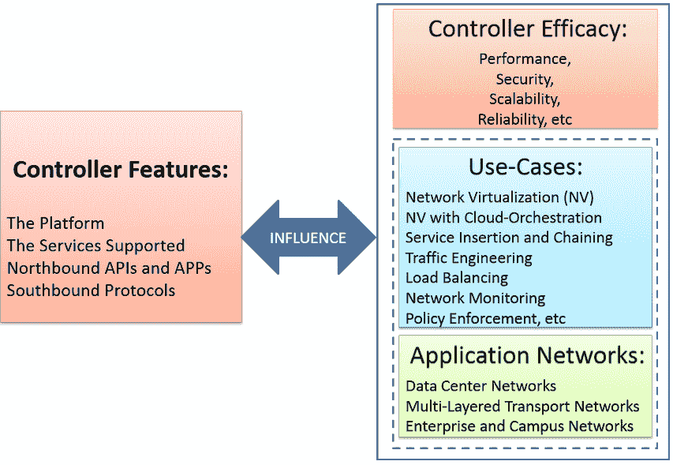
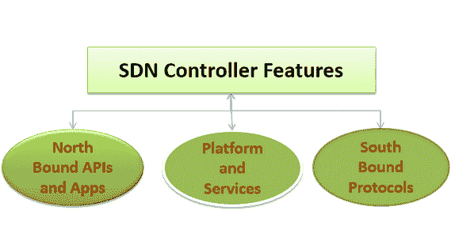
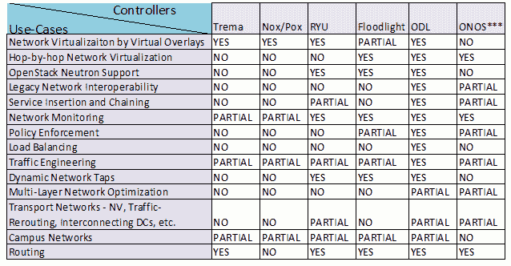

# SDN 系列第八部分:开源 SDN 控制器的比较

> 原文：<https://thenewstack.io/sdn-series-part-eight-comparison-of-open-source-sdn-controllers/>

这是关于软件定义的网络的系列文章的第八部分。可以找到该系列的其他帖子

[here](https://thenewstack.io/?s=sdn)

.

软件定义网络(SDN)增加了控制平面实施选择的灵活性，允许人们在实施设计轴上的点之间进行选择:集中式到分布式、微流到聚合流、反应式到主动式、虚拟到物理以及完全一致到最终一致。

在我们之前关于开源 SDN 控制器的文章中，我们已经看到，所有 SDN 控制器通常都包括一个开放的/基于标准的硬件接口、一个网络操作系统和定义良好的 API 来编写各种网络应用。我们也看到了控制器在这三个方面的不同。

在本文中，我们将对不同的开源 SDN 控制器进行不太全面的比较分析。首先，我想强调一下，比较 SDN 控制器是一个极具挑战性的问题，主要是因为这是一个多方面的问题。此外，比较分析通常有助于“选择”控制器以满足特定(或一组)要求。然而，在本文中，我们将不会讨论控制器的选择，而仅限于强调不同方面的差异。

我们将重点关注以下内容:

1.  控制器比较的重要相关方面的分类。
2.  确定当前比较研究涵盖和遗漏的方面。
3.  从适用性角度比较 SDN 控制器——使用案例和应用网络。

## **控制器方面进行对比分析**

图 1(下图)显示了 SDN 控制器的不同方面——特性、功效、使用案例和应用网络——可用于对比分析。该图还强调了一个事实，即“控制器特性”是最重要的方面，影响着控制器的各种效率目标，如可扩展性、可编程性和互操作性。

图 1

控制器特性的重要性还源于这样一个事实，即它们决定了控制器可以支持的适用性和用例。例如，如果一个控制器要支持基于 OpenStack 的网络虚拟化，它需要具备中子插件、端口和流可配置性等特性和服务。

此外，应用程序还指定它们希望从网络获得的服务。例如，对延迟敏感的应用程序希望控制器包含一个服务，该服务可以提供具有最小延迟量的端到端路径。

在我们提供基于适用性的控制器比较之前，让我们详细看一下不同的方面。

## 控制器特性

SDN 控制器特性可以大致分为三个不同的类别，如下图 2 所示:

图 2

在我们之前关于 SDN 控制器的文章中，我们主要从用户/管理员、系统开发人员和应用开发人员的不同角度关注这些控制器特性。

## 控制器功效

控制器功效是一个总括术语，用于指代不同的性能参数，包括性能、可扩展性、可靠性和安全性。几乎所有现有的比较研究都集中在这些参数中的一个或多个上。性能可以定义各种度量，例如控制器可以处理的接口数量、等待时间、吞吐量等。类似地，在定义可伸缩性、可靠性和安全性的现有工作中使用了各种度量。

## **用例及应用网络**

“重要的是要认识到，很少，如果有的话，It 组织想要一个 SDN，”吉姆·梅茨勒说。

> IT 组织想要的是解决当前的问题并增加价值。如果 SDN 能够让他们比其他联网方法做得更好，那么它将被广泛采用。

SDN 的关键方面——为网络设计者提供重构网络控制平面的自由——已在多个领域得到应用，如网络虚拟化和网络功能虚拟化(NFV)。事实上，最近对 NFV 的兴趣也引发了对 SDN 的兴趣。

在可用的文献中，我们会发现针对 SDN 提出的各种用例，我们将在后面详细讨论。我们还将看到一些研究人员和开发人员如何谈论控制器对特定类型网络(数据中心网络、服务提供商网络和校园网络)的适用性。因此，从使用案例和应用网络的角度来比较控制器是非常有用的。

## **现有的研究怎么说？**

下面，我们描述三个重要的比较研究。虽然商业控制者提供的一些比较分析确实存在，但这里没有提到它们，以避免供应商的任何“营销”:

1.Tootoonchian、Gorbunov、Ganjali、Casado 和 Sherwood 是第一批提供控制器比较分析的人:“[软件定义网络中的控制器性能。](https://www.usenix.org/system/files/conference/hot-ice12/hotice12-final33_0.pdf)“他们涵盖了有限数量的控制器(NOX-MT、Beacon 和 Maestro)，并且只关注控制器性能。这些控制器已经被其他控制器取代，如 POX、Ryu、泛光灯和 OpenDaylight。

2.“基于功能的软件定义网络(SDN)控制器的比较和选择”由 Khondoker、Zaalouk、Marx 和 Bayarou 进行。在这项工作中，作者提供了一系列要求:TLS 支持、虚拟化、开源、接口、GUI、RESTful API、生产力、文档、模块化、平台支持、TLS 支持、age、OpenFlow 支持、OpenStack 中子支持——其中前三项他们定义为强制性的，其余 10 项(依次排列优先级)为可选的。基于这些需求，对现有的开源控制器(及其属性)进行了比较。

此外，为了根据可选要求选择最佳控制器(例如，GUI 将比控制器的年龄更受欢迎)，名为层次分析法(AHP)的多标准决策(MCDM)方法已被单调内插/外插机制采用，该机制将属性值映射到预定义范围内的值。通过使用改进的层次分析法，对最上面的五个控制器进行了比较，并根据其要求选择了“Ryu”作为最佳控制器。

3.“SDN/OpenFlow 控制器的高级研究”由沙利莫夫、祖伊科夫、齐马利纳、普什科夫和斯梅连斯基完成。作者声称对广泛使用的 SDN 控制器(NOX、POX、Beacon、泛光灯、MuL、Maestro 和 Ryu)的有效性进行了公正的比较分析。在这项工作中，作者定义了一个总括术语——控制器有效性——作为效率指标的集合，如性能、可扩展性、可靠性和安全性。作者提供的结论包括:

*   被测试的控制器存在许多可能的安全漏洞。
*   大多数管制员能够应付平均工作量。
*   信标演示了最大吞吐量。

## **对现有研究的批判性分析**

*   大部分工作局限于控制器特性和控制器有效性，如性能、安全性和可靠性。
*   就支持的使用案例和应用网络(取决于控制器的特性)而言，控制器的适用性没有得到很好的研究。
*   在控制器功效中，各种参数都没有涉及。例如，控制器容量(就它可以管理的交换机/接口数量而言)没有得到很好的研究。甚至连移动性和可扩展性等参数都被忽略了。
*   一些控制器特性，例如对主动/被动流量管理的支持、控制器的层次/多样性、支持的南向协议以及与传统(非 SDN)网络的互操作性，都被完全忽略了。
*   多租户，多应用网络(数据中心、传输等)的一个重要方面。)评价不好。
*   基于[反应式和主动式范例](http://ieeexplore.ieee.org/xpl/articleDetails.jsp?arnumber=6531863)的比较也缺失。了解控制器如何支持主动操作以及支持哪些主动操作将是非常有趣的。
*   没有为选择“SDN 控制器的强制性要求”提供适当的理由
*   许多商用控制器大多将比较分析局限于控制器特性，很少谈到“数字”——接口数量、租户数量和虚拟网络数量等。
*   对北向 API 和南向协议的比较分析还不够全面，不足以提供重要的见解。
*   应用程序开发人员的受欢迎程度——即他们用控制器开发的应用程序的数量——并没有很好的记录。
*   最后，在 GUI 和 CLIs 等可视化选项方面，用户友好性没有得到很好的比较。

## **开源 SDN 控制器对比:用例与应用网络**

下面的表 1 描述了重要的用例。

下面是一些回顾不同 SDN 环境的用例:Netsocket、Lippis Report、 [OpenFlow 1、](https://www.clear.rice.edu/comp529/www/papers/tutorial_4.pdf) [OpenFlow 2](http://www.ipspace.net/Real_Life_OpenFlow_Use_Cases) 、NFV 和网络虚拟化、[网络可编程性](http://blogs.cisco.com/ciscoit/sdn-and-network-programmability-first-five-use-cases-for-cisco-it)、 [Brocade SDN](https://www.broadcom.com/) (docx)和[裸机 SDN](http://www.bigswitch.com/sdn-solutions) 。

*表 1*

在我们讨论控制器的比较分析之前，从比较分析的角度来看，必须注意以下关于用例的要点，这些要点突出了挑战:

1.  1.  这里涵盖的用例是重要的和流行的，应该被认为是一个完整的列表。因此，您可能会在这里看到一些无关紧要的用例，有些控制器支持，有些不支持。
    2.  大多数使用案例(传统网络支持、校园网络、多层网络优化等。)没有明确的规范和范围定义。如果一个控制器支持或不支持它，要说“是”或“否”是非常困难的。
    3.  或者，也有用例(边缘覆盖、OpenStack 中子支持、逐跳网络虚拟化等。)有明确的规范，对这些规范的比较分析相对简单，只需回答“是”或“否”
    4.  有用例(负载平衡、监控、策略执行等。)在功能上有很多重叠。一些控制器可能部分支持这样的用例，并且在那些用例中的比较也变得具有挑战性。

表 2(如下)总结了考虑不同用例的开源控制器的比较。

表 2

1.  是
    *   完全支持。
    *   大多数元素都存在，稍加改进即可支持。
    *   在开源控制器之上开发了一个商业/专有解决方案，这有助于支持用例。
    *   支持应用网络域中的大量用例。
2.  不
    *   不支持。
    *   只有基础元素存在，它们需要重大的增强。
    *   开源控制器之上不存在商业/专有解决方案。
3.  部分的
    *   部分支持用例。
    *   控制器中存在大量的服务/应用程序，以实现对用例的支持。
    *   支持应用程序网络域中的部分用例集。
    *   工作正在进行中。

从表 2 中我们可以看到，ODL 的特性使其更适合支持大多数用例。这可能是它大受欢迎的原因之一。Ryu 和泛光灯有相似数量的用例支持，Ryu 支持两个最重要的用例:服务插入和链接，以及传输网络。类似地，NOX/POX 和 Trema 具有相似的用例支持。

## 摘要

比较 SDN 控制器既有趣又具有挑战性；然而，使用这种比较分析来选择控制器更加困难。人们需要考虑控制器的各个方面，本文就是这样一个尝试，分享不同方面的比较研究。正如前面的关键分析部分所提到的，仍然非常需要进行全面的比较分析。最后，适用性是比较 SDN 控制器时应该考虑的一个有趣方面。

斯里达尔于 2007 年获得新加坡国立大学计算机科学博士学位；他于 2000 年在印度苏拉塔 KREC 获得计算机科学硕士学位；并于 1997 年 8 月从印度班加罗尔大学 Tumkur 的 SIT 获得仪器仪表和电子工程学士学位。他在印度 SRM 研究所担任研究主管；意大利都灵理工大学微软创新中心博士后研究员；也是新加坡资讯通信研究所(I2R)的研究员。他从事过各种开发和部署项目，涉及 ZigBee、WiFi 和 WiMax。斯里达尔目前在 NEC 技术印度有限公司担任集团技术专家。斯里达尔的研究兴趣主要在于下一代有线和无线网络领域，如 OpenFlow、软件定义网络、面向认知网络的软件定义无线电系统、Hotspot 2.0 和物联网。

<svg xmlns:xlink="http://www.w3.org/1999/xlink" viewBox="0 0 68 31" version="1.1"><title>Group</title> <desc>Created with Sketch.</desc></svg>