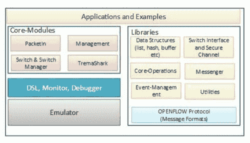
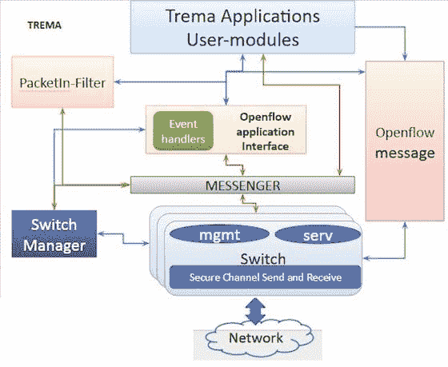

# SDN 系列第二部分:Trema，用 Ruby 和 C 开发 OpenFlow 控制器的框架

> 原文：<https://thenewstack.io/sdn-series-part-ii-trema-a-framework-for-developing-openflow-controllers-in-ruby-and-c/>

编者按:这是关于软件定义的网络的多部分系列的第二部分。可以找到该系列的其他帖子

[here](https://thenewstack.io/?s=sdn)

.

我们的[第一篇帖子](https://thenewstack.io/defining-software-defined-networking-part-1/)探讨了 SDN 和 SDN 控制器。在本文中，我们将讨论 [Trema](http://trema.github.io/trema/) ，一个用 Ruby 和 c 开发 OpenFlow 控制器的框架。这是关于不同开源 SDN 控制器的系列文章中的第一篇。

对于 Trema，术语框架用于强调用户可以自由配置和构建 OpenFlow 控制器。该框架旨在提供可扩展性，包括与 OpenFlow 交换机交互所需的所有必要库和功能。由于同时支持 C 和 Ruby 语言，Trema 允许用户根据自己的舒适程度和性能需求自由选择。

Trema 更像是一个面向 OpenFlow 开发者/研究人员/爱好者的软件平台，而不是一个生产控制器。例如，如果用户想要一个 OpenFlow 控制器来管理网络拓扑，她只需使用现有的拓扑管理器应用程序构建并运行 Trema。Trema 框架的架构如图 1 所示。



图 1

Trema 架构包括核心模块，如数据包输入过滤器、交换机和交换机管理器、OpenFlow 应用程序接口、必要的库、用于配置的网络 DSL、用于集成开发的仿真器以及用于支持调试的 Tremashark。Trema 采用多进程模型，其中许多功能模块通过 messenger 松散耦合。功能模块可以是任何用户模块(应用)或核心模块。这些模块通过 messenger 使用以下六个重要的 API 进行交互——前三个用于接收消息，后三个用于发送消息:

```
add_message_received_callback  [RECEIVE NOTIFICATION MESSAGE]
add_message_requested_callback  [RECEIVE REQUEST MESSAGE]
add_message_replied_callback  [RECEIVE REPLY MESSAGE]
send_message  [SEND NOTIFICATION MESSAGE]
send_request_message  [SEND REQUEST MESSAGE]
send_reply_message  [SEND REPLY MESSAGE]

```

这种 messenger 架构有助于动态重新配置和保护部署不稳定模块的控制器。总之，信使充当了连接用户模块(应用程序)、核心模块和监控系统的粘合剂。

下面的图 2 是 Trema 的汇总功能图。它强调了 messenger 的重要性，以及核心模块及其与用户应用程序的交互。在本文的剩余部分，我们将描述 Trema 架构的重要组件。



图 2

## 核心模块

Trema 框架的核心模块主要包括 OpenFlow 基础模块，通常是那些对多个应用有用的模块。

## 交换机和交换机管理器

这两个核心模块实现了与 OpenFlow 交换机交互的必要功能。它们还维护有关交换机的所有必要信息。

交换机管理器负责创建交换机的实例(交换机守护程序)。具体来说， **switch_manager** 监听传入的 OpenFlow 交换机(OFS)，当 OFS 进来时，它分叉并创建一个 **switch_daemon** 进程，并将 OFS 的控制权移交给交换机守护进程。因此，每个 OFS 实例将有一个 **switch_daemon** 进程，并且只有一个 **switch_manager** 实例。交换机守护程序的**服务名**最初从**交换机开始。(OFS IPaddr:port)** ，因为守护进程在启动时无法知道数据路径 ID (dpid)。一旦交换机守护进程初始化并接收到 **feature_reply** ，它就将其 **service_name** 重命名为**交换机。(dpid)** 使用**rename _ message _ received _ callback**。你可以在**switch _ manager/switch . c**的中找到代码。

## 数据包输入过滤器

PacketIn 消息是 OpenFlow 交换机向控制器发送捕获的数据包的一种方式。只有当控制器要求交换机向控制器发送数据包时，或者当交换机的流表中没有合适的条目时，交换机才会向控制器发送数据包。

顾名思义，数据包输入过滤器模块负责处理从 OpenFlow 交换机到达控制器的数据包。Trema 中的交换模块将传入的数据包传输到数据包输入过滤器，该过滤器在将数据包传递给任何已注册的应用程序之前会进行必要的更改。

## 特雷马沙克

Tremashark 是 Wireshark 插件，用于跟踪功能模块之间的任何进程间通信事件。事件可以从消息到安全通道状态到队列状态变化。

## 图书馆

Trema 中的库可以分为以下几类:

1.  **协议** : OpenFlow。
2.  **接口** : OpenFlow 应用、交换机、管理。
3.  **常用数据结构**:链表、双向链表、哈希表、定时器。
4.  **实用程序**:日志、统计、包装器。
5.  **网络协议** : TCP、IP、UDP、ether 和 etherIP、ICMP 和 IGMP。

从上面的分类中，我们可以看到库模块通常包括独立的功能和通用编程工具。

## 应用程序

Trema 框架包括大约 15 到 20 个不同的应用程序，也称为用户模块。这些应用通常实施高级功能，可以被视为 SDN 应用的示例。任何应用程序开发人员都可以利用这些应用程序作为参考点来理解 API 的用法并开发更新的应用程序。在很高的层面上，我们可以将 API 的类别总结如下:

1.  创建 OpenFlow 消息。
2.  发送 OpenFlow 消息
3.  接收 OpenFlow 消息。
4.  接收安全通道或交换机特定的事件

正如我们将在以后的文章中看到的，这些 API 将被几乎所有的 OpenFlow 控制器公开。在下表中，我们总结了 10 个不同应用程序使用的重要 OpenFlow APIs:

## 运行 Trema 应用程序

Trema 是一个 OpenFlow 平台，支持整个开发周期，包括测试。它为测试和验证提供了控制器和网络环境(如仿真器)的无缝集成。

运行 Trema 应用程序有两个不同的选项。第一种简单的方法是执行 examples 文件夹中的应用程序，不管有没有配置文件。例如，要运行 dumper 应用程序，只需使用下面的命令:

```
./trema run  ./objects/examples/dumper/dumper  –c  
./src/examples/dumper/dumper.conf

```

【Trema 命令允许用户运行和终止在核心模块之上开发的应用程序。除了“run”选项之外，该命令还可以用于终止应用程序、在主机之间发送数据包、转储交换机中的流条目以及显示统计信息。

Trema 中的所有应用程序通常都带有一个配置文件，该文件定义了特定应用程序应该如何运行(如果需要)以及集成的网络配置应该是什么(如果有的话)。在配置文件中定义应用程序的行为包括以下内容:

1.  **应用程序或模块的选择:**开发者必须决定他的控制器需要什么样的应用程序。在某些情况下，如果用户正在寻找的特性在框架中没有作为现有的应用程序出现，那么用户可能必须开发一个。例如，如果用户需要他的控制器支持 MPLS，他将为此开发一个单独的应用程序。
2.  **模块的配置:**这主要包括过滤器的配置——定义哪些事件应该由哪个组件处理。
3.  **消息路由配置:**消息路由是指将输入的数据包(从交换机到控制器)转发到相应模块的过程。

网络配置通常在交换机和主机及其连接中定义。

特征图片:[埃里克·基尔比](https://www.flickr.com/photos/ekilby/)的《[魔法雪花](https://www.flickr.com/photos/ekilby/4424205156/in/photolist-7JXd4f-8RMJcT-uhPP7V-3excXa-5giHWB-5go5uf-nQYpEc-2xyip-uDLxY-f5VigY-doFVsg-uX63TG-5eMUzz-qEKghq-nYm83r-idvCg-7yZEjD-e55sjA-dQ4BUc-4XZK1C-d6Hqzh-4odrK-93DzpR-ay71MC-Nr3p-3qwgYN-wDk8N7-5z5MUo-593uq4-qrGaz-nKLb25-5dZY6j-83e1sm-8LMMpm-2f7eqn-dZeMyg-5SmoW-5R4r9Y-6D5Li3-xsbQY-axcsbg-9FFkR-5Smps-5DnCpF-4h8cPG-5jgWPY-rGjLo-aAJtQg-6pVFf4-6fM2gh)》在 [CC BY-SA 2.0](https://creativecommons.org/licenses/by-sa/2.0/) 下获得授权。

<svg xmlns:xlink="http://www.w3.org/1999/xlink" viewBox="0 0 68 31" version="1.1"><title>Group</title> <desc>Created with Sketch.</desc></svg>